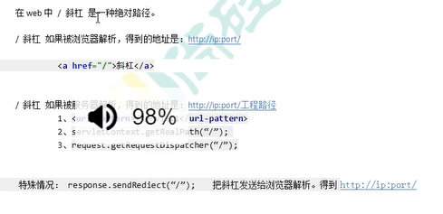
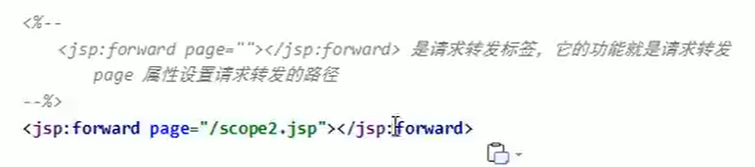
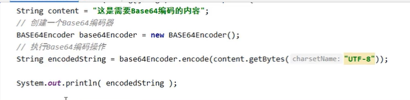

HTML文件的书写规范


## HTML标签的介绍


想看什么标签可以查看文档

.\java知识\1JavaWeb

### 标题标签


### 超链接标签


### 列表标签


### img标签


### 表格标签


### 跨行跨列的表格


### ifarme标签。

在该窗口中开一个小窗口


### 表单标签*

用于收集用户信息，并发送给浏览器


示例


可以将表单中的信息放到表格中进行格式化

表单提交的细节


### 其他标签


## CSS技术

### 第一种使用方式


### 第二种使用方式


### 第三种使用方法


### 标签名选择器


### id选择器


### Class选择器


### 组合选择器


### 常见的css样式


## JavaScript和html代码的结合方式


### javaspcript的第一种使用方式


### javascript的第二种使用方式


### 变量


。typeof(变量)----------------可以取变量的类型

### 关系(比较)运算

等于：          ==		等于是简单的，做字面上的比较。例如"12"与12相等

全等于：      === 	 除了做字面的比较之外，还会比较两个变量的数据类型

### 逻辑运算


### 数组**


### 函数的定义**


在javascript中如何使用返回值。只需要在函数内部直接使用return就行了

```javascript
function fun(){
	alert("无参函数被调用")
}

function fun2(a, b){
	alert("有参函数" + a + b)
}

function fun3() {
	return "java";
}

alert(fun3());
```


```javascript
var fun4 = function (){
  alert("无参函数")
}

var fun5 = function () {
  return "abc"
}

alert(fun5)//返回函数体
alert(fun5())//返回函数体的返回值
```

javascript是不允许重载的，重载默认会覆盖上面的函数


```javascript
function fun6(a) {//此处的a变量是完全不影响arguments的值
  //arguments完全可以看成数组
  alert(arguments.length)//获取参数的长度
  alert(arguments[0])//取出传入的值
  alert(a)
}
fun6("a","l",8);
```

### javascript自定义对象

1.第一种定义类的方式


```javascript
var obj = new Object();
obj.name = "a";
obj.age = 18;
obj.fun = function (){
    alert(this.name + this.age);
}
alert(obj.fun());
```

2.第二只定义对象的方式


```javascript
var obj = {
   name: "kjq",
   age: 18,
    fun1: function () {
        alert(this.name + this.age)
    }
}
obj.fun1()
```

### js中的事件


**事件的注册又分为静态注册和动态注册两种**

什么是时间注册（绑定）

其实就是告诉浏览器，当事件响应后要执行的那些代码。


onload静态注册：加载完成后的事件

```html
<!DOCTYPE html>
<html lang="en">
<head>
    <meta charset="UTF-8">
    <title>Title</title>
    <script type="text/javascript">
        function onloadFun(){
            alert('静态注册onload事件');
        }
    </script>
</head>
<!--静态注册onload事件-->
<body onload="onloadFun()">

</body>
</html>
```

onload动态注册

```html
<!DOCTYPE html>
<html lang="en">
<head>
    <meta charset="UTF-8">
    <title>Title</title>
    <script type="text/javascript">
        window.onload = function () {
            alert("动态注册onload事件")
        }
    </script>
</head>
<body>

</body>
</html>
```

onclick静态与动态注册：按钮点击事件

```html
<!DOCTYPE html>
<html lang="en">
<head>
    <meta charset="UTF-8">
    <title>Title</title>
    <script type="text/javascript">
        function onclickFun(){
            alert("静态注册onclick")
        }

        //动态注册onclick
        window.onclick = function (){
            //1获取标签对象
            /**
             * document是javascript语言提供的一个对象。表示整个页面
             * get
             * Element
             * by
             * id
             * getElementById通过标签属性获取id对象
             */
            var btnObj = document.getElementById("btn01");
            //2通过标签对象.事件名 = function(){}
            btnObj.onclick = function (){
                alert("动态注册onclick事件")
            }
        }
    </script>
</head>
<body>
    <!--静态注册onclick-->
    <button onclick="onclickFun()">按钮1</button>
    <button id="btn01">按钮2</button>
</body>
</html>
```

onblur静态与动态注册：常用于输入框失去焦点后，验证输入的内容是否合法

焦点：当鼠标点击某个输入框就表示焦点

```html
<!DOCTYPE html>
<html lang="en">
<head>
    <meta charset="UTF-8">
    <title>Title</title>
    <script type="text/javascript">
        //console是控制台对象，是由javascript语言提供，专门用来向浏览器控制台打印输出，测试用的
        //log是打印的方法
        function onblurFun() {
            console.log("静态注册失去焦点事件");
        }
        //动态注册
        window.onload = function () {
            //1.获取标签对象
            var password = document.getElementById("password");
            //2.通过标签对象.时间名 = function(){}\
            password.onblur = function (){
                console.log("动态注册失去焦点事件")
            }
        }
    </script>
</head>
<body>
    用户名：<input type="text" onblur="onblurFun()"><br/>
    密码：<input id="password" type="text"><br/>
</body>
</html>
```

onchange静态与动态注册：常用于下拉框与输入框内容改变后的操作

```html
<!DOCTYPE html>
<html lang="en">
<head>
    <meta charset="UTF-8">
    <title>Title</title>
    <script type="text/javascript">
        var onchangeFun = function () {
            console.log("静态注册onchange")
        }

        //动态注册onchange事件
        window.onload = function (){
            //1.获取标签对象
             var selobj = document.getElementById("sel01");
            //2.通过标签对象.时间名 = function(){}
            selobj.onchange = function (){
                console.log("动态注册onchange")
            }
        }
    </script>
</head>
<body>
  请选择你心中的女神
  <!--静态注册onchange事件-->
  <!--<select onchange="onchangeFun()">-->
<select id="sel01">
    <option>--女神--</option>
    <option>ll</option>
    <option>ss</option>
    <option>dd</option>
</select>
</body>
</html>
```

onsubmit静态与动态注册：表单提交事件。用于验证表单提交前，表单项是否合法

```html
<!DOCTYPE html>
<html lang="en">
<head>
    <meta charset="UTF-8">
    <title>Title</title>
    <script type="text/javascript">
        var onsubmit1 = function() {
            alert("静态注册----发现不合法阻止提交")
            return false
        }
        //动态注册onsubmit
        window.onload = function (){
            //获取标签对象
            var form = document.getElementById("form01")
            //标签对象.onsubmit = function(){}
            form.onsubmit = function (){
                alert("动态注册")
                return false;
            }
        }

    </script>
</head>
<body>
<!--静态注册onsubmit-->
  <form action="http://localhost:8080" method="get" onsubmit="return onsubmit1()">
      <input type="submit" value="静态注册"/>
  </form>
  <form id="form01" action="http://localhost:8080" method="get">
      <input type="submit" value="动态注册"/>
  </form>
</body>
</html>
```

### DOM模型（标签对象管理）


document对象：用于管理标签对象


Document对象中的方法介绍


var form = document.getElementById("form01");

1.以id属性获取对象getElementById

```html
<!DOCTYPE html>
<html lang="en">
<head>
    <meta charset="UTF-8">
    <title>Title</title>
  <script type="text/javascript">
      //当用户点击验证，要获取输出狂的内容，然后验证其合法性
      //规则：必须是字母，数字。下划线组成，长度是5到12位
      function onclickFun(){
          //1当我们要操作一个标签的时候，一定要先获取这个标签的对象
          var usernameObj = document.getElementById("username");
          //alert(usernameObj.value)//获取输入框的内容
          var usernameText = usernameObj.value
          /**
           * test()方法适用于测试某个字符串，是否符合我的规则
           */
          var patt = /^\w{5,12}$/;

          //获取提示信息
          var usernameSpan = document.getElementById("usernameSpan");

          if ( patt.test(usernameObj.value) ){
              usernameSpan.innerHTML = "用户名合法"
          }else {
              //通过innerHTML给Span起始标签与结束标签的内容赋值
              //usernameSpan.innerHTML = ""
              usernameSpan.innerHTML = "用户名不正确!!"
          }
      }
  </script>
</head>
<body>
    用户名：<input id="username" type="text"/>
    <button onclick="onclickFun()">验证</button>
    <span id="usernameSpan" style="color: red;"></span>
</body>
</html>
```

正则表达式创建对象

```javascript
//书写方法
var patt = new RegExp("e");
//或
var patt1 = /e/;
```

2.以name属性获取对象getElementsByName。获取的对象是一个集合


3.以表签名进行获取对象getElementsByTagName。获取的对象是一个集合


**使用的优先顺序。以上代码一定要在代码完全加载完成以后才能查询到结果**

代码是从上往下执行的


4.节点常用的属性和方法

节点就是标签对象


文本：只获取标签里的文字

内容：获取标签里的所有内容

5.createElement

```html
<!DOCTYPE html>
<html lang="en">
<head>
    <meta charset="UTF-8">
    <title>Title</title>
    <script type="text/javascript">
        window.onload = function (){
            //使用js代码创建html标签，并显示在页面上
            //标签内容是：<div>爱你哦</div>
            var divObj = document.createElement("div")
            divObj.innerHTML = "爱你哦"
            //给body标签添加元素
            document.body.appendChild(divObj);
        }
    </script>
</head>
<body>

</body>
</html>
```

## JQuery


```html
<!DOCTYPE html>
<html lang="en">
<head>
    <meta charset="UTF-8">
    <title>Title</title>
  <script type="text/javascript" src="JQuery.js"></script>
  <script type="text/javascript">
    $(function (){//表示页面加载完成之后才加载，相当于onload
        var $btnObj = $("#btnId")//表示按id查询标签对象
        $btnObj.click(function () {//绑定单击事件
            alert("JQuery的单击事件")
        })
    })
  </script>
</head>
<body>
    <button id="btnId">hello</button>
</body>
</html>
```


**$传入的参数**


DOM对象alert出来的是[object HTML 标签名Element]

jQuery对象alert出来的是：[object Object]

### jQuery对象的本质

jQuery对象是dom对象数组 + jQuery提供的一系列功能函数

jQuery与dom使用的区别

jQuery对象的方法dom对象是使用不了的。同时反过来也不行

**jQuery与dom对象的相互转化**


### jQuery选择器

1.基本选择器

$(p.myClass)表示必须是p标签，class的类型必须是myClass

复合选择器，选出的标签顺序是按照html页面的顺序存入的

想知道更多内容请参考jQuery文档：.\java知识\1JavaWeb


2.层级选择器

匹配所有的后代元素：$("form input")

在给定的父元素下匹配所有的子元素：$("form > input")

匹配所有紧接在 prev 元素后的 next 元素：$("label + input")

匹配 prev 元素之后的所有 siblings 元素：$("form ~ input")

3.基本过滤选择器

获取第一个元素：`$('li:first')`;

获取最后个元素：$('li:last')

去除所有与给定选择器匹配的元素：$("input:not(:checked)")

在jQuery 1.3中，已经支持复杂选择器了（例如:not(div a) 和 :not(div,a)）

匹配所有索引值为偶数的元素，从 0 开始计数：$("tr:even")

匹配所有索引值为奇数的元素，从 0 开始计数：$("tr:odd")

匹配一个给定索引值的元素：$("tr:eq(1)")

匹配所有大于给定索引值的元素：$("tr:gt(0)")

匹配所有小于给定索引值的元素：$("tr:lt(2)")

匹配如 h1, h2, h3之类的标题元素：$(":header")

匹配所有正在执行动画效果的元素：

```javascript
$("#run").click(function(){
  $("div:not(:animated)").animate({ left: "+=20" }, 1000);
});
```

4.内容过滤选择器

匹配包含给定文本的元素：$("div:contains('John')")

匹配所有不包含子元素或者文本的空元素：$("td:empty")

匹配含有选择器所匹配的元素的元素：$("div:has(p)")

匹配含有子元素或者文本的元素：$("td:parent")

5.属性过滤选择器

匹配包含给定属性的元素。：$("div[id]")

匹配给定的属性是某个特定值的元素：$("input[name='newsletter']").attr("checked", true);

匹配所有不含有指定的属性，或者属性不等于特定值的元素。：$("input[name!='newsletter']").attr("checked", true);

匹配给定的属性是以某些值开始的元素：$("input[name^='news']")

匹配给定的属性是以某些值结尾的元素：$("input[name$='letter']")

匹配给定的属性是以包含某些值的元素：$("input[name*='man']")

复合属性选择器，需要同时满足多个条件时使用。：$("input[id] [name$='man']")

6.表单过滤选择器

看文档吧！！！ 

### jQuery元素的筛选

看文档吧！！！

### jQuery属性操作


```html
<!DOCTYPE html>
<html lang="en">
<head>
    <meta charset="UTF-8">
    <title>Title</title>
    <script type="text/javascript" src="JQuery.js"></script>
    <script type="text/javascript">
        $(function (){
            //不传参数是获取，传递参数是设置
            //alert($("div").html());
            //$("div").html("<h1>我是div中的标题1</h1>")
            $("button").click(function () {
                alert($("#username").val())
                $("#username").val("超级程序员")
            })
        })
    </script>
</head>
<body>
    <div>我是div<span>我是div中的span</span></div>
    <input type="text" naem="username" id="username"/>
    <button>操作1</button>
</body>
</html>
```


### 练习

练习：全选，全不选，反选，提交

```html
<!DOCTYPE html>
<html lang="en">
<head>
    <meta charset="UTF-8">
    <title>Title</title>
    <script type="text/javascript" src="JQuery.js"></script>
    <script type="text/javascript">
        $(function () {
            //给全选绑定单击事件
            $("#checkedAllBtn").click(function (){
                $(":checkbox").prop("checked",true);
            })
            //给全不选绑定点击事件
            $("#checkedNoBtn").click(function () {
                $(":checkbox").prop("checked",false);
            });
            //反选
            $("#checkedRevBtn").click(function () {
                $(":checkbox[name='items']").each(function () {
                    //在each遍历中，this对象是当前便利的对象
                    this.checked = !this.checked;
                })
                //在遍历完成以后要判断是否全部选中。再给全选赋值
                if($(":checkbox[name='items']").length === $(":checkbox[name='items']:checked").length){
                    $("#checkedAllBox").prop("checked", true);
                }else {
                    $("#checkedAllBox").prop("checked", false);
                };
            })
            //提交
            $("#sendBtn").click(function () {
                $(":checkbox:checked").each(function () {
                    alert(this.value);
                })
            })
            //书写相面的全选与全不选
            $("#checkedAllBox").click(function () {

                $(":checkbox[name='items']").prop("checked",this.checked);
            })
            //下面的复选框选中或不选中，从而影响上面的
            $(":checkbox[name='items']").click(function () {
                var length1 = $(":checkbox[name='items']").length;
                var length2 = $(":checkbox[name='items']:checked").length;
                $("#checkedAllBox").prop("checked", length1 === length2);
            })
        });
    </script>
</head>
<body>
<form>
    你的爱好运动是？
    <input type="checkbox" id="checkedAllBox">全选/全部选<br/>
    <input type="checkbox" name="items" value="足球"/>足球
    <input type="checkbox" name="items" value="足球"/>足球
    <input type="checkbox" name="items" value="羽毛球"/>羽毛球
    <input type="checkbox" name="items" value="乒乓球"/>乒乓球
    <br/>
    <input type="button" id="checkedAllBtn" value="全选"/>
    <input type="button" id="checkedNoBtn" value="全不选"/>
    <input type="button" id="checkedRevBtn" value="反选"/>
    <input type="button" id="sendBtn" value="提交"/>
</form>
</body>
</html>
```

### jQuery-Dom的增删改


//平级


练习：从左到右，从右到左

```html
<!DOCTYPE html>
<html lang="en">
<head>
    <meta charset="UTF-8">
    <title>Title</title>
  <script type="text/javascript" src="JQuery.js"></script>
  <script type="text/javascript">
      $(function () {
          $("button:eq(0)").click(function () {
              $("select:eq(0) option:selected").appendTo($("select:eq(1)"));
          })

          $("button:eq(1)").click(function () {
              $("select:eq(0) option").appendTo($("select:eq(1)"));
          })

          $("button:eq(2)").click(function () {
              $("select:eq(1) option:selected").appendTo($("select:eq(0)"))
          })
          $("button:eq(3)").click(function () {
              $("select:eq(1) option").appendTo($("select:eq(0)"))
          })
      })
  </script>
</head>
<body>
<div id="left">
    <select multiple="multiple" name="sel01">
        <option value="opt01">选项1</option>
        <option value="opt02">选项2</option>
        <option value="opt03">选项3</option>
        <option value="opt04">选项4</option>
        <option value="opt05">选项5</option>
        <option value="opt06">选项6</option>
        <option value="opt07">选项7</option>
        <option value="opt08">选项8</option>
    </select>
    <button>选中添加到右边</button>
    <button>全部添加到右边</button>
</div>
<div id="rigth">
    <select multiple="multiple" name="sel02">
    </select>
    <button>选中添加到左边</button>
    <button>全部添加到左边</button>
</div>
</body>
</html>
```

练习：动态的添加和删除记录

```html
<!DOCTYPE html>
<html lang="en">
<head>
    <meta charset="UTF-8">
    <title>Title</title>
  <script type="text/javascript" src="JQuery.js"></script>
  <script type="text/javascript">
    $(function () {
      $("#addEmpButton").click(function () {
        var $1 = $("<tr>" +
                "<th>" + $("#empName").val() + "</th>" +
                "<th>" + $("#email").val() + "</th>" +
                "<th>" + $("#Salary").val() + "</th>" +
                "<th><a href=\"deleteEmp?id=001\">Delete</a></th>" +
                "</tr>");
        $1.appendTo($("#employeeTable"));
        //重新给添加的对象添加点击事件
        $1.find("a").click(function () {
          var parent = $(this).parent().parent();
          if (confirm("你确定要删除" + parent.find("th:first").text() + "吗")){
            parent.remove();
          }
          return false;
        })
      })
      $("a").click(function () {
        var parent = $(this).parent().parent();
        if (confirm("你确定要删除" + parent.find("th:first").text() + "吗")){
          parent.remove();
        }
        return false;
      })
    })
  </script>
</head>
<body>
<table id="employeeTable">
  <tr>
    <th>Name</th>
    <th>Email</th>
    <th>Salary</th>
    <th></th>
  </tr>
  <tr>
    <th>Tom</th>
    <th>1234</th>
    <th>5000</th>
    <th><a href="deleteEmp?id=001">Delete</a></th>
  </tr>
  <tr>
    <th>jerry</th>
    <th>jif89s</th>
    <th>8000</th>
    <th><a href="deleteEmp?id=002">Delete</a> </th>
  </tr>
</table>
<div id="formDiv">
  <h4>添加员工</h4>
  <table>
    <tr>
      <td class="word">name:</td>
      <td class="inp">
        <input type="text" name="name" id="empName" /><tr>
      </td>
    </tr>
    <tr>
      <td class="word">email:</td>
      <td class="inp">
        <input type="text" name="email" id="email" /><tr>
    </td>
    </tr>
      <tr>
        <td class="word">salary:</td>
        <td class="inp">
          <input type="text" name="Salary" id="Salary" /><tr>
      </td>
    </tr>
    <tr>
      <td colspan="2" align="center">
        <button id="addEmpButton" value="abc">
          submit
        </button>
      </td>
    </tr>
  </table>
</div>
</body>
</html>
```

### jQuery-CSS样式操作


### jQuery动画效果


练习：品牌展示

//标签的隐藏于显示状态是可以通过is获得的；

```html
<!DOCTYPE html>
<html lang="en">
<head>
    <meta charset="UTF-8">
    <title>Title</title>
    <style type="text/css">
        *{
            margin: 0;
            padding: 0;
        }
        body{
            font-size: 12px;
            text-align: center;
        }
        a{
            color: #04D;
            text-decoration: none;
        }
        a:hover{
            color: #F50;
            text-decoration: underline;
        }
        .SubCategoryBox ul {
            list-style: none;
        }
        .SubCategoryBox ul li {
            display: block;
            float: left;
            width: 200px;
            line-height: 20px;
        }
        .showmore , .showless{
            clear: both;
            text-align: center;
            padding-top: 10px;
        }
        .showmore a , .showless a{
            display: block;
            width: 120px;
            margin: 0 auto;
            line-height: 24px;
            border: 1px solid #AAA;
        }
        .promoted a{
            color: #f50;
        }
    </style>
    <script type="text/javascript" src="JQuery.js"></script>
    <script type="text/javascript">
        $(function () {
            $("li:gt(3)").hide();

            $("div div a").click(function () {
                $("li:gt(3)").toggle();
                return false;
            })
        })
    </script>
</head>
<body>
<div class="SubCategoryBox">
    <ul>
        <li><a href="#">佳能</a><i>(1)</i></li>
        <li><a href="#">索尼</a><i>(2)</i></li>
        <li><a href="#">三星</a><i>(3)</i></li>
        <li><a href="#">尼康</a><i>(4)</i></li>
        <li><a href="#">尼康</a><i>(5)</i></li>
        <li><a href="#">尼康</a><i>(6)</i></li>
        <li><a href="#">尼康</a><i>(7)</i></li>
        <li><a href="#">尼康</a><i>(8)</i></li>
    </ul>
    <div class="showmore">
        <a href="#"><span>显示全部品牌</span></a>
    </div>
</div>
</body>
</html>
```

### jQuery事件操作


jQuery其它事件处理：看文档


事件的冒泡


javaScript事件对象


练习：图片跟随

```html
<!DOCTYPE html>
<html lang="en">
<head>
    <meta charset="UTF-8">
    <title>Title</title>
    <style type="text/css">
        #small{
            width: 104.4px;
            height: 137.6px;
        }
        #showBig{
            position: absolute;
            display: none;
        }
    </style>
    <script type="text/javascript" src="JQuery.js"></script>
    <script type="text/javascript">
        $(function () {
            $("#small").bind("mouseover mouseout mousemove",function (event) {
                if (event.type === "mouseover"){
                    $("#showBig").show();
                }else if (event.type === "mouseout"){
                    $("#showBig").hide();
                }else if (event.type === "mousemove"){
                    $("#showBig").offset({
                        left:event.pageX + 10,
                        top:event.pageY + 10
                    })
                }
            })
        })
    </script>
</head>
<body>
    
    <div id="showBig">
        
    </div>
</body>
</html>
```

## XML


### xml语法介绍

标签不能包含空格，xml对大小写敏感

xml文档必须有根元素。跟元素就是顶级元素，没有父标签的元素，叫顶级元素。根元素是没有父标签的，而且是唯一一个才行

xml特殊字符与html一样


### xml解析技术介绍


### dom4J解析技术**

首先下载dom4j的jar包

java解析的步骤


```java
import org.dom4j.Document;
import org.dom4j.DocumentException;
import org.dom4j.Element;
import org.dom4j.io.SAXReader;

import java.util.List;

public class DOM4jTest {
    public static void main(String[] args) throws DocumentException {
        SAXReader saxReader = new SAXReader();

        Document document = saxReader.read("xml/_xml.xml");
        //System.out.println(document);
        //生成book类
        //获取根元素
        Element rootElement = document.getRootElement();
        //System.out.println(rootElement);
        //通过根元素，获取book标签对象,element和elements都是通过标签名查找子元素
        List<Element> books = rootElement.elements("book");
        //遍历，处理每个book标签，转化成book类
        for(Element book: books){
            //asXML()把标签对象，转化为标签字符串
            String snText = book.attributeValue("sn");
            String nameText = book.elementText("name");
            String priceText = book.elementText("price");
            String authorText = book.elementText("author");
            book book1 = new book(snText, nameText, priceText, authorText);
            System.out.println(book1);
        }
    }
}
```

## Tomcat服务器


安装：直接解压就可以了

bin			专门用来存放服务器可执行程序

conf		  专门用来存放服务器配置文件

lib			  专门用来存放服务器的jar包

logs		   专门用来存放服务器运行时输出的日记信息

temp		  专门用来存放运行时产生的临时数据

webapps	专门用来存放部署的web工程

work		   是tomcat工作时的目录，用来存放tomcat运行时jsp翻译为servlet的源码，和session序列化的目录	

​		

1.双击.\Tomcat\apache-tomcat-8.5.73\bin下的startup.bat文件启动tomcat服务器。

浏览器访问http://localhost:8080/验证是否启动成功

2.使用命令行启动tomcat。cd到.\Tomcat\apache-tomcat-8.5.73\bin敲入命令caralina run

3.停止tomcat

。点击X号按钮

。将tomcat按钮置为当前按钮然后ctrl+c

。进入bin双击shutdown.bat

4.如何修改tomcat默认的端口号。找到server.xml配置文件

```xml
<Connector port="8080" protocol="HTTP/1.1"
           connectionTimeout="20000"
           redirectPort="8443" />
```

修改port属性//66行。修改完成以后一定要重启tomcat

http协议默认就是80端口

### 如何把一个web工程部署到tomcat上

第一种方式：只需要把web工程的目录拷贝到tomcat的webapps目录下即可。直接到目录里去访问http://localhost:8080/1/test-04.html

第二种方式：找到.\Tomcat\apache-tomcat-8.5.73\conf\Catalina\localhost常见如下的配置文件


http://localhost:8080/abc表示要访问E:\book这个目录


当我们在浏览器输入如下地址http://localhost:8080时。默认访问的是ROOT工程

当我们在浏览器输入如下地址http://localhost:8080/工程名/。没有资源名时。默认访问index.html这个页面

### idea动态的创建web工程

先把tomcat服务器加到idea中


### 如何在IDEA中部署工程到tomcat上运行

1.建议修改web工程对应的tomcat运行实例名称


## Servlet


使用servlet

首先导入Servlet的包

首先写实现servlet接口的实现类

```java
package com.kjq.servlet;

import javax.servlet.*;
import java.io.IOException;

public class HelloServlet implements Servlet{
    @Override
    public void init(ServletConfig servletConfig) throws ServletException {

    }

    @Override
    public ServletConfig getServletConfig() {
        return null;
    }

    /**
     * 专门用来处理请求和访问的
     * @param servletRequest
     * @param servletResponse
     * @throws ServletException
     * @throws IOException
     */
    @Override
    public void service(ServletRequest servletRequest, ServletResponse servletResponse) throws ServletException, IOException {
        System.out.println("hello servlet");
    }

    @Override
    public String getServletInfo() {
        return null;
    }

    @Override
    public void destroy() {

    }
}
```

让后在配置webapp-》WEB-INF-》web.xml文件

```xml
<!DOCTYPE web-app PUBLIC
 "-//Sun Microsystems, Inc.//DTD Web Application 2.3//EN"
 "http://java.sun.com/dtd/web-app_2_3.dtd" >


<web-app>
  <display-name>Archetype Created Web Application</display-name>

  <!--servlet标签给Tomcat配置Servlet程序-->
  <servlet>
    <!--servlet-name标签Servlet程序起一个别名(一般是类名)-->
    <servlet-name>HelloServlet</servlet-name>
    <!--servlet-class是Servlet程序的类全名-->
    <servlet-class>com.kjq.servlet.HelloServlet</servlet-class>
  </servlet>

  <!--servlet-mapping标签servlet程序配置访问地址-->
  <servlet-mapping>
    <!--servlet-name标签的作用是告诉服务器，我们当前配置的地址给那个servlet程序使用-->
    <servlet-name>HelloServlet</servlet-name>
    <!--
    url-pattern标签配置访问地址
    /: 表示http://ip:port/工程路径/
    /hello: 表示http://ip:port/工程路径/hello
    -->
    <url-pattern>/hello</url-pattern>
  </servlet-mapping>
</web-app>
```


运行调用机制


### Servlet生命周期


第一，二步，是在第一次访问，的时候Servlet程序会被调用

第三步，每次访问都会被调用

第四步，在web工程停止的时候才调用

### Servlet请求的分发处理

```java
@Override
public void service(ServletRequest servletRequest, ServletResponse servletResponse) throws ServletException, IOException {
    //获取请求类型
    //先转化为HttpServletRequest类型
    HttpServletRequest httpServletRequest = (HttpServletRequest) servletRequest;
    //获取请求的方式
    String method = httpServletRequest.getMethod();
    if ("GET".equals(method)){
        System.out.println("get请求");//可以把里面的内容写一个方法
    }else if ("POST".equals(method)){
        System.out.println("post请求");
    }

}
```

### 继承HttpServlet实现Servlet程序**


```java
package com.kjq.servlet;

import javax.servlet.ServletException;
import javax.servlet.http.HttpServlet;
import javax.servlet.http.HttpServletRequest;
import javax.servlet.http.HttpServletResponse;
import java.io.IOException;

public class HelloServlet2 extends HttpServlet {
    /**
     * 在get请求的时候调用
     * @param req
     * @param resp
     * @throws ServletException
     * @throws IOException
     */
    @Override
    protected void doGet(HttpServletRequest req, HttpServletResponse resp) throws ServletException, IOException {
        System.out.println("doGet");
    }
}
```

配置文件与上述一样。

idea中直接可以创建Servlet类


会直接让你配置web.xml文件

### servlet继承体系


### ServletConfig类


```java
//可以在其他方法中通过getServletConfig()方法获取ServletConfig对象
@Override
public void init(ServletConfig servletConfig) throws ServletException {
    //获取servlet的name属性
    System.out.println(servletConfig.getServletName());
    //获取init-param。以参数名获取
    System.out.println(servletConfig.getInitParameter("username"));
    //ServletContext对象
    System.out.println(servletConfig.getServletContext());

}
```

```xml
<servlet>
  <!--servlet-name标签Servlet程序起一个别名(一般是类名)-->
  <servlet-name>HelloServlet</servlet-name>
  <!--servlet-class是Servlet程序的类全名-->
  <servlet-class>com.kjq.servlet.HelloServlet</servlet-class>
  <!--配置键值对-->
  <init-param>
    <param-name>username</param-name>
    <param-value>root</param-value>
  </init-param>
</servlet>
```


super.init(config)一定要带上。否则getServletConfig()方法就获取不到servletConfig对象


1.ServletContext对象的使用


范围是整个web工程

servletContext对象四个作用


```xml
<web-app>
  <display-name>Archetype Created Web Application</display-name>
  <!--context-param是上下文参数（它属于整个web工程）-->
  <context-param>
    <param-name>username</param-name>
    <param-value>context</param-value>
  </context-param>
```

1)

```java
@Override
protected void doGt(HttpServletRequest request, HttpServletResponse response) throws ServletException, IOException {
    ServletContext context = getServletConfig().getServletContext();
    String username = context.getInitParameter("username");
    System.out.println(username);
}
```

2)

```java
@Override
protected void doGet(HttpServletRequest request, HttpServletResponse response) throws ServletException, IOException {
    ServletContext context = getServletConfig().getServletContext();
    String path = context.getContextPath();
    System.out.println(path);
}
```

3)

```java
//.\Tomcat\apache-tomcat-8.5.73\webapps\web_01\
//工程路径。里面打包了所有的web文件
@Override
protected void doGet(HttpServletRequest request, HttpServletResponse response) throws ServletException, IOException {
    //ServletContext context = getServletConfig().getServletContext();
    //也可以用如下方法获取
    ServletContext context = getServletContext();
    //  '/' 服务器解析的地址为http://id:port/工程名/   映射到idea代码中的web目录下
    String path = context.getRealPath("/");
    System.out.println(path);
}
```

4)

```java
//只要服务器不重启，servletContext里的属性就一直能够获取
@Override
protected void doGet(HttpServletRequest request, HttpServletResponse response) throws ServletException, IOException {
    ServletContext context = getServletContext();
    context.setAttribute("key1", "value1");
    System.out.println(context.getAttribute("key1"));
}
```

### Http协议


1.请求的http协议格式


请求头最底下有一个空行


2.常用的请求头


3.那些是get请求，那些事post请求


4.响应HTTP协议的格式


5.常见的响应码

200		请求成功

302		请求重定向

404		表示请求服务器已经收到，但是你的数据不存在

500		表示请求服务器已经收到，但是服务器代码错误

### MIME类型说明


### HttpServletRequest类的介绍


```java
public class RequestAPIServlet extends HttpServlet {
    @Override
    protected void doGet(HttpServletRequest req, HttpServletResponse resp) throws ServletException, IOException {
        System.out.println(req.getRequestURI());
        System.out.println(req.getRequestURL());
        System.out.println(req.getRemoteHost());
        System.out.println(req.getHeader("User-Agent"));
        System.out.println(req.getMethod());

    }
}
```

1.如何获取浏览器发送的参数 。post的请求一样

在post请求中，需要设置一下字符集（默认的字符集不能识别中文） 

```java
//只有在获取请求参数之前调用才有效，在获取请求参数中间调用就不行
req.setCharacterEncoding("UTF-8");
```

```java
//获取表单发送的数据中的参数
public class ParameterServlet extends HttpServlet {
    @Override
    protected void doGet(HttpServletRequest req, HttpServletResponse resp) throws ServletException, IOException {
        String username = req.getParameter("username");
        String password = req.getParameter("password");
        String[] hobby = req.getParameterValues("hobby");
        System.out.println(username+password+ Arrays.asList(hobby));
    }
}
```

### 请求的转发


普通的请求不到WEB-INF里的数据，但是请求转发可以

1.base标签


2.web相对路径与绝对路径

相对路径：

​	.				表示当前目录

​	..			   表示上一级目录

​	资源名	   表示当前目录/资源名

绝对路径：

​	http://id:port/工程路径/资源路径

3.web中'/'的不同意义



### HttpServletResponse类


getOutStream与getWriter不能同时获取。

返回一个字符串 。解决乱码问题1

```java
public class ResponseIOServlet extends HttpServlet {
    @Override
    protected void doGet(HttpServletRequest req, HttpServletResponse resp) throws ServletException, IOException {
        //resp.getOutputStream();
        //默认的字符集是ISO--8859-1。需要设置默认的字符集
        resp.setCharacterEncoding("UTF-8");
        //这时还需要告诉浏览器我是用的是utf-8
        //设置浏览器也使用utf-8
        resp.setHeader("Content-Type", "text/html; charset-UTF-8");
        PrintWriter writer = resp.getWriter();
        writer.write("hello");
    }
}
```

方案2  

```java
public class ResponseIOServlet extends HttpServlet {
    @Override
    protected void doGet(HttpServletRequest req, HttpServletResponse resp) throws ServletException, IOException {
        //resp.getOutputStream();
        //这行代码可以同时设置，浏览器和服务器
        //此方法一定要在获取流对象之前调用才有效
        resp.getCharacterEncoding();//此方法是获取响应字符集的
        resp.setContentType("text/html; charset-UTF-8");
        PrintWriter writer = resp.getWriter();
        writer.write("hello");
    }
}
```

### 请求重定向 


```java
public class Response1 extends HttpServlet {
    @Override
    protected void doGet(HttpServletRequest request, HttpServletResponse response) throws ServletException, IOException {
        System.out.println("response1");
        //设置状态吗
        response.setStatus(302);//这个值可以不用设置
        //设置响应头，说明新的地址在哪里
        response.setHeader("Location", "http://localhost:8080/web_02/response2");
       
       //上面的的代码可以用下面的代码替换
       //response.setRedirect("http://localhost:8080/web_02/response2")
    }
}
```

```java
public class Response2 extends HttpServlet {
    @Override
    protected void doGet(HttpServletRequest request, HttpServletResponse response) throws ServletException, IOException {
        System.out.println("hello");
    }
}
```

特点: 


### javaEE三层架构介绍


需要的包结构


## Jsp


### jsp脚本

1.生明脚本（很少使用）


1.表达式脚本（常用）


表达式脚本的特点：

​	<1.所有的表达式脚本都会被翻译到_jspService方法中

​	<2.表达式脚本都会被翻译成为out.pring();输出到页面上

​	<3.由于表达式脚本翻译的内容都在_jspService()方法中，所以_jspService方法中的对象都可以使用。比如下面获取请求参数

```jsp
<%=request.getParameter("username")%>
```

​	<4.表达式中的表达式不能以分号结束


3.jsp代码脚本


代码脚本的特点：

​	<1.代码脚本翻译之后都在_jspService方法中

​	<2.代码脚本由于翻译到_jspService方法中，所以在_jspService方法中的现有对象都可以使用

​	<3.代码脚本还可以有多个代码脚本块组合成一个完整的java程序

示例：

​	<4.代码脚本还可以与表达式脚本组合使用。在jsp页面上输出数据

示例：

翻译成如下代码：


### jsp中的三种注释


iii.jsp注释

<%--这是jsp注释--%>

jsp注释可以注掉一切，只在jsp页面中有代码

### jsp的九大内置对象


exception				异常对象

1.jsp四个域对象


out与response输出的区别


因为jsp翻译之后，底层源代码都是out输出，所以我们也使用out输出流，避免打乱代码的顺序。

out.write() 输出字符串没有问题，输出int型的数字时，会把他以阿斯克码形式转化成字符。

out.print() 输出任何类型都没问题（会转化为字符串后调用write输出）

### jsp常用的标签

1.jsp静态标签


2.jsp动态包含


那边传递参数，可以在被引用页面获取


原理


3.jsp标签-转发




### Listener监听器


1完成以后，需要配置监听器


## EL表达式和JSTL标签库


```jsp
<%@ page isELIgnored="false" contentType="text/html;charset=UTF-8" language="java" %>
<html>
<head>
    <title>Title</title>
</head>
<body>
<%request.setAttribute("key", "值");%>
<%=request.getAttribute("key")%>
${key}
</body>
</html>
```

el:表达式格式${表达式}

el:表达式在输出null时输出的是空串，jsp表达式输出null时，输出的是null字符串


${key}：如果四个域中都有key这个键值对，那么他的打印顺序是


练习：EL表达式默认调用对象里的get方法来获取对象属性。


```jsp
<%@ page import="com.kjq.pojo.Person" %>
<%@ page import="java.util.ArrayList" %>
<%@ page import="java.util.List" %>
<%@ page import="java.util.HashMap" %>
<%@ page import="java.util.Map" %><%--
  Created by IntelliJ IDEA.
  User: 86175
  Date: 2022/1/3
  Time: 20:49
  To change this template use File | Settings | File Templates.
--%>
<%@ page isELIgnored="false" contentType="text/html;charset=UTF-8" language="java" %>
<html>
<head>
    <title>Title</title>
</head>
<body>
<%
    Person person = new Person();
    person.setName(4);
    person.setPhones(new String[]{"1", "2", "3", "4"});
    List<String> strings = new ArrayList<>();
    strings.add("a");
    strings.add("b");
    person.setCities(strings);
    Map<String, Object> stringObjectHashMap = new HashMap<>();
    stringObjectHashMap.put("key1", "value1");
    stringObjectHashMap.put("key2", "value2");
    person.setMap(stringObjectHashMap);

    pageContext.setAttribute("person", person);
%>
${person.name}<br>
${person.phones[0]}<br>
${person.cities[0]}<br>
${person.map.key1}<br>
</body>
</html>
```

### EL表达式中的运算

1.关系运算


2.逻辑运算


3.算术运算


4.empty运算


5.三元运算

表达式1?表达式2: 表达式3

6."."点运算和  [ ]  中括号运算符


### EL表达式中11个隐含对象


1.EL获取四个特定的域对象


选择性的输出域对象中的值


pageContext对象获取jsp中的9大内置对象有什么用


```jsp
<!--el表达式中request调用getScheme方法不用加get因为他会自动调用get方法-->
    ${ pageContext.request.scheme }
    ${ pageContext.request.serverName }
    ${ pageContext.request.serverName }
    ${ pageContext.request.serverPort }
    ${ pageContext.request.contextPath }
    ${ pageContext.request.method }<!--get或post-->
    ${ pageContext.request.remoteHost}
    ${ pageContext.session.id}
```


获取请求参数


获取请求头信息


### JSTL标签库


core核心库使用

1.set标签可以向域中保存数据


2.if标签


3.< c:choose>< c:when>< c:otherwise>标签与switch很像


注意：


4.< c:forEach>标签

1>.1-10遍历


2>.遍历Object数组


3>.遍历List集合。。。list中存放Person类，有属性：编号，密码，年龄，电话信息


forEach所有属性组合介绍


varStatus属性所有的方法使用


4>.遍历Map集合


## 文件上传


encType=multipart/form-data表示提交的数据，以多段（每一个表单项，一段数据）的形式进行拼接，然后以二进制流的形式发送给服务器


### servlet使用commons-file upload.jar得到上传的文件

要使用上面的jar包还需要一个commons-io-1.4.jar包和commons-fileupload-1.2.1.jar，用于解析上传的内容


servlet程序

```java
package com.kjq.servlet;

import org.apache.commons.fileupload.FileItem;
import org.apache.commons.fileupload.FileItemFactory;
import org.apache.commons.fileupload.FileUpload;
import org.apache.commons.fileupload.FileUploadException;
import org.apache.commons.fileupload.disk.DiskFileItemFactory;

import javax.servlet.*;
import javax.servlet.http.*;
import java.io.File;
import java.io.IOException;
import java.util.List;

public class UploadServlet extends HttpServlet {
    @Override
    protected void doPost(HttpServletRequest request, HttpServletResponse response) throws ServletException, IOException {
        //1判断是否是多段数据
        if(FileUpload.isMultipartContent(request)){
            //创建工厂实现类
            FileItemFactory fileItemFactory = new DiskFileItemFactory();
            //创建用于解析上传数据的工具类ServletFileUpload
            FileUpload fileUpload = new FileUpload(fileItemFactory);

            try {
                List<FileItem> fileItems = fileUpload.parseRequest(request);
                //循环判断每个表单项是普通表单项还是上传文件
                for(FileItem fileItem: fileItems){
                    if (fileItem.isFormField()){
                        //普通表单项
                        System.out.println("name: "+fileItem.getFieldName());
                        System.out.println("value: "+fileItem.getString("UTF-8"));
                    }else {
                        //上传文件
                        System.out.println("name: "+fileItem.getFieldName());
                        System.out.println("value: "+fileItem.getName());
                        //写入G盘
                        fileItem.write(new File("G:\\" + fileItem.getName()));
                    }
                }
            } catch (Exception e) {
                e.printStackTrace();
            }
        }
    }
}
```

jsp文件

```jsp
<%@ taglib prefix="c" uri="http://java.sun.com/jsp/jstl/core" %>
<%--
  Created by IntelliJ IDEA.
  User: 86175
  Date: 2022/1/3
  Time: 22:17
  To change this template use File | Settings | File Templates.
--%>
<%@ page contentType="text/html;charset=UTF-8" language="java" %>
<html>
<head>
    <title>Title</title>
</head>
<body>
    <form action="http://localhost:8080/web_02/uploadServlet" method="post" enctype="multipart/form-data">
        用户名：<input type="text" name="username"><br>
        头像：<input type="file" name="photo">
        <input type="submit" value="上传">
    </form>
</body>
</html>
```

### 文件的下载


```java
package com.kjq.servlet;

import org.apache.commons.io.IOUtils;

import javax.servlet.*;
import javax.servlet.http.*;
import java.io.IOException;
import java.io.InputStream;
import java.io.OutputStream;

public class Download extends HttpServlet {
    @Override
    protected void doGet(HttpServletRequest request, HttpServletResponse response) throws ServletException, IOException {
        //1获取下载的文件名
        String downloadFileName = "a.png";
        ServletContext servletContext = getServletContext();
        //先获取文件的下载类型
        String mimeType = servletContext.getMimeType("/file/" + downloadFileName);
        //2在回传前，通过响应头告诉客户端返回数据类型
        response.setContentType(mimeType);
        //3还要告诉客户端收到的数据适用于下载使用的（还是使用响应头）
        //attachment表示附件的意思.filename=表示要下载的文件名
        //有时候识别不了中文所以需要进行url编码.但是这种编码火狐不支持。火狐的编码是base64编码
        response.setHeader("Content-Disposition", "attachment; filename="+URLEncoder.encode("中国.png", "UTF-8"));
        //4读取文件要下载的内容
        InputStream resourceAsStream = servletContext.getResourceAsStream("/file/" + downloadFileName);
        System.out.println("/" + downloadFileName);
        //获取相应输出流
        OutputStream outputStream = response.getOutputStream();
        //5读取输入流中的数据赋值给输出流输出.把文件要下载的内容传给客户端
        System.out.println(resourceAsStream);
        IOUtils.copy(resourceAsStream,outputStream);
    }
}
```

有时候识别不了中文所以需要进行url编码.但是这种编码火狐不支持。火狐的编码是base64编码

base64编码操作



base64解码操作


使用base64编码


可以获取浏览器的User-Agent判断是哪个浏览器访问的


搜索替换文件快捷键ctrl+r或ctrl+shift+r


BeanUtils工具类。自动创建对象

commons-beanutils-1.8.0.jar

commons-logging-1.1.1.jar


populate方法默认调用User类中的set方法给属性赋值的。

### MVC概念介绍


代码的书写顺序

1.数据库表

2.编写javaBean

3.编写模块的Dao

4.编写Service

5.编写模块的Web层，和页面联调测试

## Cookie


创建Cookie


获取Cookie


没有获取某个Cookie的方法。只能获取全部的Cookie，所以在循环遍历的时候可以判断要获取那个Cookie


### Cookie的生命控制


默认情况下是负数


### Cookie有效路径Path的设置


### Session

是在服务器中的


创建Session和获取


Session存取数据


### session生命周期控制


session默认存货时长是30分钟。因为在Tomcat服务器的配置文件web.xml中默认有以下的配置，他就表示配置了当前Tomcat服务器下所有的session超时配置默认时长为：30分钟。

<session-config>  

​		<session-timeout>30<session-timeout>

<session-config>

这种方法。可以修改全部


修改单独

当修改的秒数为负数时，表示永不超时(很少用)


设置session马上超时


session浏览器和session关联的技术内幕


session中的cookie信息超时时间是默认浏览器一关闭就删除


表单重复提交问题


### 谷歌验证码的使用


购物车思路


req.getHeader("Referer")获取当前浏览器浏览的网页

this.defaultValue表示默认的value值

## Filter过滤器


Filter体验


这种方式书写具有局限性。它只能在jsp页面书写


使用Filter方式


web.xml

```xml
<filter>
  <!--给filter起一个别名-->
  <filter-name>AdminFilter</filter-name>
  <!--配置filter的全类名-->
  <filter-class>com.kjq.Filter.AdminFilter</filter-class>
</filter>
<!--filter-mapping配置filter过滤器的拦截路径-->
<filter-mapping>
  <!--filter-name表示当前的拦截路径给那个filter使用-->
  <filter-name>AdminFilter</filter-name>
  <!--url-pattern配置拦截路径.可以写多个-->
  <url-pattern>/admin/*</url-pattern>
</filter-mapping>
```

```java
package com.kjq.Filter;

import javax.servlet.*;
import java.io.IOException;

public class AdminFilter implements Filter {


    @Override
    public void init(FilterConfig filterConfig) throws ServletException {

    }

    /**
     * 专门做拦截请求。可以做权限检查
     * @param servletRequest
     * @param servletResponse
     * @param filterChain
     * @throws IOException
     * @throws ServletException
     */
    @Override
    public void doFilter(ServletRequest servletRequest, ServletResponse servletResponse, FilterChain filterChain) throws IOException, ServletException {
        //这里面写一些代码逻辑。进行判断
        String user = "kjq";
        if(user == null) {
            //没有登陆，让用户登录
            return;
        }else {
            //让程序继续往下访问用户的目标资源
            filterChain.doFilter(servletRequest, servletResponse);
        }
    }

    @Override
    public void destroy() {

    }
}
```

Filter的使用步骤


### Filter的生命周期


1，2.步在web工程启动时调用

3.每次连接到请求就会执行

4.停止web工程就会执行

```java
package com.kjq.Filter;

import javax.servlet.*;
import java.io.IOException;

public class AdminFilter implements Filter {
    public AdminFilter() {
        System.out.println("1.Filter构造器");
    }
    @Override
    public void init(FilterConfig filterConfig) throws ServletException {
        System.out.println("2.Filter的初始化init");
    }
    @Override
    public void doFilter(ServletRequest servletRequest, ServletResponse servletResponse, FilterChain filterChain) throws IOException, ServletException {
        System.out.println("3.filter的doFilter方法");
    }
    @Override
    public void destroy() {
        System.out.println("4.Filter的destroy方法销毁方法");
    }
}
```

### FilterConfig类


### FilterChain过滤器链

Filter过滤器

chain链

FilterChain就是过滤器链（多个过滤器如何一起工作）


**在多个Filter过滤器当中，它们的执行优先顺序是由他们在web.xml中从上到下配置的顺序执行决定**

多个Filter过滤器执行的特点：

​	1.所有Filter的目标资源默认都是执行在一个线程中的

​	2.以上多个Filter共同执行的时候，他们都使用同一个request对象

### Filter的拦截路径

--精确匹配


--目录匹配


--后缀名匹配


### ThreadLocal的使用


只能存一个数据：并且以最后一个为准


使用Filter管理事务


对所有的业务进行事务管理


配置错误信息


## JSON, AJAX, i18n国际化

### JSON


1.JavaScript使用Json


```html
<script type="text/javascript">
    //定义Json
    var jsonObj = {//就是一个对象
        "key1": 12,
        "key2": "abc",
        "key3": true,
        "key4": [11, "arr"],
        "key5": {
            "key5_1": 33
        }
    };
    //json的访问
    alert(jsonObj.key1);
</script>
```


json的两种存在形式


```javascript
//转化成字符串
var jsonObjString = JSON.stringify(jsonObj);
//转化为json对象
var jsonObj1 = JSON.parse(jsonObjString);
```

2.在java中使用json

先导入jar包：谷歌提供的gson-2.2.4.jar

javaBean和json的相互转换

```java
@Test
public void test1(){
    Car kjq = new Car(1, "kjq");
    Gson gson = new Gson();
    //可以把java对象转化为json字符串
    String s = gson.toJson(kjq);
    //把json字符串转化为java对象。第一个属性是json字符串，第二个属性是转化回去的字符串
    Car car = gson.fromJson(s, Car.class);
}
```

List和json的相互转换

```java
//List和json的相互转换
@Test
public void test2(){
    List<Car> cars = new ArrayList<>();
    cars.add(new Car(1, "k"));
    cars.add(new Car(2, "j"));
    Gson gson = new Gson();
    //把list集合转化为json字符串
    String s = gson.toJson(cars);
    //把json字符串转化为集合
    List<Car> list = gson.fromJson(s, new CarListType().getType());
}
```


map和json的相互转换

写成匿名内部类也行


### AJAX请求


servlet程序


请求说明

Ajax请求的局部更新，浏览器地址栏不会发生变化，局部更新不会舍弃原来的页面内容

同步：表示程序等待另一个程序，等另一个程序执行完毕。再往下执行。异步：同理可得


一般使用jQuery框架来实现Ajax请求

$.ajax方法

​	url：表示请求的地址

​	type：表示请求的类型GET或POST请求

​	data：表示发送给服务器的数据

​		格式：

​			name=value&name=value

​			{key:value}

​	success：请求成功响应，相应回调函数

​	dataType：响应数据类型（text，xml，json）


$.get方法和$.post方法

​	url：请求的url

​	data：f发送的数据

​	callback：成功的回调函数

​	type：反回的数据类型


$.getJSON方法

​	url：请求的url地址

​	data：发送给服务器的数据

​	callback：成功的回调函数


表单序列化serlalize()

把获取到的参数发送给服务器


### i18n国际化


