## java概述

------

### 		Java运行机制

​		java api 文档：[java api 文档](matools.com)

​		java语言是解释型的

​		解释性的语言是：javascript，PHP，java，编码后不能被机器直接执行需要解释器。

​		编译型的语言：c和c++编码后能被机器直接执行。

### 		jdk

​		jvm是一个虚拟机，具有指令集并使用的存储区域。负责执行指令，管理数据，内存，寄存器。包含在jdk中。

​		jdk = jre + java开发工具，jdk提供给java开发人员使用，jre = jvm  + java运行环境，包含了java程序核心库等。

### 		java开发规范

​		两款开发工具IDEA和eclipse

​		如果一个源文件有public类。其文件名必须以该类命名。其他类的个数不限。

### 	学习方法


### 	java转义字符


​		\r只是回车，没有换行，\r以后光标会顶到韩前面，在输出北京，把“韩顺平教育覆盖了”


### 注释

//当行注释

/**/多行注释

文档注释

/**

*@author 文档注释名

*@version 版本

*/	

javadoc -d d:\\java\temp -author -version Homework01.java

D:\idea_java_project\pracyice\src\com\Homework>进入java文件目录下

javadoc -d d:\\java\temp在那里创建文档

-author -version    java中文档的属性

Homework01.java源文件名称


### DOS命令

​	相对路径：从当前目录看是定位。

​	绝对路径：从顶级目录开始定位。

​	dir查看当前目录

​	cd /D c:切换到c盘

​	cd ..切换到上一级

​	cd \ 切换到根目录

​	tree查看所有子目录

​	cls清屏

​	exit推出

## 变量

----

### 	+的使用

​		1。当左右两方都是数值，则做加法运算，运算顺序从前到后的。

​		2。左右两方有一方是字符串，做拼接。

### 	数据类型


```java
	#### 		整形
```

​		1.一个字节范围-128 ~ 127

​		2.整形的细节

​		3.java的整型常量默认是int类型，声明long型常量须在后加“l”或“L”

​		4.int n1 = 1L; 不对

当数字没有超过范围时，用什么类型都可以接收。

		#### 		浮点型

​		1.浮点数是由符号位，指数位和尾数位。

​		2.尾数位可能丢失，造成精度损失。

​		3.java浮点类型默认是double类型，声明float，需要在后面加f或F。

​		4.小字节可以存储到大字节中。

​		5..789等价于0.789。

​		6.科学计数法：5.12e2等价于5.12*10平方。5.12E-2等价于5.12/10的平方

​		7.陷阱double num=8.1/3，num不等于2.7，而是无限接近2.7，他与2.7差距非常小


当我们判断8.1/3与2.7是否相等时，就用以上方法。

#### 		字符型

​		1.用于存放单个字符。可以存放数字。

​		2.string存放多个字符。

​		3.汉字也能编译成数字，可以直接给char赋一个值，然后输出时，会按照对应的unicode字符串输出。

#### 		boolean

​		1.一个字节

### 	编码

​		1.ascll表，一个字节表示，实际可以表示256个，实际一共128个字符。

​			unicode，两个字节，字母和汉字统一都是占两个字节。

​			utf-8表，大小可变的编码，字母用一个字节，汉字用三个字节。

​			gbk表，可以表示汉字，字母用一个，汉字用两个。

​			jb2312<gbk。

​			big5码，繁体汉字。

### 	数据类型的转换

```java
	//#### 		自动转换
```

​		1.精度小的数据类型可以自动转换为精度大的数据类型：

​				   char->int->long->float->double。

​		byte->short->int->long->float->double。

​		<!--2.多种数据类型混合运算转换成容量做大的数据类型。-->  

```java
int n1 = 10;
float d1 = n1 + 1.1f;//其运算结果是float

byte n1 = 1;
short n2 = 2;
int n3 = n1 + n2;//这里必须使用int或以上的类型接收
```

​		3.（byte与short）和char不会相互转换。三者可以运算，首先转换为int类型。

#### 		强制转换

​		将容量大的数据类型转换为小的数据类型

​		1.目标类型 变量 = （转换类型）值；数据精度可能有损失。数据溢出。

​		2.强转操作只针对最近的数据有效

​			`int x = (int)10*3.5+6*1.5; //只是先把10转换为int，其结果已经是double`

#### 		基本数据类型与string类型的转换和

​		1.基本数据类型转换为字符串直接加“”就行了。

```java
int n1 = 100;
float fi = 1.1f;
string s1 = n1 +  "";
```

​		2.string转换为基本数据类型（已经转化为对象了）需要一个包装类

```java
Integer.parseInt("123");

Double.parseDouble("123.1");

Float.parseFloat("123.45");

Short.parseShort("12");

Long.parseLong("1234");

Boolean.parseBoolean("true");

Byte.parsePyte("12");
```

## 运算符

---

### 	算术运算符

​		+：三重含义，正号，数字相加，字符串相加。

​		-： 负号，数值相减

​		*：乘

​		/：除，只会得到整数

​		%：取余

​		++：自增

```java
System.out.println(10 / 4); //回得到2
System.out.println(10.0 / 4); //会得到2.5
double d = 10 / 4;//结果为二
System.out.println(-10 % 3); //结果为-1
System.out.println(10 % -3); //结果为1
//取余公式 a % b = a - a / b * b;
```

​		--：自减

### 	关系运算符

​		==：相等于

​		！=：不等于

​		< ：小于

​		>：大于

​		<=：小于等于

​		>=：大于等于

### 	逻辑运算符

​		&&短路与，如果前面为假，则就不走后面的。

​		||短路或，如果前面为真，则就不走后面的。

​		！取反

​		&逻辑与

​		|逻辑或

​		^逻辑异或，当前后部同时为true

### 	赋值运算符

​		1.基本赋值运算符 int a = 10；

​		2.复合赋值运算符：+=，-=，*=，/=，%=。

```java
byte b = 3;
b += 2; //等价于 b = (byte)(b + 2);
```

​		3.<u>多种数据类型复合运算时会自动转换</u>

### 	三元运算符

​		条件表达式？表达式1：表达式2;

​		1.如果条件为真则结果为表达式1.

### 	优先级


### 	位运算符


​		原码：将最高位作为符号位（0表示正，1表示负），其它数字位代表数值本身的绝对值的数字表示方式。

​		反码：如果是正数，则表示方法和原码一样；如果是负数，符号位不变，其余各位取反，则得到这个数字的反码表示形式。

​		补码：如果是正数，则表示方法和原码一样；如果是负数，则将数字的反码加上1（相当于将原码数值位取反然后在最低位加1）。

​		计算式全部用补码计算，结果用源码表示

​		1.按位与&：两位全为1，结果为一，否则为0.

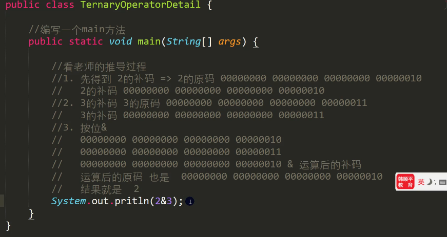

​		2.按位或|：两位有一个为1，结果为1，否则为0

​		3.按位异或^：两位一个为1一个为0，结果为1，否则为0

​		4.按位取反~：1》0，0》1

​		5.算数右移>>：低位溢出，符号位不变，并用符号位补不溢出的高位

​		相当于除2

​		6.算术左移<<：符号位不变，低位补0

​		相当于乘2

​		7.>>>逻辑右移也叫无符号右移（没有<<<）：低位溢出，高位补0

​		按位

```java
//### 	标识符的命名规则和规范
```

​		

关键字：被java设计者使用。保留字：将来可能会被java设计者是用


```java
//### 	用户的输入
-10.5%3 = //无限接近-1.5
公式 = a - (int)a/b*b;

//字符串转成基本数据类型必须用包装类

//把一个字符转换为字符串
char c1 = 'j';
String str1 = c1 + "";
```

```java
import java.util.Scanner;
public class hello {

    public static void main(String[] args){
        //Scanner类，表示文本扫描器，在java.util 包中
        //创建一个scanner对象，new 创建一个对象
        Scanner myScanner = new Scanner(System.in);
        //3.接受输入
        System.out.println("请输入名字");
        String name = myScanner.next();//接受用户的输入
        System.out.println(name);
    }
}
```

## 控制结构

---

### 	顺序

​		程序从上往下执行。

### 	分支

​	单分支

​		if(True){

​			执行语句

​		}

​	多分支

​		if(){

​			}else if(){

​			}else{

​		}

1.//表达式数据类型的转换应该与case后的数据类型保持一致

//或者可以自动转换的数据类型

2.switch，表达式中的返回值必须是：（byte,short,int,char,enum[枚举],String）

3.case中的值必须是常量，不能是变量。

4.default句子是可选的，如果没有case时，执行default

5.switch(只能是byte, short, int, char, String, 枚举)

6.case后必须是常量，default位置任意，且可以省略。

switch(){

​	case : break;

​	default : break;

}

### 	循环

​	1.循环条件返回布尔类型

​	for(循环变量初始化；循环条件；循环变量的迭代){

​		循环的操作；

}

​	while(循环条件){

​		循环体；

​		循环变量迭代；

}

do{

​	循环体；

​	循环变量的迭代；

}while(循环变量)

### 	break

​	Math.random()//产生一个double类型随机数0.0到1.0。不包含1包含0

​	break：终止最近的循环循环

​	1.break在嵌套中可以通过标签指明终止那个循环


### 	continue

​	continue用于结束本次循环，继续执行下一次循环

​	也适用于break的标签

### 	return

​	return使用在方法中，表示跳出所在的方法。如果写在main方法中，退出程序

## 数组排列和查找

---

### 	数组

​		、数组默认形况下是放在堆中

​		、是相同的数据类型总和，实现对这些数据的统一管理，是引用类型。

​		、数组可以存放任意数据类型，包括基本数据类型和引用类型，但是不能混用。

​		、数组没有赋值，默认int、short、byte、long为0，float0.0，double0.0，char\u0000，boolean false，String null。

​		、数组是引用类型，数组的数据本质是一个对象。

​		hens.length数组的长度。

​		1.int a[] = new int[5];//创建一个数组，名字a，存放5个int

​		2.int a[];//空值，还没有分配空间

​		a = new int[10];

​		3.double hens[] = {3, 5, 1, 3.4, 2, 50};

​		hens[i]

​		4.普通数据类型：

​		int n1 = 10;

​		int n2 = n1;

​		n2 = 80;

​		结果n1 = 10,n2 = 80

​		数组在默认情况下是引用传递，**赋值是地址**，复制的方式是引用传递

​		5.对数组添加元素

​		定义一个新的数组，元素大小加一

```java
String str[] = new String[]{"a", "b", "c"};//这个是可以的
```

### 	排序

​		冒泡排序

### 	查找

​		二分查找

​		字符串查找findName.equals(names[i])，判断findName与name[i]是否相等

### 	二维数组

​		arr.length表示一维数组的个数

​		arr[1].length表述的一个元素的个数

​		如果要访问第（i+1）个一维数组的第j+1个值arr[i] [j];

​		1.int[] [] arr = new int[3] [5];


​		2.int arr[] [];

​		arr = new int [2] [4];

​		3.一维数组的个数可以不一样。


​		4.		int[[]][][][][] arr = {

​		{},

​		{},

​		{},

​		{},

​		}

​		5.杨辉三角

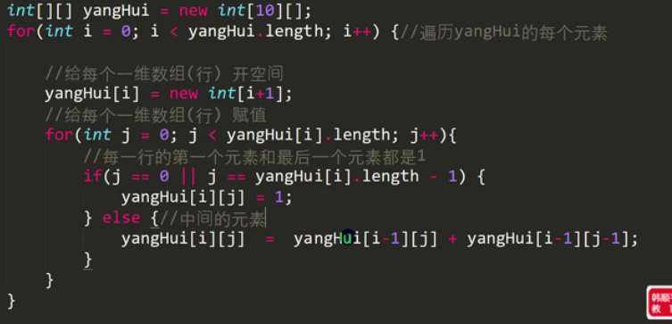


数组的扩容


## 面向对象编程（基础）

---

### 	类与对象

创建对象的流程


​		

​		我们自定义的数据类型

​		对象(属性=成员变量=field(字段)，行为)

​		属性的定义数据类型可以是任意类型，包含基本类型或引用类型

​		属性如果不赋值，有默认值，规则与数组一致。

```java
        //创建一个对象
        Cat cat1 = new Cat();
        cat1.name = "小白";
        cat1.age = 100;
        cat1.color = "白色";
        //访问数据
        System.out.println(cat1.name + "\n" + cat1.age+"\n"+cat1.color);
    }
}
//创建一个猫类
class Cat {
    //属性
    String name;
    int age;
    String color;
```

​		创建对象的两种形式

​		1.Cat cat;

​		cat = new Cat();

​		2.Cat cat = new Cat();

​		对象的赋值与数组完全相同，都是把地址赋给对方


### 	成员方法

​		主要用方法体现行为 

```java
    //public 表示方法是公开的
    //void 表示方法没有返回值
    //speak 表示方法名
    public int speak(int n, int m){
        System.out.println("我是一个好人");
        System.out.println(n);
        return m;
    }
	//方法的调用
	int vcat1.speak(19,18);
```


当执行return res就表名getsum方法执行完毕，相应的栈空间也被释放；


### 	成员方法传参机制


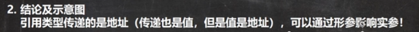


​		老鼠出迷宫

```java
public class MiGong {
    public static void main(String[] args){
        int[][] map = new int[8][7];
        for(int i = 0; i < 7; i++){
            map[0][i] = 1;
            map[7][i] = 1;
        }
        for(int i = 0; i < 8; i++){
            map[i][0] = 1;
            map[i][6] = 1;
        }
        map[3][1] = 1;
        map[3][2] = 1;
        map[2][2] = 1;
        Tb t1 = new Tb();
        t1.findWay(map, 1, 1);
        for(int i = 0; i < map.length; i++){
            for(int j = 0; j < map[i].length; j++){
                System.out.print(map[i][j]);
            }
            System.out.println();
        }
    }
}
class Tb {
    //0表示可以走，1表示障碍物，2表示可以走去，3表示走过，但是走不通是死路
    //当map[6][5] = 2时结束
    public boolean findWay(int[][] map, int i, int j) {
        if(map[6][5] == 2) {
            return true;
        }else {
            if(map[i][j] == 0) {
                map[i][j] = 2;
                if(findWay(map, i + 1, j)){
                    return true;
                } else if(findWay(map, i, j + 1)){
                    return true;
                } else if(findWay(map, i - 1, j)){
                    return true;
                }else if(findWay(map, i, j - 1)){
                    return true;
                } else {
                    map[i][j] = 3;
                    return false;
                }
            } else {
                return false;
            }
        }
    }
}
```

​	汉诺塔

```java
public class HanNuoTa {
    public static void main(String[] args) {
        Tower tower = new Tower();
        tower.move(6, 'A', 'B', 'c');
    }
}

class Tower {
    //num 表示要盘的个数，a，b，c分别为A塔....
    public void move(int num, char a, char b, char c){
        //如果只有一个盘 num = 1
        if(num == 1) {
            System.out.println(a + "->" + c);
        } else {
          //如果有多个盘，可以看成两个，最下面的和上面的所有盘(NUM-1)
          //（1）先移动上面的所有盘到b，借助c
            move(num - 1, a, c, b);
            //（2）把最下面的盘，移动到c盘
            System.out.println(a + "->" + c);
            //（3）再把b塔的所有盘，移动到c，接住a
            move(num - 1, b, a, c);
        }
    }
}

```

八皇后问题

```java
public class OopObject {
    int max = 8;
    int m = 0;
    int arr[] = new int[max];
    public static void main(String[] args) {
        OopObject object1 = new OopObject();
        object1.stack(0);
        System.out.println(object1.m);
    }

    public boolean judge(int n) {
        for (int i = 0; i < n; i++) {
            if (arr[i] == arr[n] || Math.abs(arr[n] - arr[i]) == n - i){
                return false;
            }
        }
        return true;
    }

    public void stack(int n) {
        if (n == max) {
            for (int i = 0; i < max; i++) {
                System.out.print(arr[i] + " ");
            }
            System.out.println();
            m++;
            return;
        }
        for (int i = 0; i < max; i++) {
            arr[n] = i;
            if (judge(n)){
                stack(n + 1);
            }
        }
    }
}
```

### 	overload（方法的重载）

​		方法的重载：java中允许同一个类中，多个同名方法的存在(方法名相同)。但要求形参列表不一致（顺序不同也能构成）！比如：System.out.println();   out是printStream类型。

### 	可变参数


### 	作用域

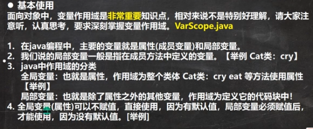


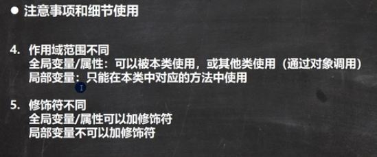

### 	构造器

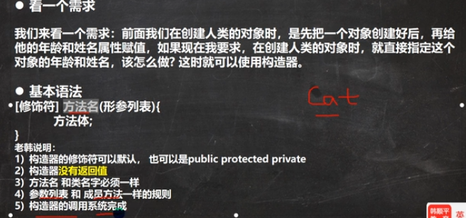

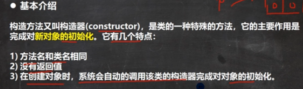


### 	this

​		java虚拟机会给每个对象分配this，代表对象。


## 面向对象编程（中级）

---

### IDEA


删除当前行：ctrl+y

复制粘贴：ctrl+d

补全代码：alt+/

快速格式化代码：ctrl+alt+L

快速运行程序：shift+f10

生成构造器：alt+insert

查看类的层级关系：CTRL+b

定位方法：ctrl+b

​	. var自动生成变量名


模板快捷键：可以高效地完成开发。在文件-》编辑器-》实时模板中

### 包


​	


### 访问修饰符


只有默认和public可与修饰类

### 封装*


案例


```java
package com.hspedu.encap;

public class Encapsulation01 {
    public static void main(String[] args) {
        Person person = new Person();
        person.setName("jfjf");
        person.setAge(30);
        person.setSalary(3000);
        System.out.println(person.info());
        System.out.println(person.getSalary());

        Person sminth = new Person("sminth", 2000, 50000);
        System.out.println(sminth.info());
    }
}

class Person{
    public String name;//公开
    private int age;//age私有化
    private double salary;//私有化

    public Person() {

    }

    //构造器-验证
    public Person(String name, int age, double salary) {
//        this.name = name;
//        this.age = age;
//        this.salary = salary;
        setSalary(salary);
        setAge(age);
        setName(name);
    }

    //快速生成get set,右键，生成。点set get，全选
    public String getName() {
        return name;
    }

    public void setName(String name) {
        //给一个判断如果成立就赋值，否则返货默认值。
        this.name = name;
    }

    public int getAge() {
        return age;
    }

    public void setAge(int age) {
        //给一个判断如果成立就赋值，否则返货默认值。
        if(age >= 1 && age <= 120) {
            this.age = age;
        }else {
            System.out.println("范围错误");
        }
    }

    public double getSalary() {
        //需要设置权限
        return salary;
    }

    public void setSalary(double salary) {
        this.salary = salary;
    }
    public String info(){
        return name+","+age+","+salary;
    }
}
```

### 继承*


细节

1.子类继承了所有的属性和方法，但私有的属性不能被直接访问，可以通过父类提供的公共方法去访问（private不能被访问）

2.子类调用自己的无参构造器（子类构造器中会在第一行调用suber()），父类的构造器也会被调用（先加载父类）

3.当创建子类的对象时，不管使用子类的那个构造器，父类的无参构造器都会被调用，如果父类没有无参构造器，则必须在子类构造器中用suber（实参列表）去指定使用哪个构造器，完成对父类的初始化，否则编译不通过。

4.在子类的构造器中传入suber(参数列表)

5.suber()必须放在子类构造器中的第一行，不能在方法中使用

6.suber()和this()都只能放在构造器的第一行，所以两个方法不能同时使用

7.java所有类都是object的子类

8.父类的构造器的调用不限于直接父类。将一直往上追溯到object类

9.java最对只能继承一个父类。即单继承

本质


当父类与子类的变量名相同时。用子类创建对象并打印该属性，则会先找子类然后是父类，依次往上找。（注意：当父类有age并且是私有的，爷爷类也有age是公共的。你再访问age时，因为在父类找到了age是私有的，直接报错，不会访问爷爷类）

### 多态*

多态可以提高代码的复用性：方法或对象具有多种形态，是面向对象的三大特征，多态是建立继承和封装的基础之上。

重载：我们传入不同的参数，就会调用不同的方法，就是多态

覆盖：我们用不同的对象调用相同的方法名，也是多态

<u>对象多态</u>：


Animal是父类Dog，cat是子类。

当父类与子类有同名方法时，再用animal调用方法就会找运行类型的方法。


细节：

<u>向上转型</u>

---

方法的规则


向上转型：子类自己的成员不能调用：

注意：--特有--两字


---

属性的规则


属性的值主要看编译类型的属性, 那里定义那里使用。

<u>向下转型</u>


如果想调用子类的成员必须用向下转型，（本质，将父类的引用强行转换为子类的引用，原来父类引用名还是指向子类创建的对象）


---

**<u>instanceof</u>**用于判断对象的 **<u>运行</u>** 类型是否为xx类型或xx类型的子类型。


练习

---


<u>多态的数组</u>


### 动态绑定机制*


当在父类中调用geti时，因为geti绑定了运行机制，所以会先执行运行属性的方法

当在父类中调用属性时，没有动态绑定机制，会执行父类的属性。

### super

​	不能访问私有的属性和方法（priate）

​	细节：

​	1.当子类中有和父类的属性和方法重名时，为了访问父类的成员，必须使用suber。如果没有重名，使用suber，this效果一样。

cal()

this.cal()

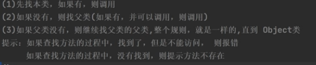

suber.cal()

​	直接查找父类


### overwrite（方法的覆盖）

​	如果子类有一个方法与父类的某个方法，的名称，返回类型，参数一样，那么我们就说子类这个方法覆盖了父类的方法

细节


### Object类详解

是所有类的父类：ctrl+b查看源码

equals方法：


object写的equals用于判断两个对象的地址是否相同

String重写了equals，用于判断两个字符串是否相同

integer重写了equals，用于判断两个值是否相同

重写equals

```java
package com.hspedu.object;

public class EqualsExercise01 {
    public static void main(String[] args) {
        Person person = new Person("jack", 10, 'n');
        Person person1 = new Person("jack", 10, 'n');
        //比较人的内容是否相同
        System.out.println(person.equals(person1));
    }
}

class Person{
    private String name;
    private int age;
    private char gender;

    //重写object的equals方法
    public boolean equals(Object obj){
        if(this == obj){
            return true;
        }
        if(obj instanceof Person){
            Person p = (Person) obj;
            return this.name.equals(p.name) && this.age == p.age;
        }
        return false;
    }

    public Person(String name, int age, char gender) {
        this.name = name;
        this.age = age;
        this.gender = gender;
    }

    public String getName() {
        return name;
    }

    public void setName(String name) {
        this.name = name;
    }

    public int getAge() {
        return age;
    }

    public void setAge(int age) {
        this.age = age;
    }

    public char getGender() {
        return gender;
    }

    public void setGender(char gender) {
        this.gender = gender;
    }
}
```

练习：


hashCode()方法


toString

返回包路径，与hashcode的16进制

一般会重写，一般会把对象的属性输出。

*  当我们输出一个对象时tostring会被默认调用。

#### 垃圾回收机制

不是说你的对象一变成垃圾，我就回收，它的底层有一套自己的算法

finalize方法

我们在实际开发中几乎不用，主要是应付面试


### 断点调试


步入方法有两种，第一强制步入，第二需要找到文件->设置->构造、执行、部署->调试器->步入->把java.* *与javax.* *关闭。


Idea默认情况下，Debug 显示的数据时简化后的，如果想看完整的数据，需要设置


可以在过程中下段点。

作业


==与equals的区别


## 项目&学以致用

---

**项目需求**

实现基本文本界面《房屋出租》。

能够实现对房屋的添加、修改和删除（用数组表示），并能够打印出房屋的明细表。

---

程序框架图

1.系统有哪些类。2明确类与类的调用关系。

HouseView.java

1.显示界面

2.接受用户的输入

3.调用HouseService类对房屋的各种操作


HouseService.java业务

1.响应HouseView的调用    

2.完成对房屋信息的各种操作（增删改查crud）


House.java实行（model）

1.一个房屋对象表示一个房屋的信息


HouseRentApp.java

main(){程序的入口

创建一个HouseView对象，

显示菜单}


工具类

完成获取用户的各种输入

## 面向对象高级

---

### 	类变量和类方法(静态static)***

​		静态变量：在类加载就生成，count在java8前是存在方法区中，在Java8和后是存在堆中

```java
public Static int count = 0;
```

​		此时count会被所有同一个类的对象共享

​		访问：（符合访问修饰符规则）

```java
//类名.类变量
//说明：变量是随着类的加载而创建的，所以即使没有创建对象也可以访问
System.out.println("a.name=" + A.name);
//或者
A a = new A();
System.out.println("a.name=" + a.name);
```

​		细节


​		静态方法：只能访问静态成员（当作工具来使用），当方法中不涉及任何和对象相关的成员，则可以将方法设计成静态方法，提高开发效率。


注意：


### 	理解main方法语法

​		args是如何传入的，在执行程序中可以传递参数


​		注意：


### 	代码块

​		基本介绍：当我们调用构造器时，都会调用代码块。rou先调用代码块再调用构造器。类加载时就会被执行。


​		好处


* **细节**

  

  静态代码块会在类加载时被执行，加载静态方法时也会被执行。只会加载一次。

  普通代码块只会在创建对象时被执行，和类加载没有关系。而且创建一个对象加载一次代码块。

  默认先加载父类的代码块

  ​	

  优先级

  

  ```java
  class A {
      private static int n1 = gettN1();
  
      static {
          System.out.println("A jingtaidamakuai01");
      }
  
      public static int gettN1() {
          System.out.println("getN1beidiaoyong...");
          return 100;
      }
  }
  ```

  

  构造器中相当于先调用suber，再调用本类的静态代码块，先走完静态，再调用普通代码块，最后走构造器

  

  例子

  

### 	单例设计模式


在还没有使用的时候，对象就已经创建好了。

```java
package com.hspedu.static_;

public class SingleTon01 {
    public static void main(String[] args) {
        AA a1 = AA.getInstance();
        System.out.println(a1);
    }
}

class AA {

    private String name;

    private static AA aa = new AA("小红红");

    private AA(String name){
        this.name = name;
    }

    public static AA getInstance() {
        return aa;
    }

    @Override
    public String toString() {
        return "AA{" +
                "name='" + name + '\'' +
                '}';
    }
}
```


只有使用才创建

```java
package com.hspedu.static_;

public class SingleTon02 {
    public static void main(String[] args) {
        System.out.println(Cat.n1);
        Cat cat1 = Cat.getInstance();
        System.out.println(cat1);
    }
}

class Cat{
    private String name;
    public static int n1 = 999;
    private static Cat cat;

    private Cat(String name){
        System.out.println("构造器被调用");
        this.name = name;
    }
//在第一次调用时会创建一个对象，第二次调用时会返回第一次创建的对象
    public static Cat getInstance(){
        if(cat == null) {
            cat = new Cat("小可爱");
        }
        return cat;
    }

    @Override
    public String toString() {
        return "Cat{" +
                "name='" + name + '\'' +
                '}';
    }
}
```


### 	final关键字


细节


一般会把final与static混合使用，当用final修饰静态属性，用类调用属性，静态方法不会被加载。


final可以在方法形参中使用。

### 	抽象类

当父类的方法没有意义，不知道怎样写时。就是抽象方法，就是没有实现的方法，就是没有方法体的，类和方法用abstract修饰，就形成了抽象方法

最后用子类实现抽象方法

细节

抽象类不能被创建（实例化）


### 	接口*

快速入门

```java
package com.hspedu.interface01;

public interface UsbInterface {
    public void start();
    public void stop();
}
```

```java
package com.hspedu.interface01;

//继承接口时，类就要实现继承接口的方法
public class Phone implements UsbInterface{
    public void start() {
        System.out.println("手机工作");
    }

    public void stop() {
        System.out.println("手机停止工作");
    }
}
```

```java
package com.hspedu.interface01;

public class Camera implements UsbInterface{
    @Override
    public void start() {
        System.out.println("相机工作");
    }

    @Override
    public void stop() {
        System.out.println("相加停止工作");
    }
}
```

```java
package com.hspedu.interface01;

public class Computer {
    public void work(UsbInterface usbInterface){
        //通过接口调用方法
        usbInterface.start();
        usbInterface.stop();
    }
}
```

```java
package com.hspedu.interface01;

public class interface01 {
    public static void main(String[] args) {
        Camera camera = new Camera();
        Phone phone = new Phone();

        Computer computer = new Computer();
        computer.work(phone);
        computer.work(phone);
    }
}
```


细节

默认方法需要用default修饰

接口可用于项目经理定义，程序员根据接口实现各种类。

1.接口不能实例化（创建对象）

2.接口中所有的方法是public方法，接口中抽象方法，可以不用abstract修饰

3.一个普通类实现接口，就必须将该接口的所有方法都实现，alt+enter


接口与继承类

小结：

当子类继承了父类，就自动拥有了父类的功能。

如果子类要扩展功能，可以通过接口来实现。

可以理解 实现接口 就是对java 单继承机制的一种补充。


接口是可以体现多态参数的。也可以创建接口数据和动态绑定机制

访问接口中的x用  类名.属性

访问类中的属性用  super.属性

### 	内部类**

一个类的内部有嵌套了另一个类结构，嵌套的类称为内部类（inner class）,嵌套其它类称为外部类（outer class），最大特点可以访问私有属性，并且可以体现先类与类之间的包含关系，

```java
class Quter { //外部类
    class Inner {
        //内部类
    }
}
class Qter{
    //外部其他类
}
```

内部类有四种

**1.局部内部类（有类名）**

通常在方法和代码块中


外部类名.this。就是外部类的对象，谁调用了外部类，那么外部类名.this就代表那个对象。

**2.匿名内部类（没有类名，重点）****

1.本质是类，2.内部类，3.该类没有名字，4.同时还是一个对象。

2.可以使用匿名内部类简化开发

接口匿名内部类：

3.jdk底层在创建匿名内部类 Outer04$1，立马就创建创建了 Outer04$1对象（实例），并把地址返回给变量

4.匿名内部类只能使用一次，就不能再使用了。匿名内部类创建的对象可以重复使用

```java
/*
	底层代码
	//
	class Outer04$1 implememnts IA {
		类体
	}
*/
//运行类型是匿名内部类
//编译类型是类或接口类
接口 变量 = new 接口(参数列表){
	类体
}
```

类匿名内部类

5.类名是匿名内部类的编译类型，运行类型是Outer04$2

```java
//参数会自动的传递给类的构造器，匿名内部类不能重写构造器 
类 变量 = new 类(参数){
    类体
}
```

细节：

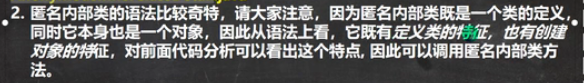


外部类名.this是对象。

```java
package com.hspedu.interface01;

public class InnerClassExercise01 {
    public static void main(String[] args) {
        f1(new AA(){
            @Override
            public void show() {
                System.out.println("这是名画？？");
            }
        });
    }
    //形参接口类型
    public static void f1(AA aa){
        aa.show();
    }
}
interface AA{
    void show();
}
```

```java
package com.hspedu.interface01;

public class InnerClassExercise02 {
    public static void main(String[] args) {
        CellPhone cellPhone = new CellPhone();
        cellPhone.alarmclock(new Bell() {
            @Override
            public void ring() {
                System.out.println("懒猪起床了");
            }
        });
        cellPhone.alarmclock(new Bell(){
            public void ring(){
                System.out.println("小伙伴上课了");
            }
        });
    }
}

class CellPhone{
    public void alarmclock(Bell bell){
        bell.ring();
    }
}

interface Bell{
    void ring();
}
```

```java
package com.hspedu.enum_;

import javafx.scene.control.Cell;

public class Homework03 {
    public static void main(String[] args) {
        Cellphone cellphone = new Cellphone();
        cellphone.textWork(new Icalculate() {
            @Override
            public double work(double n1, double n2) {
                return n1 + n2;
            }
        }, 10, 8);
    }
}

interface Icalculate {
    public double work(double n1, double n2);
}

class Cellphone {
    public void textWork(Icalculate icalculate, double n1, double n2){
        double result = icalculate.work(n1, n2);
        System.out.println(result);
    }
}
```


**3.成员内部类（没有static修饰）**

不写在方法中也不写在代码块中

可以访问外部的所有成员

 可以添加任意访问修饰符


外部其他类访问内部类

1.

```java
Outer08 outer = new Outer08();
Outer08.Inner08 inner08 = outer08.new Inner08();
```

2.在外部类中，编写一个方法，可以返回Inner08对象

```java
Outer08.Inner08 inner08 = outer08.getInner08Instance();
```

**4.静态内部类（使用static修饰）**

1.放在外部类的成员位置

2.使用static修饰

3.可以访问所有的外部静态成员，包含私有的，但不能访问非静态成员

4.可以添加访问修饰符

5.外部其他类访问内部类

new Outer10.Inner10 inner10 = new Outer.Inner10()//可以通过类名直接访问

编写一个方法，可以返回静态内部类的实例


### 作业

非常方便修改

唐僧取经

```java
package com.hspedu.enum_;

public class Homework06 {
    public static void main(String[] args) {
        Person tang = new Person("唐僧", new Horse());
        tang.common();
        tang.passRiver();
    }
}

class VehiclesFactory {
    private static Horse horse = new Horse();

    private VehiclesFactory() {}
    public static Horse getHorse() {
    //        return new Horse();
        return horse;
    }

    public static Boat getBoat() {
        return new Boat();
    }
}

interface Vehicles{
    public void work();
}

class Horse implements Vehicles {
    public void work(){
        System.out.println("使用马");
    }
}

class Boat implements Vehicles {
    public void work(){
        System.out.println("使用船");
    }
}

class Person {
    private String name;
    private Vehicles Vehicles;

    public Person(String name, Vehicles vehicles) {
        this.name = name;
        this.Vehicles = vehicles;
    }
    public void passRiver() {
        if(!(Vehicles instanceof Boat)){
            Vehicles = VehiclesFactory.getBoat();
        }
        Vehicles.work();
    }

    public void common() {
        if(!(Vehicles instanceof Horse)){
            Vehicles = VehiclesFactory.getHorse();
        }
        Vehicles.work();
    }
}
```


## 枚举和注释

---

### 自定义实现枚举


枚举1

```java
package com.hspedu.enum_;

public class Enumeration01 {
    public static void main(String[] args) {
            System.out.println(Season.season);
            System.out.println(Season.season1);
            System.out.println(Season.season2);
            System.out.println(Season.season3);
        }
}

class Season{
    private String name;
    private String desc;
    //在内部直接创建对象
    public static final Season season = new Season("春天", "温暖");
    public static final Season season1 = new Season("冬天", "寒冷");
    public static final Season season2 = new Season("夏天", "炎热");
    public static final Season season3 = new Season("秋天", "温暖");

    private Season(String name, String desc) {
        this.name = name;
        this.desc = desc;
    }

    public String getName() {
        return name;
    }

    public String getDesc() {
        return desc;
    }

    @Override
    public String toString() {
        return "Season{" +
                "name='" + name + '\'' +
                ", desc='" + desc + '\'' +
                '}';
    }
}
```

### enum关键字实现枚举

枚举2

javac编译

javap反编译


```java
package com.hspedu.enum_;

public class Enumeration01 {
    public static void main(String[] args) {
            System.out.println(Season.season);
            System.out.println(Season.season1);
            System.out.println(Season.season2);
            System.out.println(Season.season3);
        	//输出枚举对象的名字
            Ststem.out.println(autumn.name())
            //ordina输出的是该枚举对象的次序，从零开始
            Ststem.out.println(autumn.ordina())
            //从反编译可以看到有values方法，返回对象数据
            Season[] values = Season2.values();
        	for(Season2 season:values){//增强for循环
                System.out.println(season);
            }
            //valueOf根据()中的值，查找枚举对象
        	Season2 autumn1 = Season2.valueOf("AUTUMN");
        	//compareTo:比较的就是编号，把Season2.AUTUMN编号与Season2.SUMMER编号相减
        	System.out.println(Season2.AUTUMN.compareTo(Season2.SUMMER))
        }
}

//使用关键字实现枚举
enum Season{

    //在内部直接创建对象
    //如果使用enum枚举把对象写在最前面
    season("春天", "温暖"),
    season1("冬天", "温暖"),
    season2("秋天", "温暖"),
    season3("夏天", "温暖"),
    what();//what() = what,如果调用的是无参构造器，则()可以省略
    
    private String name;
    private String desc;
    private Season(String name, String desc) {
        this.name = name;
        this.desc = desc;
    }

    public String getName() {
        return name;
    }

    public String getDesc() {
        return desc;
    }

    @Override
    public String toString() {
        return "Season{" +
                "name='" + name + '\'' +
                ", desc='" + desc + '\'' +
                '}';
    }
}
```


Enum常用的方法：

不能在继承其他类，可以继承接口。

### jdk内置的基本注解类型

@target访问空间


/////////////////////////////////////////////////////////////////////////////////////////////////////////////////////////////////////


//////////////////////////////////////////////////////////////////////////////////////////////////////////////////////////////////////


还有类型（TYPE),可以做版本升级过度使用

all抑制所有警告


### 元注解：对注解进行注解


作业

```java
package com.hspedu.enum_;

public class Homework08 {
    public static void main(String[] args) {
        Color green = Color.GREEN;
        switch (green){
            case YELLOW:
                break;
            case GREEN:
                green.show();
                break;
            default:
                break;

        }
    }
}

interface IMyInterface {
    public void show();
}

enum Color implements IMyInterface{
    RED(255, 0, 0),
    BLUE(0, 0, 255),
    BLACK(0, 0, 0),
    YELLOW(255, 255, 0),
    GREEN(0, 255, 0);

    private int reValue;
    private int greenValue;
    private int blueValue;

    Color(int reValue, int greenValue, int blueValue) {
        this.reValue = reValue;
        this.greenValue = greenValue;
        this.blueValue = blueValue;
    }

    @Override
    public void show() {
        System.out.println("属性为"+ reValue +","+greenValue+","+ blueValue);
    }
}
```

## Exception

---

### 异常的概念

将发生异常的代码块选中->快捷键ctrl + alt + t -> 选中 try-catch


### 异常的体系图**


### 常见的异常

常见的五个运行时异常：


1. ```java
   String name = null;
           System.out.println(name.length());
   ```

2. ```java
   int a = 100;
   int b = 0;
   return a / b;
   ```

3. ```java
   int[] arr = {1, 2, 3};
           for (int i = 0; i <= arr.length; i++) {
               System.out.println(arr[i]);
           }
   ```

4. ```java
   public class Exeption01 {
       public static void main(String[] args) {
            A a = new B();
            C c = (C)a;//抛出异常
       }
   }
   
   class A {}
   class B extends A {}
   class C extends A {}
   ```

5. ```java
   String name = "孔德方";
            int num = Integer.parseInt(name);//抛出异常
           System.out.println(num);
   ```

常见的编译异常


### 异常处理**


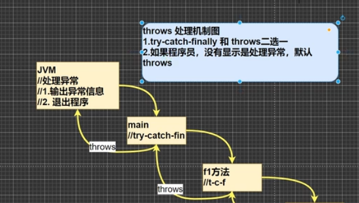

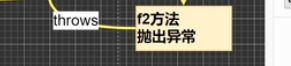

**try-catch-finally的细节：**


练习：


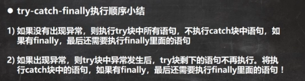

练习：

```java
package com.hspedu.exeption;
import java.util.Scanner;

public class Excption02 {
    public static void main(String[] args) {
        Scanner scanner = new Scanner(System.in);
        int num = 0;
        while(true){
            System.out.println("请输入整数");
            try {
                num = Integer.parseInt(scanner.next());
                break;
            } catch (NumberFormatException e) {
                System.out.println("你输入的不是整数");
            }
        }
        System.out.println("你输入的是整数");
    }
}
```

**throws异常处理**


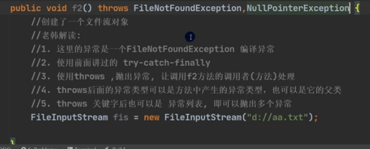

细节：


### 异常的分类

### 自定义异常


```java
package com.hspedu.exeption;
import java.util.Scanner;

public class CustomException {
    public static void main(String[] args) {
        Scanner scanner = new Scanner(System.in);
        int num = Integer.parseInt(scanner.next());
        if(!(num >= 18 && num <= 120)){
            throw new AgeException("年龄需要在 18-120之间");
        }
        System.out.println("你的年龄是正确的");
    }
}

//重写父类的运行异常
class AgeException extends RuntimeException {
    public AgeException(String message){
        super(message);
    }
}
```


### throw和throws的对比

 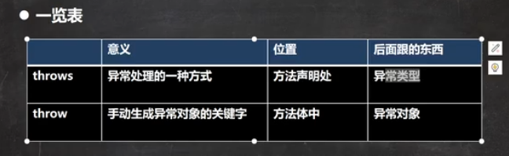


异常处理过以后不会退出程序

## 常用类

---

### 	包装类

基本数据类型不是对象，把基本数据类型转化为对象，就称包装类


**装箱和拆箱**

基本数据类型转换


```java
package com.hspedu.exeption;

public class Interger {
    public static void main(String[] args) {
        //jdk5以前手动装箱和拆箱
        //手动装箱
        int n1 = 100;
        Integer integer = new Integer(n1);
        Integer integer1 = Integer.valueOf(n1);

        //手动拆箱
        //Integer -> int
        int i = integer.intValue();
        //自动装箱
        int n2 = 200;
        Integer integer2 = n2;//Integer.valueOf(n2);
        //自动拆箱
        int n3 = integer2;
    }
}
```

练习：


包装类型与string的相互转换

```java
//        包装类 -> String
        Integer i = 100;
//        1.
        String str1 = i + "";//i没有变化
//        2.
        String str2 = i.toString();
//        3.
        String str3 = String.valueOf(i);
//        Strng -> 包装类(integer)
        String str4 = "12345";
//        1.
        Integer i2 = Integer.parseInt(str4);
//        2.
        Integer i3 = new Integer(str4)
```


练习：


### 	String**

```java
String s = "hsp";
String s1 = new String("hsp");
```


串行化表示可以在网络传输


练习：


   


看源码学习

String常见的方法：


### 	StringBuffer**


构造器的使用


String与StringBuffer相互转换


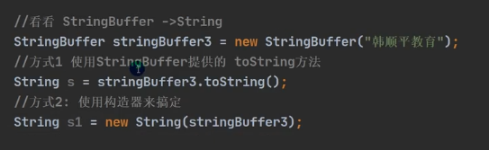

常用方法  


练习题：


```java
package com.hspedu.exeption;

public class String01 {
    public static void main(String[] args) {
        String name = "164445623567.59";
        StringBuffer sb = new StringBuffer(name);
        
//      int i = sb.lastIndexOf(".");
        for (int i = sb.lastIndexOf(".") - 3; i > 0; i -= 3) {
            sb = sb.insert(i, ",");
        }
        System.out.println(sb);
    }
}
```

### 	StringBuilder**


String与StringBuffer与StringBuilder的比较

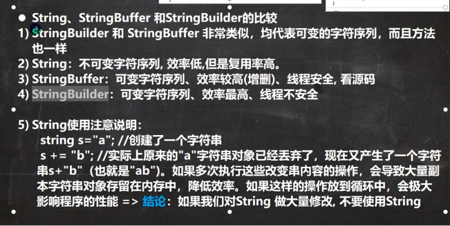

效率strinBilder>StringBuffer>String


### 	Math(数学函数)


### 	Date, Calender, LocaIDate...（日期类）

1.


Simpledate日期时间的输出格式


2.（日历）（java.util.Calender）


3.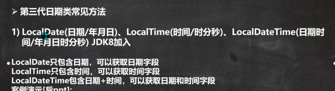


日期类：

DatetimeFormatter


时间戳instant


### 	System


1.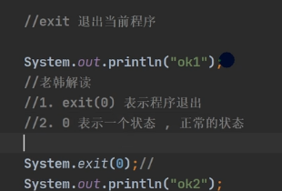

2. 
3. 

### 	Arrays

```java
package com.hspedu.Sringbuilder;

import java.lang.reflect.Array;
import java.util.Arrays;
import java.util.Comparator;

public class MathMethod {
    public static void main(String[] args) {
        //        常用的方法
        Integer[] integers = {20 ,1 , 30};

        //输出数组
        System.out.println(Arrays.toString(integers));
        //演示sort方法的演示
        //排序,可以直接使用sort直接排序
        //排序后会影响integers[]
        Arrays.sort(integers);
        System.out.println(Arrays.toString(integers));
        //定制排序:
        //调用一个方法时传入两个参数,实现了comparator的匿名内部类
        //这里体现了接口的编程方式,
        Integer[] arr = {-8, 28, 9, -2, -10};
        Arrays.sort(arr, new Comparator<Integer>() {
            @Override
            public int compare(Integer o1, Integer o2) {
                Integer i1 = (Integer) o1;
                Integer i2 = (Integer) o2;
                return i1 - i2;
            }
        });
        
            //        二叉查找
            int index = Arrays.binarySearch(arr, 9);
            System.out.println(index);
        	System.out.println(Arrays.toString(arr));
    }
}
LegacyMergeSort.userRequested
```


自定义，定制排序

```java
package com.hspedu.ArraysSortCusto;

import java.util.Arrays;
import java.util.Comparator;

public class ArrsySo {
    public static void main(String[] args) {
        
        
        int[] arr = {1, -1, 8, 0, 20};
//        bubble01(arr);
        bubble01(arr, new Comparator() {
            @Override
            public int compare(Object o1, Object o2) {
                int i1 = (Integer) o1;
                int i2 = (Integer) o2;
                return i1 - i2;
            }
        });
        System.out.println(Arrays.toString(arr));
    }
    
    public static void bubble01(int[] arr, Comparator c){
        int temp = 0;
        for (int i = 0; i < arr.length - 1; i++) {
            for (int j = 0; j < arr.length - 1 - i; j++) {
                if (c.compare(arr[j], arr[j + 1]) > 0){
                   temp = arr[j];
                   arr[j] = arr[j + 1];
                   arr[j + 1]  =temp;
                }
            }
        }
    }
}
```


### 	BigInteger BigDecimal


1.


2.

除法如果是一个无限循环小数就会报错

解决方法设置精度：BigDecimal.ROUND_CEILING

如果是一个无限循环小数会保留分子的精度

### 作业

```java
package com.hspedu.Homework;

public class Homework01 {
    public static void main(String[] args) {
        String str = "abcdefgh";
        try {
            str = reverse(str, 1, 1);
        } catch (Exception e) {
            System.out.println(e.getMessage());
            return;
        }
        System.out.println(str);
    }

    public static String reverse(String str, int start, int end){
        //重要技巧1.先写出正确的情况,取反为不正确的
        if(!(str != null && start >= 0 && end > start && end < str.length())){
            throw new RuntimeException("参数不正确");
        }

        char[] chars = str.toCharArray();
        char temp = ' ';
        for (int i = start, j = end; i < j; i++, j--) {
            temp = chars[i];
            chars[i] = chars[j];
            chars[j] = temp;
        }

        return new String(chars);
    }
}
```

```java
package com.hspedu.Homework;

public class Homework02 {
    public static void main(String[] args) {
        String name = "jackffgg";
        String pwd = "123456";
        String email = "jack@sohu.com";
        try {
            userRegister(name, pwd, email);
            System.out.println("注册成功");
        } catch (Exception e) {
            System.out.println(e.getMessage());
        }
    }

    public static void userRegister(String name, String pwd, String email) {
        int nameLength = name.length();
        if(!(nameLength >= 2 && nameLength <= 4)) {
            throw new RuntimeException("用户名长度不正确");
        }
        if(!(pwd.length() == 6 && isDigital(pwd))){
            throw new RuntimeException("你的密码长度为六");
        }

        int i = email.indexOf('@');
        int i1 = email.indexOf('.');
        if(!(i > 0 && i1 > i)) {
            throw new RuntimeException("邮箱包含@与., 并且@在.的前面");
        }
    }

    public static boolean isDigital(String str) {
        char[] chars = str.toCharArray();
        for (int i = 0; i < chars.length; i++) {
            if(chars[i] < '0' || chars[i] > '9'){
                return false;
            }
        }
        return true;
    }
}
```

```java
package com.hspedu.Homework;

import java.util.Locale;

public class Homework03 {
    public static void main(String[] args) {
        String name = "jfjs fjia sjfls";
        printName(name);
    }

    public static void printName(String str) {
        if(str == null) {
            return;
        }

        String[] names = str.split(" ");
        if(names.length != 3){
            return;
        }
        String format = String.format("%s,%s.%c", names[2], names[0], names[1].toUpperCase().charAt(0));
        System.out.println(format);
    }
}
```


## 集合

---

### 	**集合的框架体系


### 		Collection(单列集合，接口)


常用方法

```java
package com.hspedu.collection_;

import java.util.List;
import java.util.ArrayList;

public class CollectionMethod {
    @SuppressWarnings("all")
    public static void main(String[] args) {
        List list = new ArrayList();
        //添加
        list.add("jack");//里面的数据是对象
        list.add("Kong");
        System.out.println(list);
        //删除元素
        list.remove(0);//删除第一个元素, 也可以指定删除元素
        System.out.println(list);
        //查看元素是否存在
        System.out.println(list.contains("jack"));
        //返回元素的个数
        System.out.println(list.size());
        //判断集合是否为空
        System.out.println(list.isEmpty());
        //清空元素
        list.clear();
        System.out.println(list);
        //添加列表
        ArrayList list2 = new ArrayList();
        list2.add("红楼梦");
        list2.add("三国演义");
        list.addAll(list2);
        System.out.println(list);
        //判断都个元素是否存在
        System.out.println(list.containsAll(list2));
        //删除多个元素
        list.add("聊斋");
        list.removeAll(list2);
        System.out.println(list);
    }
}
```


示例

还有一个是普通的遍历

```java
package com.hspedu.collection_;

import java.util.ArrayList;
import java.util.Collection;
import java.util.Iterator;

public class CollectionIterator {
    @SuppressWarnings("all")
    public static void main(String[] args) {

        Collection col = new ArrayList();

        col.add(new Book("三国演义", "罗贯中", 10.1));
        col.add(new Book("小李飞刀", "古龙", 5.1));
        col.add(new Book("红楼梦", "曹雪芹", 43.6));

		//System.out.println(col);
        //1.先得到col对应的迭代器
        Iterator iterator = col.iterator();
		//2.使用while遍历
//        while(iterator.hasNext()) {
//            //返回下一个元素。类型是Object
//            Object obj = iterator.next();
//            System.out.println(obj);
//        }
        //快捷键, 显示所有快捷键ctrl + j
        while (iterator.hasNext()) {
            Object next =  iterator.next();
            System.out.println(next);
        }
        //当迭代器指向最后一个元素时，就不能再取元素了，再取元素就会报NoSuchElementException
        //3.如果希望再次遍历，需要重置迭代器iterator = col.iterator()
    
    	iterator = col.iterator();

        //使用增强for循环，也可以用在数组上
        //底层依然是迭代器，就是简化版的迭代器，快捷键 I
        for(Object next : col) {
            System.out.println(next);
        }
    }
}

class Book {
    private String name;
    private String author;
    private double price;

    public Book(String name, String author, double price) {
        this.name = name;
        this.author = author;
        this.price = price;
    }

    public String getName() {
        return name;
    }

    public void setName(String name) {
        this.name = name;
    }

    public String getAuthor() {
        return author;
    }

    public void setAuthor(String author) {
        this.author = author;
    }

    public double getPrice() {
        return price;
    }

    public void setPrice(double price) {
        this.price = price;
    }

    @Override
    public String toString() {
        return "Book{" +
                "name='" + name + '\'' +
                ", author='" + author + '\'' +
                ", price='" + price + '\'' +
                '}';
    }
}
```

#### 					list(接口)（有序）（可以重复，能存储null）

三种创建对象的遍历都可以

```java
//List有顺序，添加元素与取出元素是一致的，并且可以重复
        List list = new ArrayList();
        list.add("jsck");
        list.add("tom");
        list.add("mary");
        list.add("tom");
        System.out.println(list);
        //list每个元素都有顺序索引，从零开始
        System.out.println(list.get(2));
		//插入元素
        list.add(1,"刘备");
        System.out.println(list);
        //插入多个元素
        List list1 = new ArrayList();
        list1.add("黄忠");
        list1.add("赵云");
        list.addAll(1, list1);
        System.out.println(list);
        //找出元素的位置,返回第一个元素的位置
        System.out.println(list.indexOf("tom"));
        //如果有多个相同的元素，返回最后一个元素的位置
        System.out.println(list.lastIndexOf("tom"));
        //删除指定位置的元素，并返回元素
        Object name = list.remove(0);
        System.out.println(name);
        //替换元素
        list.set(1, "玛丽");
        System.out.println(list);
        //返回指定位置的的集合，前闭后开
        List list2 = list.subList(0, 2);
        System.out.println(list2);
```

##### 							ArrayList*（线程不安全， 数组）


ArrayList是线程不安全的，因为没有加synchronized修饰

synchronized修饰表示

​			练习：

```java
package com.hspedu.List_;

import java.util.ArrayList;
import java.util.Iterator;
import java.util.List;

public class ListExercise02 {
    public static void main(String[] args) {
        List list = new ArrayList();

        list.add(new Book("红楼梦 ", 120, "曹雪芹"));
        list.add(new Book("小李飞刀", 100, "古龙"));
        list.add(new Book("三国演义", 320, "罗贯中"));

        Iterator iterator = list.iterator();
        while (iterator.hasNext()){
            Object next = iterator.next();
            System.out.println(next);
        }

        int listSize = list.size();
        for (int i = 0; i < list.size() - 1; i++) {
            for (int j = 0; j < list.size() - 1 - i; j++) {
                Book book = (Book)list.get(j);
                Book book2 = (Book)list.get(j+1);
                if(book.getPrice() >= book2.getPrice()){
                    list.set(j, book2);
                    list.set(j + 1, book);
                }
            }
        }
        iterator = list.iterator();
        while (iterator.hasNext()){
            Object next = iterator.next();
            System.out.println(next);
        }

    }
}

class Book {
    private String name;
    private double price;
    private String author;

    public Book(String name, double price, String author) {
        this.name = name;
        this.price = price;
        this.author = author;
    }

    public String getName() {
        return name;
    }

    public void setName(String name) {
        this.name = name;
    }

    public double getPrice() {
        return price;
    }

    public void setPrice(double price) {
        this.price = price;
    }

    public String getAuthor() {
        return author;
    }

    public void setAuthor(String author) {
        this.author = author;
    }

    @Override
    public String toString() {
        return  "name: " + name + '\t' +
                "price: " + price + '\t' +
                "author: " + author;
    }
}
```

分析源码：


什么是 java 序列化？什么情况下需要序列化？
	序列化：将 Java 对象转换成字节流的过程。

​	反序列化：将字节流转换成 Java 对象的过程。

​	当 Java 对象需要在网络上传输 或者 持久化存储到文件中时，就需要对 Java 对象进行序列化处理。

​	序列化的实现：类实现 Serializable 接口，这个接口没有需要实现的方法。实现 Serializable 接口是为了告诉 jvm 这个类的对象可以被序列化。

​	注意事项：

​	某个类可以被序列化，则其子类也可以被序列化
​	声明为 static 和 transient 的成员变量，不能被序列化。static 成员变量是描述类级别的属性，transient 表示临时数据
​	反序列化读取序列化对象的顺序要保持一致

**当走无参构造器时：**


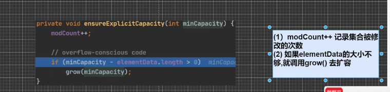


**走有参构造器时**


##### 							LinkedList（线程不安全，双向链表）


链表的创建：

```java
package com.hspedu.Linklist;

public class LinkList {
    public static void main(String[] args) {
        Node jack = new Node("jack");
        Node tom = new Node("tom");
        Node hsp = new Node("hsp");

        //连接三个链表
        jack.next = tom;
        tom.next = hsp;

        hsp.pre = tom;
        tom.pre = jack;

        Node first = jack;//头
        Node last = hsp;//尾

        while (true) {
            if(first == null) {
                break;
            }
            System.out.println(first);
            first = first.next;
        }
    }
}

//定义一个Node类，Node对象，表示双向链表的一个节点
class Node {
    public Object item;//数据
    public Node next;//指向后一个节点
    public Node pre;//指向前一个结点
    public Node(Object name) {
        this.item = name;
    }

    @Override
    public String toString() {
        return  "Node name: " + item;
    }
}
```

操作：

```java
public static void main(String[] args) {
    LinkedList linkedList = new LinkedList();
    linkedList.add(1);
    linkedList.add(2);
    linkedList.add(3);
    System.out.println(linkedList);

    //删除第一个节点
    linkedList.remove();
	//修改某个节点
    linkedList.set(1, 999);
    System.out.println(linkedList);

    //得到某个节点
    Object o = linkedList.get(1);
    System.out.println(o);

    //因为linkdelist是实现list接口的，所以与原来的一样
    Iterator iterator = linkedList.iterator();
    while (iterator.hasNext()) {
        Object next = iterator.next();
        System.out.println(next);
    }
}
```

Arraylist与linkedlist的比较：


##### 							Vector*（线程安全，数组）

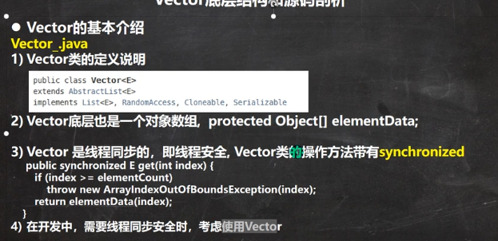


#### 				set(接口)（无序）（不允许重复，最多有一个null）


##### 							HashSet*(底层是HashMap，单向链表)


数组加链表

```java
package com.hspedu.set_;

public class HashSetStructure {
    @SuppressWarnings({"all"})
    public static void main(String[] args) {
        //1.创建一个数组，类型是Node
        Node[] table = new Node[16];

        //创建一个结点
        Node john = new Node("john", null);
        table[2] = john;
        Node jack = new Node("jack", null);
        john.next = jack;//将jack的节点挂载到新节点
        System.out.println(table);
    }
}

class Node {
    Object item;//存数据
    Node next;//指向下一个节点

    public Node(Object item, Node next) {
        this.item = item;
        this.next = next;
    }
}
```


522集追源码

```java
package com.hspedu.set_;

import java.util.HashSet;

@SuppressWarnings({"all"})
public class HashSetIncrement {
    public static void main(String[] args) {
        HashSet hashSet = new HashSet();

//        for (int i = 0; i < 101; i++) {
//            hashSet.add(i);
//        }
//        System.out.println(hashSet);

        for (int i = 0; i <= 12; i++) {
            hashSet.add(new A(i));
        }
        System.out.println(hashSet);
    }
}

class A {
    private int n;

    public A(int n) {
        this.n = n;
    }

    public int hashCode() {
        return 100;
    }
}
```

只要你加入元素，不管是加入节点上还是链表上，都算一个当大于十二是数组进行扩容，以此类推。

练习：


```java
package com.hspedu.set_;

import java.util.HashSet;
import java.util.Objects;

@SuppressWarnings({"all"})
public class HashSetExercise {
    public static void main(String[] args) {
        HashSet hashSet = new HashSet();
        hashSet.add(new Employee("小明", 18));
        hashSet.add(new Employee("小明", 18));
        hashSet.add(new Employee("小明", 28));
        System.out.println(hashSet);
    }
}

class Employee {
    private String name;
    private int age;

    public Employee(String name, int age) {
        this.name = name;
        this.age = age;
    }

    public String getName() {
        return name;
    }

    public void setName(String name) {
        this.name = name;
    }

    public int getAge() {
        return age;
    }

    public void setAge(int age) {
        this.age = age;
    }

    @Override
    public String toString() {
        return  "name=" + name + "\t" + "age=" + age;
    }

    @Override
    public boolean equals(Object o) {
        if (this == o) return true;
        if (o == null || getClass() != o.getClass()) return false;
        Employee employee = (Employee) o;
        return age == employee.age && Objects.equals(name, employee.name);
    }

    @Override
    public int hashCode() {
        return Objects.hash(name, age);
    }
}
```

###### 	LinkedHashSet(底层是LinkedHashMap，双向链表，加入顺序和去除顺序是一样的，因为底层用双向链表连接)


##### 			TreeSet*（存储数据是有序的。需要传入比较器，只能传入实现Comparable接口的对象）

当重写Comparable接口的compare方法时，返回零表示传进的值相同，对象就加入不了

 存储数据是有序的，需要做一些处理（可以按字符串的大小排序，可以传入一个比较器）


### 		Map(双列集合，无序)

key不能重复，value可以重复，当key重复时会把value替换


Node是Hashmap的内部类，而Node有继承了Entry接口，Node实现了Map.Entry接口

EntrySet也是HashMap的内部类


常用方法：


Map的六大遍历方法：

```java
package com.kjqedu.home01;

import java.util.*;

@SuppressWarnings("all")
public class HomeWork03 {
    public static void main(String[] args) {
        Map hashMap = new HashMap();
        hashMap.put("jack", 650);
        hashMap.put("tom", 1200);
        hashMap.put("smith", 2900);
        hashMap.put("jack", 2600);

        Set set = hashMap.keySet();
        System.out.println(set);
        for(Object key: set){
            System.out.println(key + ";" + hashMap.get(key));
        }

        Iterator iterator = set.iterator();
        while (iterator.hasNext()){
            Object next = iterator.next();
            System.out.println(next + ";" + hashMap.get(next));
        }

        //只能取出values
        Collection values = hashMap.values();
        for (Object value : values) {
            System.out.println(value);
        }

        Iterator iterator1 = values.iterator();
        while (iterator1.hasNext()) {
            Object next = iterator1.next();
            System.out.println(next);
        }
        
        //第三种方式
        Set set1 = hashMap.entrySet();
        for (Object o : set1) {
            Map.Entry m = (Map.Entry) o;
            System.out.println(m.getKey() + ";" + m.getValue());
        }

        Iterator iterator2 = set1.iterator();
        while (iterator2.hasNext()) {
            Object next = iterator2.next();
            Map.Entry m = (Map.Entry) next;
            System.out.println(m.getKey() + ";" + m.getValue());
        }

    }
}
```


entryset取数据


#### 				HashMap(数组+链表+红黑树，线程不安全，无序)*


因为HashMap没有synchronize，所以线程不安全


##### 			LinkedHashMap

#### 				Hashtable（线程安全，k-v不能为null）


Hashtable与HashMap的对比


##### 			properties(继承了Hashtable)


集合的使用技巧


#### 				TreeMap（有序，需要传入比较器，他的key只能传入实现Comparable接口的对象）


### 		Collections

对list，map，set进行操作


### 作业


```java
package com.hspedu.Homework;

import java.util.ArrayList;

@SuppressWarnings({"all"})
public class Homework04 {
    public static void main(String[] args) {
        ArrayList arrayList = new ArrayList();
        arrayList.add(new New("新冠确诊病例超千万，数百万印度教信徒傅恒和\"圣域\"因民众担忧"));
        arrayList.add(new New("静安分局岸基飞机进了房间安静多了"));

        int size = arrayList.size();
        for (int i = size - 1; i >= 0; i--) {
//            System.out.println(arrayList.get(i));
            New anew = (New)arrayList.get(i);
            System.out.println(processTitle(anew.getText()));
        }
    }

    public static String processTitle(String title) {
        if(title == null) {
            return "";
        }
        if(title.length() > 15) {
            return title.substring(0, 15) + "...";
        }else {
            return title;
        }
    }
}

class New {
    private String text;
    private String content;

    public New(String text) {
        this.text = text;
    }

    public String getText() {
        return text;
    }

    public void setText(String text) {
        this.text = text;
    }

    public String getContent() {
        return content;
    }

    public void setContent(String content) {
        this.content = content;
    }

    @Override
    public String toString() {
        return "text=" + text;
    }
}
```


## 	泛型

---

### 泛型语法

传统方法的不足


```java
package com.hspedu.generic;

public class Generic01 {
    public static void main(String[] args) {
        
        Person<String> person = new Person<String>();

    }
}

class Person<E> {
    E s;//E表示，s的数据类型，该数据类型在定义Person对象的时候指定的，即在编译期间，就确定E是什么类型
//E
}
```

语法：


### 自定义泛型

#### 		泛型类


2.泛型不能实例化，因为数组在new时，不能确定T的类型，就无法在内存开辟空间。可以定义，


#### 		泛型接口


#### 		泛型的方法

‘

不用特意传递数据类型，


使用时直接判断fly传递的数据类型

### 泛型的继承和通配符


这里错误！！

2.


3.


4.可以是任意父类。


### JUnit


作业：


```java
package com.hspedu.Homework;

import org.junit.jupiter.api.Test;

import java.util.*;

public class Homework06 {
    public static void main(String[] args) {

    }
    @Test
    public void testList() {
        DAO<User> dao = new DAO<>();
        dao.save("001", new User(1, 10, "jack"));
        dao.save("002", new User(2, 18, "king"));
        dao.save("003", new User(3, 28, "smith"));

        List<User> list = dao.list();
        System.out.println(list);

        dao.update("003", new User(3, 58, "milan"));
        list = dao.list();
        System.out.println(list);
    }
}

class DAO<T> {
    private Map<String, T> map = new HashMap<>();

    public T get(String id) {
        return map.get(id);
    }

    public void update(String id, T entity) {
        map.put(id, entity);
    }

    public List<T> list() {
        List<T> list = new ArrayList<>();

        Set<String> keySet = map.keySet();
        for (String key : keySet) {
            list.add(map.get(key));
        }
        return list;
    }
    public void delete(String id) {
        map.remove(id);
    }

    public void save(String id, T entity) {
        map.put(id, entity);
    }
}

class User {
    private int id;
    private int age;
    private String name;

    public User(int id, int age, String name) {
        this.id = id;
        this.age = age;
        this.name = name;
    }

    public int getId() {
        return id;
    }

    public void setId(int id) {
        this.id = id;
    }

    public int getAge() {
        return age;
    }

    public void setAge(int age) {
        this.age = age;
    }

    public String getName() {
        return name;
    }

    public void setName(String name) {
        this.name = name;
    }

    @Override
    public String toString() {
        return "User{" +
                "id=" + id +
                ", age=" + age +
                ", name='" + name + '\'' +
                '}';
    }
}
```

## 线程（基础）

---

### 	线程的介绍


### 	线程的使用*

**Thread创建接口**


```java
package com.hspedu;

public class Thread01 {
    public static void main(String[] args) {
        //创建一个Cat对象，可以当作线程使用
        Cat cat = new Cat();
        //为什么不用cat.run()，run方法只是一个普通的方法，没有真正启动一个线程。
        cat.start();//启动线程
    }
}

//1.当一个类继承了Thread类，该类就可以当成线程使用
//2.重写run方法，写上自己的业务逻辑
//3.run Thread 类 实现了 Runnable 接口的run方法
class Cat extends Thread {

    @Override
    public void run() {
        while (true) {
            System.out.println("喵喵，小猫咪" + "线程名" + thread.currentThread().getName());

            try {
                Thread.sleep(1000);
            } catch (InterruptedException e) {
                e.printStackTrace();
            }
        }
    }
}
```


在Terminal中输入JConsole查看线程

不是因为主线程结束进程就结束了，所有线程结束时才会结束进程

**Runnable**创建一个线程


```java
package com.hspedu;

public class Thread02 {
    public static void main(String[] args) {
        Dog dog = new Dog();
        //dog.start(); 这里不能使用start
        //创建一个Thread对象，把dog对象，放入Thread
        Thread thread = new Thread(dog);
        thread.start();
    }
}

class Dog implements Runnable {

    int count = 0;
    @Override
    public void run() {
        while(true) {
            System.out.println("小狗汪汪叫" + (++count) + Thread.currentThread().getName());

            try {
                Thread.sleep(1000);
            } catch (InterruptedException e) {
                e.printStackTrace();
            }
        }
    }
}
```

```java
//使用代理，模拟了一个极简的Thread
class Proxy implements Runnable {//把Proxy看成Thread

    private Runnable target = null;

    @Override
    public void run() {
        if(target != null){
            target.run();
        }
    }

    public Proxy(Runnable target) {
        this.target = target;
    }

    public void start() {
        start0();
    }

    public void start0 () {
        run();
    }
}
```


**多线程的问题**

```java
package com.hspedu.ticket;

public class SellTicket {
    public static void main(String[] args) {
        SellTicket01 sellTicket01 = new SellTicket01();
        SellTicket01 sellTicket02 = new SellTicket01();
        SellTicket01 sellTicket03 = new SellTicket01();
        //会出现票数超卖情况
        sellTicket01.start();
        sellTicket02.start();
        sellTicket03.start();
    }
}

class SellTicket01 extends Thread {

    private int num = 100;//让多个线程共享num

    @Override
    public void run() {
        while (true) {
            if(num <= 0) {
                System.out.println("售票结束");
                break;
            }
            //休眠50毫秒
            try {
                Thread.sleep(50);
            } catch (InterruptedException e) {
                e.printStackTrace();
            }

            System.out.println("窗口" + Thread.currentThread().getName() + "售出一张票" + "剩余" + (--num));

        }
    }
}
```

**通知线程退出**


```java
package com.hspedu.ticket;

public class SellTicket {
    public static void main(String[] args) {
        SellTicket01 sellTicket01 = new SellTicket01();
        sellTicket01.start();
        try {
            Thread.sleep(1000);
        } catch (InterruptedException e) {
            e.printStackTrace();
        }
        System.out.println("主线程运行中~");
        //主线程控制子线程
        //调用对象退出方法，从而退出线程
        sellTicket01.setLoop(false);
    }
}

class SellTicket01 extends Thread {
    //设置一个变量
    private int count = 0;
    private boolean loop = true;
    @Override
    public void run() {
        while (loop) {
            System.out.println("线程运行中~");
            //休眠50毫秒
            try {
                Thread.sleep(50);
            } catch (InterruptedException e) {
                e.printStackTrace();
            }
        }
    }

    public void setLoop(boolean loop) {
        this.loop = loop;
    }
}
```

### 	线成的方法

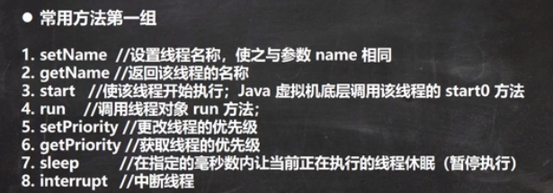

```java
//修改线程的优先级
thread.setPriority(Thread.MIN_PRIORITY);
```

interrupt(会中断休眠)只是改变线程中断的状态，InterruptedException。当休眠被中断时就会抛出一个中段异常


interrupt会中断休眠


线程的插队与礼让，默认都会停止礼让线程，进而执行其他线程

```java
package com.hspedu.ticket;

public class SellTicket {
    public static void main(String[] args) throws InterruptedException {
        SellTicket01 t2 = new SellTicket01();
        t2.start();
        for (int i = 0; i < 20; i++) {
            try {
                Thread.sleep(1000);
            } catch (InterruptedException e) {
                e.printStackTrace();
            }
            System.out.println("小弟吃包子~");
            if(i == 5) {
                System.out.println("小弟吃了5个包子，让大哥先吃~");
                //t2.join();线程插队，一定成功
                Threa d.yield();
            }
        }
    }
}

class SellTicket01 extends Thread {
    @Override
    public void run() {
        for (int i = 0; i < 20; i++) {
            System.out.println("大哥吃包子~");
            try {
                Thread.sleep(1000);
            } catch (InterruptedException e) {
                e.printStackTrace();
            }
        }
    }
}
```

**用户线程与守护线程**


```java
package com.hspedu.ticket;

public class SellTicket {
    public static void main(String[] args) throws InterruptedException {
        SellTicket01 t2 = new SellTicket01();
        t2.setDaemon(true);//设置守护线程
        t2.start();
        //如果我们希望当main线程结束后，子线程自动结束
        //只需要将子线程设置为守护线程即可
        for (int i = 0; i < 10; i++) {
            System.out.println("宝强在工作。。。");
            Thread.sleep(1000);
        }

    }
}

class SellTicket01 extends Thread {
    @Override
    public void run() {
        while(true){
            try {
                Thread.sleep(1000);
            } catch (InterruptedException e) {
                e.printStackTrace();
            }
            System.out.println("快乐聊天。。。");
        }
    }
}
```

### 	线程的生命周期

- 线程状态。一个线程可以有以下规定： 

  - [`NEW`](../../java/lang/Thread.State.html#NEW)
    线程尚未开始在这个状态。 
  - [`RUNNABLE`](../../java/lang/Thread.State.html#RUNNABLE)
    处于执行线程状态中的java虚拟机。 
  - [`BLOCKED`](../../java/lang/Thread.State.html#BLOCKED)（锁）
    线程阻塞等待监控锁在这个线程。 
  - [`WAITING`](../../java/lang/Thread.State.html#WAITING)（插队被插队状态）
    处于这种状态的线程被无限期地等待另一个线程来执行特定的动作。 
  - [`TIMED_WAITING`](../../java/lang/Thread.State.html#TIMED_WAITING)（等待）Thread.sleep(500);
    处于这种状态的线程正在等待另一个线程执行一个动作指定的等待时间。 
  - [`TERMINATED`](../../java/lang/Thread.State.html#TERMINATED)
    处于这种状态的线程退出。 

  一个线程可以在一个给定的时间点上只有一个状态。这些状态是不反映任何操作系统线程状态的虚拟机状态。


```java
package com.hspedu.ticket;

public class SellTicket {
    public static void main(String[] args) throws InterruptedException {
        T t2 = new T();
        System.out.println(t2.getName() + "状态" + t2.getState());
        t2.start();
        //如果我们希望当main线程结束后，子线程自动结束
        //只需要将子线程设置为守护线程即可
        for (; Thread.State.TERMINATED != t2.getState(); ) {
            System.out.println(t2.getName() + "状态" + t2.getState());
            Thread.sleep(1000);
        }
        System.out.println(t2.getName() + "状态" + t2.getState());
    }
}

class T extends Thread {
    @Override
    public void run() {
        while(true){
            try {
                Thread.sleep(1000);
            } catch (InterruptedException e) {
                e.printStackTrace();
            }
            System.out.println("快乐聊天。。。");
        }
    }
}
```

### 	Synchronized（锁）非公平锁*

获取对象锁才能操作，锁住的内容


### 	互斥锁*


**当继承Tread时创建了多个对象，而锁对象只能要求一个，所以根本锁不住。**

```java
package com.hspedu.ticket;

public class SellTicket {
    public static void main(String[] args) {
        SellTicket01 sellTicket01 = new SellTicket01();
        new Thread(sellTicket01).start();
        new Thread(sellTicket01).start();
        new Thread(sellTicket01).start();
//          SellTicket01 sellTicket01 = new SellTicket01();
//          SellTicket01 sellTicket02 = new SellTicket01();
//          SellTicket01 sellTicket03 = new SellTicket01();
//
//          sellTicket01.start();
//          sellTicket02.start();
//          sellTicket03.start();

    }
}

class SellTicket01 implements Runnable{

    private int num = 100;//让多个线程共享num
    private boolean loop = true;
    Object obj = new Object();
    String name = "ming";

    public /*synchronized*/ void sell() {
        synchronized (/*this*/ name) {//互斥锁依然是this上的。name对象可以是任意
            if(num <= 0) {
                System.out.println("售票结束");
                loop = false;
                return;
            }
            //休眠50毫秒
            try {
                Thread.sleep(50);
            } catch (InterruptedException e) {
                e.printStackTrace();
            }
			//System.out.println(this.getClass());
            System.out.println("窗口" + Thread.currentThread().getName() + "售出一张票" + "剩余" + (--num));
        }
//        System.out.println(this.getClass());
    }
    @Override
    public void run() {//在同一时刻只能有一个操作方法
        while (loop) {
            sell();
        }
    }
}
```

### 	死锁


**释放锁**


## IO流

---

### 	文件


创建一个文件


创建文件的三种方式

```java
        //1
//        String filePath = "e:\\news1.txt";
//        File file = new File(filePath);
//        file.createNewFile();
        //2
//        File file = new File("e:\\");
//        String fileName = "news2.txt";
//        File file1 = new File(file, fileName);
//        file1.createNewFile();
        //3
        String parentPath = "e:\\";
        String filPath = "news3.txt";
        File file = new File(parentPath, filPath);
        file.createNewFile();//执行此语句，才会真正的创建对象
```


获取文件内容

```java
//1
File file = new File("e.\\news1.txt");
System.out.println("文件名"+file.getName());
//2
System.out.println("绝对路径"+file.getAbsolutePath());
System.out.println("文件的目录"+file.getParent());
System.out.println("文件的大小"+file.length());
System.out.println("文件是否存在"+file.exists());
System.out.println("是不是一个文件"+file.isFile());
System.out.println("是不是一个目录"+file.isDirectory());
```

```java
//1d:\\news1.txt是否存在，如果存在就删除
//        String filePath = "e:\\news1.txt";
//        File file = new File(filePath);
//        if(file.exists()){
//            if(file.delete()) {
//                System.out.println("删除成功");
//            }
//        }else {
//            System.out.println("删除失败");
//        }
        //2判断目录是否存在
//        String filePath1 = "e:\\news2.txt";
//        File file1 = new File(filePath1);
//        if(file1.exists()){
//            if(file1.delete()) {
//                System.out.println("删除成功");
//            }else {
//                System.out.println("删除失败");
//            }
//        }else {
//            System.out.println("该目录不存在");
//        }
        //3判断目录是否存在如果不存在就创建
        String filePath = "e:\\dome\\a\\b\\c";
        File file = new File(filePath);
        if(file.exists()){
            System.out.println("存在");
        }else {
            if(file.mkdirs()){

            }
        }
```

### 	io流原理及流的分类


InputStream与OutputStream都是一个抽象类，Reader与Writer也是抽象类


### 	节点流和处理流


处理流是指能够包装节点流，进而更加方便

字节流：


处理流：

1.处理流是对字节流的封装


处理流之字符流


```java
package com.hspedu.file;

import java.io.BufferedReader;
import java.io.FileReader;
import java.io.IOException;

public class BufferedReader_ {
    public static void main(String[] args) throws IOException {
        String filePath = "e:\\story.txt";

        BufferedReader bufferedReader = new BufferedReader(new FileReader(filePath));
        String line;
        while ((line = bufferedReader.readLine()) != null){
            System.out.println(line);
        }

        bufferedReader.close();
    }
}
```


```java
package com.hspedu.file;

import java.io.BufferedWriter;
import java.io.FileWriter;
import java.io.IOException;

public class BufferedWriter_ {
    public static void main(String[] args) throws IOException {
        String filePath = "e:\\story.txt";
        //BufferedWriter bufferedWriter = new BufferedWriter(new FileWriter(filePath));
        //追加
        BufferedWriter bufferedWriter = new BufferedWriter(new FileWriter(filePath, true));
        bufferedWriter.write("hello");

        bufferedWriter.close();

    }
}
```

**拷贝文件**

```java
package com.hspedu.file;

import java.io.*;
//按字符操作的不要读取二进值文件
public class BufferedCopy_ {
    public static void main(String[] args) throws IOException {
        String srcFilePath = "e:\\story.txt";
        String destFilePath = "e:\\abc.txt";

        String line;
        BufferedReader bufferedReader = new BufferedReader(new FileReader(srcFilePath));
        BufferedWriter bufferedWriter = new BufferedWriter(new FileWriter(destFilePath));

        while ((line = bufferedReader.readLine()) != null){
            bufferedWriter.write(line);
            //换行
            bufferedWriter.newLine();
        }
        if(bufferedReader != null){
            bufferedReader.close();
        }
        if(bufferedWriter != null){
            bufferedWriter.close();
        }
    }
}
```

2.处理流之字节流


```java
package com.hspedu.file;

import java.io.*;
//可以操作文本文件
public class BufferedCopy02 {
    public static void main(String[] args) throws IOException {

        String srcFilePath = "e:\\koala.jpg";
        String destFilePath = "e:\\hsp.jpg";
        byte[] buff = new byte[1024];
        int readLen = 0;

        BufferedInputStream bufferedInputStream = new BufferedInputStream(new FileInputStream(srcFilePath));
        BufferedOutputStream bufferedOutputStream = new BufferedOutputStream(new FileOutputStream(destFilePath));


        while ((readLen = bufferedInputStream.read(buff)) != -1){
            bufferedOutputStream.write(buff, 0, readLen);
        }

        if(bufferedInputStream != null){
            bufferedInputStream.close();
        }
        if(bufferedOutputStream != null){
            bufferedOutputStream.close();
        }

    }
}
```

### 对象处理流


保存文件的数据类型，就称为序列化，把文件中的值和数据类型回复到文件中就称为反序列化

一般推荐使用Serializable

**序列化**


```java
package com.hspedu.file;

import java.io.FileOutputStream;
import java.io.IOException;
import java.io.ObjectOutputStream;
import java.io.Serializable;

public class ObjectOutputStream_ {
    public static void main(String[] args) throws IOException {
        //序列化后，保存的不是纯文本，而是按他的格式处理的
        String filePath = "e:\\data.dat";

        ObjectOutputStream objectOutputStream = new ObjectOutputStream(new FileOutputStream(filePath));

        //序列化数据
        objectOutputStream.writeInt(100);
        objectOutputStream.writeBoolean(true);
        objectOutputStream.writeObject(new Dog("小明"));
        objectOutputStream.close();

    }
}

class Dog implements Serializable {
    String name;

    public Dog(String name) {
        this.name = name;
    }
}
```

**反序列化**

```java
package com.hspedu.file;

import java.io.FileInputStream;
import java.io.IOException;
import java.io.ObjectInputStream;

public class ObjectInputStream_ {
    public static void main(String[] args) throws IOException, ClassNotFoundException {
        String filePath = "e:\\data.dat";

        ObjectInputStream objectInputStream = new ObjectInputStream(new FileInputStream(filePath));
        //读取循序与存储顺序一致, 否则出现异常
        System.out.println(objectInputStream.readInt());
        System.out.println(objectInputStream.readBoolean());
        Object o = objectInputStream.readObject();
        System.out.println(o);//Object -> dog
        objectInputStream.close();
        //我们想使用dog方法，就需要向下转型
        //需要把dog类做成公共的包，放在可以引用的位置

    }
}
```

注意事项


3.当加入一个新的属性时，序列化时他会认为是一个版本的修改，而不是一个新的类

4.transient表示不进行序列化。

5.比如String实现了Serializable接口, 需要给属性的类实现Serializable

### 标准输入输出流


```java
System.out.println();
new Scanner(System.in);
```

### 转换流(把字节流转换为字符流，字节流是可以指定编码方式的)


输入转换流演示


输出转换流演示


### 打印流(只有输出没有输入)


//我们可以修改输出流的位置


```java
package com.hspedu.file;

import java.io.FileWriter;
import java.io.IOException;
import java.io.PrintWriter;

public class PrintWriter_ {
    public static void main(String[] args) throws IOException {
        //打印到控制台
        //PrintWriter printWriter = new PrintWriter(System.out);

        //打印到文件
        PrintWriter printWriter = new PrintWriter(new FileWriter("e:\\f2.txt"));
        printWriter.print("hi, 你好");
        printWriter.close();
    }
}
```

### 	输入流*

**字节流**

创建一个流对象，用流对象操作流

汉字不能用字节，汉字占三个字节，而字节流只能一个字节的读取


FilterInputStream(字节读取流)

使用read(byte[] b)提高读取效率

```java
package com.hspedu.file;

import java.io.FileInputStream;
import java.io.FileNotFoundException;
import java.io.IOException;

public class FilterInputStream_ {
    public static void main(String[] args) {
        //字节输入流
        new FilterInputStream_().readFile01();
    }

    public void readFile01() {
        String filePath = "e:\\hello.txt";
        int readData = 0;
        //定义数组
        byte[] bytes = new byte[8];//一次读取八个字节
        int readLen = 0;
        FileInputStream fileInputStream = null;
        try {
            fileInputStream = new FileInputStream(filePath);
            //while ((readData = fileInputStream.read()) != -1){
            //如果读取正常返回实际读取的readLen字节数
            while ((readLen = fileInputStream.read(bytes)) != -1){
                //System.out.println((char) readData);//转成字符
                System.out.println(new String(bytes, 0, readLen));
            }
        } catch (IOException e) {
            e.printStackTrace();
        }finally {
            try {
                fileInputStream.close();
            } catch (IOException e) {
                e.printStackTrace();
            }
        }
    }
}
```

**字符流**

一个字符按三个字节读取


### 	输出流*

**字节流**

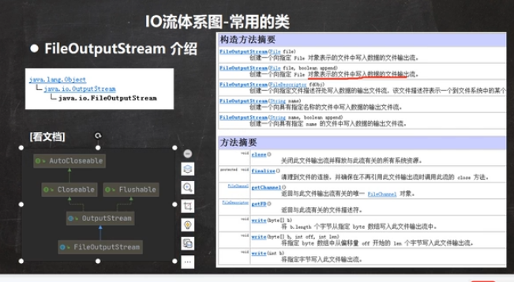

FileOutputStream(字节输出流)


```java
package com.hspedu.file;

import java.io.FileOutputStream;
import java.io.IOException;
import java.nio.charset.StandardCharsets;

public class FileOutputSteam01 {
    public static void main(String[] args) {
        try {
            new FileOutputSteam01().writeFile();
        } catch (IOException e) {
            e.printStackTrace();
        }
    }
    public void writeFile() throws IOException {
        String filePath = "e:\\a.txt";
        FileOutputStream fileOutputSteam = null;
        //得到一个对象
        //new FileOutputStream(filePath)通过覆盖的方式写入
        //new FileOutputStream(filePath, true)追加的方式写入
        fileOutputSteam = new FileOutputStream(filePath, true);
        //fileOutputSteam.write('a');//写一个字符
        String str = "world";
        //全部输入文件中
        //fileOutputSteam.write(str.getBytes());//getBytes把字符串转变成字符数组
        //输出字符串的片段
        fileOutputSteam.write(str.getBytes(), 0, str.length());//str.length()表示输出字符串的个数
        fileOutputSteam.close();

    }
}
```

**字符流**


```java
package com.hspedu.file;

import java.io.FileWriter;
import java.io.IOException;

public class FileReader_ {
    public static void main(String[] args) throws IOException {
        String filePath = "e:\\story.txt";
        FileWriter fileWriter = null;
        char[] chars = {'a', 'b', 'v', 'k'};

        fileWriter = new FileWriter(filePath);
        //fileWriter.write('H');
        //fileWriter.write(chars);
        //指定数组的部分写入
        //fileWriter.write("韩顺平教育".toCharArray(), 0, 3);
        fileWriter.write("上海天津", 0, 2);
        //关闭文件流，就等价于flesh() + 关闭
        fileWriter.close();


    }
}
```

### 文件的拷贝

```java
package com.hspedu.file;

import java.io.FileInputStream;
import java.io.FileOutputStream;
import java.io.IOException;

public class FileCopy {
    public static void main(String[] args) throws IOException {
        //1.将文件读入java中
        //2.将文件写入文件中

        String srcFilePath = "e:\\koala.jpg";
        String filePath = "d:\\koala.jpg";
        FileInputStream fileInputStream = null;
        FileOutputStream fileOutputStream = null;
        fileInputStream = new FileInputStream(srcFilePath);
        fileOutputStream = new FileOutputStream(filePath);
        byte[] buf = new byte[1024];
        int readLen = 0;
        while ((readLen = fileInputStream.read(buf)) != -1){
            //边读边写
            fileOutputStream.write(buf, 0, readLen);
        }
        System.out.println("拷贝成功");
        if(fileInputStream != null){
            fileInputStream.close();
        }
        if(fileOutputStream != null){
            fileOutputStream.close();
        }
    }
}
```

### 	Properties类

主要功能是输入流，把配置文件的数据加载到内存中


```java
package com.hspedu.file;

import java.io.BufferedReader;
import java.io.FileOutputStream;
import java.io.FileReader;
import java.io.IOException;
import java.util.Properties;

public class Properties01 { 
    public static void main(String[] args) throws IOException {
//        Properties properties = new Properties();
//        //加载指定文件
//        properties.load(new FileReader("src\\mysql.properties"));
//        //把kv显示控制台
//        properties.list(System.out);
//        //根据key获取对应值
//        String user = properties.getProperty("user");
//        System.out.println(user);
        //修改，创建
        Properties properties = new Properties();
        properties.setProperty("charset", "utf8");
        properties.setProperty("user", "汤姆");//注意保存时，是中文的unicode码值
        properties.setProperty("pwd", "abc111");


        //如果没有就创建，有就修改修改
        properties.setProperty("pwd", "888888888");
        properties.store(new FileOutputStream("src\\mysql2.properties"), null);//null表示注释


    }
}
```


```java
package com.hspedu.file;

import java.io.*;

public class Homework01 {
    public static void main(String[] args) throws IOException {
        String directoryPath = "e:\\mytemp";

        File file = new File(directoryPath);
        if(!(file.exists())){
            //创建
            if(file.mkdirs()) {
                System.out.println("创建成功");
            }

            String filePath = directoryPath + "\\hello.txt";
            file = new File(filePath);
            if(!(file.exists())){
                if(file.createNewFile()) {
                    System.out.println("hello.txt创建成功");

                    //写入内容
                    BufferedWriter bufferedWriter = new BufferedWriter(new FileWriter(file));
                    bufferedWriter.write("hello,world");
                    bufferedWriter.close();
                }
            }else {
                System.out.println("文件存在");
            }
        }
    }
}
```


```java
package com.hspedu.file;

import java.io.BufferedReader;
import java.io.FileReader;
import java.io.IOException;

public class Homework02 {
    public static void main(String[] args) throws IOException {
        String filePath = "e:\\a.txt";
        String line = "";
        BufferedReader bufferedReader = new BufferedReader(new FileReader(filePath));
        while ((line = bufferedReader.readLine()) != null){
            System.out.println(line);
        }

        if(bufferedReader != null){
            bufferedReader.close();
        }

    }
}
```


## 项目&学以致用

---

### java绘图坐标体系


### java绘图技术

```java
package com.hspedu.draw;

import javax.swing.*;
import java.awt.*;

public class DrawCircle extends JFrame{//JFrame对应一个窗口

    //定义一个面板
    private MyPanel mp = null;
    public static void main(String[] args) {
        new DrawCircle();
    }
    public DrawCircle() {
        mp = new MyPanel();
        //把面板放入窗口中
        this.add(mp);
        //设置窗口的大小
        this.setSize(400, 300);
        //当点击时就退出程序
        this.setDefaultCloseOperation(JFrame.DISPOSE_ON_CLOSE);
        this.setVisible(true);//可以显示
    }
}

//定义一个面板MyPanel, 继承JPanel,

class MyPanel extends JPanel {
    //MyPanel对象就是一个画板
    //Graphics g就是一个画笔
    //Graphics提供了很对绘图的方法
    @Override
    public void paint(Graphics g) {//绘图方法
        super.paint(g);//调用父类的方法完成初始化。
        //画出一个圆型, x, y表示左上角的的点
        g.drawOval(10, 10, 100, 100);
                //画直线
//        g.drawLine(10, 10, 100, 100);
        //设置画笔的颜色
//        g.setColor(Color.black);
        //填充颜色
//        g.fillOval(10, 10, 100, 100);
        //获取图片资源
//        Image image = Toolkit.getDefaultToolkit().getImage(Panel.class.getResource("/8d36383c85557a2f94e8d82a033111470940b291_raw.jpg"));
//        g.drawImage(image, 10, 10, 175, 221, this);
        //给画笔设置颜色和字体
//        g.setColor(Color.red);
//        g.setFont(new Font("隶属", Font.BOLD, 50));
        //x,y是左下角
//        g.drawString("小明", 100, 100);
    }
}
```


### java事件处理机制

监听点击事件

```java
package com.hspedu.event_;

import com.hspedu.tankgame.Mypanel;

import javax.swing.*;
import java.awt.*;
import java.awt.event.KeyEvent;
import java.awt.event.KeyListener;

public class BallMove extends JFrame{

    MyPanel mp = null;
    public static void main(String[] args) {
        BallMove ballMove = new BallMove();
    }

    public BallMove() {
        mp = new MyPanel();
        this.add(mp);
        this.setSize(400, 300);
        this.setDefaultCloseOperation(JFrame.EXIT_ON_CLOSE);
        this.setVisible(true);
        //JFrame窗口可以监听键盘事件，即可以监听到面板发生的键盘事件
        this.addKeyListener(mp);
    }
}
//KeyListener监听键盘的敲击时间，当时间元产生事件时，就可以传入事件监听者处理
class MyPanel extends JPanel implements KeyListener {

    //为了让小球可以移动把x，y设置成变量
    int x = 10;
    int y = 10;
    @Override
    public void paint(Graphics g) {
        super.paint(g);
        g.fillOval(x, y, 20, 20);
    }

    //如果有字符输入，该方法就会触发
    @Override
    public void keyTyped(KeyEvent e) {

    }

    //当某一个见按下去该方法就会触发
    @Override
    public void keyPressed(KeyEvent e) {

    }

    //当某个键松开了，该方法就会触发
    @Override
    public void keyReleased(KeyEvent e) {
//        System.out.println((char) e.getKeyCode() + "被按下");
        //根据不同的键来处理小球的移动
        //java中会给每一个键赋一个值
        if(e.getKeyCode() == KeyEvent.VK_DOWN){
            y++;
        }else if(e.getKeyCode() == KeyEvent.VK_UP){
            y--;
        }else if(e.getKeyCode() == KeyEvent.VK_LEFT){
            x--;
        }else if(e.getKeyCode() == KeyEvent.VK_RIGHT){
            x++;
        }
        //重新绘制图像
        this.repaint();

    }
}
```

### 坦克大战1.0版

## 网络编程

---

### 网络基础


域名和端口号


TCP与UDP协议


### InetAddress


InetAddress对象

```java
package com.hspedu.api_;

import java.net.InetAddress;
import java.net.UnknownHostException;

public class API_ {
    public static void main(String[] args) throws UnknownHostException {
        //获取本地的InetAddress对象
        InetAddress localHost = InetAddress.getLocalHost();
        System.out.println(localHost);//DESKTOP-6BGOQ2F/192.168.43.236

        //根据主机名获取InetAddress对象
        InetAddress byName = InetAddress.getByName("DESKTOP-6BGOQ2F");
        System.out.println(byName);

        //根据一个域名返回InetAddress对象
        InetAddress host2 = InetAddress.getByName("www.baidu.com");
        System.out.println(host2);//www.baidu.com/110.242.68.3

        //通过InetAddress对象，获取对应的地址
        String hostAddress = host2.getHostAddress();
        System.out.println(hostAddress);//110.242.68.3

        //通过InetAddress对象,获取主机名
        String hostName = host2.getHostName();
        System.out.println(hostName);
    }
}
```

### Socket


### TCP编程*

TCP字节流编程


字节流编程

服务器端

发送完数据应该有一个结束标记

```java
//设置结束标记,只有设置结束标记客户端才知道数据发送完毕
socket.shutdownOutput();
```

```java
package com.hspedu.api_;

import java.io.IOException;
import java.io.InputStream;
import java.io.OutputStream;
import java.net.ServerSocket;
import java.net.Socket;

//服务器端
public class SocketTCP01Server {
    public static void main(String[] args) throws IOException {
        //监听，等待连接
        //要求在本机没有其他服务监听9999，否则报异常
        //serverSocket可以通过accept()返回多个socket[多个客户高并发]
        ServerSocket serverSocket = new ServerSocket(9999);
        //当没有客户端链接9999，程序会阻塞，等待连接
        //如果有链接，会返回Socket对象，程序会继续
        Socket socket = serverSocket.accept();
        //获取输入流数据
        InputStream inputStream = socket.getInputStream();
        //io读取
        byte[] bytes = new byte[1024];
        int readLen = 0;
        while ((readLen = inputStream.read(bytes)) != -1) {
            System.out.println(new String(bytes, 0, readLen));
        }

        //获取socket相关的输出流
        OutputStream outputStream = socket.getOutputStream();
        outputStream.write("hello, client".getBytes());
        //设置结束标记,只有设置结束标记客户端才知道数据发送完毕
        socket.shutdownOutput();

        //关闭流和socket

        outputStream.close();

        inputStream.close();
        socket.close();
        serverSocket.close();//关闭监听器,可以创建很多socket
    }
}
```

客户端

```java
package com.hspedu.api_;

import java.io.IOException;
import java.io.InputStream;
import java.io.OutputStream;
import java.net.InetAddress;
import java.net.Socket;
import java.net.UnknownHostException;

//客户端
public class SocketTCP01Client {
    public static void main(String[] args) throws IOException {
        //连接服务器,如果远程连接输入ip地址，后加端口号
        //链接InetAddress.getLocalHost()（本机）主机的9999端口
        Socket socket = new Socket(InetAddress.getLocalHost(), 9999);
        //如果链接成功返回socket对象
        //生成hello传给服务器端
        OutputStream outputStream = socket.getOutputStream();
            
        //得到与socket关联的输出流对象,写入数据到通道
        outputStream.write("hello".getBytes());
        //设置结束标记,只有设置结束标记服务端才知道数据发送完毕
        socket.shutdownOutput();

        //获取和socket关联的输入流，读取字节，并提示
        InputStream inputStream = socket.getInputStream();
        byte[] buf = new byte[1024];
        int readLen = 0;
        while ((readLen = inputStream.read(buf)) != -1){
            System.out.println(new String(buf, 0, readLen));
        }

        //关闭客户端和流对象

        inputStream.close();

        outputStream.close();
        socket.close();
        System.out.println("客户端关闭");

    }
}

```

字符流编程 

writer.newLine()//[换行符]，也可以表示一个写入结束标记，要求必须用readLine()读取

```java
bufferedWriter.flush();//如果使用字符流，需要手动刷新，否则数据进不去通道
bufferedWriter.newLine();//插入一个换行符，便是写入内容结束，要求对方使用readLine()读数据
```


服务端

```java
package com.hspedu.api_;

import java.io.*;
import java.net.ServerSocket;
import java.net.Socket;

//服务器端，使用字符流
public class SocketTCP01Server {
    public static void main(String[] args) throws IOException {
        //监听，等待连接
        //要求在本机没有其他服务监听9999，否则报异常
        //serverSocket可以通过accept()返回多个socket[多个客户高并发]
        ServerSocket serverSocket = new ServerSocket(9999);
        //当没有客户端链接9999，程序会阻塞，等待连接
        //如果有链接，会返回Socket对象，程序会继续
        Socket socket = serverSocket.accept();
        //获取输入流数据
        InputStream inputStream = socket.getInputStream();
        //io读取
        byte[] bytes = new byte[1024];
        int readLen = 0;
        while ((readLen = inputStream.read(bytes)) != -1) {
            System.out.println(new String(bytes, 0, readLen));
        }

        //获取socket相关的输出流
        OutputStream outputStream = socket.getOutputStream();
        //获取输出字符流
        BufferedWriter bufferedWriter = new BufferedWriter(new OutputStreamWriter(outputStream));
        bufferedWriter.write("hello server");
        bufferedWriter.flush();//如果使用字符流，需要手动刷新，否则数据进不去
        bufferedWriter.newLine();//插入一个换行符，便是写入内容结束


        //关闭流和socket

        bufferedWriter.close();

        inputStream.close();
        socket.close();
        serverSocket.close();//关闭监听器,可以创建很多socket
    }
}
```

客户端

```java
package com.hspedu.api_;

import java.io.*;
import java.net.InetAddress;
import java.net.Socket;
import java.net.UnknownHostException;

//客户端，使用字符流
public class SocketTCP01Client {
    public static void main(String[] args) throws IOException {
        //连接服务器,如果远程连接输入ip地址，后加端口号
        //链接InetAddress.getLocalHost()（本机）主机的9999端口
        Socket socket = new Socket(InetAddress.getLocalHost(), 9999);
        //如果链接成功返回socket对象
        //生成hello传给服务器端
        OutputStream outputStream = socket.getOutputStream();
        //得到与socket关联的输出流对象,写入数据到通道
        outputStream.write("hello".getBytes());

        //设置结束标记,只有设置结束标记服务端才知道数据发送完毕
        socket.shutdownOutput();

        //获取和socket关联的输入流，读取字节，并提示
        InputStream inputStream = socket.getInputStream();
        //获取输入字符流
        BufferedReader bufferedReader = new BufferedReader(new InputStreamReader(inputStream));
        String s = bufferedReader.readLine();
        System.out.println(s);

        //关闭客户端和流对象

        inputStream.close();

        outputStream.close();
        socket.close();
        System.out.println("客户端关闭");

    }
}
```

案例


```java
package com.hspedu.api_;

import java.io.*;
import java.net.ServerSocket;
import java.net.Socket;

//服务端
public class TCPFileUploadServer {
    public static void main(String[] args) throws IOException {
        //8888
        ServerSocket serverSocket = new ServerSocket(8888);
        //等待连接
        Socket socket = serverSocket.accept();

        //socket得到输入流
        BufferedInputStream bis = new BufferedInputStream(socket.getInputStream());
        ByteArrayOutputStream byteArrayOutputStream = new ByteArrayOutputStream();
        byte[] bytes = new byte[1024];
        int readLen = 0;
        while ((readLen = bis.read(bytes)) != -1){
            byteArrayOutputStream.write(bytes, 0, readLen);
        }

        byte[] array = byteArrayOutputStream.toByteArray();

        //写入指定的目录
        String destFilePath = "src\\qie2.jpg";
        BufferedOutputStream bos = new BufferedOutputStream(new FileOutputStream(destFilePath));
        bos.write(array);

        bos.close();
        bis.close();
        byteArrayOutputStream.close();
        serverSocket.close();

    }
}
```

客户端

```java
package com.hspedu.api_;

import java.io.*;
import java.net.InetAddress;
import java.net.Socket;
import java.net.UnknownHostException;

//客户端
public class TCPFileUploadClient {
    public static void main(String[] args) throws IOException {
        Socket socket = new Socket(InetAddress.getLocalHost(), 8888);

        //创建输入流
        String filePath = "d:\\qie.jpg";
        BufferedInputStream bis = new BufferedInputStream(new FileInputStream(filePath));

        ByteArrayOutputStream byteArrayOutputStream = new ByteArrayOutputStream();
        byte[] b = new byte[1024];
        int len;
        while ((len = bis.read(b)) != -1) {
            byteArrayOutputStream.write(b, 0, len);
        }
        byte[] array = byteArrayOutputStream.toByteArray();
        byteArrayOutputStream.close();

        //通过socket获取到输出流，将bytes数据发送给服务器
        BufferedOutputStream bos = new BufferedOutputStream(socket.getOutputStream());
        bos.write(array);//写入数据通道
        
        socket.shutdownOutput();
        bis.close();
        
        bos.close();
        socket.close();
    }
}
```


netstat -anb | more查看哪一个程序运行的ip地址

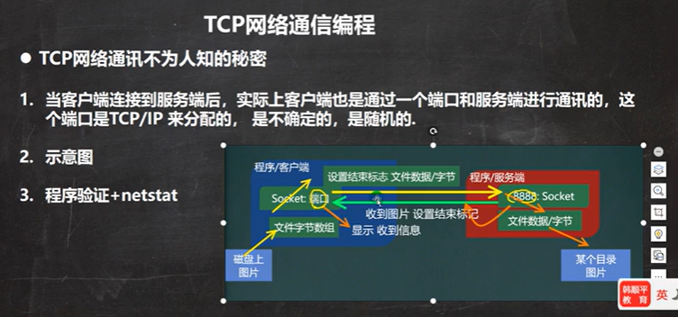

### UDP编程


案例


接收端

```java
package com.hspedu.api_;

import java.io.IOException;
import java.net.DatagramPacket;
import java.net.DatagramSocket;
import java.net.SocketException;

//接收端A
public class UDPReceiverA {
    public static void main(String[] args) throws IOException {
        //创建一个DatagramSocket对象，准备在9999接收数据
        DatagramSocket datagramSocket = new DatagramSocket(9999);
        //构建一个对象，准备接收数据

        byte[] buf = new byte[1024];
        DatagramPacket datagramPacket = new DatagramPacket(buf, buf.length);
        //调用接收数据方法,将通过网络传送的对象，填充到datagramPacket
        //当数据包发送到9999时，就会接收，如果没有数据发送就会等待
        datagramSocket.receive(datagramPacket);

        //把数据进行拆包，取出数据
        int length = datagramPacket.getLength();//获取实际字节的长度
        byte[] data = datagramPacket.getData();//接收到数据
        String s = new String(data, 0, length);
        System.out.println(s);
        datagramSocket.close();

    }
}
```

发送端

```java
package com.hspedu.api_;

import java.io.IOException;
import java.net.*;

//发送端
public class UDPSenderB {
    public static void main(String[] args) throws IOException {
        DatagramSocket socket = new DatagramSocket(9998);
        //将发送的数据封装到DatagramSocket对象中
        byte[] data = "hello 明天吃火锅".getBytes();
        DatagramPacket packet = new DatagramPacket(data, data.length, InetAddress.getByName("192.168.43.236"), 9999);

        socket.send(packet);

        socket.close();
    }
}
```


## qq项目

---

项目开发流程


思路分析


项目路径G:\java\ideaJavaProject\qqclient

​			  G:\java\ideaJavaProject\qqserver

## 反射

---

### 	反射机制*

​		快速入们


可以通过配置文件来修改调用的哪个方法，不需要修改源文件


反射机制


反射相关类


当关闭setAccessible时就会提高效率


### 	Class类*


每一个类都会有一个对应的Class对象


**class常用类**

```java
package com.kjqedu.class_;

import com.kjqedu.Car;

import java.lang.reflect.Field;

public class Class02 {
    public static void main(String[] args) throws ClassNotFoundException, InstantiationException, IllegalAccessException, NoSuchFieldException {
        String classAllPath = "com.kjqedu.Car";
        //1.获取class类 对应的class对象
        //<?>表是不确定的class类型
        Class<?> cls = Class.forName(classAllPath);
        //2.输出cls
        System.out.println(cls);//显示class对象，是哪个类的class对象
        System.out.println(cls.getClass());//输出class的运行类型
        //3.得到包名
        System.out.println(cls.getPackage().getName());
        //4.得到全类名
        System.out.println(cls.getName());
        //5.通过cls创建对象实例
        Car car = (Car) cls.newInstance();
        System.out.println(car);
        //6.通过反射获取属性brand
        Field brand = cls.getField("brand");
        System.out.println(brand.get(car));//不能访问私有属性，后面会将获取私有属性
        //7.通过反射给属性赋值
        brand.set(car, "奔驰");
        System.out.println(brand.get(car));
        //8.遍历所有的属性
        Field[] fields = cls.getFields();
        for (Field f : fields) {
            System.out.println(f.getName());//属性的名称
        }
    }
}
```


```java
package com.kjqedu.class_;

import com.kjqedu.Car;

public class GetClass_ {
    public static void main(String[] args) throws ClassNotFoundException {
        //演示得到Class对象的各种方式（6）
        String classAllPath = "com.kjqedu.Car";//通过配置文件获取
        Class<?> cls1 = Class.forName(classAllPath);
        System.out.println(cls1);

        //2.类名.class，用于参数传递
        Class<Car> cls2 = Car.class;
        System.out.println(cls2);

        //对象。getClass(),应用场景，有对象实例
        Car car = new Car();
        Class<? extends Car> cls3 = car.getClass();
        System.out.println(cls3);

        //通过类加载器【4】获取class对象
        //先得到类加载器
        ClassLoader classLoader = car.getClass().getClassLoader();
        //通过类加载器获取class对象
        Class<?> cls4 = classLoader.loadClass(classAllPath);
        System.out.println(cls4);

        Class<Integer> integerClass = int.class;

        Class<Integer> type = Integer.TYPE;
    }
}
```


### 	类加载*


```java
Dog dog = new Dog();//静态加载，不管有没有走到这里。都会先加载Dog类
Class cls = Class.forName("person");//动态加载，只有当程序能够进入时才加载Person类 
Object o = cls.newInstance();
Method m = cls.getMethod("hi");
m.invoke(o);
```


1

2.1验证主要是对文件进行安全的校验安全，比如文件格式，元数据验证是否正确，字节码是否正确


2.2准备是对静态变量分配内存，针对静态变量进行默认初始化


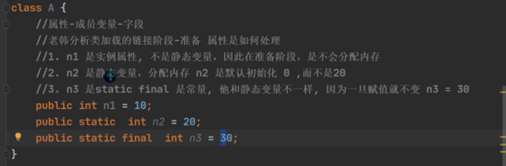

2.3解析，虚拟机会把常量池中的符号引用替换为直接引用


引用是一个变量指向一个地址

3


### 	反射获取类的结构信息***

#### class


修正7.包含本类没有父类

```java
package com.kjqedu.question;

import org.junit.Test;

import java.lang.annotation.Annotation;
import java.lang.reflect.Constructor;
import java.lang.reflect.Field;
import java.lang.reflect.Method;

public class ReflectionUtils {
    public static void main(String[] args) {

    }

    @Test
    public void api_01() throws ClassNotFoundException {
        Class<?> personCls = Class.forName("com.kjqedu.question.Person");

        System.out.println(personCls.getName());

        System.out.println(personCls.getSimpleName());

        Field[] fields = personCls.getFields();
        for (Field field : fields) {
            System.out.println(field.getClass());
        }

        Field[] declaredFields = personCls.getDeclaredFields();
        for (Field declaredField : declaredFields) {
            System.out.println(declaredField.getName());
        }

        Method[] methods = personCls.getMethods();
        for (Method method : methods) {
            System.out.println(method.getName());
        }

        Method[] declaredMethods = personCls.getDeclaredMethods();
        for (Method declaredMethod : declaredMethods) {
            System.out.println(declaredMethod.getName());
        }

        Constructor<?>[] constructors = personCls.getConstructors();
        for (Constructor<?> constructor : constructors) {
            System.out.println(constructor.getName());
        }

        Constructor<?>[] declaredConstructors = personCls.getDeclaredConstructors();
        for (Constructor<?> declaredConstructor : declaredConstructors) {
            System.out.println(declaredConstructor.getName());
        }

        System.out.println(personCls.getPackage());

        Class<?> superclass = personCls.getSuperclass();
        System.out.println(superclass);

        Class<?>[] interfaces = personCls.getInterfaces();
        for (Class<?> anInterface : interfaces) {
            System.out.println(anInterface);
        }

        Annotation[] annotations = personCls.getAnnotations();
        for (Annotation annotation : annotations) {
            System.out.println(annotation);
        }
    }
}

class A {
    public String hobby;
}

interface IA {
}
interface IB {}

@Deprecated
class Person extends A implements IA, IB{
    //属性
    public String name;
    protected int age;
    String job;
    private double sal;
    //方法

    public void m1() {

    }

    protected void m2() {

    }

    void m3() {

    }

    private void m4() {

    }
}
```

#### 		Field


```java
@Test
public void api_02() throws ClassNotFoundException {
    Class<?> personCls = Class.forName("com.kjqedu.question.Person");
    Field[] declaredFields = personCls.getDeclaredFields();
    for (Field declaredField : declaredFields) {
        System.out.println(declaredField.getName() + "该属性修饰符值等于" + declaredField.getModifiers() + "该属性的类型" + declaredField.getType());
    }
}
```

#### Method


```java
@Test
public void api_02() throws ClassNotFoundException {
    Class<?> personCls = Class.forName("com.kjqedu.question.Person");
    Method[] declaredMethods = personCls.getDeclaredMethods();
    for (Method declaredMethod : declaredMethods) {
        System.out.println(declaredMethod.getName() + "该方法的访问修饰值" + declaredMethod.getModifiers() + "该方法的返回值类型" + declaredMethod.getReturnType());
        //输出当前方法的形参
        Class<?>[] parameterTypes = declaredMethod.getParameterTypes();
        for (Class<?> parameterType : parameterTypes) {
            System.out.println("该方法的形参类型" + parameterType);
        }
    }
}
```

#### 		Constructor


```java
@Test
public void api_04() throws ClassNotFoundException {
    Class<?> personCls = Class.forName("com.kjqedu.question.Person");
    Constructor<?>[] declaredConstructors = personCls.getDeclaredConstructors();
    for (Constructor<?> declaredConstructor : declaredConstructors) {
        System.out.println(declaredConstructor.getName());
        Class<?>[] parameterTypes = declaredConstructor.getParameterTypes();
        for (Class<?> parameterType : parameterTypes) {
            System.out.println("该构造器的形参类型" + parameterType);
        }
    }
}
```

### 反射爆破创建对象


```java
package com.kjqedu.question;

import java.lang.reflect.Constructor;

public class EeFlecCreateInstance {
    public static void main(String[] args) throws Exception, InstantiationException, IllegalAccessException {
        //1先获取user类的class对象
        Class<?> userClass = Class.forName("com.kjqedu.question.User");
        //2通过public的无参构造器创建实例
        Object o = userClass.newInstance();
        System.out.println(o);
        //3通过public有参构造器创建实例
        //先得到对应的构造器，再传入实参
        Constructor<?> constructor = userClass.getConstructor(String.class);
        Object hsp = constructor.newInstance("hsp");
        System.out.println(hsp);
        //4通过非public的有参构造器创建实例
        Constructor<?> declaredConstructor = userClass.getDeclaredConstructor(int.class, String.class);
        //先得到私有的构造器
        declaredConstructor.setAccessible(true);//爆破，使用反射可以访问private的构造器，反射面前都是纸老虎
        Object user2 = declaredConstructor.newInstance(100, "张三丰");
        System.out.println(user2);
    }
}

class User {
    private int age = 10;
    private String name = "小明";

    public User () {
    }

    public User(String name) {
        this.name = name;
    }

    private User(int age, String name) {
        this.age = age;
        this.name = name;
    }

    @Override
    public String toString() {
        return "User{" +
                "age=" + age +
                ", name='" + name + '\'' +
                '}';
    }
}
```

### 反射爆破操作属性


### 反射爆破操作方法


## Mysql基础

---

### MySQL安装和配置

MySQL5.7现在地址

https://dev.mysql.com/get/Downloads/MySQL-5.7/mysql-5.7.19-winx64.zip


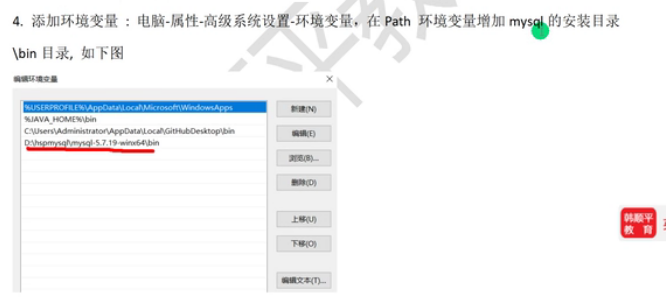


mysqld -install  


mysqld --initialize-insecure --user=mysql


退出指令quit


mysql -h 127.0.0.1 -P 3306 -u root -pkjq

操作数据库的软件Navicat地址: https://www.navicat.com.cn/products/

SQLyog下载地址：https://sqlyog.en.softonic.com/

### 数据库

MySQL的三层结构


***数据库的相关操作***


当在数据库下创建表示，而且没有指定字符集和校对规则，默认会以该数据库的符集和校对规则为准


创建数据库时最好在数据库的名称上加上反引号（``）这样做可以规避关键字


备份文件就是保存sql语句

备份数据库的某张表

mysqldump -u 用户名 -p密码 数据库 表1 表2 表n > G:\\文件名.sql

### 表

创建


timestamp自动更新时间【UNSIGNED】指定有符号还是无符号（表示没有正数）

INSERT INTO t3 VALUES(127); #非常简单的添加语句

SELECT * FROM t3 #查询语句


sqlyog注释快捷键shift+ctrl+c，取消注释shift+ctrl+r


char(size)size表示存储的的字符，它不区分字母或汉字【所占空间取决于你的编码】{是定长，size=4，存入AA，它也占四个字符}

varchar(size)是变长，

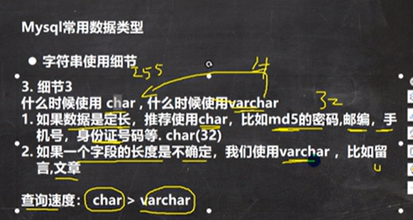


修改


```sql
-- 添加一个列
ALTER TABLE t01 
	ADD image VARCHAR(32) NOT NULL DEFAULT '' 
	AFTER RESUME -- 在resume后面
	
DESC t03-- 显示表的结构

-- 修改一个列
ALTER TABLE t01
	MODIFY job VARCHAR(60)
	
-- 删除一个列
ALTER TABLE t01
	DROP sex
	
-- 改变表名

RENAME TABLE t01 TO t03

-- 修改表的字符集utf8
ALTER TABLE t03 
	CHARACTER SET utf8;

-- 列名name修改为user_name
ALTER TABLE t03 
	CHANGE `name` user_name VARCHAR(64) NOT NULL DEFAULT ''
-- 删除表中所有的信息
DELETE FROM t03
TRUNCATE TABLE t03

-- 删除一张表
DROP TABLE t03;
```

### Mysql数据类型(列的类型/字段的类型)*

### CRUD*


***insert***添加

```SQL
-- 1.
CREATE TABLE `goobs` (
	id INT,
	goobs_name VARCHAR(10),
	price DOUBLE);
-- 添加数据
INSERT INTO `goobs` (id, goobs_name,  price)
	VALUES(10, '华为手机', 2000);

INSERT INTO `goobs` (id, goobs_name,  price)
	VALUES(20, '苹果手机', 3000);

-- 查询
SELECT * FROM goobs;
```


1.'30'可以把30字符串转为int类型

```sql
-- 7.
INSERT INTO `goobs` 
	VALUES(20, '苹果手机', 3000);
```

8.如果某个列没有给定值 not null，那么添加数据时，没有给定值，则会添加null

如果我们希望给定一个默认值，在创建字段时，在后面加入not null default 100，给一个默认值100

***update***修改


```sql
-- 对goobs表的price字段所有数据进行修改
UPDATE goobs SET price = 2500;

-- 对goobs表的id=10的price进行修改
UPDATE goobs 
	SET price = 3500
	WHERE id = 10;
	
-- 将goobs表id=10在原来基础上增加1000
UPDATE goobs 
	SET price = price + 1000
	WHERE id = 10;

-- 查询
SELECT * FROM goobs;
```

***delete***删除


```sql
-- 删除表中id=10的记录
DELETE FROM goobs
	WHERE id = 10;

-- 删除所有的记录
DELETE FROM goobs; 

-- 删除一张表
DROP TABLE goobs;

-- 查询
SELECT * FROM goobs;
```

***select***查询

单表


```sql
-- 查询表中所有的学生
SELECT * FROM student;	

-- 查询表中所有学生姓名和对应的英语成绩
SELECT `name`, chinese FROM student;

-- 过滤表中重复的元素，distinct
SELECT DISTINCT chinese FROM student;
```


```sql
-- 统计每一个学生的总分
SELECT 'name', (chinese+id) FROM student;

-- 在所有的学生总分加10的形况
SELECT 'name', (chinese+id+10) FROM student;

-- 给总分取一个别名
SELECT 'name', (chinese+id) AS total_score FROM student;
```


```sql
-- 查询
SELECT * FROM student
	WHERE id = 3;
	
-- 语文成绩大于80分
SELECT * FROM student
	WHERE chinese > 80;
	
-- 语文成绩大于80，并且id大于2，姓王的学生
SELECT * FROM student
	WHERE chinese > 80 
	  AND id > 2
	  AND `name` LIKE '王%';
	  
-- 语文成绩在70-80之间的,BETWEEN 70 AND 80是一个闭区间
SELECT * FROM student
	WHERE chinese BETWEEN 70 AND 80;
	
-- 语文成绩在78 86 31的学生
SELECT * FROM student
	WHERE chinese IN (78, 86, 31);
```


```sql
-- 给查询的语文成绩进行升序
SELECT * FROM student
	ORDER BY chinese;
	
-- 对总分按降序排序
SELECT `name`, (chinese+id) AS total_score FROM student
	ORDER BY total_score DESC;
```

### 函数*


sun函数仅对数值起作用，否则会报错


```sql
-- 统计班里有多少学生
SELECT COUNT(*) FROM student;

-- 统计语文成绩大于80的学生
SELECT COUNT(*) FROM student
	WHERE chinese > 80;
	
-- conunt(*)与count(列)的区别
-- 解释：count(*)返回满足条件的记录的行数
-- count(列): 统计满足条件的某列有对少个，但会排除null

-- 统计班级语文成绩的总和
SELECT SUM(chinese) FROM student;

-- 统计班级语文成绩的平局分
SELECT SUM(chinese)/COUNT(*) FROM student;
SELECT AVG(chinese) FROM student;

-- 求班级语文成绩的最高分与最低分
SELECT MAX(chinese), MIN(chinese) FROM student;
```

 分组统计

```sql
-- 对表emp先按照deptnp进行分组然后按照job进行分组，求平局值与最大值
SELECT AVG(sal), MAX(sal), deptno, job
	FROM emp GROUP BY deptno, job;
-- 对表emp按照deptnp进行分组，求平局值小于两千的deptno
SELECT AVG(sal), deptho
	FROM emp GROUP deptno
	HAVING AVG(sal) < 2000;
```

 

```sql
-- 返回字符串的字符集
SELECT CHARSET(ename) FROM emp;

-- 将多个列拼接成一列
SELECT CONCAT(ename, ' job is', job) FROM emp;

-- 返回字串的位置, dual是一个亚元表，可以当成测试表使用
SELECT INSTR('hanshunping', 'pin') FROM DUAL;

-- 转成大写
SELECT UCASE(ename) FROM emp;

-- 从ename中左（右）边取length个字符
-- select left(ename, 2) from emp;
SELECT RIGHT(ename, 2) FROM emp;

-- 判断字符串的长度,返回的是字节长度
SELECT LENGTH(ename) FROM emp;

-- 如果是manager就替换为经理
SELECT ename, 
	REPLACE(job, 'MANAGER', '经理') 
	FROM emp;
	
-- 判断两个字符是否相等, 需要判断表中的字符是否区分大小写
SELECT STRCMP('kjq', 'Kjq') FROM DUAL;

-- 取ename列的第1个位置开始取出两个字符
SELECT SUBSTRING(ename, 1, 2) FROM emp;


-- 联系，以首字母小写的方式显示所有员工的姓名
-- 方法一
SELECT 
	CONCAT(LCASE(SUBSTRING(ename, 1, 1)), SUBSTRING(ename, 2)) AS new_name
	FROM emp;
```


当我们需要产生一个固定的随机数时seed添加一个值，产生的随机数不会该表


YEAR()|MONTH()|DATE()|获取时间的年月日

```SQL
-- unix_timestamp() 返回的是1970-1-1到现在的秒数
SELECT UNIX_TIMESTAMP() FROM DUAL;

-- from_unixtime() 可以把unix_timestamp秒数转换为指定格式的日期
-- 在开发中可以存放数值转换为时间
SELECT FROM_UNIXTIME(UNIX_TIMESTAMP(), %Y-%m-%d)
	FROM DUAL;
```


```sql
-- 密码进行加密
SELECT MD5('kjq') 
	FROM DUAL;

-- mysql数据库默认用password加密的
SELECT PASSWORD('kjq') FROM DUAL;
```


```sql
SELECT IF(TRUE, '北京', '上海') FROM DUAL;

SELECT ename, IF(comm IS NULL, 0.0, comm)
	FROM emp;
	
SELECT ename, (CASE 
	WHEN job = 'CLERK' THEN '职员'
	WHEN job = 'MANAGER' THEN '经理'
	ELSE '销售人员' END)
	FROM emp;
```

细节部分


```sql
-- 分页查询
-- 按雇员id号升序取出，每页显示三条记录，显示三页
-- 表示第四页，的数据, 公式每；页的行数*(第几页-1)；
SELECT * FROM emp 
	ORDER BY empnp
	LIMIT 3*(4-1), 3;
```

 


顺序1，先分组2，过滤3，排序4，分页


```sql
SELECT deptno, AVG(sal) AS avg_sal
	FROM emp
	GROUP BY deptno
	HAVING avg_sal > 1000
	ORDER BY avg_sal DESC
	LIMIT 0, 2;
```

多表查询

### 内连接


3，这样对标查询默认处理反回的结果，称为笛卡尔集

4，解决这个多表的关键就是要写出正确的过滤条件where，需要程序员自己分析

```sql
SELECT ename, sal, dname, emp.deptno
	FROM emp, dept
	WHERE emp.deptno = dept.deptno
```

当我们需要显示某个表的列时需要，表明.列名

自连接


```sql
-- 把自己看成两张表
-- 需要给表取别名，表名 表别名
SELECT worker.ename AS '职员表', boss.ename AS '上级表'
	FROM emp worker, emp boss
	WHERE worker.mgr = boss.empnp;
```

 子查询


```sql
-- 先找到sminth的部门编号，当成子查询
SELECT deptno
	FROM emp
	WHERE ename = 'SMITH'

-- 单行子查询
-- 将上述结果写到下面语句中
SELECT * 
	FROM emp
	WHERE deptno = (
        SELECT deptno
            FROM emp
            WHERE ename = 'SMITH'
	);
	
-- 多行子查询
SELECT DISTINCT job
	FROM emp
	WHERE deptno = 30
	
SELECT ename, job, sal, deptno
	FROM emp
	WHERE job IN (
        SELECT DISTINCT job
            FROM emp
            WHERE deptno = 30
	) AND deptno != 30;

-- 子查询也可以当成一个临时表来使用
SELECT empnp, MAX(sal)
	FROM emp
	GROUP BY empnp

SELECT emp.ename, emp.sal, max_sal
	FROM (
        SELECT empnp, MAX(sal) AS max_sal
            FROM emp
            GROUP BY empnp
	) temp, emp
	WHERE temp.empnp = emp.empnp 
	AND temp.max_sal = emp.sal
```

 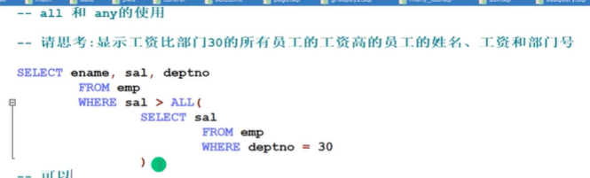


多列子查询


```sql
SELECT deptno, job
	FROM emp
	WHERE ename = 'SMITH'
	
SELECT *
	FROM emp
	WHERE (deptno, job) = (		
		SELECT deptno, job
			FROM emp
			WHERE ename = 'WARD'
	) AND ename != 'WARD'
```

联系

查找每个部门的工资高于本部门的平均水平的人的资料

```sql
SELECT ename, sal, temp.avg_sal, emp.deptno
	FROM emp, (
		SELECT deptno, AVG(sal) AS avg_sal
			FROM emp
			GROUP BY deptno
	) temp 

	WHERE emp.deptno = temp.deptno 
	AND sal > avg_sal;
```

表名.*，是把这张表的所有列都显示出来

查询每个部门的信息（包含：部门名，编号，地址）和人员数量

```sql
SELECT dept.deptno, dname, loc, temp.per_num
	FROM dept, (
		SELECT COUNT(*) AS per_num, deptno
			FROM emp
			GROUP BY deptno
	) temp
	WHERE dept.deptno = temp.deptno
```

表复制操作

```sql
-- 把emp表的数据复制到my_tab01中
INSERT INTO my_tab01
	(id, `name`, sal, job, deptno)
	SELECT empnp, ename, sal, job, deptno FROM emp;
	
-- 自我复制, 应用场景，可以测试sql语句的速度
INSERT INTO my_tab01
	SELECT * FROM my_tab01;
	

CREATE TABLE my_tab02 LIKE emp;-- 复制表的结构

INSERT INTO my_tab02
	SELECT * FROM emp;
-- 面试题，如何去除重复记录
/*
	思路，
	先创建一张临时表my_tmp, 该表的结构和my_tab02一样
	把my_tmp的记录，通过distinct关键字处理后 把记录复制到my_tmp
	清楚my_tab02记录
	把my_tmp表的记录复制到my_tab02中
	drop掉 临时表my_tmp
*/	
CREATE TABLE my_tmp LIKE my_tab02

INSERT INTO my_tmp
	SELECT DISTINCT * FROM my_tab02;

DELETE FROM my_tab02;

INSERT INTO my_tab02
	SELECT * FROM my_tmp
	
DROP TABLE my_tmp
```

合并查询


### 外连接*


```sql
-- 左外连接
SELECT `name`, stu.id, grade-- r如果没有配的左边的表也完全显示出来
	FROM stu LEFT JOIN exam
	ON stu.id = exam.id;

-- 右外连接
SELECT `name`, stu.id, grade
	FROM stu RIGHT JOIN exam
	ON stu.id = exam.id;
```

### 约束 


```sql
CREATE TABLE t17
	(id INT PRIMARY KEY);
-- 演示复合主键	（id + name变成复合主键）
CREATE TABLE t18
	(id INT,
	`name` VARCHAR(32),
	PRIMARY KEY (id, `name`));
-- 这里是复合主键，在添加数据时id与name不能都相同

-- 查看t20表的结果，显示约束的情况
DESC t20
```

 

unique字段约束的null 可以添加多个

如果一个列(字段)，是unique not null 使用效果类似 primary key


外键


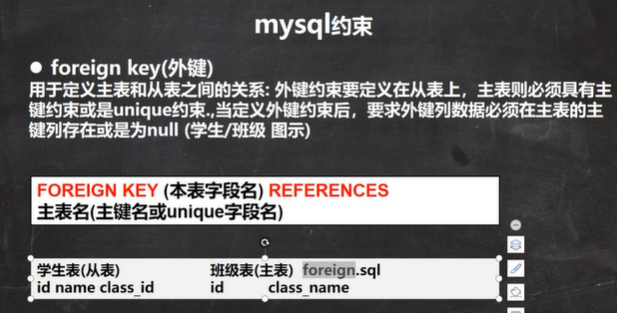

```sql
-- 外键演示
-- 先创建主表，主表必须使用主键或unique约束
CREATE TABLE my_class (
	id INT PRIMARY KEY,
	`name` VARCHAR(32) NOT NULL DEFAULT '');
	
-- 创建 从表 my_stu
CREATE TABLE my_stu (
	id INT PRIMARY KEY,
	`name` VARCHAR(32) NOT NULL DEFAULT '',
	class_id INT,
	FOREIGN KEY (class_id) REFERENCES my_class(id));
	
INSERT INTO my_class 
	VALUES(100, 'java'), (200, 'web');
	
SELECT * FROM my_class;
INSERT INTO my_stu
	VALUES(2, 'java', 200);

INSERT INTO my_stu
	VALUES(3, 'kjq', 300);	-- 失败，因为主表中没有300的id
	
INSERT INTO my_stu
	VALUES(3, 'kjq', null);	-- 加空可以，前提是外键可以为空
-- 主键，当有外键指向它时，主键中的数据就删除不了

SELECT * FROM my_stu;
```


存储引擎必须是innodb


```sql
CREATE TABLE t23 (
	id INT PRIMARY KEY,
	`name` VARCHAR(32),
	sex VARCHAR(6) CHECK (sex IN('man', 'woman')),
	sal DOUBLE CHECK (sal > 1000 AND sal < 2000));
```

```sql
-- 使用约束的课堂练习
-- 商品表的建立
CREATE DATABASE shop_db;

-- 商品
CREATE TABLE goobs(
	goods_id INT PRIMARY KEY,
	goods_name VARCHAR(64) NOT NULL DEFAULT '',
	unitprice DECIMAL(10, 2) NOT NULL DEFAULT 0,
		CHECK (unitprice >= 1.0 AND unitprice <= 9999.99),
	category INT NOT NULL DEFAULT 0,
	provider VARCHAR(64) NOT NULL DEFAULT '');

-- 客户表
CREATE TABLE customer(
	customer_id CHAR(8) PRIMARY KEY,
	`naem` VARCHAR(64) NOT NULL DEFAULT '',
	address VARCHAR(64) NOT NULL DEFAULT '',
	email VARCHAR(64) UNIQUE NOT NULL,
	sex ENUM('男', '女') NOT NULL, -- 这里使用枚举，时生效的
	card_id CHAR(18));
	
-- 订单表
CREATE TABLE purchase(
	order_id INT UNSIGNED PRIMARY KEY,
	customer_id CHAR(8) NOT NULL ,
	goods_id INT NOT NULL DEFAULT 0,
	nums INT NOT NULL DEFAULT 0,
	FOREIGN KEY (customer_id) REFERENCES customer(customer_id),
	FOREIGN KEY (goods_id) REFERENCES goobs(goods_id));
```

自增长

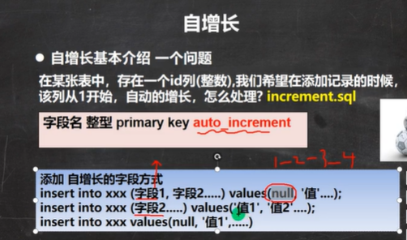


```sql
-- 5. 如果你添加数据时，给自增长字段（列）指定的有值，则以指定的值为准，如果指定了自增长，一般来说，就按照自增长的规则来添加数据
-- 创建自增长的表
CREATE TABLE t24
	(id INT PRIMARY KEY AUTO_INCREMENT);
	
INSERT INTO t24
	VALUES(NULL);
	
SELECT * FROM t24;
```

### 索引*


只有创建索引的字段，查询速度才会变快

索引的机制


索引的分类


5. 查询索引（三种方式）

   show index(es) from table_name;

   show keys from table_naem;

   desc table_name;

```sql
CREATE TABLE t25(
	id INT,
	`name` VARCHAR(32));

-- 添加索引
-- 添加普通索引
CREATE INDEX id_index ON t25 (id);
ALTER TABLE t25 ADD INDEX id_index (id);
-- 添加唯一索引, 不会重复，添加唯一索引
CREATE UNIQUE INDEX id_index ON t25 (id); 
-- 添加主键索引，在建表时添加主键，就是主键索引

-- 删除索引，先查询索引的名称是id_index
DROP INDEX id_index ON t25
-- 删除主键索引
ALTER TABLE t25 DROP PRIMARY KEY

-- 修改索引是先删除在添加
	
-- 查询表是否有索引
-- 方式1
SHOW INDEX FROM t25;
-- 方式二
SHOW INDEXES FROM t25;
-- 方式三
SHOW KEY FROM t25
-- 方式四
DESC t25
```


### 事务


```sql
-- 事务的重要操作
CREATE TABLE t27
	(id INT,
	`name` VARCHAR(32));
-- 开始事务
START TRANSACTION
-- 设置保存点
SAVEPOINT a
-- 执行dml操作
INSERT INTO t27 VALUES(100, 'tom');
SELECT * FROM t27;

SAVEPOINT b
-- 执行dml操作
INSERT INTO t27 VALUES(200, 'jack');
-- 回退到b
ROLLBACK TO b;
-- 回退到a
ROLLBACK TO a;
-- 直接回退到事务开始的状态
ROLLBACK 
```


5。InnoDB存储引擎支持事务，MyISAM不支持

隔离级别


脏读：由于你在事务中添加数据，但尚未提交，我的查询语句可以看到你尚未提交的数据

不可重复读：由于你对数据进行了修改，导致我查询的结果，第一次与第二次不一样

幻读：由于我在查询中，你出现添加数据，导致我，第二次查询的结果比第一次多了一个


```sql
-- 演示mysql的事务隔离级别

-- 1.开了两个mysql控制台
-- 2查看当前mysql的隔离级别
SELECT @@tx_isolation

-- 默认的隔离级别
-- +-----------------+
-- | @@tx_isolation  |
-- +-----------------+
-- | REPEATABLE-READ |
-- +-----------------+

-- 把其中一个控制台的隔离级别设置 read uncommitted
SET SESSION TRANSACTION ISOLATION LEVEL READ UNCOMMITTED

-- 两边同时启动一个事务，并进入数据库use db01
START TRANSACTION;
START TRANSACTION;

-- 创建表
CREATE TABLE t28 (
	id INT,
	`name` VARCHAR(32),
	money INT);
```

加锁的隔离级别，当有一个事务正在操作时，另一个事务执行查询语句，就会卡住。

查看当前的隔离级别，设置隔离级别


修改默认的隔离级别

修改不是mysql.ini而是my.ini

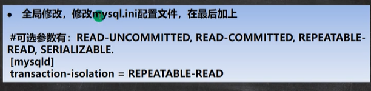


mysql表类型和存储引擎


```sql
-- 查看所有的存储引擎
SHOW ENGINES
-- 支持事务
-- InnoDB     Support Supports transactions, row-level locking, and foreign keys
-- 收集相同的MyISAM表
-- MRG_MYISAM YES Collection of identical MyISAM tables
-- 表存储在内存中的，读写速度非常快
-- MEMORY     YES Hash based, stored in memory, useful for temporary tables
-- 任何写入的数据都没有了
-- BLACKHOLE  YES /dev/null storage engine (anything you write to it disappears)
-- 批量添加速度非常快
-- MyISAM     YES MyISAM storage engine
-- CSV        YES CSV storage engine
-- ARCHIVE    YES Archive storage engine
-- PERFORMANCE_SCHEMA YES Performance Schema
-- FEDERATED  NO Federated MySQL storage engine
```

 


```SQL
ALTER TABLE `T29` ENGIE = INNODB
```

### 视图


```sql
-- 创建视图
CREATE VIEW emp_view01
	AS 
	SELECT empnp, ename, job, deptno FROM emp; 
	
-- 查看视图
DESC emp_view01;

SELECT * FROM emp_view01;

-- 查看创建视图的指令	
SHOW CREATE VIEW emp_view01;

-- 删除视图
DROP VIEW emp_view01;
```


练习


```sql
CREATE VIEW emp_view02
	AS
	SELECT empnp, ename, dname
	FROM emp, dept
	WHERE emp.deptno = dept.deptno
	
DESC emp_view02
SELECT * FROM emp_view02
```

MySQL管理

 


不同的数据库用户，登录到DBMS后，根据相应的权限，可以操作的数据库和数据对象（表，视图，触发器）都不一样


权限生效指令：是刷新指令


取别名时as可以不用写

当一个数加上一个null时，其结果是null

LAST_DAY(日期)

获取日期的最后一天

## JDBC和连接池

---

### JDBC快速入门


写一组JDBC接口，让其他厂商去实现该接口


第一种方式

```java
package com.kjqedu.jdbc;

import com.mysql.jdbc.Driver;

import java.sql.Connection;
import java.sql.SQLException;
import java.sql.Statement;
import java.util.Properties;

//第一种连接数据库的方式
public class Jdbc01 {
    public static void main(String[] args) throws SQLException {
        //前置工作：在项目下创建一个文件比如libs
        //将mysql.jar拷贝到该目录下，点击add to project.. 加入到项目中
        //注册驱动
        Driver driver = new Driver();//创建驱动

        //得到链接
        //jdbc:mysql://规定好表示协议，通过jdbc的方式链接mysql
        //localhost主机，可以是ip地址
        //3306表示mysql监听端口
        //db01表示连接数据库
        //mysql的连接本质就是socket连接
        String url = "jdbc:mysql://localhost:3306/db01";
        //将 用户名和密码放入到Properties对象
        Properties properties = new Properties();
        //user,password是规定好的
        properties.setProperty("user", "root");
        properties.setProperty("password", "kjq");
        Connection connect = driver.connect(url, properties);

        //执行sql
        String sql = "insert into actor values(null, '刘德华', '男', '1970-11-11', '110')";
        //statement用于执行静态sql语句并返回生成的结果对象
        Statement statement = connect.createStatement();
        //i表示受影响的行数，1表示添加成功，0表示成功
        int i = statement.executeUpdate(sql);
        System.out.println(i > 0 ? "成功" : "失败");

        //关闭连接资源
        statement.close();
        connect.close();
    }
}
```

 第二种方式

```java
public static void connect01() throws ClassNotFoundException, InstantiationException, IllegalAccessException, SQLException {
    //使用反射加载类
    Class<?> aClass = Class.forName("com.mysql.jdbc.Driver");
    Driver driver = (Driver) aClass.newInstance();
    String url = "jdbc:mysql://localhost:3306/db01";
    //将 用户名和密码放入到Properties对象
    Properties properties = new Properties();
    //user,password是规定好的
    properties.setProperty("user", "root");
    properties.setProperty("password", "kjq");

    Connection connect = driver.connect(url, properties);
    System.out.println(connect);
}
```

第三种方式

```java
//使用DriverManager替换Diver进行统一管理
public static void connect03() throws ClassNotFoundException, InstantiationException, IllegalAccessException, SQLException {
    Class<?> aClass = Class.forName("com.mysql.jdbc.Driver");
    Driver driver = (Driver) aClass.newInstance();

    //创建user和password
    String url = "jdbc:mysql://localhost:3306/db01";
    String user = "root";
    String password = "kjq";

    DriverManager.registerDriver(driver);//注册Driver驱动

    Connection connection = DriverManager.getConnection(url, user, password);
    System.out.println(connection);
}
```

第四种连接（这种方式是用的最多的，推荐使用）

```java
public static void connect04() throws ClassNotFoundException, SQLException {
    //使用反射加载类
    //在加载Driver类时，完成注册
    /*
    源码，静态代码块
    static {
        try {
            DriverManager.registerDriver(new Driver());
        } catch (SQLException var1) {
            throw new RuntimeException("Can't register driver!");
        }
    }
    */
    Class.forName("com.mysql.jdbc.Driver");//此句在5.1.6以上是可以删除的，不用写也能连接成功（建议写上）

    //创建user和password
    String url = "jdbc:mysql://localhost:3306/db01";
    String user = "root";
    String password = "kjq";

    Connection connection = DriverManager.getConnection(url, user, password);

    System.out.println(connection);
}
```

 第五种方式：在方式四的基础上配置文件连接数据库

```java
public static void connect05 () throws IOException, ClassNotFoundException, SQLException {
    //通过Properties对象获取配置文件
    Properties properties = new Properties();
    properties.load(new FileInputStream("src\\mysql.properites"));

    //获取相关配置信息
    String user = properties.getProperty("user");
    String password = properties.getProperty("password");
    String driver = properties.getProperty("driver");
    String url = properties.getProperty("url");

    Class.forName(driver);

    Connection connection = DriverManager.getConnection(url, user, password);

    System.out.println(connection);
}
```

查找练习

```java
package com.kjqedu.jdbc.resultset_;

import java.io.FileInputStream;
import java.io.IOException;
import java.sql.*;
import java.util.Properties;

public class ResultSet_ {
    public static void main(String[] args) throws SQLException, IOException, ClassNotFoundException {
        connect05();
    }
    public static void connect05 () throws IOException, ClassNotFoundException, SQLException {
        //通过Properties对象获取配置文件
        Properties properties = new Properties();
        properties.load(new FileInputStream("src\\mysql.properites"));

        //获取相关配置信息
        String user = properties.getProperty("user");
        String password = properties.getProperty("password");
        String driver = properties.getProperty("driver");
        String url = properties.getProperty("url");

        //注册驱动
        Class.forName(driver);

        //得到链接
        Connection connection = DriverManager.getConnection(url, user, password);

        //得到Statement
        Statement statement = connection.createStatement();

        //组织sql
        String sql = "select id, name, sex, borndate from actor";
        ResultSet resultSet = statement.executeQuery(sql);
        //使用while取出数据
        while (resultSet.next()) { //光标向后移动，如果没有跟多记录返回false
            int id = resultSet.getInt(1);// 获取改行的第一列
            String name = resultSet.getString(2); // 获取改行的第2列
            String sex = resultSet.getString(3);
            Date date = resultSet.getDate(4);
            System.out.println(id + "\t" + name + "\t" + sex + "\t" + date);
        }

        //关闭连接
        resultSet.close();
        statement.close();
        connection.close();
    }
}
```

SQL注入

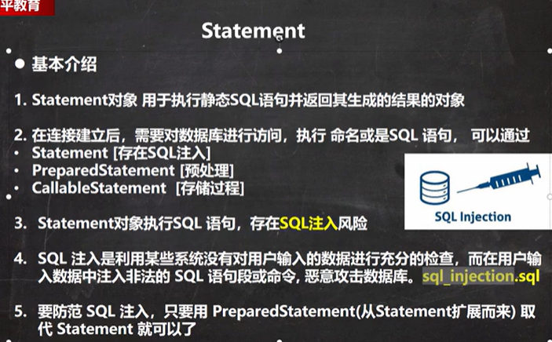

```sql
SELECT * FROM damin
	WHERE NAME = 'tom' AND pwd = '123'

-- sql
-- 上面是正常情况
-- sql注入，输入用户名：1' or 
-- 输入万能密码密码：or '1'='1

SELECT * FROM damin
	WHERE NAME = '1' OR' AND pwd = 'OR '1'='1'
```

preparedStatement


可以很好地避免sql注入

```java
package com.kjqedu.jdbc.preparedstatement_;

import java.io.FileInputStream;
import java.sql.*;
import java.util.Properties;
import java.util.Scanner;

public class PreparedStatement_ {
    public static void main(String[] args) throws Exception {

        Scanner scanner = new Scanner(System.in);

        System.out.println("请输入用户名：");
        String admin_name = scanner.nextLine();
        System.out.println("请输入管理员的密码：");
        String admin_pwd = scanner.nextLine();

        //通过Properties对象获取配置文件
        Properties properties = new Properties();
        properties.load(new FileInputStream("src\\mysql.properites"));

        //获取相关配置信息
        String user = properties.getProperty("user");
        String password = properties.getProperty("password");
        String driver = properties.getProperty("driver");
        String url = properties.getProperty("url");

        //注册驱动
        Class.forName(driver);

        //得到链接
        Connection connection = DriverManager.getConnection(url, user, password);

        //得到PreparedStatement
        //组织sql,sql语句中的？就相当于占位符
        String sql = "select name, pwd from damin where name=? and pwd=?";
        //preparedStatement 对象实现了PreparedStatement接口的实现类的对象
        PreparedStatement preparedStatement = connection.prepareStatement(sql);
        //给？赋值
        preparedStatement.setString(1, admin_name);
        preparedStatement.setString(2, admin_pwd);


        ResultSet resultSet = preparedStatement.executeQuery();
        if (resultSet.next()) {
            System.out.println("登陆成功");
        }else {
            System.out.println("登陆失败");
        }

        //关闭连接
        resultSet.close();
        preparedStatement.close();
        connection.close();
    }
}
```

 

### JDBC API*


### JDBCUtils 

```java
package com.kjqedu.jdbc.Utils;

import java.io.FileInputStream;
import java.io.IOException;
import java.sql.*;
import java.util.Properties;
//
public class JDBCUtils {
    //定义相关属性，因为只需要一份，所以定义成static
    private static String user;
    private static String password;
    private static String url;
    private static String driver;

    //在static代码块中初始化
    static {
        Properties properties = new Properties();
        try {
            properties.load(new FileInputStream("src\\mysql.properites"));
            //读取数据
            user = properties.getProperty("user");
            password = properties.getProperty("password");
            url = properties.getProperty("url");
            driver = properties.getProperty("driver");

        } catch (IOException e) {
            //在实际开发中，将编译异常转成运行异常
            //这是调用者，可以选择捕获异常，也可以选择默认处理该异常，比较方便
            throw new RuntimeException(e);
        }
    }
    //连接数据库，返回Connection
    public static Connection getConnection() {
        try {
            return DriverManager.getConnection(url, user, password);
        } catch (SQLException e) {
            throw new RuntimeException(e);
        }
    }

    //关闭资源
    /*
    ResultSet结果集
    statement或者PreparedStatement
    Connection
     */

    public static void close(ResultSet set, Statement statement, Connection connection) {
        try {
            if (set != null){
                set.close();
            }
            if (statement != null){
                statement.close();
            }
            if (connection != null){
                connection.close();
            }
        } catch (SQLException e) {
            throw new RuntimeException(e);
        }
    }
}
```

```java
package com.kjqedu.jdbc.Utils;

import java.sql.Connection;
import java.sql.PreparedStatement;
import java.sql.SQLException;

/**
 * 该类主要演示使用工具类
 */
public class JDBCUtils_Use {
    public static void main(String[] args) {
        new JDBCUtils_Use().testDML();
    }
    public void testDML() {
        //得到连接
        Connection connection = null;
        //组织一个sql
        String sql = "update actor set name = ? where id = ?";
        PreparedStatement preparedStatement = null;
        try {
            //得到连接
            connection = JDBCUtils.getConnection();

            preparedStatement = connection.prepareStatement(sql);
            //给占位赋值
            preparedStatement.setString(1, "周星驰");
            preparedStatement.setInt(2, 1);
            //执行
            preparedStatement.executeUpdate();
        } catch (SQLException e) {
            e.printStackTrace();
        } finally {
            //关闭资源
            JDBCUtils.close(null, preparedStatement, connection);
        }
    }
}
```

### 事务*


转账案例

```java
package com.kjqedu.jdbc.transaction_;

import com.kjqedu.jdbc.Utils.JDBCUtils;

import java.sql.Connection;
import java.sql.PreparedStatement;
import java.sql.SQLException;

public class Transaction_ {

    public static void main(String[] args) {
        new Transaction_().useTransaction();
    }
    //没有使用事务, 在默认情况下事务自动提交
    public void noTransaction() {

        //得到连接
        Connection connection = null;
        //组织一个sql
        String sql = "update account set balance = balance - 100 where id = 1";
        String sql2 = "update account set balance = balance + 100 where id = 2";
        PreparedStatement preparedStatement = null;
        try {
            //得到连接
            connection = JDBCUtils.getConnection();

            preparedStatement = connection.prepareStatement(sql);
            preparedStatement.executeUpdate();//第一条sql
            //执行第二条
            int i = 1 / 0;
            preparedStatement = connection.prepareStatement(sql2);
            preparedStatement.executeUpdate();
        } catch (SQLException e) {
            e.printStackTrace();
        } finally {
            //关闭资源
            JDBCUtils.close(null, preparedStatement, connection);
        }
    }

    //事务解决
    public void useTransaction() {
        //得到连接
        Connection connection = null;
        //组织一个sql
        String sql = "update account set balance = balance - 100 where id = 1";
        String sql2 = "update account set balance = balance + 100 where id = 2";
        PreparedStatement preparedStatement = null;
        try {
            //得到连接
            connection = JDBCUtils.getConnection();
            //将connection设置不自动提交
            connection.setAutoCommit(false);
            preparedStatement = connection.prepareStatement(sql);
            preparedStatement.executeUpdate();//第一条sql
            //执行第二条
            //int i = 1 / 0;
            preparedStatement = connection.prepareStatement(sql2);
            preparedStatement.executeUpdate();
            //这里提交事务
            connection.commit();
        } catch (SQLException e) {
            //这里我们有机会回滚
            //默认回滚到事务开启的地方
            try {
                connection.rollback();
            } catch (SQLException ex) {
                ex.printStackTrace();
            }

            e.printStackTrace();
        } finally {
            //关闭资源
            JDBCUtils.close(null, preparedStatement, connection);
        }
    }
}
```

### 批处理


```java
package com.kjqedu.jdbc.batch_;

import com.kjqedu.jdbc.Utils.JDBCUtils;

import java.sql.Connection;
import java.sql.PreparedStatement;
import java.sql.SQLException;

/**
 * 演示java批处理
 */

public class Batch_ {
    public static void main(String[] args) throws SQLException {
        new Batch_().batch();
    }
    //传统方法添加5000条数据
    public void noBatch() throws SQLException {

        Connection connection = JDBCUtils.getConnection();
        String sql = "insert into admin2 values (null, ?, ?)";
        PreparedStatement preparedStatement = connection.prepareStatement(sql);
        long start = System.currentTimeMillis();
        for (int i = 0; i < 1000; i++){
            preparedStatement.setString(1, "jack" + i);
            preparedStatement.setString(2, "6666" + i);
            preparedStatement.executeUpdate();

        }
        long end = System.currentTimeMillis();
        System.out.println(end - start);//传统方式耗时3345
        //关闭连接
        JDBCUtils.close(null, preparedStatement, connection);
    }

    //使用批量添加数据
    public void batch() throws SQLException {
        Connection connection = JDBCUtils.getConnection();
        String sql = "insert into admin2 values (null, ?, ?)";
        PreparedStatement preparedStatement = connection.prepareStatement(sql);
        long start = System.currentTimeMillis();
        for (int i = 0; i < 1000; i++){
            preparedStatement.setString(1, "jack" + i);
            preparedStatement.setString(2, "6666" + i);
            //将sql语句，加入到批处理包中 -> 看源码
            /*
            public void addBatch() throws SQLException {
                synchronized(this.checkClosed().getConnectionMutex()) {
                    if (this.batchedArgs == null) {
                        this.batchedArgs = new ArrayList();
                    }

                    for(int i = 0; i < this.parameterValues.length; ++i) {
                        this.checkAllParametersSet(this.parameterValues[i], this.parameterStreams[i], i);
                    }

                    this.batchedArgs.add(new PreparedStatement.BatchParams(this.parameterValues, this.parameterStreams, this.isStream, this.streamLengths, this.isNull));
                }
            }
            */
            preparedStatement.addBatch();
            //当有200条数据时统一执行
            if ((i + 1) % 200 == 0){
                preparedStatement.executeBatch();
                //清空一把
                preparedStatement.clearBatch();
            }

        }
        long end = System.currentTimeMillis();
        System.out.println(end - start);//批处理方式耗时92
        //关闭连接
        JDBCUtils.close(null, preparedStatement, connection);
    }
}
```


### 连接池*

当有多个连接数据库时，而且不关闭连接，就会报一个异常。导致数据库崩溃


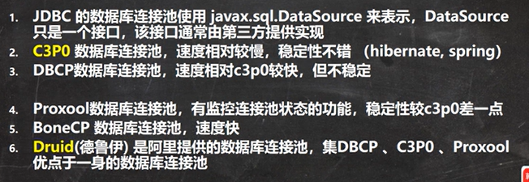

c3p0数据库连接池

```java
package com.kjqedu.jdbc.datasource;
//先把c3p0与mchange-commons导入到java项目中

import com.mchange.v2.c3p0.ComboPooledDataSource;

import java.io.FileInputStream;
import java.sql.Connection;
import java.util.Properties;

public class C3P0_ {
    public static void main(String[] args) throws Exception {
        new C3P0_().testC3P0_01();
    }
    //方式一， 相关参数，在程序中指定user，url，password
    public void testC3P0_01() throws Exception {
        //创建一个数据对象
        ComboPooledDataSource comboPooledDataSource = new ComboPooledDataSource();
        //通过配置文件，获取相关连接的信息
        Properties properties = new Properties();
        properties.load(new FileInputStream("src\\mysql.properites"));
        //读取数据
        String user = properties.getProperty("user");
        String password = properties.getProperty("password");
        String url = properties.getProperty("url");
        String driver = properties.getProperty("driver");

        //给数据源comboPooledDataSource设置相关的参数
        //注意：连接管理是由comboPooledDataSource来管理

        comboPooledDataSource.setDriverClass(driver);
        comboPooledDataSource.setJdbcUrl(url);
        comboPooledDataSource.setUser(user);
        comboPooledDataSource.setPassword(password);

        //设置初始化连接数
        comboPooledDataSource.setInitialPoolSize(10);
        //最大连接数，表示能连接池的连接数，最多能够涨到五十个
        comboPooledDataSource.setMaxPoolSize(50);
        //
        Connection connection = comboPooledDataSource.getConnection();
        System.out.println("连接成功");
        connection.close();
    }
    
    //第二种方式 使用配置文件模板来完成
    //将c3p0-service.xml拷贝到src目录下
    //该指定了连接数据库和连接池的相关参数
    public void testC3P0_02() throws SQLException {
        ComboPooledDataSource comboPooledDataSource = new ComboPooledDataSource("hello");
        Connection connection = comboPooledDataSource.getConnection();
        System.out.println("连接成功");
        connection.close();
    }
}
```

德鲁伊连接池(阿里实现的，当数据量最大时，最好)

```java
package com.kjqedu.jdbc.datasource;

import com.alibaba.druid.pool.DruidDataSourceFactory;

import javax.sql.DataSource;
import java.io.FileInputStream;
import java.io.FileNotFoundException;
import java.io.IOException;
import java.sql.Connection;
import java.util.Properties;

public class Druid_ {
    public static void main(String[] args) throws Exception {
        //加入druid jar包
        //加入 配置文件 druid.properties,将该文件拷贝项目的src目录下
        //创建properties对象，读取配置文档
        Properties properties = new Properties();
        properties.load(new FileInputStream("src\\druid.properties"));
        //创建一个指定参数的数据库连接池，druid的连接池
        DataSource dataSource = DruidDataSourceFactory.createDataSource(properties);
        Connection connection = dataSource.getConnection();
        System.out.println("连接成功");
        connection.close();

    }
}
```

基于德鲁伊的工具类

```java
package com.kjqedu.jdbc.datasource;

import com.alibaba.druid.pool.DruidDataSourceFactory;

import javax.sql.DataSource;
import java.io.FileInputStream;
import java.sql.Connection;
import java.sql.ResultSet;
import java.sql.SQLException;
import java.sql.Statement;
import java.util.Properties;

public class JDBCUtilsByDruid {

    private static DataSource ds;
    public static void main(String[] args) {
        //在静态代码快完成德鲁伊初始化

    }
    static {
        Properties properties = new Properties();
        try {
            properties.load(new FileInputStream("src\\druid.properties"));
            ds = DruidDataSourceFactory.createDataSource(properties);
        } catch (Exception e) {
            throw new RuntimeException(e);
        }
    }

    //编写getConnection方法
    public static Connection getConnection() throws SQLException {
        return ds.getConnection();
    }

    //关闭连接，不是关闭连接，而是把连接放入到连接池中
    public static void close(ResultSet resultSet, Statement statement, Connection connection) {
        try {
            if (resultSet != null) {
                resultSet.close();
            }
            if (statement != null) {
                statement.close();
            }
            if (connection != null) {
                connection.close();
            }
        } catch (SQLException e) {
            throw new RuntimeException(e);
        }
    }
}
```

```java
package com.kjqedu.jdbc.datasource;

//使用工具类

import java.sql.*;

public class JDBCUtilsByDruid_USE {
    public static void main(String[] args) {
        //得到连接
        Connection connection = null;
        //组织一个sql
        String sql = "select * from actor where id = ?";
        PreparedStatement preparedStatement = null;
        ResultSet set = null;
        try {
            //得到连接
            connection = JDBCUtilsByDruid.getConnection();

            preparedStatement = connection.prepareStatement(sql);
            //给占位赋值
            preparedStatement.setInt(1, 1);
            //执行
            set = preparedStatement.executeQuery();

            while (set.next()) {
                int id = set.getInt("id");
                String name = set.getString("name");
                String sex = set.getString("sex");
                Date borndate = set.getDate("borndate");
                String phone = set.getString("phone");
                System.out.println(id + "\t" + name + "\t" + sex  + "\t" + borndate + "\t" + phone);
            }
        } catch (SQLException e) {
            e.printStackTrace();
        } finally {
            //关闭资源
            JDBCUtilsByDruid.close(set, preparedStatement, connection);
        }
    }
}
```

### Apache--DBUtils把查询到的数据封装到列表中


练习：使用DBUtils+数据连接池（德鲁伊）方式，完成对表actor的crud

```java
package com.kjqedu.jdbc.datasource;

import java.sql.Date;

public class Actor {
    private Integer id;
    private String name;
    private String sex;
    private Date borndate;
    private String phone;

    public Actor() {}

    public Actor(Integer id, String name, String sex, Date borndate, String phone) {
        this.id = id;
        this.name = name;
        this.sex = sex;
        this.borndate = borndate;
        this.phone = phone;
    }

    public Integer getId() {
        return id;
    }

    public void setId(Integer id) {
        this.id = id;
    }

    public String getName() {
        return name;
    }

    public void setName(String name) {
        this.name = name;
    }

    public String getSex() {
        return sex;
    }

    public void setSex(String sex) {
        this.sex = sex;
    }

    public Date getBorndate() {
        return borndate;
    }

    public void setBorndate(Date borndate) {
        this.borndate = borndate;
    }

    public String getPhone() {
        return phone;
    }

    public void setPhone(String phone) {
        this.phone = phone;
    }

    @Override
    public String toString() {
        return "Actor{" +
                "id=" + id +
                ", name='" + name + '\'' +
                ", sex='" + sex + '\'' +
                ", borndate=" + borndate +
                ", phone='" + phone + '\'' +
                '}';
    }
}
```

```java
package com.kjqedu.jdbc.datasource;

import com.kjqedu.jdbc.Utils.JDBCUtils;
import org.apache.commons.dbutils.QueryRunner;
import org.apache.commons.dbutils.handlers.BeanListHandler;

import java.sql.Array;
import java.sql.Connection;
import java.sql.SQLException;
import java.util.List;

public class DBUtils_USE {
    public static void main(String[] args) throws SQLException {
        testQueryMany();
    }
    //使用apache-DBUtils 工具类+druid完成表的crud

    public static void testQueryMany() throws SQLException {
        //得到连接
        Connection connection = JDBCUtilsByDruid.getConnection();
        //使用DBUtils类和接口，先引入DBUtils相关的jar, 加入到project
        //创建QueryRunner
        QueryRunner queryRunner = new QueryRunner();
        //就可以执行相关方法，返回Array1List结果集
        String sql = "select * from actor where id = ?";
        //query方法就是执行sql语句，得到resultset --封装到 --> ArrayList集合中
        //返回集合
        //connection连接
        //sql执行的sql语句
        //new BeanListHandler<>(Actor.class):在将resultset -》Actor对象 -》 封装到ArrayList
        //底层的反射机制 去获取Actor类的属性，然后进行封装
        //1 就是给sql语句中的？赋值，可以有多个值，因为是可变参数
        //底层得到的resultset，会在query关闭，关闭PreparedStatment
        List<Actor> list = queryRunner.query(connection, sql, new BeanListHandler<>(Actor.class), 1);
        for(Actor actor : list){
            System.out.println(actor);
        }

        JDBCUtilsByDruid.close(null, null, connection);
    }
}
```

演示apache-dbutils + druid完成 返回的结果是单行记录（单个对象）

```java
public static void testQuerySingle() throws SQLException {
    //得到连接
    Connection connection = JDBCUtilsByDruid.getConnection();
    //使用DBUtils类和接口，先引入DBUtils相关的jar, 加入到project
    //创建QueryRunner
    QueryRunner queryRunner = new QueryRunner();
    //就可以执行相关方法，返回单个对象
    String sql = "select * from actor where id = ?";
    //应为我们知道返回单个记录，使用hander是beanhander
    Actor actor = queryRunner.query(connection, sql, new BeanHandler<>(Actor.class), 1);
    System.out.println(actor);

    //释放资源
    JDBCUtilsByDruid.close(null, null, connection);
}
```

演示qpache-dbutils + druid完成查询结果是单行单列-返回的就是object

```java
public static void testScalar() throws SQLException {
    Connection connection = JDBCUtilsByDruid.getConnection();
    //使用DBUtils类和接口，先引入DBUtils相关的jar, 加入到project
    //创建QueryRunner
    QueryRunner queryRunner = new QueryRunner();

    String sql = "select * from actor where id = ?";
    Object query = queryRunner.query(connection, sql, new ScalarHandler(), 1);
    System.out.println(query);


    //释放资源
    JDBCUtilsByDruid.close(null, null, connection);
}
```

### DAO增量改查-BasicDao把各种表封装成对象*


## 正则表达式

---

### 正则表达式基本语法

```java
Pattern compile = Pattern.compile("[0-9]+");
Matcher matcher = compile.matcher(content);
while (matcher.find()){
    System.out.println(matcher.group(0));
}
```


转义字符\\\

常用 .*+()$/\?[]^{}

1.限定符

?前要用()表示作用域，加上？也表示非贪婪匹配


2.选择匹配符

|表示与

3.分组组合符


非捕获分组，不能用group(0)找


4.特殊字符

5.字符匹配符

​	(1)[a-z]匹配小写的a-z


[^a-z]匹配不是a-z的所有字符

[abcd]匹配abcd任意字符

\\\d相当于[0-9], \\\D相当于\[^0-9], \\w相当于\[^a-zA-Z0-9_], \\\W与w正好相反，\\\s匹配任何空白字符（空格，制表符），\\\S与\\\s相反，\\\\.匹配\n外的所有字符

6.定位符


\\\b表示匹配只有在结尾才能匹配成功


匹配url

```java
String content = "https://www.bilibili.com/video/BV1fh411y7R8?p=894&spm_id_from=pageDriver";

String regStr = "^((http|https)://)([\\w-]+\\.)+[\\w-]+(\\/[\\w-?=&/%.#])?$";//[.]表示匹配.本身

Pattern pattern = Pattern.compile(regStr);
Matcher matcher = pattern.matcher(content);
if (matcher.find()){
    System.out.println(0);
}else {
    System.out.println(1);
}
```

### 三个常用类


### 分组，捕获，反向引用

 


去结巴


### 元字符

## java8 java11

---

