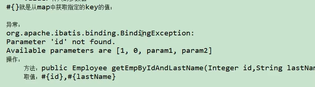
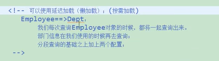
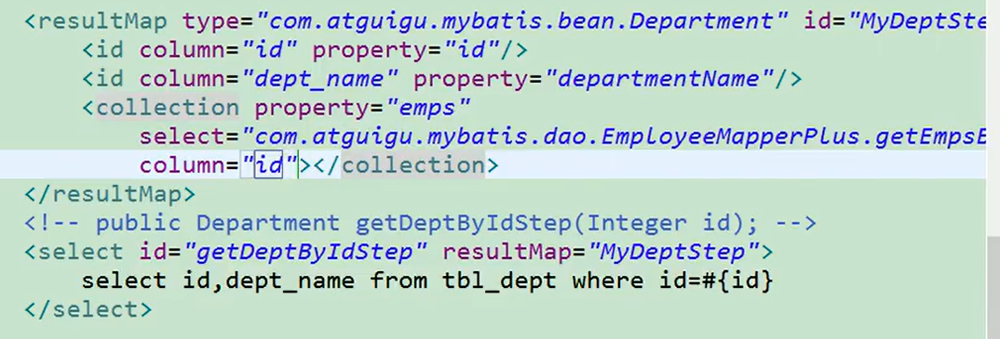
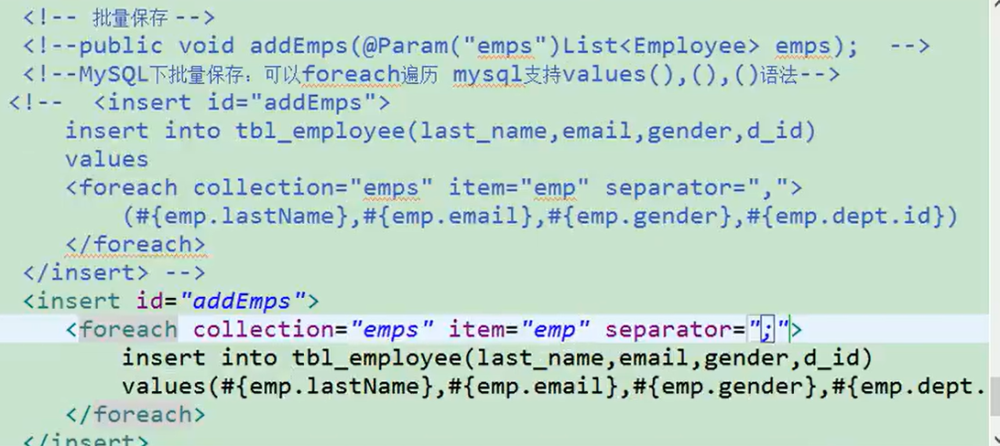
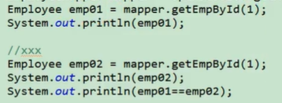

## 介绍

mybatis的四大对象，可以被plugins插件拦截。	

- 执行者
- Executor (update, query, flushStatements, commit, rollback, getTransaction, close, isClosed)
- 参数处理器
- ParameterHandler (getParameterObject, setParameters)
- 结果集处理器
- ResultSetHandler (handleResultSets, handleOutputParameters)
- 声明处理器

- StatementHandler (prepare, parameterize, batch, update, query)

<dependency>
    <groupId>org.mybatis</groupId>
    <artifactId>mybatis</artifactId>
    <version>3.4.6</version>
</dependency>

中文文档：https://mybatis.org/mybatis-3/zh/getting-started.html

## 第一个MyBatis程序

---

思路：搭建环境->导入MyBatis->编写代码->测试

### 搭建环境

搭建数据库：新建maven项目

```xml
<!--导入依赖-->
<dependencies>
    <dependency>
        <groupId>mysql</groupId>
        <artifactId>mysql-connector-java</artifactId>
        <version>5.1.9</version>
    </dependency>
    <dependency>
        <groupId>org.mybatis</groupId>
        <artifactId>mybatis</artifactId>
        <version>3.5.1</version>
    </dependency>
    <dependency>
        <groupId>junit</groupId>
        <artifactId>junit</artifactId>
        <version>4.12</version>
        <scope>test</scope>
    </dependency>
</dependencies>
```

删除src。

### 创建一个模块

。编写mybatis的核心配置文件

mybatis-config.xml

```xml
<?xml version="1.0" encoding="UTF-8" ?>
<!DOCTYPE configuration
        PUBLIC "-//mybatis.org//DTD Config 3.0//EN"
        "http://mybatis.org/dtd/mybatis-3-config.dtd">
<!--核心配文件-->
<configuration>
    <environments default="development">
        <environment id="development">
            <transactionManager type="JDBC"/>
            <dataSource type="POOLED">
                <property name="driver" value="com.mysql.jdbc.Driver"/>
                <property name="url" value="jdbc:mysql://localhost:3306/mybatis"/>
                <property name="username" value="root"/>
                <property name="password" value="kjq"/>
            </dataSource>
        </environment>
    </environments>
</configuration>
```

。编写mybatis工具类

```java
package com.kjq.utils;

import org.apache.ibatis.io.Resources;
import org.apache.ibatis.session.SqlSession;
import org.apache.ibatis.session.SqlSessionFactory;
import org.apache.ibatis.session.SqlSessionFactoryBuilder;

import java.io.InputStream;

//sqlSessionFactory->sqlSession
public class MyBatisUtils {
    private static SqlSessionFactory sqlSessionFactory;
    static {
        try {
            String resource = "mybatis-config.xml";
            InputStream inputStream = Resources.getResourceAsStream(resource);
            sqlSessionFactory = new SqlSessionFactoryBuilder().build(inputStream);
        } catch (Exception e) {
            e.printStackTrace();
        }
    }
    public static SqlSession getSqlSession() {
        SqlSession sqlSession = sqlSessionFactory.openSession();
        return sqlSession;
    }

}
```


每次使用都应该去获取对象，不应该写成成员变量共享数据

4.mapper接口没有实现类，但是mybatis会为这个接口生成一个代理对象。（将接口和xml进行绑定）

​	EmployyeeMapper empMapper = sqlSession.getMapper(Employee Mapper.class)

5.两个重要的配置文件。

​	mybatis的全局配置文件，包含数据连接池的信息，事务管理信息。。系统的运行环境信息

​	sql映射文件：保存了每一个sql语句的映射信息：将sql抽取出来

## MyBatis全局配置文件

mybatis-config.xml

```xml
<?xml version="1.0" encoding="UTF-8" ?>
<!DOCTYPE configuration
        PUBLIC "-//mybatis.org//DTD Config 3.0//EN"
        "http://mybatis.org/dtd/mybatis-3-config.dtd">
<!--核心配文件-->
<configuration>
    <environments default="development">
        <environment id="development">
            <transactionManager type="JDBC"/>
            <dataSource type="POOLED">
                <property name="driver" value="com.mysql.jdbc.Driver"/>
                <property name="url" value="jdbc:mysql://localhost:3306/mybatis"/>
                <property name="username" value="root"/>
                <property name="password" value="kjq"/>
            </dataSource>
        </environment>
    </environments>
<!--每个Mapper.xml都需要在MyBatis河西配置文件注册-->
    <mappers>
        <mapper resource="com/kjq/dao/EmployeeMapper.xml"/>
    </mappers>
</configuration>
```

### properties标签

properties配置文件

```properties
jdbc.driver=com.mysql.jdbc.Driver
jdbc.url=jdbc:mysql://localhost:3306/mybatis
jdbc.username=root
jdbc.password=kjq
```

```xml
<?xml version="1.0" encoding="UTF-8" ?>
<!DOCTYPE configuration
        PUBLIC "-//mybatis.org//DTD Config 3.0//EN"
        "http://mybatis.org/dtd/mybatis-3-config.dtd">

<configuration>
    <!--
    1.mybatis可以使用properties标签可以引入外来的properties配置文件的内容
    resource：引入类路径下的资源
    url：引入网络路径或者磁盘路径下的资源
    -->
    <properties resource="dbconfig.properties"></properties>
    <environments default="development">
        <environment id="development">
            <transactionManager type="JDBC"/>
            <dataSource type="POOLED">
                <property name="driver" value="${jdbc.driver}"/>
                <property name="url" value="${jdbc.url}"/>
                <property name="username" value="${jdbc.username}"/>
                <property name="password" value="${jdbc.password}"/>
            </dataSource>
        </environment>
    </environments>

<!--每个Mapper.xml都需要在MyBatis河西配置文件注册-->
    <mappers>
        <mapper resource="com/kjq/dao/EmployeeMapper.xml"/>
    </mappers>
</configuration>
```

### settings标签

```xml
2.settings包含很多重要的设置项
setting:用来设置每一个设置项
    name：设置项名
    value：设置项取值
-->
<settings>
    <setting name="mapUnderscoreToCamelCase" value="true"/>
</settings>
```

### typeAliases标签

```xml
<!--
    3.typeAliases:别名处理器，可以为我们java类型起别名
    别名不区分大小写
    typeAlias:为某个java类的别名
        type：指定要起别名的类型全类名;不指定名称，默认以首字母小写的形式employee
        alias:指定新的别名
    -->
    <typeAliases>
<!--        <typeAlias type="com.kjq.pojo.Employee" alias="emp"/>-->
        <!--
        package为某个包下的类批量起别名
        name:指定包名（为当前包以及下面的所有包的每一个类都起一个默认别名（类名小写））

        也可以在目标类中使用@Alias("emp")这个注解为目标类指定emp别名
        -->
        <package name="com.kjq.pojo"/>
    </typeAliases>

    <environments default="development">
        <environment id="development">
            <transactionManager type="JDBC"/>
            <dataSource type="POOLED">
                <property name="driver" value="${jdbc.driver}"/>
                <property name="url" value="${jdbc.url}"/>
                <property name="username" value="${jdbc.username}"/>
                <property name="password" value="${jdbc.password}"/>
            </dataSource>
        </environment>
    </environments>

<!--每个Mapper.xml都需要在MyBatis河西配置文件注册-->
    <mappers>
        <mapper resource="com/kjq/dao/EmployeeMapper.xml"/>
    </mappers>
</configuration><!--
    3.typeAliases:别名处理器，可以为我们java类型起别名
    typeAlias:为某个java类的别名
        type：指定要起别名的类型全类名;不指定名称，默认以首字母小写的形式employee
        alias:指定新的别名
    -->
    <typeAliases>
        <typeAlias type="com.kjq.pojo.Employee" alias="emp"/>
    </typeAliases>
    <environments default="development">
        <environment id="development">
            <transactionManager type="JDBC"/>
            <dataSource type="POOLED">
                <property name="driver" value="${jdbc.driver}"/>
                <property name="url" value="${jdbc.url}"/>
                <property name="username" value="${jdbc.username}"/>
                <property name="password" value="${jdbc.password}"/>
            </dataSource>
        </environment>
    </environments>

<!--每个Mapper.xml都需要在MyBatis河西配置文件注册-->
    <mappers>
        <mapper resource="com/kjq/dao/EmployeeMapper.xml"/>
    </mappers>
</configuration>
```

### typeHandlers标签

类型处理器

架起java类型与数据库类型一一映射的桥梁。比如将java的String转换成varchar

日期类型的处理器：mybatis3.4以前的版本需要我们自己配置，以后的版本都自动注册的

### plugins标签

插件

### environments标签

```xml
<!--
    4.environments：环境配置，mybatis可以配置多种环境。default指定那个环境，来切换使用那个配置
    每一个environment：配置一个具体的环境信息，必须有。id表示环境的唯一标识
        transactionManager：事务管理器
            type：事务管理器的类型。type="[JDBC|MANAGED]"
            也可以自定义管理
        dataSource：数据源
             type="[UNPOOLED|POOLED|JNDI]"
                UNPOOLED：不使用连接池
                POOLED：使用连接池
             自定义：实现这个接口DataSourceFactory
    -->
    <environments default="development">
        <environment id="development">
            <transactionManager type="JDBC"/>
            <dataSource type="POOLED">
                <property name="driver" value="${jdbc.driver}"/>
                <property name="url" value="${jdbc.url}"/>
                <property name="username" value="${jdbc.username}"/>
                <property name="password" value="${jdbc.password}"/>
            </dataSource>
        </environment>
    </environments>

<!--每个Mapper.xml都需要在MyBatis河西配置文件注册-->
    <mappers>
        <mapper resource="com/kjq/dao/EmployeeMapper.xml"/>
    </mappers>
</configuration>
```

### databaseIdProvider标签

```xml
 <!--5.databaseIdProvider支持多数据库厂商
    type="DB_VENDOR",VendorDatabaseProductName()
    作用2就是得到数据库厂商的标识（驱动getDatabaseProductName()）,
    mybatis就会根据厂商的标识来执行不同的sql
    MySql，Orace，SQL Server-->
    <databaseIdProvider type="DB_VENDOR">
<!--        为不同的数据库厂商起一个别名-->
        <property name="MySQL" value="mysql"/>
    </databaseIdProvider>
<!--每个Mapper.xml都需要在MyBatis河西配置文件注册-->
    <mappers>
        <mapper resource="com/kjq/dao/EmployeeMapper.xml"/>
    </mappers>
</configuration>
```

```xml
<!--查询语句-->
<select id="getUserList" resultType="Employee" databaseId="mysql">
    select * from tal_employee;
</select>
```

### mappers标签

```xml
<!--
    6.mappers将sql映射注册到全局配置文件中
    mapper注册一个sql映射
        resource：引用类路径下的sql映射文件
            mybatis/mapper/EmployeeMapper.xml
        url：引用网络路径或者磁盘路径下的sql映射文件
            file://var/mappers/AuthorMapper.xml
        class:引用（注册）接口
            1.有sql映射文件，映射文件必须和接口同名，并且放在与接口同目录下，
            2.没有sql配置文件，所有的sql都用注解写在接口上；
            推荐：使用有sql映射文件

    -->

    <mappers>
        <mapper resource="com/kjq/dao/EmployeeMapper.xml"/>
        <!--批量注册-->
        <package name="包名"/>
    </mappers>
    
    
</configuration>
```

## 映射文件


```java
package com.kjq.dao;

import com.kjq.pojo.Employee;
import org.apache.ibatis.io.Resources;
import org.apache.ibatis.session.SqlSession;
import org.apache.ibatis.session.SqlSessionFactory;
import org.apache.ibatis.session.SqlSessionFactoryBuilder;
import org.junit.Test;

import java.io.IOException;
import java.io.InputStream;

public class TestMyBatis {
    @Test
    public void test01() throws IOException {
        String resource = "mybatis-config.xml";
        InputStream inputStream = Resources.getResourceAsStream(resource);
        SqlSessionFactory sqlSessionFactory = new SqlSessionFactoryBuilder().build(inputStream);

        SqlSession sqlSession = sqlSessionFactory.openSession();
        EmployeeDao mapper = sqlSession.getMapper(EmployeeDao.class);

        Employee employee = mapper.getEmpById(1);
        System.out.println(employee);
        sqlSession.close();
    }
    @Test
    public void test02() throws IOException {
        String resource = "mybatis-config.xml";
        InputStream inputStream = Resources.getResourceAsStream(resource);
        SqlSessionFactory sqlSessionFactory = new SqlSessionFactoryBuilder().build(inputStream);

        SqlSession sqlSession = sqlSessionFactory.openSession();
        EmployeeDao mapper = sqlSession.getMapper(EmployeeDao.class);

        mapper.addEmp(new Employee(null, "jerry", "1", "jerry@qq.com"));
        sqlSession.commit();
        sqlSession.close();
    }
    @Test
    public void test03() throws IOException {
        String resource = "mybatis-config.xml";
        InputStream inputStream = Resources.getResourceAsStream(resource);
        SqlSessionFactory sqlSessionFactory = new SqlSessionFactoryBuilder().build(inputStream);

        SqlSession sqlSession = sqlSessionFactory.openSession();
        EmployeeDao mapper = sqlSession.getMapper(EmployeeDao.class);

        mapper.update(new Employee(1, "1", "1", "kjq@qq.com"));
        sqlSession.commit();
        sqlSession.close();
    }
    @Test
    public void test04() throws IOException {
        String resource = "mybatis-config.xml";
        InputStream inputStream = Resources.getResourceAsStream(resource);
        SqlSessionFactory sqlSessionFactory = new SqlSessionFactoryBuilder().build(inputStream);

        SqlSession sqlSession = sqlSessionFactory.openSession();
        EmployeeDao mapper = sqlSession.getMapper(EmployeeDao.class);

        mapper.deleteEmpById(2);
        sqlSession.commit();
        sqlSession.close();
    }
}
```

### insert添加

mysql添加


```java
Employee employee = new Employee(null, "jerry", "1", "jerry@qq.com");
mapper.addEmp(employee);
sqlSession.commit();
//执行完成以后id会被自动赋值
System.out.println(employee);
```

oracle


### 参数处理

接口传参

单个参数：mybatis不会做特殊处理，

​	#{参数名}，取出参数。参数名可以为任何值

多个参数：mybatis会做特殊处理。多个参数封装成map，

​	key，param1....paramN，或者参数的索引也可以

​	value：是我们传入的参数值




​	@Param注解是作用在属性上面的

如果多个参数正好等于pojo是我们的业务逻辑模型，我们就可以直接传入pojo

​	#{属性名}：取出pojo的属性值

如果多个参数不是业务模型的数据，没有对应pojo，为了方便，我们也可以传入map

​	#{key}：取出map中对应的值


**特殊参数处理**


处理参数封装成map集合的源码

names在构造器中就设计好了


​				name就保存{0=id, 1=lastName, 2=2}

args[1, "Tom"]：

```java
public Object getNamedParams(Object[] args) {
    int paramCount = this.names.size();
    //1、参数为null直接走else，放后返回
    if (args != null && paramCount != 0) {
        //2、paramCount=1如果参数只有一个，并且没有Param注解。args[0]拿到第一个参数
        if (!this.hasParamAnnotation && paramCount == 1) {
            return args[(Integer)this.names.firstKey()];
        //3.多个元素，或有Param注解
        } else {
            //先设计一个map
            Map<String, Object> param = new ParamMap();
            int i = 0;
			//保存数据，遍历names={0=id, 1=lastName, 2=2}
            for(Iterator var5 = this.names.entrySet().iterator(); var5.hasNext(); ++i) {
                Entry<Integer, String> entry = (Entry)var5.next();
                //names的value值当key；
                //args[1, "Tom"]：的key作为value赋值
                param.put((String)entry.getValue(), args[(Integer)entry.getKey()]);
                
                //额外的有重新给param赋值genericParamName=param1....paramN;
                String genericParamName = "param" + String.valueOf(i + 1);
                if (!this.names.containsValue(genericParamName)) {
                    param.put(genericParamName, args[(Integer)entry.getKey()]);
                }
            }

            return param;
        }
    } else {
        return null;
    }
}
```


**参数值的获取**

#{}：可以获取map中的值或者pojo对象属性的值；

${}：即可以获取map中的值或者pojo对象属性的值，又能给查询语句的表名动态获取；(不建议使用，不能防止sql注入)


#{}：更丰富的用法


### select查询


id：唯一标识。-用来引用这条数据，需要和接口的方法名一致

parameterType：参数类型。-可以不传，MyBatis会根据TypeHandler自动推断

resultType：返回值类型。-别名或者全类名，如果返回值的集合，定义集合中元素的类型。不能和resultMap同时使用

​	返回值类型要写集合中元素的类型


把Employee对象封装到map中，以map为key

```java
//key=对象的主键，value=Employee对象
@MapKey("id")//告诉mybatis封装这个map的时候使用哪个属性作为key
public Map<Integer, Employee> getEmoByLastNameLikeReturnMap();
```

```xml
<select id="getEmoByLastNameLikeReturnMap" resultType="com.kjq.pojo.Employee">
    select * from tal_employee
</select>
```

#### **resultMap**属性自定义返回值类型


**resultMap更强大的用法：**

场景一：

​	查出员工的同时，也查出部门。

​	让员工的信息与部门建立外键关联，一个员工有一个部门

​	查出的信息是

​		id	last_name	gender	d_id	did	dept_name


​	第二种写法


也可以用assocition做分布查询


分段查询也可以在用的时候去查询，不用就不查。



原来的分布查询不用改，只需要在全局配置文件中

1.延迟加载打开

2.用的时候加载，不用就不加载


场景二：collection封装集合

​	查询部门的同时把所有的员工查询出来，一个部门对应多个员工

​	先把所有的员工查出来


​	也用分部查询。延迟加载也适用




collection中的column属性表示把那一列的属性传给这个方法。

如果把多列的值传递过去

​	将多列的值封装map传递；

​	column = "{key1=value1, key2=value2}"

​	


最后一个标签discriminator：鉴别器


## MyBatis-动态SQL。OGNL表达式

动态sql是MyBatis强大特性之一。极大的嘉华我们的拼接sql的操作。

动态sql元素和使用JSTL或其他类似基于xml的文本处理器相似。

MyBatis采用功能强大的基于OGNL的表达式来简化操作。

​	-if

​	-choose(when，otherwise)

​	-trim(where，set)

​	-foreach

### if判断

```xml
select * from tal_employee
        where
        <!--
        从参数中取值进行判断
        遇见特殊符号应该写转义字符,&&也是特殊字符
        -->
        <if test="id!=null">
            id=#{id}
        </if>
        <if test="lastName!=null and lastName!=&quot;&quot;">
            and last_name like #{lastName}
        </if>
        <if test="email!=null">
            and email=#{email}
        </if>
        <if test="gender==0 or gender==1">
            and gender=#{gender}
        </if>
</select>
```

**set标签**


**where标签**

如果没有id，查询的时候如果某些条件设带可能sql拼接错误

​	1.给where后面加上1=1，以后的条件都and xxx

​	2.mybatis使用where标签来将所有的查询条件包含在内

​		where只会去掉第一个多出来的and或or

```xml
<where>
    <if test="id!=null">
        id=#{id}
    </if>
    <if test="lastName!=null and lastName!=&quot;&quot;">
        and last_name like #{lastName}
    </if>
    <if test="email!=null">
        and email=#{email}
    </if>
    <if test="gender==0 or gender==1">
        and gender=#{gender}
    </if>
</where>
```

### trim字符串截取

```xml
<!--
后面多出and或or where标签不能解决
prefix=""：前缀:trim标签体中是整个字符串拼串后的结果
    prefix给拼串后的整个字符串加一个前缀
prefixOverrides=""：前缀覆盖：
    去掉整个字符串前面的多余的字符
suffix=""：后缀：
    suffix给拼串后的整个字符串加一个后缀
suffixOverrides=""
    去掉整个字符串后面的多余的字符
-->
<trim prefix="where" suffixOverrides="and">
    <if test="id!=null">
        id=#{id} and
    </if>
    <if test="lastName!=null and lastName!=&quot;&quot;">
        last_name like #{lastName} and
    </if>
    <if test="email!=null">
        email=#{email} and
    </if>
    <if test="gender==0 or gender==1">
        gender=#{gender}
    </if>
</trim>
```

### choose分支的选择相当于java中swtich-case

```xml
<select id="getEmpsByConditionChoose" resultType="com.kjq.pojo.Employee">
    select * from tal_employee
        <where>
            <!-- 如果带了id就用id查，如果带了lastName就用lastName查；-->
            <choose>
                <when test="id!=null">
                    id=#{id}
                </when>
                <when test="lastName!=null and lastName!=&quot;&quot;">
                    and last_name like #{lastName}
                </when>
                <when test="email!=null">
                    and email=#{email}
                </when>
                <when test="gender==0 or gender==1">
                    and gender=#{gender}
                </when>
            </choose>
        </where>
</select>
```

### foreach


批量保存




定义变量的标签


**sql标签**引用sql的片段


## MyBatis-缓存机制

包含一个非常强大的查询缓存特性。它可以非常方便地配置和定制。缓存可以极大的提升查询效率。

一级缓存和二级缓存。

​	-1.默认情况下，只有一级缓存（SqlSession级别的缓存，也称为本地缓存）开启。

​	-2.二级缓存需要动手开启和配置，他是基于namespace级别的缓存

​	-3.为了提高扩展性能。MyBatis定义了缓存接口Cache。我们可以通过实现Cache接口来自定义二级缓存

### 一级缓存

​	----其实就是SqlSession中的一个map

​	与数据库同一次会话期间查询到的数据会放在本地缓存中。

​	以后如果需要获取相同的数据，直接从缓存中拿，没必要再去查询数据库



​																输出的结果为true

默认查询相同的id会把查询到的结果放在缓存中

以后获取相同的数据直接从缓存中拿

​	默认情况下是开启的，只有一级缓存SqlSession级别的缓存，也称为本地缓存，每一个SqlSession都有一个一级缓存，他们是不共享缓存的

​	一级缓存失效情况（没有使用到当前一级缓存的情况下，效果就是，还需要再向数据库发送查询）

​	1.SqlSession换了，就是新的session

​	2.sqlSession相同，查询条件不同（当前一级缓存中还没有这个数据）

​	3.sqlSession相同，两次查询之间执行了增删改（这次增删改可能改变了当前数据有影响，所以会执行新的查询）

​	4.sqlSession相同，手动清除了缓存

​		openSession.clearCache()

### 二级缓存（全局缓存）

​	二级缓存需要动手开启和配置，他是基于namespace级别的缓存。每个xml都有一个名称空间，一个名称空间对应一个二级缓存

​		1.一次会话，查询一条数据，这条数据就会被放在当前的绘话的一级缓存中

​		2.如果会话关闭，一级缓存中的数据会被保存到二级缓存中。新的会话信息，就会放到二级缓存中

​		3.sqlSession===EmployeeMapper==>Employee			

​									DepartmentMapper==>Department

​			不同的namespace查处的数据会放在自己对应的缓存中

使用:

​	1.需要在全集配置文件中开启二级缓存

​	2.取mapper.xml中配置使用二级缓存


​		size：缓存存放多少元素

​		type：指定自定义缓存的全类名

​					实现Cache接口即可：

​	3.我们的POJO需要实现序列化的接口Serializable

​		查询到的数据都会先放到一级缓存中

​		只有会话提交或关闭以后，一级缓存中的数据才会转移到二级缓存中


### 和缓存有关的设置和属性

1.setting配置中cacheEnabled属性为false时：关闭缓存（二级缓存关闭）（一级缓存不关闭）

2.

useCache=false不使用缓存（二级缓存不使用）（一级缓存不关闭）

3.

flushCache=true表示增删改以后就会清除缓存。一级和二级缓存都会清空

4.sqlSession.clearCache()只会清除当前的一级缓存

5.setting配置中还有一个与缓存有关的属性localCacheScope

​	STATEMENT，可以禁用一级缓存


## mybatis逆向工程

## 运行原理框架分层架构  


执行者：Executor

参数处理器：ParameterHandler

结果集处理器：ResultSetHandler

声明处理器：StatementHandler


1.根据配置文件创建SQLSessionFactory

​	总结的一句话是把配置文件的信息解析并保存在Configuration对象中，返回DefaultSqlSession对象中。返回包含了Configuration的DefaultSqlSession对象


一个mapperdtatement表示一个增删改查标签的详细信息


最终全部解析的xml的信息保存再configuration对象中

​	保存了配置文件的详情信息


mappedStatements：表示一个增删改查的标签的详细信息


2.获取SqlSession对象

​	返回SqlSession的实现类DefaultSqlSession对象。

​	它里面包含了Executor和Configuration

​	会在这一步被创建Executor


3.获取接口的代理对象MapperProxy

​	getMapper，使用MapperProxyFactory创建一个MapperProxy的代理对象

​	代理对象里面包含了，DefaultSqlSession(Executor)


4.执行增删改查方法

boundSql对象：里边保存了sql语句，属性等所有信息


查询流程总结


整个运行流程进行总结


拦截器


## 插件开发

原理


**插件的编写**

1.编写一个类实现Interceptor接口


2.告诉mybatis拦截那个对象的哪个方法

type：四大对象的那个对象

method：哪个方法

args：方法的参数

在类上使用注解@Interface({

​	@Signature{type=""}

})

3.将写好的插件注册到全局配置文件中


传入的参数会赋值第三个方法properties中


