## Spring概念

---

spring是一个轻量级的开源的javaee框架，spring可以解决企业应用开发的复杂性，spring两个核心的部分ioc、aop

IOC：控制反转，把创建对象的过程交给spring进行管理

AOP：面向切面，不修改源码增加功能

特点：

​	方便解耦，简化开发

​	aop编程的支持，方便程序的测试

​	可以方便整合其他框架

​	方便事务的操作

​	降低api开发难度

入门案例

​	先创建maven项目。导入相关的依赖

```xml
<dependency>
  <groupId>org.springframework</groupId>
  <artifactId>spring-context</artifactId>
  <version>5.2.5.RELEASE</version>
</dependency>
```

创建普通类，在这个类创建普通方法

```java
public class User {
    public void add() {
        System.out.println("add输出");
    }
}
```

创建spring配置文件，在配置文件配置创建的对象

​	使用xml格式的配置文件

```xml
<?xml version="1.0" encoding="UTF-8"?>
<beans xmlns="http://www.springframework.org/schema/beans"
       xmlns:xsi="http://www.w3.org/2001/XMLSchema-instance"
       xsi:schemaLocation="http://www.springframework.org/schema/beans http://www.springframework.org/schema/beans/spring-beans.xsd">

    <!--配置User对象的创建-->
    <bean id="user" class="com.kjq.spring5.User"></bean>
</beans>
```

```java
@Test
public void testAdd() {
    //加载配置文件
    ApplicationContext context = new ClassPathXmlApplicationContext("bean1.xml");
    //获取配置文件的对象
    User user = context.getBean("user", User.class);
    user.add();
}
```

## IOC容器

---

什么是ioc：

​	ioc控制反转，把对象的创建和对象之间的调用过程，交给spring惊醒管理

​	使用ioc目的：为了解耦度降低

ioc底层技术原理

​	xml解析，工厂模式，反射

### IOC底层原理

原始方法

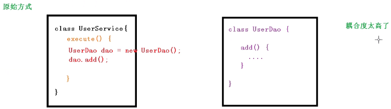

工厂模式

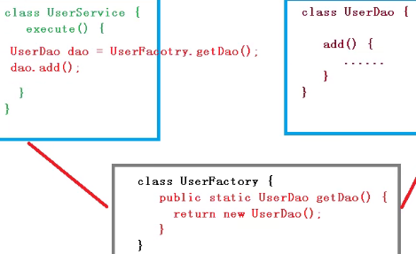

IOC

把耦合度进一步降低。比如UserDao路径变了，只需要修改配置文件

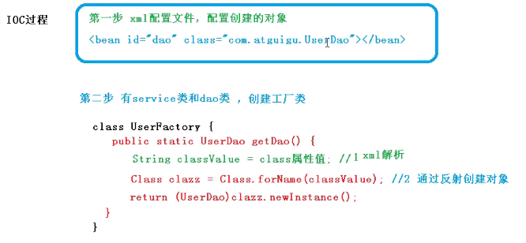

### 接口(BeanFactory)

IOC的接口

​	ioc思想基于ioc容器完成，ioc容器底层就是对象工厂

​	spring提供ioc容器的两种实现方式：（两个接口）

​		BeabFactory：ioc容器的最基本实现，是spring内部的使用接口，不提供开发人员使用（特点：在加载配置文件的时候不会创建对象，在使用或获取对象的时候才会去创建对象）

​		ApplicationContext：BeabFactory接口的子接口，提供跟队更强大的功能，一般有开发人员进行使用（加载配置文件的时候就会创建对象）

​		解释为什么第二种好用，当在启动服务器时就创建对象，节约时间

ApplicationContext的实现类

ctrl+h打开类图

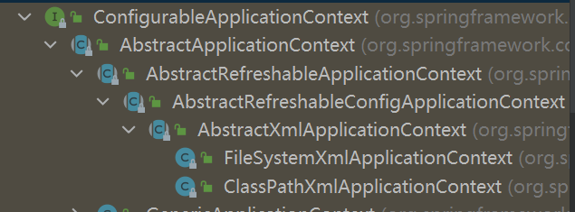

最下面两个最重要的实现类

​	FileSystemXmlApplicationContext：表示在系统盘的配置文件路径

​	ClassPathXmlApplicationContext：表示在resources中的配置文件路径

### IOC操作Bean管理(基于xml)

1.什么是Bean管理

​	spring创建对象

​	spring注入属性

基于xml的Bean管理

创建对象

​	先在resources配置文件中写入创建配置文件

```xml
<!--配置User对象的创建-->
<bean id="user" class="com.kjq.spring5.User">
```

​	1.在spring配置文件中，使用bean标签，标签里面添加对应属性，就可以实现创建对象

​	2.在bean标签中有很对属性，介绍常用的属性

​		id属性：唯一标识

​		class属性：类的全路径

​		name属性：与id相似，基本不用了

​	3.创建对象的时候默认使用无参构造方法

注入属性

​	1.DI：依赖注入，就是注入属性

#### set方法注入属性

前提是要有set方法

```java
package com.kjq.spring5;

public class Book {
    private String name;
    public void setName(String name) {
        this.name = name;
    }
}
```

​			在spring配置文件先配置对象的创建，再配置属性的注入	

```xml
<?xml version="1.0" encoding="UTF-8"?>
<beans xmlns="http://www.springframework.org/schema/beans"
       xmlns:xsi="http://www.w3.org/2001/XMLSchema-instance" 
xmlns:p="http://www.springframework.org/schema/p"       xsi:schemaLocation="http://www.springframework.org/schema/beans http://www.springframework.org/schema/beans/spring-beans.xsd">
    <!--创建对象-->
    <!--set方法注入属性-->
    <bean id="book" class="com.kjq.spring5.Book">
        <!--使用property完成属性的注入
        name:属性的名称
        value：向属性注入的值-->
        <property name="name" value="易经经"></property>
    </bean>
    <!--
	p名称空间注入，了解一下
    使用p名称空间注入，可以简化基于xml配置方式
	需要在bean中加一个属性xmlns:p=""
	在bean标签进行属性注入
	<bean id="book" class="com.kjq.spring5.Book" p:bname="易经经">
    </bean>
	-->
</beans>

```

```java
@Test
public void testBook() {
    ApplicationContext context = new ClassPathXmlApplicationContext("bean1.xml");
    Book book = context.getBean("book", Book.class);
    System.out.println(book);
}
```

#### 有参构造注入属性

```java
package com.kjq.spring5;
public class Book {
    private String name;
    public Book(String name) {
        this.name = name;
    }
    @Override
    public String toString() {
        return "Book{" + "name='" + name + '\'' + '}';
    }
}
```

```xml
<bean id="book" class="com.kjq.spring5.Book">
    <constructor-arg name="name" value="黄帝内经"/>
</bean>
```

也可以通过索引值

```xml
<bean id="book" class="com.kjq.spring5.Book">
    <constructor-arg index="0" value="黄帝内经"/>
</bean>
```

```java
@Test
public void testBook2() {
    ApplicationContext context = new ClassPathXmlApplicationContext("bean1.xml");
    Book book = context.getBean("book", Book.class);
    System.out.println(book);
}
```

#### IOC操作Bean管理其它属性注入管理

1.字面量set

​	null值

```xml
<!--给属性设置空值null-->
<property name="name">
    <null/>
</property>
```

​	属性值包含特殊符号

```xml
<!--属性值中含有特殊字符
    把<进行转译
    把带有特殊字符内容写到CDATA
-->
<property name="name">
    <value><![CDATA[内容]]></value>
</property>
```

​	

#### 注入属性-外部bean。set与构造器都行

​		两个类service类和dao类

​		在service调用dao里面的方法

​		在spring配置文件中进行配置。使用set注入

```xml
<bean id="userService" class="com.kjq.spring5.service.UserService">
    <property name="userDao" ref="userDaoImpl"/>
</bean>
<bean id="userDaoImpl" class="com.kjq.spring5.dao.impl.UserDaoImpl"/>
```

​	

​	注入属性-内部bean

​		一对多关系：部门和员工

​		在spring配置文件中进行配置

```xml
<!--内部bean嵌套定义-->
<bean id="emp" class="com.kjq.spring5.bean.Emp">
    <property name="ename" value="lucy"></property>
    <property name="gender" value="女"></property>
    <property name="dept">
        <bean id="dept" class="com.kjq.spring5.bean.Dept">
            <property name="dname" value="保安"></property>
        </bean>
    </property>
</bean>
```

​	

​	注入属性-级联赋值

```xml
<!--    <bean id="emp" class="com.kjq.spring5.bean.Emp">-->
<!--        <property name="ename" value="lucy"></property>-->
<!--        <property name="gender" value="女"></property>-->
<!--        &lt;!&ndash;级联赋值&ndash;&gt;-->
<!--        <property name="dept" ref="dept"></property>-->
<!--    </bean>-->
<!--    <bean id="dept" class="com.kjq.spring5.bean.Dept">-->
<!--        <property name="dname" value="财务部"></property>-->
<!--    </bean>-->
    <!--上面的代码也可以这样写，前提是dept属性要有get方法-->
    <bean id="emp" class="com.kjq.spring5.bean.Emp">
        <property name="ename" value="lucy"></property>
        <property name="gender" value="女"></property>
        <!--级联赋值-->
        <property name="dept" ref="dept"></property>
        <property name="dept.dname" value="技术部"></property>
    </bean>
    <bean id="dept" class="com.kjq.spring5.bean.Dept"></bean>
```

#### xml注入集合属性

​		注入数组类型属性

​		注入List集合类型属性

​		注入Map集合类型属性

```java
import java.util.List;
import java.util.Map;
public class Stu {
    private String[] courses;
    private List<String> list;
    private Map<String, String> map;
    public void setList(List<String> list) {
        this.list = list;
    }
    public void setMap(Map<String, String> map) {
        this.map = map;
    }
    public void setCourses(String[] courses) {
        this.courses = courses;
    }
}
```

```xml
<bean id="stu" class="com.kjq.spring5.collectiontype.Stu">
    <!--数组类型的注入-->
    <property name="courses">
        <array>
            <value>java</value>
            <value>python</value>
        </array>
    </property>
    <!--list类型注入-->
    <property name="list">
        <list>
            <value>张三</value>
            <value>李四</value>
        </list>
    </property>
    <!--map类型注入-->
    <property name="map">
        <map>
            <entry key="JAVA" value="java"></entry>
            <entry key="PYTHON" value="python"></entry>
        </map>
    </property>
</bean>
```

#### 当集合中的属性是对象怎样注入

```xml
<!--集合类型属性的注入-->
<bean id="stu" class="com.kjq.spring5.collectiontype.Stu">
	<!--list值是对象-->
    <property name="coursesList">
        <list>
            <ref bean="course1"></ref>
            <ref bean="course2"></ref>
        </list>
    </property>
</bean>
<bean id="course1" class="com.kjq.spring5.collectiontype.Course">
    <property name="cname" value="java"></property>
</bean>
<bean id="course2" class="com.kjq.spring5.collectiontype.Course">
    <property name="cname" value="python"></property>
</bean>
```


#### 把集合注入部分提取出来。作为公共部分

​	在spring配置文件中引入名称空间util

​	使用util标签完成list集合注入提取

```xml
<?xml version="1.0" encoding="UTF-8"?>
<beans xmlns="http://www.springframework.org/schema/beans"
       xmlns:xsi="http://www.w3.org/2001/XMLSchema-instance"
       xmlns:util="http://www.springframework.org/schema/util"
       xsi:schemaLocation="http://www.springframework.org/schema/beans http://www.springframework.org/schema/beans/spring-beans.xsd
                           http://www.springframework.org/schema/util http://www.springframework.org/schema/util/spring-util.xsd">
    <!--提取list集合类型属性注入-->
    <util:list id="bookList">
        <value>易经经</value>
        <value>九阳神功</value>
        <value>九阳真经</value>
    </util:list>
    <bean id="book" class="com.kjq.spring5.collectiontype.Book">
        <property name="list" ref="bookList"></property>
    </bean>
</beans>
```

#### IOC操作Bean管理（FactorBean）

​	1、spring有两种类型bean，一种是普通bean，另一种是工厂bean(FactorBean)

​	2、普通bean：在配置文件中定义bean类型就是返回类型

​	3、工厂bean：在配置文件定义bean类型可以和返回类型不一样

​		第一步创建类、让这个类作为工厂bean，实现接口FactoryBean

​		第二部实现接口中的方法，在实现的方法中定义反回的bean类型

```java
//典型的定义类型和返回类型不一样
public class MyBean implements FactoryBean<Course> {
    //来定义返回的bean对象的类型
    @Override
    public Course getObject() throws Exception {
        Course course = new Course();
        return course;
    }

    @Override
    public Class<?> getObjectType() {
        return null;
    }

    @Override
    public boolean isSingleton() {
        return FactoryBean.super.isSingleton();
    }
}
```

```xml
<bean id="myBean" class="com.kjq.spring5.factorybean.MyBean">
</bean>
```


#### bean的作用域

1、在spring里面，设置创建bean实例是单实例还是多实例

2、在spring在默认情况下。创建的是单实例

3、设置多实例，bean标签里有scope用于设置示例的个数

​	singleton默认值：当去加载配置文件的时候就会创建单实例的值

​	prototype多实例：当调用getBean方法的时候才会去创建对象

```java
<!--提取list集合类型属性注入-->
<util:list id="bookList">
    <value>易经经</value>
    <value>九阳神功</value>
    <value>九阳真经</value>
</util:list>
<bean id="book1" class="com.kjq.spring5.collectiontype.Book1" scope="prototype">
    <property name="list" ref="bookList"></property>
</bean>
```

​	request：一次请求，每次创建对象会把对象放到request中

​	session：一次会话，每次创建对象会把对象放到session中

#### bean的生命周期

1、生命周期：从对象的创建到销毁的过程

2、bean的生命周期

​	通过无参构造创建bean实例

​	调用set方法为bean的属性设置值和对其他bean引用

​	（初始化之前）把bean实例传到bean的后置处理器的方法

​	调用bean中的初始化方法

​	（初始化之后）把bean实例传到bean的后置处理器的方法

​	bean可以使用了

​	当容器关闭时候，调用bean的销毁方法

```java
package com.kjq.spring5.bean;

//实现类
public class Orders {
    private String oname;
    public Orders() {
        System.out.println("1、无参构造被调用");
    }
    public void setOname(String oname) {
        this.oname = oname;
        System.out.println("2、set方法被调用");
    }
    //创建初始化方法
    public void initMethod() {
        System.out.println("3、初始化方法被执行了");
    }
    //创建销毁方法
    public void destroyMethod() {
        System.out.println("5、销毁方法被执行");
    }
}
```

```xml
<!--    配置文件，init-method="initMethod"让bean执行初始化方法，destroy-method="destroyMethod"让bean执行销毁的方法-->
    <bean id="orders" class="com.kjq.spring5.bean.Orders" init-method="initMethod" destroy-method="destroyMethod">
        <property name="oname" value="手机"></property>
     </bean>
```

```java
//测试方法
@Test
public void test06() {
    ClassPathXmlApplicationContext context = new ClassPathXmlApplicationContext("bean8.xml");
    Orders orders = context.getBean("orders", Orders.class);
    System.out.println("4、" + orders);
    //手动让bean销毁
    context.close();
}
```

​	添加后置处理器的操作

```java
package com.kjq.spring5.bean;
//添加处理器
import org.springframework.beans.BeansException;
import org.springframework.beans.factory.config.BeanPostProcessor;

public class MyBeanPost implements BeanPostProcessor {
    @Override//调用初始化方法之后
    public Object postProcessAfterInitialization(Object bean, String beanName) throws BeansException {
        System.out.println("在初始化之后执行这个方法");
        return bean;
    }

    @Override//调用初始化方法之前
    public Object postProcessBeforeInitialization(Object bean, String beanName) throws BeansException {
        System.out.println("在初始化之前执行这个方法");
        return bean;
    }
}
```

```xml
<!--    配置文件-->
    <bean id="orders" class="com.kjq.spring5.bean.Orders" init-method="initMethod" destroy-method="destroyMethod">
        <property name="oname" value="手机"></property>
     </bean>

<!--    配置后置处理器，会为所有的bean添加后置处理器-->
    <bean id="myBeanPost" class="com.kjq.spring5.bean.MyBeanPost"></bean>
```

**自动装配**

1、根据指定装配规则(属性名称或者属性类型)，spring自动将匹配的属性值进行注入

2、演示装配的过程

```xml
<!--
        实现自动装配
        bean标签属性autowire，配置自动装配
        autowire属性常用的两个值，
            byName根据属性名称注入，属性名称要与bean的id相等
            byType根据属性类型注入，相同类型的bean不能定义多个
        -->
    <bean id="emp" class="com.kjq.spring5.bean.Emp" autowire="byName">
<!--        <property name="dept" ref="dept"></property>-->
     </bean>
    <bean id="dept" class="com.kjq.spring5.bean.Dept"></bean>
```

#### 引入外部的属性文件

1、直接配置数据库信息，配置德鲁伊连接池

2、引入外部文件属性文件配置数据库连接池

​	把外部properties属性文件引入到spring配置文件中（context）

​	使用标签引入外部文件

```properties
# druid.properties
prop.driverClass=com.mysql.jdbc.Driver
prop.url=jdbc:mysql://127.0.0.1:3306/db01?rewriteBatchedStatements=true
prop.userName=root
prop.password=kjq
```

```xml
<?xml version="1.0" encoding="UTF-8"?>
<beans xmlns="http://www.springframework.org/schema/beans"
       xmlns:xsi="http://www.w3.org/2001/XMLSchema-instance"
       xmlns:context="http://www.springframework.org/schema/context"
       xsi:schemaLocation="http://www.springframework.org/schema/beans http://www.springframework.org/schema/beans/spring-beans.xsd
                            http://www.springframework.org/schema/context http://www.springframework.org/schema/context/spring-context.xsd">
    <!--直接去配置连接池-->
    <!--<bean id="dataSource" class="com.alibaba.druid.pool.DruidDataSource">-->
        <!--<property name="driverClassName" value="com.mysql.jdbc.Driver"/>-->
        <!--<property name="url" value="jdbc:mysql://127.0.0.1:3306/db02"/>-->
        <!--<property name="username" value="root"/>-->
        <!--<property name="password" value="kjq"/>-->
    <!--</bean>-->
    <!--引入外部文件-->
    <context:property-placeholder location="jdbc.properties"/>
    <bean id="dataSource" class="com.alibaba.druid.pool.DruidDataSource">
        <property name="driverClassName" value="${prop.driverClass}"/>
        <property name="url" value="${prop.url}"/>
        <property name="username" value="${prop.userName}"/>
        <property name="password" value="${prop.password}"/>
    </bean>
</beans>
```

### IOC操作Bean管理(基于注解)

1、什么是注解

​	注解是代码特殊标记。格式@注解名称(属性名称=属性值，属性名称=属性值...)

​	使用注解，注解作用在类上面，方法上面，属性上面

2、spring针对Bean管理中创建对象提供注解

​	@Component：都可以用

​	@Service：业务逻辑层

​	@Controller：web层

​	@Repository：持久层

​	上面的四个注解功能是一样的，都可以用来创建bean

#### 基于注解创建对象

​	1、引入依赖spring-aop

​	2、开启组件扫描

​	3、引入context名称空间

```java
import org.springframework.stereotype.Service;

//value可以省略不写
//不写默认是value="userService"
//写上可以写别的名字
@Service(value = "userService")//与<bean id="userService" class="路径"/>
public class UserService {
    public void add(){
        System.out.println("add");
    }
}
```

```xml
<?xml version="1.0" encoding="UTF-8"?>
<beans xmlns="http://www.springframework.org/schema/beans"
       xmlns:context="http://www.springframework.org/schema/context"
       xmlns:xsi="http://www.w3.org/2001/XMLSchema-instance"
       xsi:schemaLocation="http://www.springframework.org/schema/beans http://www.springframework.org/schema/beans/spring-beans.xsd
                           http://www.springframework.org/schema/context http://www.springframework.org/schema/context/spring-context.xsd">
    <!--开启组件扫描,
    想要扫描多个包中间可以用逗号隔开,
    也可以扫描他的上级目录-->
    <context:component-scan base-package="com.kjq.spring5.service, com.kjq.spring5.dao"></context:component-scan>
</beans>
```

```java
@Test
//测试代码
public void test01() {
    ApplicationContext context = new ClassPathXmlApplicationContext("bean1.xml");
    UserService userService = context.getBean("userService", UserService.class);
    userService.add();
}
```

#### 开启组件扫描细节的配置

```xml
<!--开启组件扫描,
use-default-filters="false"表示按我们的配置进行扫描
对Service注解进行扫描-->
<context:component-scan base-package="com.kjq.spring5" use-default-filters="false">
    <context:include-filter type="annotation" expression="org.springframework.stereotype.Service"/>
</context:component-scan>
<!--表示哪些内容不进行包含-->
<context:component-scan base-package="com.kjq.spring5" use-default-filters="false">
    <context:exclude-filter type="annotation" expression="org.springframework.stereotype.Controller"/>
</context:component-scan>
```

#### 基于注解方式实现属性注入

@AutoWired：根据属性类型进行注入，自动装配

1、把service和dao对象创建，在service和dao类型加创建对象注解

```java
//定义dao类性的属性
//不需要添加set方法
@Autowired
private UserDao userDao;
```

@Qualifler：根据属性名称进行注入

​	他要与@AutoWired一起使用

```java
//一个根据类型进行注入，他不知道找那个类型
//所以需要加一个名称
@Autowired
@Qualifier(value = "userDaoImpl")
private UserDao userDao;
```

@Resoure：可以根据类型也可以根据属性名称。javax是java本身的

```java
@Resource(name = "userDaoImpl")
private UserDao userDao;
```

@Value：上面三个都是根据对象类型。这个是普通类型的注解

```java
@Value(value = "abc")
private String name;
```

完全注解开发

1、创建一个配置类，代替xml配置文件

```java
//作为一个配置类，用来替代配置文件
@Configuration
//开启组件扫描
@ComponentScan(basePackages = {"com.kjq"})
public class SpringConfig {
}
```

```java
//测试代码
@Test
public void test02() {
    ApplicationContext context = new AnnotationConfigApplicationContext(SpringConfig.class);
    UserService userService = context.getBean("userService", UserService.class);
    userService.add();
}
```

## AOP

---

1、面向切面编程。利用AOP可以对业务逻辑的各个方面进行隔离，从而使得业务逻辑各个部分之间的耦合度降低，提高程序的可重用性，同时提高了开发的效率。

2、不修改源代码的情况下，在主干中添加新的功能

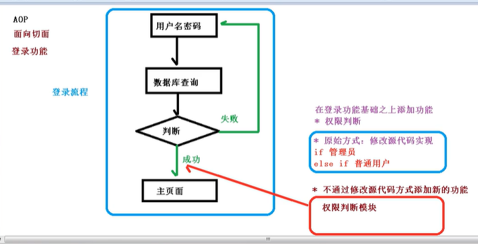

### AOP底层原理

1、aop底层使用动态代理

​	第一种情况有接口的情况：使用JDK动态代理

​	----创建接口实现类代理对象，增强类的方法

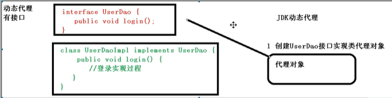

​	第二种情况没有接口的情况：使用CGLIB动态代理

​	----创建子类的代理对象，增强类的方法

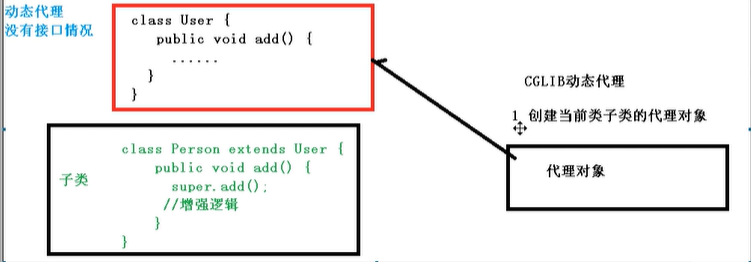


**JDK的动态代理，使用Proxy类里面的方法创建代理对象**

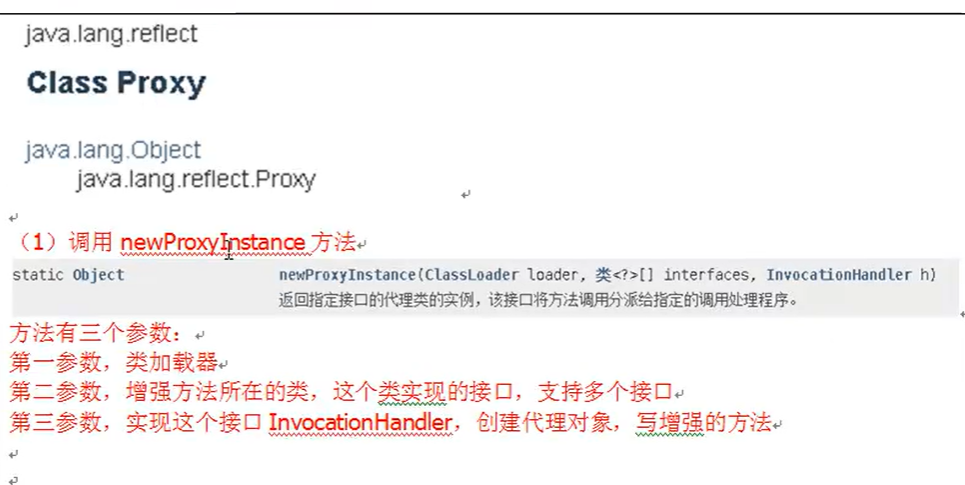

1、创建实现类和接口

2、使用Proxy类创建接口的代理对象

```java
package com.kjq.spring5.dao;
public interface UserDao {
    public int add(int a, int b);
    public String update(String id);
}

package com.kjq.spring5.dao.impl;
import com.kjq.spring5.dao.UserDao;
public class UserDaoImpl implements UserDao {
    @Override
    public int add(int a, int b) {
        System.out.println("add方法执行了");
        return a+b;
    }
    @Override
    public String update(String id) {
        return id;
    }
}
```

```java
package com.kjq.spring5.dao.impl;

import com.kjq.spring5.dao.UserDao;

import java.lang.reflect.InvocationHandler;
import java.lang.reflect.Method;
import java.lang.reflect.Proxy;
import java.util.Arrays;

public class JDKProxy {
    public static void main(String[] args) {
        //创建接口的实现代理对象
        Class[] interfaces = {UserDao.class};
        UserDaoImpl userDao = new UserDaoImpl();
        UserDao dao = (UserDao) Proxy.newProxyInstance(JDKProxy.class.getClassLoader(), interfaces, new UserDaoProxy(userDao));
        System.out.println(dao.add(3, 5));
    }
}

//创建代理对象代码
class UserDaoProxy implements InvocationHandler {
    //1创建的是谁的代理对象，把谁传递过来
    //有参数构造器传递
    private Object obj;
    public UserDaoProxy(Object obj) {
        this.obj = obj;
    }

    //增强的逻辑
    @Override
    public Object invoke(Object proxy, Method method, Object[] args) throws Throwable {
        //方法之前做一个处理
        System.out.println("方法之前执行。。。"+method.getName()+"参数："+ Arrays.toString(args));

        Object res = method.invoke(obj, args);

        //方法之后做一个处理
        System.out.println("在方法之后执行");
        return res;
    }
}
```

**AOP术语**

1、连接点：哪些方法可以被增强，哪这些方法就称为连接点

2、切入点：**实际被增强的方法**就称为切入点

3、通知：**实际增强的逻辑**部分叫做通知

​	前置通知：在方法之前执行

​	后置通知：在方法之后执行

​	环绕通知：在方法的前后都可以被执行

​	异常通知：当执行的方法发生异常的时候会执行

​	最终通知：不管方法有没有异常都会执行

4、切面：是一个动作，把通知应用到切入点的过程

### AspectJ

1、spring框架一般都是基于AspectJ实现AOP操作

​	什么是AspectJ

​	AspectJ不是spring组成部分，独立AOP框架，一般把AspectJ和spirng框架一起使用，进行AOP操作

2、基于xml配置文件实现AOP。

​	基于注解的方式实现AOP（常用）。

3、先引入依赖

```xml
<dependency>
  <groupId>org.springframework</groupId>
  <artifactId>spring-aspects</artifactId>
  <version>5.2.5.RELEASE</version>
</dependency>
```

4、切入点表达式

​	作用：知道对那个类里面的哪个方法进行增强

​	语法结构：execution([权限修饰符] [返回值类型] [类的全路径* ] [方法名称* ] ([参数列表]))


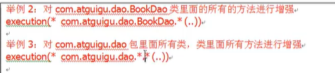

### 使用注解

1、创建一个类，定义一个方法，对方法进行增强功能

```java
package com.kjq.spring5.aopanno;
//被增强的类
public class User {
    public void add() {
        System.out.println("user的add");
    }
}
```

2、增强的一个类

```java
package com.kjq.spring5.aopanno;
//增强的类
public class UserProxy {
    //前置通知
    public void before() {
        System.out.println("UserProxy的before方法");
    }
}
```

3、进行通知配置

​	在spring配置文件中，开启注解扫描（可以是配置文件，也可以是配置类）

​	使用注解创建User和UserProxy对象

​	在增强类上加上一个注解@Aspect

​	在spring配置文件中开启生成代理对象

​	配置不同类型的通知

​		在增强类的里面，在作为通知方法上面添加通知类型注解，使用切入点表达式配置

```java
package com.kjq.spring5.aopanno;
import org.aspectj.lang.annotation.Before;
import org.springframework.stereotype.Component;
//被增强的类
@Component
public class User {
    public void add() {
        System.out.println("user的add");
    }
}
```

```java
package com.kjq.spring5.aopanno;
import org.aspectj.lang.annotation.Aspect;
import org.aspectj.lang.annotation.Before;
import org.springframework.stereotype.Component;
//增强的类
@Component
@Aspect//生成代理对象
public class UserProxy {
    //相同的切入点进行提取
    @Pointcut(value = "execution(* com.kjq.spring5.aopanno.User.add(..))")
    public void pointcut() {}
    //前置通知
    @Before(value = "pointcut()")
    //前置通知
    public void before() {
        System.out.println("UserProxy的before方法");
    }
    //后置通知
    @After(value = "execution(* com.kjq.spring5.aopanno.User.add(..))")
    public void after() {
        System.out.println("after方法");
    }
    //不管有没有异常都执行此方法
    @AfterReturning(value = "execution(* com.kjq.spring5.aopanno.User.add(..))")
    public void afterReturning() {
        System.out.println("afterReturning方法");
    }
    //异常通知
    @AfterThrowing(value = "execution(* com.kjq.spring5.aopanno.User.add(..))")
    public void afterThrowing() {
        System.out.println("afterThrowing方法");
    }
    //环绕通知
    @Around(value = "execution(* com.kjq.spring5.aopanno.User.add(..))")
    public void around(ProceedingJoinPoint proceedingJoinPoint) {
        System.out.println("around方法");
        try {
            //执行目标方法
            proceedingJoinPoint.proceed();
        } catch (Throwable e) {
            e.printStackTrace();
        }
    }
}
```

```xml
<?xml version="1.0" encoding="UTF-8"?>
<beans xmlns="http://www.springframework.org/schema/beans"
       xmlns:context="http://www.springframework.org/schema/context"
       xmlns:aop="http://www.springframework.org/schema/aop"
       xmlns:xsi="http://www.w3.org/2001/XMLSchema-instance"
       xsi:schemaLocation="http://www.springframework.org/schema/beans http://www.springframework.org/schema/beans/spring-beans.xsd
                           http://www.springframework.org/schema/context http://www.springframework.org/schema/context/spring-context.xsd
                           http://www.springframework.org/schema/aop http://www.springframework.org/schema/aop/spring-aop.xsd">
    <!--开启注解的扫描-->
    <context:component-scan base-package="com.kjq.spring5.aopanno">
    </context:component-scan>
    <!--开启Aspectj生成代理对象，在类中进行扫描。只要有@Aspect就让他变成代理对象-->
    <aop:aspectj-autoproxy></aop:aspectj-autoproxy>
</beans>
```

```java
//测试
public void test01() {
    ApplicationContext context = new ClassPathXmlApplicationContext("bean1.xml");
    User user = context.getBean("user", User.class);
    user.add();
}
```


可以对相同的切入点进行提取

```java
//相同的切入点进行提取
    @Pointcut(value = "execution(* com.kjq.spring5.aopanno.User.add(..))")
    public void pointcut() {}
    //前置通知
    @Before(value = "pointcut()")
```


多个增强类对同一个方法进行增强，设置类的优先级

​	1、可以在增强类上面添加注解@Order(数字类型值)，数字越小，优先级越高


### 使用配置文件

1、创建两个类，创建方法

2、在spring配置文件中创建两个类的对象

3、在spring配置文件中配置切入点

```java
package com.kjq.spring5.aopxml;
public class Book {
    public void buy() {
        System.out.println("buy");
    }
}
```

```java
package com.kjq.spring5.aopxml;
public class BookProxy {
    public void before() {
        System.out.println("before");
    }
}
```

```xml
<!--先创建两个对象-->
<bean id="book" class="com.kjq.spring5.aopxml.Book">
</bean>
<bean id="bookProxy" class="com.kjq.spring5.aopxml.BookProxy">
</bean>
<!--配置aop增强-->
<aop:config>
    <!--切入点-->
    <aop:pointcut id="p" expression="execution(* com.kjq.spring5.aopxml.Book.buy(..))"/>
    <!--配置切面-->
    <aop:aspect ref="bookProxy">
        <!--增强作用在自己的方法上method属性表示增强的方法-->
        <aop:before method="before" pointcut-ref="p"/>
    </aop:aspect>
</aop:config>
```

```java
@Test
//测试
public void test02() {
    ApplicationContext context = new ClassPathXmlApplicationContext("bean2.xml");
    Book book = context.getBean("book", Book.class);
    book.buy();
}
```

## 事务管理

---

ACID

​	1、原子性：要么都成功，要么都失败

​	2、一致性：操作之前和操作之后总量是不变的

​	3、隔离性：多事务操作互不影响

​	4、持久性：表中数据发生变化

### spring事务管理

1.建议把事务加载service层上

2.在spring进行事务管理

​	两种方式：编程式事务管理和声明式事务管理（一般使用声明式事务管理）

3.声明式事务管理

​	基于注解方式（一般使用注解的方式）

​	基于xml配置文件方式

4.在spring进行声明式事务管理。底层使用AOP原理

5.spring事务管理API

​	提供一个（事务管理器）接口（PlatformTransactionManager，整合mybatis框架的实现类是DataSourceTransactionManager），代表事务管理器，这个接口针对不同的框架提供了不同的实现类

**事务的操作**

1.在spring配置文件配置事务管理器

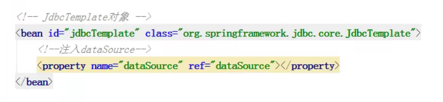

2.在spring配置文件，开启事务的注解

​	在spring配置文件引入名称空间tx

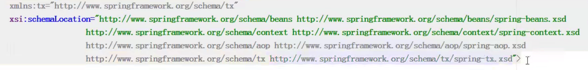

​	开启事务的注解


3.在service类上面（获取service类上面方法上面）添加事务的注解

​	@Transactional，这个注解可以加载类上也可以家在方法上

​	如果把这个注解添加到类上，这个类里面的所有方法都添加事务

​	如果把这个注解添加到方法上，这个方法就添加事务

**@Transactional参数的配置**

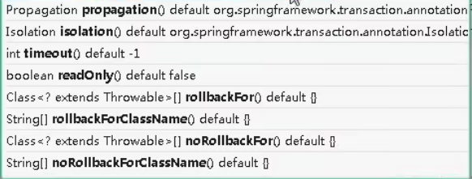

1.propagation：事务的传播行为

​	多事务方法直接进行调用，这个过程中事务是如何进行管理的(默认不写就是REQUIRED)

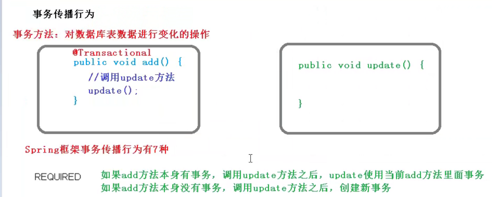


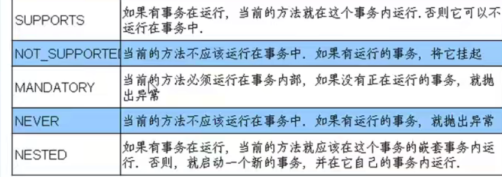

2.isolation：隔离界别(默认值是)

事务在多事务操作之间不会产生影响

三种问题：脏读，不可重复读，幻读

​	脏读：一个未提交的事务读到另一个未提交事务变化的数据（另一个事务可能发生回滚），（两个事务都去操作这个数据）

​	不可重复读：一个未提交事务读取到另一提交事务修改数据（在另一个事务提交前后读取两次，两次读取的数据不一样），（两个事务都去操作这个数据）

​	幻读：一个未提交事务读取到另一提交事务添加一条数据

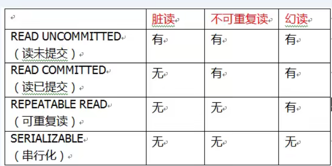

3.timeout：超时时间

事务需要在一定的时间内提交，如果不提交进行回滚

默认是-1，不超时。设置时间以秒为单位

4.readOnly：是否只读

默认值是false，表示可以增删改查

5.rollbackFor：回滚

设置出现那些异常进行回滚

6.onrollbackFor：不回滚

设置出现那些异常不进行回滚

## Spring5的新特性

---

1、整个框架基于java8，运行的时候兼容jdk9.许多不建议使用的类和方法在代码库中删除了

2、spring5.0框架自带了通用的日志封装，也可以整合其他日志

​	spring5已经移除了Log4JConfigListener，官方建议使用Log4J2

### 整合Log4j2的日志

引入jar包

创建log4j2.xml配置文件

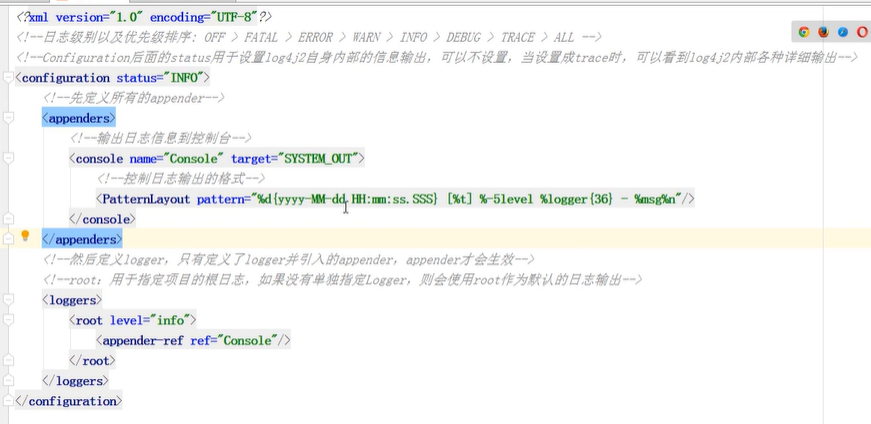

```xml
<?xml version="1.0" encoding="UTF-8" ?>
<configuration status="INFO">
    <appenders>
        <console name="Console" target="SYSTEM_OUT">
            <PatternLayout pattern="%d{yyyy-MM-dd HH:mm:ss.SSS} [%t] %-5level %logger{36} - %msg%n"/>
        </console>
    </appenders>
    <loggers>
        <root level="info">
            <appender-ref ref="Console"/>
        </root>
    </loggers>
</configuration>
```

### Nullable注解和函数式对象

spring框架核心容器支持@Nullable注解

​	@Nullable注解可以使用在方法上面，属性上面，表示方法返回值可以为空，属性值可以为空，参数值可以为空


spring5核心容器支持函数式风格GenericApplicationContext

```java
public class User1 {
    @Test
    public void test01() {
        //创建GenericApplicationContext对象
        GenericApplicationContext context = new GenericApplicationContext();
        //调用context的方法对象注册
        context.refresh();
        context.registerBean(User.class, () -> new User());
        //获取在spring中的对象
        User user = (User) context.getBean("com.kjq.spring4.User");
        System.out.println(user);
    }
}
```

### spring支持整合JUnit5

整合JUnit4

```xml
<dependency>
  <groupId>org.springframework</groupId>
  <artifactId>spring-test</artifactId>
  <version>5.3.14</version>
</dependency>
```

```java
package com.kjq.spring4;

import org.junit.Test;
import org.junit.runner.RunWith;
import org.springframework.beans.factory.annotation.Autowired;
import org.springframework.test.context.ContextConfiguration;
import org.springframework.test.context.junit4.SpringJUnit4ClassRunner;
@RunWith(SpringJUnit4ClassRunner.class)
@ContextConfiguration("classpath:bean1.xml")//加载配置文件
public class JTest4 {
    @Autowired
    private User user;
    @Test
    public void test01() {
        System.out.println(user);
    }
}
```
