## 实用篇

### 微服务治理

#### 认识微服务

微服务落地技术springcloud和阿里巴巴dubbo。

单体架构：架构简单，部署成本低，耦合度高。

分布式架构：耦合低。


分布式需要考虑的问题

1. 服务拆分粒度如何
2. 服务集群地址如何维护
3. 服务之间如何实现远程调用
4. 服务健康状态如何感知

微服务是良好的架构设计的分布式架构方案，微服务架构特征

1. 单一职责：微服务拆分粒度小，每个服务对应唯一业务能力
2. 面向服务：微服务对外暴露接口。
3. 自治：团队独立，技术独立，数据独立，部署独立。
4. 隔离性强：服务调用做好隔离，容错，降级，避免出现联机问题。


springcloud和springboot版本对应关系


#### 服务拆分和RestTemplate远程调用

> 服务拆分的案例


1. 微服务根据业务模块拆分，做到单一职责，不要重复开发相同业务
2. 微服务可以将业务暴露为接口，供其他微服务使用
3. 不同微服务都因该有自己独立的数据库


>远程调用，根据订单id查询订单同时，把订单所属的用户信息查询出来

从订单向用户发送远程调用，在java代码中发送http请求，注册RestTemplate，在配置类注入也行。


```java
public Order queryOrderById(Long orderId) {
        // 1.查询订单
        Order order = orderMapper.findById(orderId);
        // 2.根据userId发送http请求
        // 2.1url路径
        String url = "http://localhost:8081/user/" + order.getUserId();
        // 2.2发送http请求
        User user = restTemplate.getForObject(url, User.class);
        // 2.3封装user
        order.setUser(user);
        // 4.返回
        return order;
}
```


消费者和提供者：一个服务既可以是消费者又可以是提供者。

#### Eureka注册中心

>问题


EurekaServer：服务端，注册中心

EurekaClient：客户端

- Provider：服务提供者，如user-service。1.注册自己的信息到EurekaServer。2.每隔30秒向EurekaServer发哦是那个心跳
- consumer：服务消费者，如order-service。1.根据服务名称从EurekaServer拉去服务列表。2.基于服务列表做负载均衡，选中一个做远程调用。


>动手实践：搭建注册中心->服务注册->服务发现

- 搭建注册中心：需要创建一个新的服务


- 服务注册


- 服务发现

服务拉取是基于服务名称获取服务列表，然后根据负载均衡


#### Ribbon负载均衡

>执行流程


默认是轮询机制。第二种方案是针对某台服务配置的规则


>优化第一次访问时间


#### Nacos注册中心

Nacos注册中心相比Eureka注册中心功能更加丰富，国内受欢迎程度高

安装https://github.com/alibaba/nacos/releases

下载后解压。nacos默认端口是8848

startup.cmd -m standalone

访问：http://192.168.0.102:8848/nacos/index.html

账号：nacos。密码：nacos


>快速入门

- 服务注册到Nacos


>nacos服务分级存储模型，nacos多分了一层集群属性，表示每个地域一个集群。


服务调用尽可能选择本地集群的服务，跨集群调用延迟较高。本地集群不可访问时，再去访问其他集群。配置集群只需要加入如下配置。

```yaml
cloud:
    nacos:
      server-addr: localhost:8848 # nacos 服务端口
      discovery:
        cluster-name: HZ #HZ表示杭州集群
```


>nacosRole负载均衡

```yaml
#配置访问userservice服务时，默认先访问同集群的。再本地随机访问
userservice:
  ribbon:
    NFLoadBalancerRuleClassName: com.alibaba.cloud.nacos.ribbon.NacosRule
```


> 服务器权重设置，好的服务器承担更多请求。不好的服务器承担少的请求。调成0不会被访问。


> **环境隔离**

1. namespace用来做环境隔离
2. 每个namespace都有唯一id
3. 不同namespace下的服务不可见
4. 环境隔离主要用于开发环境，生产环境的隔离。


> eureka注册中心和nacos注册中心区别


eureka：没有临时实例与非临时实例之分。

nacos：临时实例与eureka一样，没有变化。

非临时实例：注册中心会主动询问实例是否挂掉(不会做心跳推送)，如果挂掉nacos不会剔除实例，只是标记为不可用。nacos会主动推送服务变化(消费者拉取和推送两者结合)，让消费者缓存能够及时更新。


#### Nacos配置管理

- 配置的热更新：服务不用重启，配置文件立即生效。

添加配置：nacos面板的配置管理->配置列表->添加一个配置文件


- 配置获取的步骤，因为在访问application.yml文件之前需要先知道nacos的地址，而application.yml中又配置了nacos的地址，所以nacos地址不能放到application.yml中。需要提前到bootstrap.yml中


> 使用nacos配置文件


name，active，file-extension决定了配置文件名字

测试：


> 添加热更新，微服务无需重启就可以感知。可以通过以下两种方式

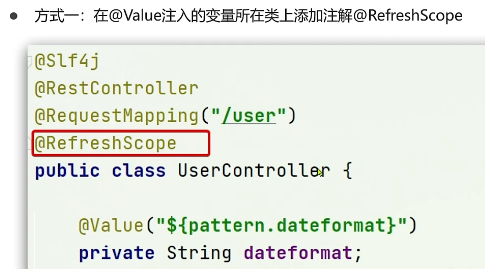


> 多环境配置共享


多种配置的优先级：服务名-dev.yaml > 服务名称.yaml > 本地配置。

微服务会从nacos读取的配置文件，服务名-dev.yaml和服务名.yaml

#### Nacos集群搭建


1. 搭建数据库，初始化数据库表结构
2. 下载nacos安装包
3. 配置nacos
4. 启动nacos集群
5. nginx反向代理

#### Feign远程调用

RestTemplate：代码可读性差，变成体验不统一。参数复杂URL难以维护。

Feign：是一个声明式的http客户端(类似于生命式事务)，内部自动实现负载均衡，因为feign集成了ribbon。


> Feign的使用


> feign自定义配置


> Feign性能优化


使用Apache HttpClient


> Feign的最佳使用方式：第一种方式耦合度高。第二种方式服务可能会应用多余的接口。


> 方式二的最佳实践

定义的FeignClient不在SpringBootApplication的扫描包范围，这些FeignClient无法使用。推荐使用第二个，用哪个加载那个


#### Gateway服务网关

> 为什么使用网关

- 身份认证和权限校验
- 服务路由、负载均衡
- 请求限流


Zuul是基于Servlet的实现，属于阻塞式编程。而SpringCloudGateway基于Spring5中提供的WebFlux，属于响应式编程的实现，性能更好。


> 网关服务的搭建


- 书写启动类


执行流程


> 路由断言工厂


```yaml
redicates:
  - Path=/order/**
  # 2031年后，亚洲上海访问
  - After=2031-04-13T15:14:47.433+08:00[Asia/Shanghai]
```


> 路由过滤器，可以对进入网关的请求和微服务返回的响应做处理


```yaml
spring:
  application:
    gateway:
      routes:
        - id: user-service 
          filters: # 添加过滤器
            - AddRequestHeader=Truth,Itcast is freaking aowsome! #添加请求头信息
            
spring:
  application:
    gateway:
      default-filters: # 默认过滤器，会对所有路由生效
     	- AddRequestHeader=Truth,Itcast is freaking aowsome! #添加请求头信息
```


> 全局过滤器添加过滤器方式，GlobalFilter全局过滤器。拦截用户判断身份等方式。


比如判断用户身份的过滤器，判断是否有authorization = admin，如果有放行，否则拦截。

```java
//过滤器越小越先执行
@Order(0)
@Component
public class AuthorizeFilter implements GlobalFilter {
    @Override
    public Mono<Void> filter(ServerWebExchange exchange, GatewayFilterChain chain) {
        //1.获取请求参数
        ServerHttpRequest request = exchange.getRequest();
        MultiValueMap<String, String> queryParams = request.getQueryParams();

        //2.获取参数中的authorization
        String authorization = queryParams.getFirst("authorization");
        //3.获取参数值是否是admin
        if ("admin".equals(authorization)) {
            //4.是，放行
            return chain.filter(exchange);
        }
        //5.否，拦截
        //5.1设置状态码
        exchange.getResponse().setStatusCode(HttpStatus.UNAUTHORIZED);
        return exchange.getResponse().setComplete();
    }
}
```


> 路由执行循序


请求路由后，会将当前路由过滤器和DefaultFilter、GlobalFilter，合并到一个过滤器集合中，排序一次执行过滤器。


> 跨域问题处理

CORS：浏览器会问服务器是否让跨域，跨域配置如下

```yaml
spring:
    gateway:
      globalcors:
        add-to-simple-url-handler-mapping: true #浏览器会问服务器是否允许跨域。浏览器询问请求不做拦截
        corsConfigurations:
          '[/**]': # 拦截一切请求
            allowedOrigins: # 允许哪些静态页面网站的跨域请求
              - "http://localhost:58316"
            allowedMethods: # 允许的跨域ajax的请求方式
              - "GET"
              - "POST"
              - "DELETE"
              - "PUT"
              - "OPTIONS"
            allowedHeaders: "*" # 允许在请求中携带头信息
            allowCredentials: true # 是否允许系带cookie
            maxAge: 360000 # 这次跨域检测的有效期秒
```

### SpringCloudAlibaba

单体架构


垂直架构


分布式架构


SOA架构


微服务架构


Sentinel服务容错、nacos、rocketMQ、seata分布式事务

#### 微服务环境搭建

#### 服务治理

#### 服务容错

#### 服务网关

#### 链路追踪

#### 消息驱动

#### 短信服务

#### 服务配置

#### 分布式事务

### Docker

docker Desktop可视化工具

#### 初始Docker

docker作用就是把运行环境和linux函数库和程序一起打包成镜像，方便迁移各种环境。


> 镜像和容器

- 镜像：Docker将应用程序及其所需的依赖、函数库、环境、配置等文件打包在一起，称为镜像。
- 容器：镜像中的应用程序运行后形成的进程就是容器，只是Docker会给容器做隔离，对外不可见


DockerHub是一个Docker镜像的托管平台。


> 安装docker分为ce和ee两大版本，ce是社区免费的。

```shell
# 安装需要的软件包
yum install -y yum-utils device-mapper-persistent-data lvm2
# 在contos安装docker，设置docker镜像源
yum-config-manager \
	--add-repo \
	https://mirrors.aliyun.com/docker-ce/linux/centos/docker-ce.repo

sed -i 's/download.docker.com/mirrors.aliyun.com\/docker-ce/g'
/etc/yum.repos.d/docker-ce.repo

yum makecache fast

# 安装docker 
yum install -y docker-ce

# 注意开放docker防火墙

# 启动docker
systemctl start docker
# 查看启动状态
systemctl status docker
# 停止
systemctl stop docker
# 重启
systemctl restart docker

#设置国内的镜像加速
sudo mkdir -p /etc/docker

sudo tee /etc/docker/daemon.json <<='EOF'
{
	"registry-mirrors": ["https://n0dwemtq.mirror.aliyuncs.com"]
}
EOF

sudo systemctl daemon-reload

sudo systemctl restart docker
```

#### Docker的基本操作

```docker
docker images --helo # 查看帮助文档
```

> 镜像操作

镜像命名规范：[repository]:[tag]。如mysql:5.7


```shell
docker pull nginx # 拉取镜像
docker images #查看镜像
docker save -o nginx.tar nginx:latest # 把镜像导出为压缩包。
docker rmi nginx:latest #删除镜像
docker load -i nginx.tar #读取压缩包内的镜像
```


> 容器相关操作


```shell
# -d 表示后台运行，containerName给容器起一个名字
# 端口映射访问宿主机端口就访问量容器端口
docker run --name containerName -p 宿主机端口:容器内端口 -d 镜像名称。

#查看容器，默认查看运行中的容器。-a表示查看所有
docker ps -a
#查看日志，-f表示实时监控日志
docker logs -f myn
#修改容器内部的文件，如配置文件等信息。虽然进入容器能修改，但是不推荐。
#1.docker exec：进入容器内部，执行命令。
#2.-it：给当前进入的容器创建一个标准输入、输出终端，允许我们与容器交互
#3.mn：进入容器的名称
#4.bash：进入容器后执行的命令，bash是一个linux终端命令
docker exec -it myn bash
#进入index.html文件夹
cd /etc/share/nginx/html
#修改index.html的内容
sed -i 's#Welcome to nginx!#hello word#g' index.html
#退出容器
exit
#停止nginx容器
docker stop myn
#删除容器， -f可删除运行中的容器
docker rm -f myn
```


> 数据卷：容器和数据耦合的问题，把容器和数据分离方便管理


```shell
#创建数据卷
docker volume create html
#查看数据卷的列表
docker volume ls
#查看数据卷的详情信息
docker volume inspect html
#删除未使用的数据卷
docker volume prune
#删除指定的数据卷
docker volume rm html
```


> 数据卷挂载到容器当中

创建nginx容器，修改容器内的html目录内的index.html内容

```shell
# html 卷名称后面跟容器内的html存放地址。如果数据卷不存在docker会自动创建数据卷。
docker run --name mn -p 81:80 -v html:/usr/share/nginx/html -d nginx。

# 宿主机/var/lib/docker/volumes/html/_data到/usr/share/nginx/html的映射
```


> 将宿主机目录挂载到容器目录里

```shell
docker run \
 --name mysql \
 -e MYSQL_ROOT_PASSWORD=123 \
 -p 3306:3306 \
 -v /tmp/mysql/conf/hmy.cnf:/etc/mysql/conf.d/hmy.cnf \
 -v /tmp/mysql/data:/var/lib/mysql \
 -d \
 mysql:5.7.25
```


数据卷挂载和直接挂载对比


#### Dockerfile自定义镜像


自定义一个jar项目的镜像

创建一个目录，里面放置docker-demo.jar、Dockerfile，jdk8.tar.gz

```shell
# .表示Dockerfile所在的目录
docker build -t javaweb:1.0 .
```


#### Docker-Compost容器编排技术

Compost文件：就是把创建容器和构建指令改成命令的形式构建。


#### Docker镜像服务

> 创建镜像仓库

> Docker官方的Docker Registry是一个基础版本的Docker镜像仓库，具备仓库管理的完整功能，但是没有图像化界面。

```shell
docker run -d \
	--restart=always \
	--name registry \
	-p 5000:5000 \
	-v registry-data:/var/lib/registry \
	registry
```


> 有图型化界面的的私有仓库，使用DockerCompose部署带有图形化界面的DockerRegistry


### 异步通信

#### 初始MQ

> 同步的问题：1.耦合度高。2.性能下降。3.资源浪费。4.级联失败。


> 异步调用


> 什么是MQ

MQ，中文名消息队列，字面来看就是存放消息的队列。也就是事件驱动架构中的broker


#### RabbitMQ快速入门

下载

docker pull rabbitmq:3-management

安装镜像

```sh
docker run \
	-e RABBITMQ_DEFAULT_USER=itcast \
	-e RABBITMQ_DEFAULT_PASS=123321 \
	--name mq \
	--hostname mq1 \
	# 管理平台的端口
	-p 15672:15672 \
	# 应用程序的端口
	-p 5672:5672 \
	# 后台运行
	-d \
	rabbitmq:3-management
```


> 官方给出五种MQ的Demo示例


1.基本消息队列

```shell
#发送消息
1.建立connection
2.创建channel
3.利用channel声明队列
4.利用channel向队列发送消息
#接收消息
1.建立connection
2.创建channel
3.利用channel声明队列
4.定义consumer的消费行为handleDelivery()
5.利用channel将消费者与队列绑定
```

#### SpringAMQP

AMQP消息队列的规范，SpringAMQP是spring是基于AMQP协议定义的一套API规范。


> 基本消息队列，使用流程

1.在父工程中引入spring-amqp的依赖。


2.在publisher服务中利用RabbitTemplate发送消息到simple.queue这个队列。


3.在consumer服务中编写消费逻辑，绑定simple.queue这个队列。


> 工作消息队列，提高消息的速度，避免消息的堆积。

1.在publisher服务中定义测试方法，每秒产生50条消息，发送到simple.queue。

2.在consumer服务中定义两个消息监听者，都能监听simple.queue队列。

3.消费者1每秒处理50条消息，消费者2每秒处理10条消息。


> Fanout广播发布订阅

Exchange会将接收到的消息路由到每一个跟其绑定的queue


1.在consumer服务中，利用代码声明队列、交换机、并将两者绑定

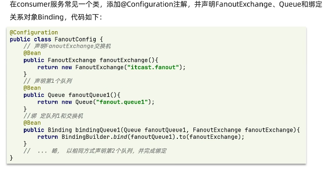

2.在consumer服务中，编写两个消费者方法，分别监听fanout.queue1和fanout.queue2

3.在publicsher中编写测试方法，向itcast.fanout发送消息

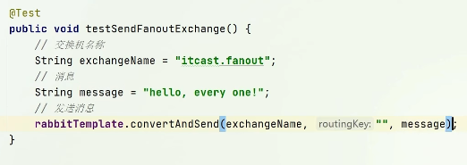

> Direct路由发布订阅

Exchange会将接收到的消息根据规则路由到指定的Queue，因此称为路由模式。


1.绑定关系利用@RabbitListener注解声明路由，队列和key

2.在consumer服务中，编写两个消费者方法，分别监听direct.queue1和direct.queue2


3.在publisher中编写测试方法，向itcast.dirct发送消息


> Topic话题发布订阅

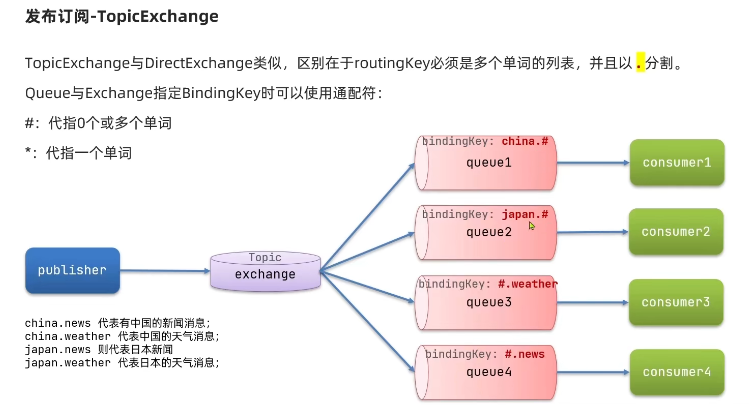


> 消息转换器


推荐使用json序列化，数据体积更小。

- 发送json数据。

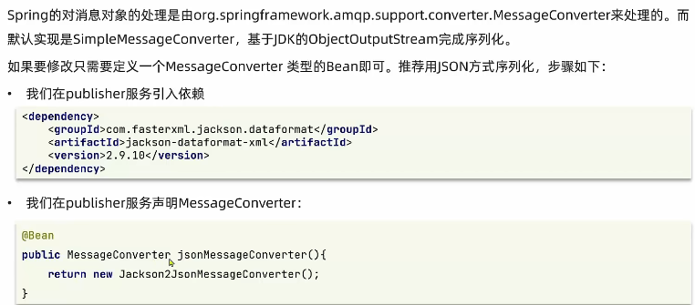

- 接收json数据。


### 分布式搜索

#### 初识elasticsearch

- elasticsearch是一款非常强大的开源搜索引擎，可以帮助我们从海量数据中快速找到需要的内容。
- elasticsearch结合kibana、Logstash、Beats，也是elastic stack（ELK）。被广泛应用在日志数据分析、实时监控领域。


> 正向索引与倒排索引区别


> elasticsearch与mysql对比


> 安装es

```shell
#因为需要部署kibana容器，因此需要让es和kibana容器互联。先创建一个网络
docker network create es-net
#拉取镜像
docker pull elasticsearch:7.12.1
docker pull kibana:7.12.1

#运行es
docker run -d \
--name es \
-e "ES_JAVA_OPTS=-Xmx512m -Xmx512m" \
-e "discovery.type=single-node" \
-v es-data:/usr/share/elasticsearch/data \
-v es-plugins:/usr/share/elasticsearch/plugins \
--privileged \
--network es-net \
#暴露的http端口，让用户访问
-p 9200:9200 \
#es互联的端口
-p 9300:9300 \
elasticsearch:7.12.1

#运行kibana
docker run -d \
--name kibana \
#设置es的端口
-e ELASTICSEARCH_HOSTS=http://es:9200 \
#和es在同一个网络
--network=es-net \
-p 5601:5601 \
kibana:7.12.1
```


> es中的分词

```shell
#es在搜索时需要对用户输入的内容分词。但是默认的分词规则对中文不友好。
POST /_analyze
{
	"analyzer": "standard", #分词器
	"text": "黑马程序员学习java太棒了！"
}

#一般中文分词器使用IK分词器。进入容器
docker exec -it elasticsearch /bin/bash
#在线下载并安装
./bin/elasticsearch-plugin install https://github.com/medc1/elasticsearch-analysis-ik/releases/download/v7.12.1/elasticsearch-analysis-ik-7.12.1.zip
#退出
exit
#重启
docker restart elasticsearch

#ik_smart:最少切分。ik_max_word:最细切分。
POST /_analyze
{
	"analyzer": "ik_smart", #分词器
	"text": "黑马程序员学习java太棒了！"
}
```


> ik分词器的扩展，需要新建ext.dic和stopword.dic


#### 索引库操作

索引库->数据库中的表


> mapping对索引库中文档的约束，常见的mapping属性包括：


> 索引库的增删改查

```shell
#获取
GET /heima
#删除
DELETE /heima
#索引库是不允许修改的，但是可以添加新字段
PUT /heima/_mapping
{
	"properties":{
		"新字段名":{
			"type":"integer"
		}
	}
}
```


#### 文档操作

```json
// 新增数据
POST /索引库名/_doc/文档id
{
    "字段1": "值1",
    "字段2": "值2",
    "字段3": {
        "子属性1": "值3"
    }
}
//查询
GET /索引库名/_doc/文档id
//删除
DELETE /索引库名/_doc/文档id
```


#### RestAPI

RestClient组装es的语句发送http请求，获取数据

> springboot操作索引库


把多个字段拷贝一个字段进行分词，提高效率。


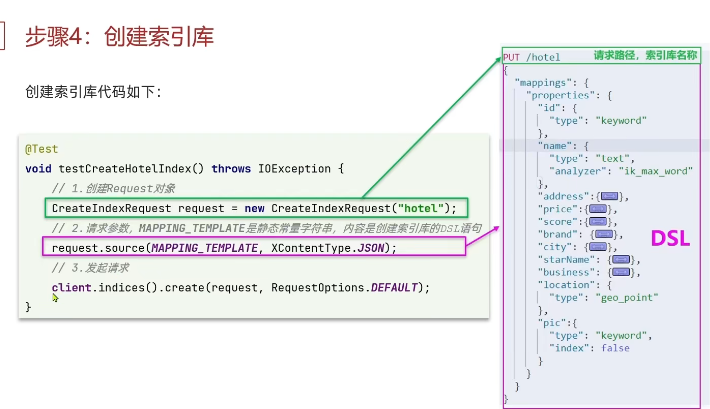


> 文档操作


添加数据


查询信息

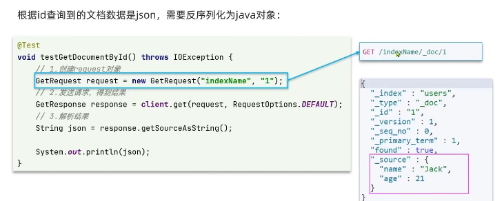

修改文档


删除文档


批量插入数据


#### 搜索文档


查询所有


全文检索

```json
//match查询
GET /indexName/_search{
    "query":{
        "match":{
            "FIELD":"TEXT"
        }
    }
}

GET /hotel/_search{
    "query":{
        "match":{
            //all字段是把："brand", "name", "business"拷贝进去了。
            "all":"外滩如家"
        }
    }
}

//multi_match查询
GET /hotel/_search{
    "query":{
        "multi_match":{
            "query":"外滩如家",
            //根据多字段查询
            "fields": ["brand", "name", "business"]
        }
    }
}
```

精确查询，分为精确查询term和范围查询range

```json
//term查询
GET /hotel/_search{
    "query":{
        "term":{
            //字段名
            "city":{
                "value":"上海"
            }
        }
    }
}
//range查询
GET /hotel/_search{
    "query":{
        "range":{
            //字段名
            "price":{
                //gte是大于等于，gt大于
                "gte":100,
                "lte":300
            }
        }
    }
}
```

地理查询，搜索附近的酒店，搜索附近的出租车，搜索附近的人。

```json
//搜索一定范围内的所有信息
GET /hotel/_search{
    "query":{
        "geo_bounding_box":{
            //查询geo_point值落在矩形范围内所有文档
            "FIELD":{
                "top_left":{
                    "lat":31.1,
                    "lon":121.7
                },
                "bottom_right":{
                    "lat":30.9,
                    "lon":121.7
                }
            }
        }
    }
}

//根据中心点查询
GET /indexName/_search{
    "query":{
        "geo_distance":{
            "distance":"15km",
            "FIELD":"31.21, 121.5"
        }
    }
}
```

复合查询


把多个查询子句的组合。子查询的组合方式有：

1. must：必须匹配每个子查询，类似“与”。
2. should：选择性匹配子查询，类似“或”。
3. must_not：必须不匹配，不参与算分，类似“非”。
4. filter：必须匹配，不参与算分。


#### 搜索结果处理

> 排序

es支持结果排序，默认是根据相关度算分_score来排序。可以排序字段类型有：keyword、数值类型、地理坐标、日期。


> 分页

```json
//这样有问题，es会把所有数据查出然后排序，再从990-1000截取，内存消耗非常巨大。
GET /hotel/_search{
    "query":{
        "match_all":{}
    },
    "from":990,//分页开始的位置，默认值为0
    "size":10,//期望获取的文档总数
    "sort":[
        {"price":"asc"}
    ]
}
```

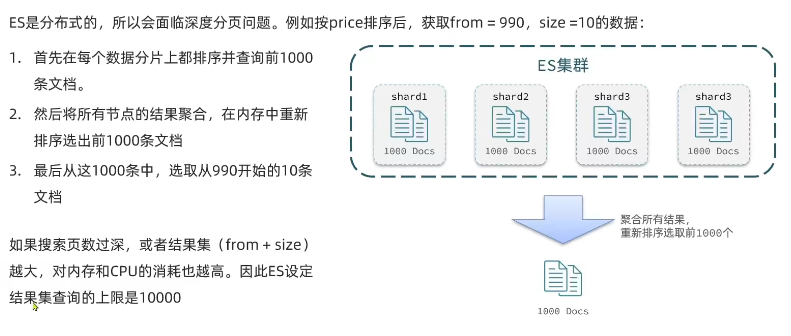


> 高亮


es返回结果时给关键字添加em标签


```json
GET /hotel/_search{
    "query":{
        "match":{
            "all":"儒家"
        }
    },
    "highlight":{
        "fields":{
            "name":{
                //是否字段匹配，高亮字段name与搜索字段匹配all
                "require_field_match":"true"
            }
        }
    }
}
```


#### RestClient查询文档

快速入门


> 全文检索match和multi_match查询。


> 精确查询


> 复合查询


> 排序和分页


> 高亮


#### 数据聚合

类似于mysql的聚合函数


> 桶聚合

按字段聚合


聚合后排序

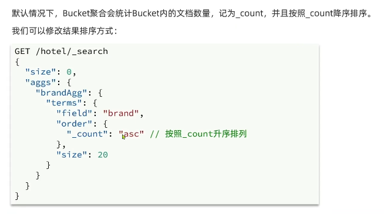

聚合前限定范围


> 度量聚合


> RestClient聚合实现


#### 自动补全


#### 数据同步

mysql数据发生变化，elasticsearch也跟着变化。

1. 同步调用，数据耦合，业务耦合。


2. 异步通知，解决了业务耦合。


3. 监听binlog，完全解耦。但是需要学习新的中间件canal，提高了mysql的压力。


#### 集群

为了解决海量数据存储和单点故障问题。


## 高级篇

### 微服务保护

JMeter模拟并发访问

#### 初识Sentinel

> 雪崩问题

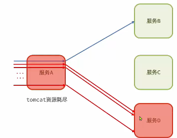


预防雪崩


> 服务保护组件Sentinel

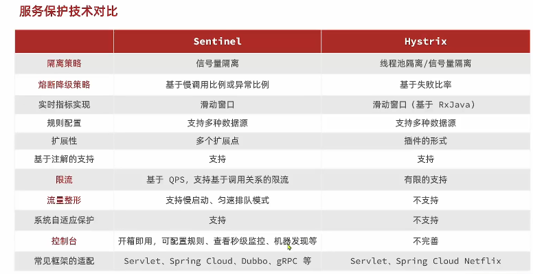


> 安装sentinel


密码，账号都是sentinel


监控order-service服务


#### 流量控制

簇点链路


流控和熔断都是针对簇点链路中的资源来设置的，点击按钮设置规则。

- 直接，每秒不能超过1个请求。


- 关联


- 链路


给service添加限流规则


> 流控效果


- warmup


- 排队等待


- 热点参数，对springMVC无效的。


#### 舱壁隔离和降级熔断

#### 授权规则

对请求者身份的判断

#### 规则持久化

我们配置好的规则持久化

### 分布式事务

#### 理论基础

> CAP定理

- 一致性Consistency


- 可用性Availability


- 分区容错性Partition tolerance


es是cp

> BASE理论


#### 初识Seata

seata架构：seata搭建TC服务器。


#### 动手实践

#### 高可用

分布式部署

### 多级缓存

更高流量并发，利用请求中的每个环节，分别添加缓存，减轻Tomcat压力。


### 分布式缓存

redis分布式：

传统redis问题

- 数据丢失
- 并发能力有限
- 故障恢复问题
- 存储能力有限

### 可靠消息服务

- 消息可靠性问题：如何确保发送的消息至少被消费一次。
- 延迟消息问题：如何实现消息的延迟投递。
- 高可用问题：如何避免单点MQ故障而导致的不可用问题。
- 消息堆积问题：如何解决数百万消息堆积，而无法及时消费的问题。

## 面试篇