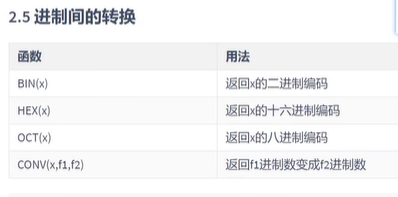
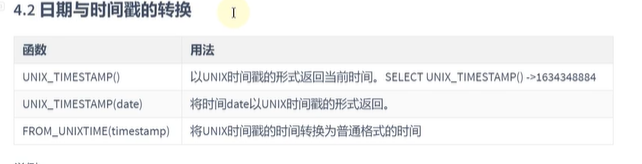
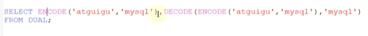
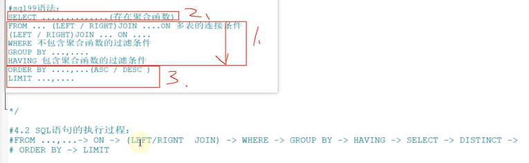
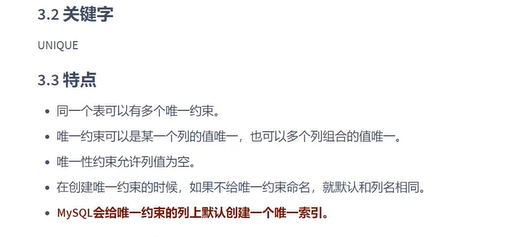
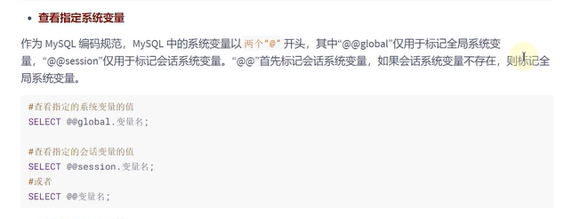

## 数据库的概述和MySQL安装篇

### 	数据库概述

---

https://db-engines.com/en/ranking


关系型RDBNS与非关系型数据库的区别：

**关系型数据库**中表与表之间的存在关系，并且数据库是以表的形式存储的

**优势**：可以用sql语句方便的在一个表以及多个表之间做复杂的查询。事务支持。

**非关系型数据库**可以看成关系型数据库的阉割版本，基于键值对存储数据，不需要经过SQL层的解析，性能非常高。

k-v型数据库：查询速度很快。Redis是最流行的键值型数据库。

文档型数据库：也是键值的形式，可以是xml、json格式，这里一个文档就相当于一条记录，可以存放并获取文档。MongoDB最流行

搜索引擎数据库：Elasticsearch数据库

列式数据库：普通的是Mysql是根据行来存储的，大量降低了（比如MySQL查询一条记录中有id，name属性，而我们只需要name属性，但id也加载到内存中，所以增加了不必要的i/o）I/O。HBase数据库(大数据)

图形数据库：主要存储网状图形之间的联系  


表的关联关系

一对一关联，一对多关联，多对多关联，自我引用

两种键表的原则：

​	外键唯一：主键的主键和从表的外键(唯一)，形成主外键关系，外键唯一。

​	外键是主键：主表的主键和从表的主键，形成主外键关系。

### 	MySQL环境搭建

从官网中下载mysql，https://www.mysql.com

https://dev.mysql.com/downloads/file/?id=510039

cmd使用命令

启动：net start MySQL

停止：net stop MySQL

登录：mysql -u root -p密码

MySQL数据库默认编码是拉丁的

修改默认字符集的配置文件


## SQL之SELEXCT使用篇


SQL语言的分类

​	DDL数据定义语言：create \ alter \ drop \ rename \ truncate

​	DML数据操作语言：insert \ delete \ update \ select

​	DCL数据控制语言：commit \ rollback \ savepoint \ savepoint \ grvoke \ revoke

### 	SQL语言的规则与规范

规则

use 指明要操作的数据库;

每个语句结束要以";"结束

关键字不能小写，也不能换行

规范

mysql在windows运行是大小写不敏感的，Linux环境下是大小写敏感的（数据库名，表名，表的别名，变量名是严格区分大小写的[建议小写]。关键字，函数名，列名，列的别名是忽略大小写的[建议大写]）

#或-- :单行注释

/**/:多行注释


导入现有的数据表,表的数据

source 文件的全路径:这种方式必须在命令窗口中执行

### 	基于SELECT语句  

```sql
# 1查询表中所有的字段
select * from employees;
# 2查询自己需要的字段
select employees_id, last_name, salary
from empoyees;
```

```sql
# 3给列起一个别名,三种方式,不要使用单引号
select * employees_id emp_id, last_name as lname, department_id "dept_id"
from employees;
# 4去除重复行,distinct去重
# 查询那些部门有id
select distinct department_id
from employees;
# 5空值参与运算null,结果一定为null
# ifnull(commission_pct,0): commission_pct如果为null用0替换
```

```sql
# 6着重号``: 可以把与关键字重复的变量名用``括起来
```

```sql
# 7查询常数
select '尚硅谷', employee_id
from employees;
# 8显示表结构,显示表中字段的详细信息
describe employees;
```

```sql
# 9过滤数据,查询满足条件的数据,放在from后面
select * from employees
where department_id = 90;  
```

### 	 运算符


1.算数运算符: + - * (/ div )(% mod)

100+'1'在MySQL中结果是101

100+'a'在MySQL把'a'当成0来处理

100+null在MySQL中null参与运算结果为null

分母为零结果为null

%:取模结果的符号与被摸数的符号一至

2.比较运算符: = <=> <> != < <= > >=

字符串存在隐士转换: 数值与字符串比较, 在比较运算符如果字符串中的值是数字, 参与比较就把字符串转化成数值进行比较. 如果字符串中不是数字就把字符串转化成0进行比较; 字符串与字符串比较不进行隐式转换.

只要有null参与判断,结果一定为null

<=>安全等于: 可以对null进行判断(为null而生的)


```sql
# 查询表中不为空的数据
select last_name, salary, commission_pct
from employees
where commission_pct is not null;
```

 ```sql
# 查询表中salary6000到8000的员工信息
select employee_i, last_name, salary
from employees
where salary between 6000 and 8000;
# in\not in
# 查询部门为10, 20, 30
select last_name, salary, department_id
from employees
where department_id in (10, 20, 30);
# 模糊查询
# 包含字符'a'
# %:表示多个不确定的字符,_:表示一个不确定的字符,\:转义字符
select last_name
from employees
where last_name like '%a%';
 ```


```sql
# 以s开头
select 'shkstart' regexp '^s'
from dual;
# 以e结尾
SELECT * 
FROM employees
WHERE first_name REGEXP 'e$';
```

3.逻辑运算符


```sql
select last_name, salary, department_id
from employees
where departent_id = 10 or department_id = 20;
```

or与and一起使用,但是在使用时要注意两者的优先级,由于and的优先级高于or的优先级

4.位运算符


```sql
select 12 & 5, 12 | 5, 12 ^ 5
from dual;
```

### 	排序与分页

排序

```sql
# 按工资从高到低排序
# order by默认升序
# asc: 升序
# desc: 降序
# name列的别名只能在order by中使用,不能在where中使用
# 因为在使用order by时已经查询到数据.
select employee_id,last_name 'name', salary
from employees
order by salary desc;
# 二级排序,在department_id降序的基础之上,salary升序
select employee_id,last_name, salary, department_id
from employees
order by department_id desc, salary asc;
```

分页

```sql
# 使用limit实现数据的分页
# 从第零条开始,显示20条数据
# 先写order by再写limit
select employee_id, last_name
from employees
limit 0, 20;
```


### 	多表查询*


```sql
# 查询员工名为
# 查询的结果是一个笛卡尔积,缺少多表的连接条件
select employee_id, department_name
from employees, departments; 
```

```sql
# 如果多表查询语句中,多个表中出现相同的字段,必须指明此字段所在的表.
# 建议从sql优化的角度,建议多表查询时,每个字段前都指明其所在的表.
# 可以给表起一个别名,给表起一个别名必须使用别名.
# 如果查询n张表需要n-1个连接
select emp.employee_id, dept.department_name
from employees emp, departments dept; 
where emp.employee_id = dept.employee_id;
```

多表查询的分类

1.等值连接和非等值连接

```sql
# 等值连接
where emp.employee_id = dept.employee_id;
# 非等值连接
where emp.salary between job_grades.lowest_sal and job_grades.highest_sal;
```

2.自连接和非自连接

```sql
# 自连接
```


3.内连接与外连接

**推荐使用sql99语法**

```sql
# 内连接,上面都是内连接
# 内连接: 把做表和右表满足结果的都查询出来的叫内链接
select emp.employee_id, dept.department_name
from employees emp, departments dept; 
where emp.department_id = dept.department_id;
```

```sql
# 外连接: 把两个表满足条件的结果查出来,还查出不满足条件的行,叫外链接
# MySQl不支持使用sql92的写法,MySQL是支持sql99语法的
# 左外连接:比如查出没有部门的员工(查出所有的员工)
/*
实现sql99内连接'inner'是内连接的关键词(可以省略)
select emp.employee_id, dept.department_name
from employees emp inner join departments dept; 
on emp.employee_id = dept.employee_id;
*/
# outer是外连接的关键词(可以省略), left是左外连接的关键词
select emp.employee_id, dept.department_name
from employees emp left outer join departments dept; 
on emp.department_id = dept.department_id;
# 右外连接:查出没有员工的部门
# right是右外连接的关键词
select emp.employee_id, dept.department_name
from employees emp right join departments dept; 
on emp.department_id = dept.department_id;
# 满外连接:关键词full,MySQL不支持满外
```


union:有一个去重的操作,所以效率不高

union all:不用去重,效率比较高,(建议使用),怎样拼接看下图


```sql
# 实现上图
# 左上
select emp.employee_id, dept.department_name
from employees emp left outer join departments dept
on emp.department_id = dept.department_id;
# 右上
select emp.employee_id, dept.department_name
from employees emp right join departments dept 
on emp.department_id = dept.department_id;
# 中
select emp.employee_id, dept.department_name
from employees emp inner join departments dept
on emp.department_id = dept.department_id;
# 左中
select emp.employee_id, dept.department_name
from employees emp left outer join departments dept
on emp.department_id = dept.department_id
where dept.department_id is null;
# 右中
# 左下
select emp.employee_id, dept.department_name
from employees emp left outer join departments dept
on emp.department_id = dept.department_id
where dept.department_id is null
union all
select emp.employee_id, dept.department_name
from employees emp right join departments dept 
on emp.department_id = dept.department_id;
# 右下
```

sql99语法的新特性

自然连接条件: 'natural join': 他会把两张表相同的字段自动的作为判断条件.


'using':


### 	单行函数(进一放一)

**数值函数**

单行函数是可以嵌套的




**字符串函数**


**日期和时间函数**





type的取值与4.4相同


**流程控制函数**


**加密与解密函数**


加密与解密



**MySQL信息函数**


**其他函数**


### 	聚合函数(进多放一)

**聚合函数是不能嵌套使用的**

**常见的聚合函数**

以下函数都不计算null

AVG() / SUM(): 平均值 / 求总和，是针对于数值类型的

MAX() / MIN()：最大值 / 最小值

COUNT()：求个数：计算指定字段在查询结果中出现的次数

count(2),与前面的字段的个数有关，个数里面是（不计算null的）

```sql
# 查寻公司的的平均奖金率
select sum(commission_pct) / count(ifnull(commission_pct, 0)),
from employees;
# count(*) count(1) count(字段)那个效率最高，跟存储引擎有关
# 如果使用MyISAM存储引擎，三这效率相同
# 如果使用InnoDB，count(*) = count(1) > count(字段)
```

#### group by的使用


```sql
# 求出员工的各个部门的平均工资
select department_id, AVG(salary)
from empoyees
group by department_id;
# 求出各个部门的job_id相同员工的平均工资(department_id, job_id先后顺序都一样)
select department_id, job_id, AVG(salary)
from empoyees
group by department_id, job_id;
# 这样书写是不对的，select中的字段一定要写在group by中
select department_id, job_id, AVG(salary)
from empoyees
group by department_id;# group by放在where后面，放在order by前面
```

#### having的使用


```sql
# 查询各个部门的最高工资比10000高的部门信息
# 如果过滤条件中出现聚合函数，则必须使用having来替换where，否则报错
# 如果出现having必须放在group by后面
# 开发中使用having一般与group by一起使用
select department_id, MAX(salary)
from employees
group by department_id;
having max(salary) > 10000;
```


where与having对比：

​	1.having的适用范围更广

​	2.如果没有聚合函数，where的效率高于having

```sql
select.........(存在聚合函数)
from...........
where..........多表的连接条件 and 不包含聚合的过滤条件
group by.......对聚合函数查询你的结果进行分组
having.........包含聚合函数的过滤条件
order by.......(asc / drsc)
limit..........分组
```

**sql底层执行原理**



### 	子查询*

在一个查询中又放了一个查询，子表可以在任何地方使用

```sql
select last_name, salary
from employees
where salary > (
		select salary
		from employees
		where last_name = 'Abel'
	);
```

角度一：从内查询返回的结果的条目数

​	单行子查询 vs多行子查询

角度二：内查询是否被执行多次

​	相关子查询 vs 不想管子查询

#### 单行子查询


```sql
# 查询工资大于149号员工工资的员工信息
select *
from employees
where salary > (
	select salary
    from employees
    where employee_id = 149
);
# 返回job_id与141号员工相同，salary比143号员工多的员工姓名，job_id和工资
select last_name, job_id, salary
from employees
where salary > (
	select salary
    from employees
    where employee_id = 143
) and job_id = (
	select job_id
    from employees
    where employee_id = 141
);
# 返回公司工资最少的员工的last_name,job_id和salary
select last_name, job_id, salary
from employees
where salary = (
	select min(salary)
    from employees
);
# 也可以写在having中
# 也能在case中使用
SELECT employee_id, last_name, CASE department_id WHEN (
							SELECT department_id
							FROM departments
							WHERE location_id = 1800
						) THEN 'Canade'
						ELSE 'USA' END "location"
FROM employees;
```

#### 多行子查询


```sql
# 查询那些员工的工资在自己部门是最低工资
select employee_id, last_name
from employees
where salary in(
	select min(salary)
    from employees
    group by department_id
);
# 返回其他job_id中比job_id为‘IT_PROG’部门任一工资低的员工的员工号，姓名，job_id以及salary
# 任一的意思就是结果中有一个比他小的就行
select employee_id, last_name, job_id, salary
from employees
where job_id <> 'IT_PROG' and salary < any (
	select salary
    from employees
    where job_id = 'IT_PROG'
);
# 返回其他job_id中比job_id为‘IT_PROG’部门所有工资低的员工的员工号，姓名，job_id以及salary
select employee_id, last_name, job_id, salary
from employees
where job_id <> 'IT_PROG' and salary < all (
	select salary
    from employees
    where job_id = 'IT_PROG'
);
```

#### 相关的子查询

以上都是不相关子查询

```sql
# 查询员工中工资大于本部门平均工资的员工的last_name,salary和其department_id
select last_name, salary, department_id
from employees t1
where salary > (
	select AVG(salary)
    from employees t2
    where department_id = t1.department_id
);
# 查询员工的id，salary，按照department_name排序
SELECT employee_id, salary
FROM employees t1
ORDER BY (
	SELECT department_name
	FROM departments t2
	WHERE t2.department_id = t1.department_id
);
```

```sql
select.........
from...........
where..........
group by.......不能写子查询
having.........
order by.......
limit..........不能写子查询
```

```sql
# 若employees表中employee_id与job_history表中employee_id相同的数目不小于2，输出这些相同id的员工的employee_id，last_name和其job_id
SELECT employee_id, last_name, job_id
FROM employees t1
WHERE 2 <= (
	SELECT COUNT(employee_id)
	FROM job_history t2
	GROUP BY t2.employee_id
	HAVING t1.employee_id = t2.employee_id
);
```

## SQL之DDL，DML，DCL使用篇

### 	创建和管理表

#### 数据库的操作


```sql
# 创建数据库
create database 数据库名;
# 创建数据库并指定字符集
create database 数据库名 character set 字符集;
# 判断数据库是否已经存在，不存在则创建数据库(推荐使用)
create datebase if not exists 数据库名;
```

```sql
# 切换数据库
use 数据库名;
# 查看数据库中有哪些表
show tables;
# 查看使用的数据库
select database() from dual;
# 查看指定数据库下保存的数据库表
show tables from mysql;
```

```sql
# 修改数据库
# 字符集
alter database 数据名 character set 'utf8';
```

```sql
# 删除数据库
drop database mytest1;
# 如果数据库存在就是删除不存在，不报错
drop database if not exists mytest1;

```

#### 数据库表的操作

```sql
# 创建表,没有创建，有表不报错
create table if not exists myemp1(
	id int,
    emp_name varchar(15),
    hire_date date
); 
# 查看表结构
desc myempl;
# 查看创建表的语句
show create table myemp1;
# 基于现有的表创建一个新的表，同时也导入数据
# 查询语句中表的别名，可以作为新创建表的别名
create table myemp2
as
select employee_id,last_name,salary
from employees;
```

```sql
# 修改表
# 添加一个字段
alter table myemp1
add salary double(10, 2);

alter table myemp1
add phone_number varchar(20) first;
# 修改一个字段,长度，指定默认值
alter table myemp1
modify emp_name varchar(25);

alter table myemp1
modify emp_name varchar(35) default 'aaa';
# 重命名一个字段
alter table myemp1
change salary monthly_salary double(10, 2);
# 删除一个字段
alter table myemp1
drop column email;
```

```sql
# 重命名表
rename table myempl
to myemp11;
```

```sql
# 删除表
drop table if exists myemp11;
```

```sql
# 清空表
truncate table employees_copy;
```

DCL中COMMIT和ROLLBACK

commit：提交数据，一旦执行commit，则数据就被永久的保存在了数据库中，意味着数据库不可以回滚，rollback：回滚数据。一旦执行rollbach，则可以实现数据的回滚，回滚到最近的一次commit之后。

```sql
# 对比truncate table 和delete from
# 相同点：都可以删除所有的数据
# truncate table不能回滚，delete from可以回滚
```

DDL：一但执行，就不能回滚

DML：一旦执行，默认不能回滚，在DML之前一旦执行set autocommit = false，就可以回滚

MySQL8.0的新特性：原子性，DDL也可以实现回滚，当同时删除两个表示，其中表2不存在，那么在8.0表1就会删除失败，在5.7表1会删除成功。失败的原因是回滚了

### 	数据处理之增删该

```sql
# 添加一条数据
insert into emp1
values (1, 'Tom', '2000-12-2', 3400);

insert into empl(id, hire_date, salary, `name`)
values(2, '2000-12-2', 4000, 'Tom')
# 添加多条数据(推荐)
insert into empl(id, hire_date, salary, `name`)
values(2, '2000-12-2', 4000, 'Tom'),
	(2, '2000-12-2', 4000, 'Tom');
# 查询的的结果添加到insert中
insert into emp1(id, name, salary, re_date)
select employee_id, last_name, salary, hire_date
from employees
where department_id in (70, 80);
```

```sql
# 更新数据
# update.....set....where...
# 可以实现批量修改数据
# 有可能更新数据据失败，可能受约束的影响
update empl
set hire_date = curdate(), salary = 6000
where id = 4;
```

```sql
# 删除数据
# 有可能删除数据据失败，可能受约束的影响
delete from emp1
where id = 1;
```


### 	MySQL数据类型精讲

#### 整数类型


```sql
# 整形的数据类型
create table test_int1(
	f1 tinyint,
    f2 smallint,
    f3 mediumint,
    f4 integer,
    f5 bigint
)
# int(5) zerofill当插入的值大小不足五位时，前面就用0补充
create table test_int2(
	f1 int,
    f2 int(5),
    f3 int(5) zerofill # int(5) 要与 zerofill配合使用，int(5)才有意义
)
insert into test_int2(f3)
values(123),(123456); # 插入的结果是00123，123456
# unsigned无符号
create table test_int3(
	f1 int unsigned
);
```


#### 浮点类型


```sql
# 浮点类型
# 因为浮点数是不准确的，所以我们要避免使用“=”来判断两个数是否相等。
create table test_double(
	f1 float,
    f2 float(5,2),# 表示一共有五位，小数点后面站两位
    f3 double,
    f4 double(5,2)# 如果整数位多了，就报错，小数位多了就四舍五入
);
```

#### 定点数类型

它的精度没有改变


```sql
create table test_decimall(
	f1 decimal,
	f2 decimal(5,2)
);
desc test_decimall;
```

#### 为类型：BIT


```sql
# 位类型,以二进制的形式存放
create table test_bit1(
	f1 bit,# 默认是一位0或1
    f2 bit(5),# 五位二进制
    f3 bit(64)
);
# 以二进制和16进制形式显示
bin() hex()
# 以十进制的形式显示
select f1 + 0, f2 + 0
from test_bit1;
```

#### 日期与时间类型


```sql
# year类型
create table test_year(
	f1 year, -- 默认是四位
    f2 year(4)
)
# date类型
create table test_date1(
 	f1 date
);
insert into test_date1
values(curdate()),(current_date()),(now());
# time类型
create table test_timel(
	f1 time
)
# datetime类型(推荐使用)
create table test_datetime(
	dt datetime
)
# timestamp类型，这种类型是随时去的变化而变化的，底层存储的是毫秒数
create table test_timestamlp(
	ts timestamp
)
# 切换日本的时区
set time_zone = '+9:00';
```

#### 文本类型


```sql
# char：可以指定字符串的长度
create table test_char1(
	c1 char, # 默认长度是一
    c2 char(5)
)
# carchar:可以指定字符串的长度
create table test_varchar(
	name varchar(5) # 能存放五个字符  
)
# text:当存储文本比较大时建议使用text,建议不要删除数据
create table test_text(
	tx text
)
# enum枚举:忽略大小写，没有限制，可以添加空值
create table test_enum(
	seasom enum('春', '夏', '秋', '冬')# 春夏秋冬可以用下表1，2，3，4表示
)
insert into test_enum
values('春'), ('秋');
# set 也是一个枚举，可以添加多个值
create table test_set(
	s set('a', 'b', 'c')
)
insert into test_set(s)
values('a,b');
```

#### 二进制字符串类型


```sql
# binary与varbinary类型，只能指定字节数
create table test_binaryl(
	f1 binary,
    f2 binary(3),
#    f3 varbinary,这里必须指定大小
    f4 varbinary(10)
)
insert into test_binaryl(f2, f4)
values('ab', 'ab');
```

#### JSON类型

```sql
# json类型
create table test_json(
	js json
);
insert into test_json(js)
values('{"name":"songhk", "age":18, "address":{"province":"beijing","city":"beijing"}}');
```

#### 适用类型建议


### 	约束


check	(检查约束)，default   (默认值约束)

create table时添加约束

alter table 时增加约束，删除约束

#### 非空约束


```sql
# 修改表中字段的约束
alter table test1
modify email varcher(25) not null;
# 删除约束
alter table test1
modify email varcher(25) null;
```

#### 唯一性约束



唯一性约束允许多次添加null值

```sql
# 创建表时添加约束unique
create table test2(
	id int unique, # 列级约束
    # 表级约束,uk_test2_emeail给约束起一个名字，在删除约束的时候需要约束名
    constraint uk_test2_emeail unique(email)
);
# 修改约束
alter table test2
add unique(salary);

alter table test2
modify last_name varcher(15) unique;
# 复合约束
# 两个字段不完全一样就行
create table user(
	id int,
    name varchar(15),
    password varchar(25),
    # 给上面两个字段添加唯一性约束
    constraint uk_user_name_pwd unique(`name`, `password`)
);
# 删除唯一性约束
# 添加唯一性约束的列上也会自动创建唯一性索引
# 删除唯一约束只能通过删除唯一索引的方式删除
# 删除时需要指定唯一索引名，唯一索引名就和唯一约束名一样
desc test2;
# 复合唯一性约束名，与（）第一个名相同
alter table test2
drop index last_name;
```

#### 主键约束

主键约束相当于唯一约束+非空约束的组合，主键约束列不允许重复，也不能为空


```sql
# primary key,一个表中只能有一个主键约束
create table test3(
	id int primary key,# 列级约束
    last_name varchar(15),
    salary decimal(10,2),
    email varchar(25)
    # 表级约束pk_test3_id就算自己也不会起作用
    # primary key(id)
);
# 复合主键约束,联合在一起都不能为空值
create table test3(
	id int,
    name varchar(15),
    password decimal(10,2),
    primary key (name, password)
);
# 修改主键
alter table test6
add primary key (id);
# 删除主键约束（在实际开发中不会去删除主键）
alter table test6
drop primary key;
```

#### 自增列：auto_increment


```sql
-- 自增长
-- 当插入数据时给主键添加0或null，主键添加的值都是自增
create table test7(
	id int primary key auto_increment,
    last_name varchar(15) 
);
-- 修改时添加自增
alter table test8
modify id int auto_increment;
-- 删除自增
alter table test8
modify id int;
```

#### 外键约束foreign key约束

从表中添加外键的值，在主表中一定要存在


```sql
# 创建表示添加
# 先创建主表
create table dapt1(
	dept_id int primary key auto_increment,
	dept_name varchar(15)
);
create table empl(
	emp_id int primary key auto_increment,
    emp_name varchar(15),
    department_id int,
    # 表级约束
    constraint fk_emp1_dept_id foreign key(department_id) references dept1(dept_id)
);
# 建表以后添加外键约束
alter table emp2
add constraint fk_emp2_dept_id foreign key(department_id) references dept2(det_id);
```

外键约束的等级


#### 检查约束check

MySQL不支持check约束。意思就是，写上也不报错，但是不起作用

```sql
create table test10(
	id int,
    last_name varchar(15),
    salary decimal(10,2) check(salary>2000)
);
```

#### 默认值的约束DEFAULT

```sql
# 指定一个默认值
create table test11(
	id int,
    last_name varchar(15),
    salary decimal(10,2) default 2000
);
# 修改约束
alter table test12
modify salary decimal(8,2) default 2500;
# 在alter table 删除约束
alter table test12
modify salary decimal(8,2);
```


## 其他数据库对象篇


### 	视图

视图相当于一张虚拟的表，我们对视图增删改查，相当于对原表进行操作，

视图就好像时分装起来的select语句，能够简化查询（一般针对大型项目使用，可以控制访问权限）

试图对应的表叫做基表，视图删除不会影响原表

#### 创建视图

```sql
# 创建视图
create view 视图名称
as 查询语句
```

针对单表的情况


针对多表的情况，相当于多表查询


也可以基于视图来创建视图

```sql
# 查看视图
show table;
# 查看试图表结构
describe vu_emp1;
# 查看视图属性信息
show table status like 'vu_empl';
```

#### 增删改视图中的数据

```sql
# 更新视图中的数据或导致表中的数据修改，反之亦然
update vu_emp1
set salary = 20000
where employee_id = 101;
# 更新失败的情况
# 比如平局值字段
```

```sql
# 修改视图
create or replace view vu_emp1
as
select employee_id,last_name,salary,email
from emps;

alter view vu_emp1
as
select employee_id,last_name,salary,email,hire_date
from emps;
# 删除视图
drop view vu_emp1;
```

### 	存储过程与函数

#### 存储过程(不建议使用)

存储过程与函数的区别是存储过程没有返回值


分类：

```sql
# 创建存储过程
# 没有参数(无参数无返回)
delimiter $ # 指定$为结束符

create procedure seect_all_data()
begin 
	select * from employees;
end $

delimiter ; # 指定;为结束标识符# 存储过程的调用
call select_all_data();

# 仅仅带out类型(无参数有返回)
delimiter //

create procedure show_min_salary(out ms double)
begin
	select min(salary) into ms
	from employees;
end //

delimiter ;
# 调用
call show_min_salary(@ms);
select @ms


# 仅仅带in类型(有参数无返回)
delimiter //

create procedure show_min_salary(in empname varchar(20))
begin
	select salary
	from employees
	where last_name = empname;
end //

delimiter ;
# 调用
call show_someone_salary('Abel');

set @empname = 'Abel';
call show_someone_salary(@empname);

# 即带in又带out(有参数有返回)
delimiter //

create procedure show_min_salary(in empname varchar(20), out empsalary decimal(10,2))
begin
	select salary into empsalary
	from employees
	where last_name = empname;
end //

delimiter ;
# 调用
set @empname = 'Abel';
call show_someone_salary(@empname,@empsalary);
select @empsalary;

# 带inout(有参数有返回)
delimiter //

create procedure show_min_salary(inout empname varchar(25))
begin
	select last_name into empname
	from employees
	where employee_id = (
        select manager_id
        from employees
        where last_name = empname;
    )
end //

delimiter ;
# 调用
set @empname = 'Abel';
call show_someone_salary(@empname);
select @empname;
```

#### 函数

必须有返回值

```sql
# 无参数有返回值
delimiter //

create function email_by_name()
returns varchar(25)
	deterministic # 表示函数是确定的
	contains sql # 表示包含sql语句
	reads sql data # 读sql中的数据
begin
	returen (select email from employees where last_name = 'Abel');
end //

delimiter ;
# 调用
select email_by_name();

# 有参数
# 创建函数前执行此语句，保证函数的创建会执行成功。就不用加特征了
set global log_bin_trust_function_creators = 1;
delimiter //

create function email_by_id(emp_id int)
returns varchar(25)

begin
	returen (select email from employees where employee_id = emp_id);
end //

delimiter ;
# 调用
select email_by_id(100);
```

函数的查看修改和删除

```sql
# 查看存储函数，和存储过程
show create procedure show_mgr_name;
```


```sql
# 修改相关的特性
alter procedure show_max_salary
sql security invoker
comment '查询最高工资';

# 删除存储过程函数
drop function if exists count_by_id;
```


### 	变量，流程控制与游标

#### 变量

1.变量：系统变量（全局系统变量，会话系统变量）vs 用户自定义变量

2.查看系统变量





自定义变量：会话用户变量和局部变量

会话用户变量：应用域和会话变量一样，只对当前连接会话有效。

局部变量：只在BEGIN和END语句块中有效，局部变量只能在存储过程和函数中使用。

```sql
# 会话用户变量：使用’@‘开头，作用域为当前会话。
set @m1 = 1;
set @m2 := 2;
set @sum := @m1 + @m2;

select @count : = count(*) from employees;
select avg(salary) into @avg_sal from employees;
# 局部变量：只能使用在存储过程和存储函数中的。
# 局部变量必须使用declare生命，声明并使用在begin ... end 中，必须声明在首航
delimiter //

create procedure test_var()

begin
	# 声明
	declare a int default 1;
	declare b int;
	declare emp_name varchar(25);
	
	# 赋值
	set a = 1;
	set b:= 2;
	select last_name into emp_name from employees where employee_id = 101;
	
	# 使用
	select a,b,emp_name;
end //
delimiter ;
call test_var();
```

#### 流程控制

```sql
# 条件判断语句：if语句和case语句
if 表达式1 then 操作1
elseif 表达式2 then 操作2
elseif 表达式3 then 操作3
else 操作4
end if;

case 表达式
when 值 then 结果1或语句1（如果是语句，需要加分号）
when 值 then 结果2或语句2（如果是语句，需要加分号）
else 结果n或语句n（如果是语句，需要加分号）
end [case] （如果是放在begin end中需要加上case，如果在select后面不需要）

case
when 条件1 then 结果1或语句1（如果是语句，需要加分号）
when 条件2 then 结果2或语句2（如果是语句，需要加分号）
else 结果n或语句n（如果是语句，需要加分号）
end [case] （如果是放在begin end中需要加上case，如果在select后面不需要）
# 循环语句：loop，while和repeat语句
loop_label:loop
	set num = num + 1;
	if num >= 10
	then leave loop_label # 退出循环
	end if;
end loop loop_label; # 循环执行的语句

while_lable:while 循环条件 do
	循环体
end while while_label; # 循环执行的语句，while_label可以不写

repeat_label:repeat
	循环体的语句
until 结束循环的条件表达式
end repeat repeat_label;# 循环执行的语句，repeat_label可以不写
# 跳转语句：iterate和leave语句
leave 标签名 # 表示退出那个标签

iterate 循环标签 # 相当于java中continue。只能在循环中执行
```

#### 游标（光标）

可以精确定位某一条记录，相当于指针的作用

### 	触发器

是封装好的触发器，有时间调用（增删该）。当修改一张表时，另一张表也跟着修改

触发器就是作用在表上的，它与表是高度耦合的

```sql
# 创建触发器
create trigger 触发器的名称
before # 表示删除记录之前操作
# after表示山粗之后
delete # 表示删除记录时才触发，还可以写update，insert
on 给那张表加触发器
for each row # 表示没删除一条记录就触发一次
begin
# 触发器执行的语句;
end //
```

```sql
# 查看
#1.查看数据库中所有的触发器
show triggers\G;
#2.查看当前数据库中某个触发器的定义
show create trigger 触发器名
#3.从系统库informaion_schema的triggers表中查询“salary_check_trigger”触发器的信息
select * from information_schema.TRIGGERS;

# 删除触发器
drop trigger if exists 触发器名称;
```

优点：保证数据的完整性，可以帮我们记录操作的日志，还可以在操作数据前，对数据进行合法性检查

缺点：触发器最大的一个缺点就是可读性很差，相关数据的更新可能导致触发器的出错
