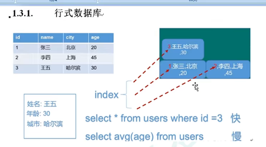
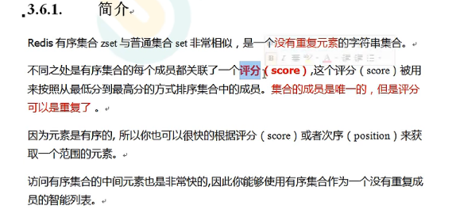
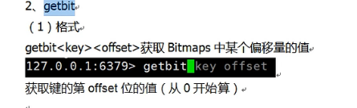
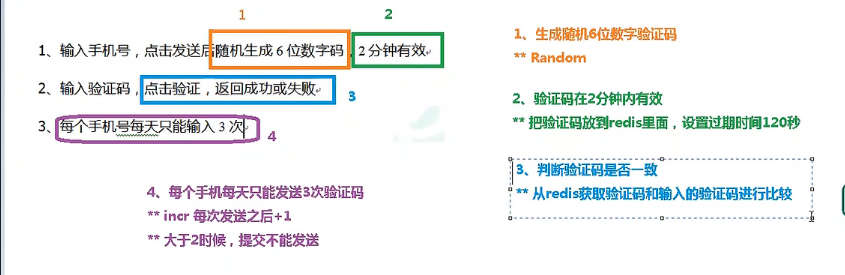
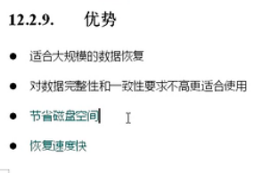
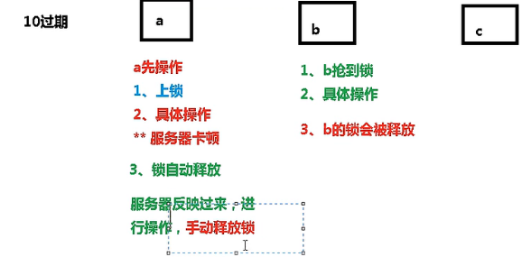

## NoSQL数据库简介

关闭服务

net stop redis

启动服务

net start redis

### NOSQL数据库


1、onsql能减小cpu和io的压力


2、作为缓存使用增加访问速度

NoSQL不支持原子性，一致性，隔离性，持久性ACID，远超sql性能

。对数据高并发的读取

。海量数据的读取

。对数据高可扩展性的

不适应的场景

。需要事务支持

。基于sql的结构化查询存储，处理复杂的关系


### 行式存储数据库




## Redis6概述和安装

Redis是一个开源的key-value存储系统。

这些数据类型都支持push/pop, add/remove及取交集并集和差集极丰富的操作，而这些操作都是原子性的

redis会周期性的把更新的数据写入到磁盘中

可以做session的共享到不同的服务器


Resis的安装

https://redis.io/download/在官网中下载redis

安装以后里面的文件功能


redis-cli.exe:启动redis数据库

默认端口：6379。从何而来的

默认右16个系统数据库，类似数组下标从0开始，初始默认使用0号数据库

1、redis与memcached区别

、redis能够持久化存储

、redis能够存储的数据类型比较多

、redis式单线程+多路IO复用（举例：当同时获取数据时，线程不会等待，会继续执行下面的操作。当获取到数据时才执行现在的操作）。memcache是多线程+锁

## 常用五大数据类型

redis键key的操作


### redis字符串String


当set设置相同的key，就会覆盖掉上一个value。setnx当key存在就会设置失败。


原子性操作：就是指不会被线程调度机制打断的操作。通俗讲就是线程之间操作不受影响，就好像是加上了锁


内部结构类似于java中的ArraList，最大不能超过512mb

### redis列表list

是一个单键多值


常用的命令操作


取值lrange <key> <start> <stop>按照索引小标获得元素(从左到右), 如果是lrange mylist 0 -1 0左边第一个，-1右边第一个（表示获取所有）


**List底层的数据结构**

quickList快速链表


### redis集合set

与List主要的区别是，无序的并且不可重复


常见操作


### redis哈希Hash


多用于存储对象

key			value

user		field	value

​				id		1

​				name	张三


  常用的命令


 ```redis
hset user id value
hset user name zhangsan
 ```


### redis有序集合Zset 



zset常用的命令


底层结构原理

hash			field		value

​					java		100

​					php		200


## Redis6配置文件详解

INCLUDES :表示包含的意思

NETWORK：网络配置

​	bind 127.0.0.1------表示只能通过本地访问

​	protected-mode yes开启保护模式，表示只能通过本机访问

​	port 6379：表示端口号

​	tcp-backlog 511：设置tcp的backlog，backlog是一个连接队列，backlog队列和=未完成三次握手队列+已经完成三次握手

​	timeout 0：设值连接的超时时间，0表示永不超时

​	tcp-keepalive 0：每隔300秒检测一次连接是否活着，如果活着进行服务

 GENERAL ：一般的配置

​	daemonize yes：是否为后台进程，设置yes

​	pidfile /var/run/redis.pid：每次操作有一个进程号，把每次操作的进程号设置到文件中

​	loglevel notice：表示日志的级别

​		debug (a lot of information, useful for development/testing)

​		verbose (many rarely useful info, but not a mess like the debug level)

​		notice (moderately verbose, what you want in production probably)

​		warning (only very important / critical messages are logged)

​	databases 16：表示一共有16个数据库

SECURITY：安全的配置

​	 requirepass foobared：给数据库设置一个密码

LIMITS 

​	maxclients 10000：设置最大连接数

​	maxmemory <bytes>：内存最大能占多大


## Redis6的发布和订阅

**是一种消息的通信模式**

### 什么是发布和订阅

redis发布订阅（pub/sub）是一种消息通信模式：发布者（pub）发送消息，订阅者（sub）接收消息


### 发布订阅命令实现


## Redis6新数据类型

### Bitmaps

是一个位操作,只能存放0和1


例子


很多用户的id以指数开头（如10000），直接将id和Bitmaps的偏移量对应势必会造成一定的浪费

在一次初始化时，假如偏移量非常大，那么整个初始化会比较慢

去出值



统计被设置一的数量


判断两天都访问的数量


### HyperLogLog

统计页面的访问量，基数计算的操作

命令


对两个集合合并，放到第三个集合中


### Geospatial

通过对地理信息的操作

范围-85.05112878到85.05112878


## Jedis操作Redis6

也可以使用Lettuce驱动操作数据库，springboot默认使用的是Lettuce

java对redis进行操作。连接的时候需要注入，redis的配置文件，和防火墙是否关闭

```java
//创建Jedis对象
Jedis jedis = new Jedis("127.0.0.1", 6379);
//测试
String ping = jedis.ping();
System.out.println(ping);
jedis.close();
```

```java
//创建Jedis对象
Jedis jedis = new Jedis("127.0.0.1", 6379);
//添加
jedis.set("name", "lucy");
//获取
String name = jedis.get("name");
System.out.println(name);
jedis.close();
```

模拟验证码的发送



```java
@Test
public void test05() {
    //生成6位的随机数
    String code = "";
    Random random = new Random();
    for (int i = 0; i < 6; i++) {
        int i1 = random.nextInt(10);
        code += i1;
    }
    //每个手机每天只能发送三次，设置过期时间
    Jedis jedis = new Jedis("127.0.0.1", 6379);
    //手机发送次数的key，保存验证码的key
    String phoneKey = "12345678901";
    String codeKey = phoneKey + "VerifyCode";
    String s = jedis.get(phoneKey);
    if (s == null){
        System.out.println("第一次发送");
        jedis.setex(phoneKey, 24*60*60, "1");
    }else if (Integer.parseInt(s) <= 2){
        jedis.incr(phoneKey);
    }else if (Integer.parseInt(s) > 2){
        System.out.println("今天的发送次数过多");
    }
    jedis.setex(codeKey, 120, code);
    jedis.close();
}
```

## Redis6与Spring Boot整合

## Redis6事务操作

### redis的事务定义

事务是把各种操作串联到一个直线上，可以防止别的命令插队，是顺序执行的

### Multi、Exec、discard


### 事务的错误处理


### 事务冲突的问题


 


乐观锁具体操作

```sql
watch [key] # 去监视某个key
multi # 开启事务
incrty [key] 10 # 给key加10操作，当另一个也加10就会执行失败
```

### Redis事务三特性


### redis事务秒杀案例


1、乐观锁会解决多买问题，

2、连接池会解决连接超时问题，

3、可以是用Lua小巧的脚本语言解决商品遗留问题


```java
// 使用jedis中的方法去加载LUA脚本字符串
String sha1 = jedis.scriptLoad(secKillScript);
// 传入参数，让lua脚本去执行
OBject result = jedis.evalsha(shal, 2, userid, prodid);
```

## Redis6持久化之RDB

在指定的时间间隔内将内存中的数据集快照写入磁盘，也就是行话讲的Snapshot快照，它回复时是将快照文件直接读到内存里


持久化存储是存储到dump.rdb文件中去

SNAPSHOTTING：此配置文件专门负责配置持久化的




对数据进行备份


## Redis6持久化之AOF


AOF默认是不开启的

appendonly yes：开启


no-appendfsync-on-rewrite:

重写压缩操作只有文件大于64mb才触发，


存在不管，造成回复不能


## Redis6的主从复制

主机数据更新后根据配置和策略，自动同步到备机的master/slaver机制，Master以写为主，Slaver以读为主


读写分离：是主服务器只负责写的操作，从服务器只负责读的操作

容灾的快速恢复，比如第一台从服务器挂掉，就会切换其他的从服务器。（如果一台主服务器挂掉，可以切换其他集群中的主服务器，主服务器只能有一个）

**创建一主两从的服务器**


从机中不能做写操作

如果某台从服务器关掉：

​	在主服务器做添加操作，再次启动关闭的从服务器（这是是一个主服务器，再让他变成从服务器），会把主服务器中的所有数据都复制下来。

如果主服务器关闭：

​	从服务器不会改变，重新启动主服务器，还是一个主服务器

**主从复制的原理**


**星火相传**


**反客为主**

slaveof no one，将从机变成主机

如果最大的服务器挂掉，下面的小的主服务器就会变成大哥


**哨兵模式**自动般的反客为主

能够后台监控主机是否故障，如果故障了根据通票数自动将从库转换为主库

一主而从配置哨兵模式：

需要先创建一个配置文件sentinel.conf

在配置文件中只写一句话sentinel monitor mymaster 127.0.0.1 6379 1

其中mymaster为监控对象起的服务名称，1为至少有多少个哨兵同意迁移的数量

启动哨兵：redis-sentinel sentinel.conf


当主服务挂掉之后，就会再从两个从服务器上选一个当成主服务器，原来的主服务器就会变成从服务器

复制延时：


选举的规则：

1、优先级高的先选举：在配置文件。新版本已经改变了k-v：replica-priority

2、选择偏移量最大的（偏移量就是谁给主服务器数据同步高）

3、选择runid最小的从服务器

## Redis6集群

### 集群的介绍

当容量不够，redis如何进行扩容

并发写操作，redis如何分离

代理主机：


无中心化集群


### 用无中心化集群搭建

创建6个配置文件：6379，6380，6381，6389，6380，6381

加上这三个配置：cluster-enabled yes 打开集群模式

​							cluster-config-file nodes-6379.conf 设定节点配置文件名

​							cluster-node-timeout 15000 设置节点失联时间，超过改时间（毫秒），集群自动进行主从切换

启动六个节点，把六个节点合成一个集群（注意：老的版本需要装一个环境，新版本不需要装环境）

​	先进入安装目录的src下


​	-replicas 1 采用最简单的方式配置集群，一台主机，一台从机，正好三组

​	此处不要用127.0.0.1，要用真实的ip地址

用集群方式连接：redis-cli -c -p 6379，用cluster nodes命令查看集群的信息

### 集群操作和故障分配

分配原则


16384 slots coverred.：slots是什么


set k1 value1: 他会根据k1计算k1所在插槽。没法添加多个值，可以通过组添加多个值

常用的命令：

查看key在那个插槽，查看插槽中有对少值，在某个插槽中返回10个值


**故障恢复**

一台主服务器停止，会自动恢复，挂掉的主机再次启动，会变为从机


### 集群的Jedis开发

```java
@Test
public void test06() {
    HostAndPort hostAndPort = new HostAndPort("192.168.44.168", 6378);
    //通过6379连上集群
    JedisCluster jedisCluster = new JedisCluster(hostAndPort);
    //进行操作
    jedisCluster.set("b1", "value1");
    String b1 = jedisCluster.get("b1");
    jedisCluster.close();
}
```

集群的好处：实现扩容，分摊压力，无中心配置相对简单


## Redis6应用问题解决

### 缓存穿透。

遭到黑客攻击，让服务器瘫痪

1、应用服务器压力变大了。2、redis命中率降低。3、一直查询数据库

1、redis查询不到数据库。2、出现很多非正常的url


常见的四种解决方案


### 缓存击穿

1、数据库访问压力瞬时增加。2、redis里面没有出现大量key过期3、redis正常运行

1、redis某个key过期，大量访问使用这个key

解决方案


### 缓存雪崩

1、数据库压力变大，服务器崩溃


### 分布式锁

是一个共享锁

锁的类型：1、基于数据库实现分布式锁。2、基于缓存。3、基于Zookeeper每个分布式锁解决方案都有各自的优缺点

1、redis性能高2、zookeeper可靠性高

基于redis实现分布式锁

setnx users 10，就加了一把锁。别人要设置首先要释放，del users删除就释放了，可以设置过期时间，自动释放（最好上锁的时候就设置过期时间set users 10 nx ex 12）




使用uuid。set lock uuid nx ex 10。使用uuid表示的不同的操作

释放锁的时候，首先判断当前uuid和要释放锁uuid是否一样


使用lua脚本实现原子性，使用事务

## Redis6新功能
