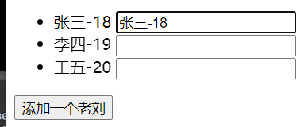
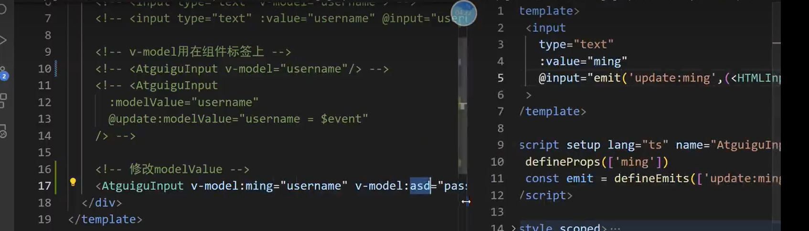

## css组件库

[NES.css](https://nostalgic-css.github.io/NES.css/)

## 人工智能辅助代码编写

copilot：github开发

codewhisper

fitten code：清华博士生开发

CodeGeeX


dependencies：生产环境依赖，devDependencies：开发环境依赖

npm install时：-save与-save-dev

-g是安装全局

npm默认安装模式不会放在dependencies与devDependencies运行npm install时不会下载模块


静态站点构建工具：

​	开发：React Static

​	博客：Gatsby.js，Docusaurus，Hugo，Hexo

​	文档：Docsify，Jekyll，VuePress，Dumi

大前端：用前端三件套代码，可以帮你生成移动应用，小程序等

​	移动应用：Hybrid，webView，React Native

​	桌面端：Electron，NW.js，Proton Native

​	小程序：原生，webView

​	跨段开发框架：如果写一个前端代码，可以生成所有程序。uni-app，Taro

## vue基础

初识vue

1. 想让vue工作，就必须创建一个vue对象，且传入一个配置对象
2. root容器里的代码依然符合html规范，只不过混入了一些特殊的vue语法
3. root容器里的代码称为【vue模板】。vue实例与容器是一一对应
4. {{这里可以写data有的，和js表达式，所有vue对象中有的它都能用}}

```html
<!DOCTYPE html>
<html>
<head>
    <meta charset="UTF-8">
    <title>Document</title>
    <script type="text/javascript" src="../../../../js/vue.js"></script>
</head>
<body>
    <div id="root">
    <!-- 把变化的值交给vue处理,这里使用插值语法{{}}括号中可以写只要能产生一个值的表达式，其实所有vm中有的属性都能写在这里-->
        <h1>hello. {{name}}</h1>
    </div>
    <script type="text/javascript">
        Vue.config.productionTip = false;//阻止vue默认的提示
        //创建vue实例
        //只传一个对象参数
        new Vue({
            el:'#root',//el用于指定当前vue实例为那个容器服务，值通常为为css选择器字符串
            data: {
                //name只能供root中的标签使用
                name:'尚硅谷123'
            }
        });
    </script>
</body>
</html>
```

### 模板语法

这种就是插值语法

```html
<div id="root">
    <!-- 插值语法 -->
    <h1>hello. {{name}}</h1>
    <!-- 指令语法：插值语法往往指定标签体内容，v-bind:href与:href相同 url当成表达式执行 -->
    <a :href="url">百度一下</a>
</div>
<script type="text/javascript">
    Vue.config.productionTip = false;
    const vue = new Vue({
        el:'#root', 
        data: {
            name:'尚硅谷123'
            url: "http://www.baidu.com"
        }
    });
    //vue.$mount('#root');//也能指定vue实例，更灵活一些，与el用那个都行
</script>
```

v-bind:单项数据绑定data->value

v-model:双向数据绑定data->value, value->data(v-model:value可以简写成v-model)

v-model只能应用在表单上，而且要有value的值。能够输入时才能用

### el和data两种写法

```js
//el第一种写法
const v = new Vue({
    data:{
        name:123
    }
});
v.$mount('#root');
```

```javascript
el:'#root',//el用于指定当前vue实例为那个容器服务，值通常为为css选择器字符串
    // data: {
    //     //对象式写法
    //     name:'尚硅谷123',
    //     url: "http://www.baidu.com"
    // }
    //函数式写法
    data(){
        //此处的this是vue对象
        return{
            name:'尚硅谷123',
            url: "http://www.baidu.com"
        };
    }
```

### MVVM模型

M：表示data的数据，V：就是vue解析生成的dom，VM：实例对象


### 数据代理

**Object.defineProperty()**方法

```javascript
let number = 18;
let Person = {
    name: '张三'
}
Object.defineProperty(person,'age',{
    //value:number,//此时这里的age是不能被枚举的，就是不能遍历
    //enumerable:true,//表示可以枚举
    //writable:true,//表示age的值可以被修改
    //configurable:true//表示属性是否能被删除
    get(){//每次访问age都会都会调用这个函数读取number
    	return number;
	}
    set:function(value){//每次修改age都会调用这个函数
    	number = value;
	}
});
```

**vue是怎样运用数据代理的**

data中的属性，就是通过代理添加到vm中的。当修改vm中的数据，其实就是把data中的数据修改掉

vm中有一个属性是一个_data,就是data == vm. _ data


vm._data不是数据代理，而是数据劫持（详情请看vue检测数据改变原理）


### 事件处理

v-on:click="showInfo"：当点击button时就去找showInfo()的函数调用,v-on可以简写成@,默认回传event参数

```html
<script type="text/javascript" src="../../../../js/vue.js"></script> 
<div id="root">
    <button @click="showInfo1(6,$event)">传参点我提示信息</button>
    <!-- 当传入@click.prevent就取消浏览器的默认行为 -->
    <a href="http://www.baidu.com" @click.prevent="showInfo1(1)">123</a>
</div>
    <script type="text/javascript">
        Vue.config.productionTip = false;
        const mv = new Vue({
            el:'#root',
            data:{
                
            },
            methods:{
                //可以写道data中但是不建议，因为data中的数据会进行数据代理
                showInfo:function(event){
                    console.log(this);//this就是vm
                    console.log(ecent);//事件对象
                },
                showInfo1:function(number,event){
                    console.log(number);
                }
            }
        });
    </script>
```

### 事件修饰符

修饰符可以连续写多个。

事件冒泡就是嵌套的点击事件。(在嵌套的点击事件中，捕获阶段是从外向内的，冒泡阶段是从内向外的(默认冒泡阶段处理事件))


```html
<!-- 当传入v-on:click.prevent就取消浏览器的默认跳转行为 -->
<a href="http://www.baidu.com" @click.prevent="showInfo1(1)">123</a>
```

### 键盘事件和键盘修饰符

键盘修饰符也可以写多个

一下两种方式只要键盘按下就触发事件，所以需要判断

keydown：按下按键事件不用抬起就触发事件。keyup：按下再抬起来就触发事件

```html
<!-- 按下回车提示输入,直接在按键事件后面加enter表示回车事件 -->
<input type="text" placeholder="按下回车提示输入" @keyup="showInfo02">
```

```javascript
showInfo02:function(event){
    //if(event.keyCode !== 13) return;
    console.log(event.target.value);//打印每个编码的值
    //event.key，event.keyCode表示名字和编码
}
```

enter：也可以用enter键盘修饰符表示回车


tab键不许配合keydown一起使用

```javascript
//自己定义别名
Vue.config.keyCodes.haha = 13;//定义了回车的别名是haha
```

修饰符是可以连着写的，@keyup.enter.y。也是可以的

### 计算属性

computed:{

​	这里写计算属性

}

拿着data中的属性，去计算出的属性就叫计算属性

```html
<html lang="en">
    <script type="text/javascript" src="../../../../js/vue.js"></script>
<body>
    <div id="root">
        <span>{{fullName}}</span>
    </div>
    <script type="text/javascript">
        const vm = new Vue({
            el:'#root',
            data:{
                firstName: "hello"
            },
            //这里的值也相当于在vm当中
            computed:{
                //可以直接读取{{fullName}}
                //get会做缓存，当多次读取同一个计算属性只会调用一次。1、初次读取fullName时被调用。2、所依赖的值发生变化。就会被调用
                fullName:{
                    //get有什么作用，只要有人读取fullName时，get就会被调用，且返回值作为fullName的值
                    get(){
                        console.log("get被调用");
                        return this.firstName + ' kjq';
                    },
                    //set什么时候调用，当fullName被修改时被调用，不经常修改
                    set(value){
                        //修改firstName的值
                        this.firstName = value;
                    }
                }
            }
        });
    </script>
</body>
</html>
```

计算属性简写形式，只能读，不能修改(计算属性一般也不修改)

```js
computed:{
	fullName(){
		console.log("get被调用");
		return this.firstName + ' kjq';
    }
}        
```

### 侦听属性

可以开启异步任务，异步任务this都是window，但如果是箭头函数this就是外部的this

```html
<html lang="en">
    <script type="text/javascript" src="../../../../js/vue.js"></script>
<body>
    <div id="root">
        <span>{{info}}</span>
        <button @click="change">改变天气</button>
    </div>
    <script type="text/javascript">
        Vue.config.productionTip = false;
        const vm = new Vue({
            el:'#root',
            data:{
                isHot:true,
                isPort: 8080
            },
            computed:{
                info(){
                    return this.isHot?'炎热':"凉爽";
                }
            },
            methods:{
                change(){
                    this.isHot=!this.isHot;
                }
            },
            //监视data中属性，也可以检测计算属性
            watch:{
                
                //监视isHot属性
                isHot:{
                    //handler当isHot发现改变时调用，也可以监视计算属性
                    handler(newValue, oldValue){
                        //newValue是isHot修改后的值，oldValue是修改前值
                        console.log("handler被调用了");
                    }
                    immediate:true,//初始化时让handler执行一下
                }
                //简写形式
                //isHot(newValue, oldValue){
                     //newValue新值，oldValue旧值
                // }
            }
        });

        //这里也可以实现监视的作用
        vm.$watch('isPort', {
            handler(newValue, oldValue){
            }
        });
    </script>
</body>
</html>
```

### 深度侦听

```html
<html lang="en">
    <script type="text/javascript" src="../../../../js/vue.js"></script>
<body>
    <div id="root">
        <span>{{numbers.a}}</span>
    </div>
    <script type="text/javascript">
        const vm = new Vue({
            el:'#root',
            data:{
                numbers:{
                    a:1,
                    b:2,
                    c:3
                }
            },
            watch:{
                numbers:{
                    deep:true,//当我们配置了这个属性，number中其中一个属性发生变化，就认为是numbers发生了变化
                    handler(newValue, oldValue){
                        //newValue新值，oldValue旧值
                    }
                }
            }
        });
    </script>
</body>
</html>
```

计算属性和属性监视的区别


### class绑定

```html
<!DOCTYPE html>
<html lang="en">
<head>
    <meta charset="UTF-8">
    <title>Document</title>
    <script type="text/javascript" src="../../../../js/vue.js"></script>
</head>
<body>
    <div id="root">
        <!-- 把class绑定到data中，适用样式名不确定，需要动态指定 -->
        <div class="basic" :class="a" @click="changeMood">{{name}}</div>
        <!-- 数组的写法，适用样式不确定个数，名字不确定 -->
        <div class="basic" :class="classArr">{{name}}</div>
        <!-- 对象的写法，适用，样式个数确定，名字也确定，动态决定用不用 -->
        <div class="basic" :class="classObj">{{name}}</div>
        <!-- 直接给div添加样式,也可以写数组 -->
        <div class="basic" :style="styleObj">{{name}}</div>
    </div>

    <script type="text/javascript">
        Vue.config.productionTip = false;

        const vm = new Vue({
            el:'#root',
            data:{
                name: 'hello',
                a: 'normal',
                classArr:['a1', 'a2'],
                classObd:{
                    atguigu1:true,//为true表示有值，false表示无值
                    atguigu2:false
                },
                fsize:40,
                styleObj:{
                    fontSize: '40px'
                }
            },
            //让vue去操作dom
            methods: {
                changeMood(){
                    this.a = 'happy';
                }
            },
        });
    </script>
</body>
</html>
```

### 条件渲染

```html
<!DOCTYPE html>
<html lang="en">
<head>
    <meta charset="UTF-8">
    <title>Document</title>
    <script type="text/javascript" src="../../../../js/vue.js"></script>
</head>
<body>
    <div id="root">
        <!-- v-show表示显示隐藏，当等于false是disply为none。如果切换频率高建议用这个 -->
        <h1 v-show="name == 'hello'">欢迎来到{{name}}</h1>
        
        <!-- 如果为false那么h1标签直接删除，这之间不能被打断 -->
        <h1 v-if="true">欢迎来到{{name}}</h1>
        <h1 v-else-if="true">欢迎来到{{name}}</h1>
        <h1 v-else>欢迎来到{{name}}</h1>
        <!-- v-if与template的配合使用 -->
        <template v-if="n === 1">
            <h2>你好</h2>
            <h2>你好</h2>
            <h2>你好</h2>
        </template>
    </div>

    <script type="text/javascript">
        Vue.config.productionTip = false;

        const vm = new Vue({
            el:'#root',
            data:{
                name: 'hello'
            },
        });
    </script>
</body>
</html>
```

### 列表渲染

使用index作为key不能破坏原有的数据顺序，否则会发生错误




使用id作为


如果不写key，vue会默认传一个index作为key。最好选择唯一标识来作为key

1、构建虚拟dom，需要与key相同原来的虚拟dom进行比较，标签没变，就复用，如果内容变了就替换

```html
<html lang="en">
    <script type="text/javascript" src="../js/vue.js"></script>
<body>
    <div id="root">
        <ul>
            <!-- :key可以写index和p.id都行 -->
            <!-- 这里的key中的index改成p.id就没有问题 -->
            <li v-for="(p,index) in persons" :key="index">
                {{p.name}}-{{p.age}}
                <input type="text">
            </li>
        </ul>
        <button @click.once="add">添加一个老刘</button>
        <ul>
            <!-- 也可以遍历对象 -->
            <li v-for="(value,key) in cars" :key="key">{{key}}-{{value}}</li>
        </ul>
        <ul>
            <!-- 也可以遍历数 -->
            <li v-for="(a,index) in 5" :key="key">{{index}}-{{a}}</li>
        </ul>
    </div>
    <script>
        new Vue({
            el:'#root',
            data:{
                persons:[
                    {id:'001',name:'张三',age:18},
                    {id:'002',name:'李四',age:19},
                    {id:'003',name:'王五',age:20}
                ],
                cars:{
                    name:"奥迪",
                    price:"70万"
                }
            },
            methods: {
                add(){
                    const p = {id:'004',name:'老刘',age:22};
                    //这里只有放在第一个位置才会出错
                    this.persons.unshift(p);
                }
            },
        })
    </script>
</body>
</html>
```

列表过滤

```html
<div id="root">
        <input type="text" v-model="keyWord" placeholder="请输入名字">
        <ul>
            <li v-for="(p,index) in filPerons" :key="index">
                {{p.name}}-{{p.age}}
            </li>
        </ul>
    </div>
    <script>
        new Vue({
            el:'#root',
            data:{
                keyWord:'',
                persons:[
                    {id:'001',name:'马冬梅',age:18},
                    {id:'002',name:'周冬雨',age:19},
                    {id:'003',name:'周杰伦',age:20},
                    {id:'004',name:'温兆伦',age:20}
                ],
                filPerons:[]
            },
            watch:{
                keyWord:{
                    handler(new1,old){
                        this.filPerons = this.persons.filter((p)=>{
                            return p.name.indexOf(new1) !== -1;
                        })
                    },
                    immediate:true

                }
            }
        })
    </script>
```

### vue监测数据改变的原理

自己实现vue检测属性

```html
<script>
        let data = {
            //这里没有考虑对象属性
            name:'kjq'
        }
        const obs = new Observer(data);
        function Observer(obj){
            //回族对象中所有属性汇总数组
            const keys = Object.keys(obj);
            //遍历
            keys.forEach((k)=>{
                
                Object.defineProperty(this,k,{
                    get(){
                       return obj[k];
                    },
                    set(val){
                        // 这里开始解析模板，生成虚拟dom，虚拟dom对比
                        obj[k] = val;
                    }
                })
            })
        }
        let vm = {};
        vm._data = data = obs;
    </script>
```

只能给data中某个对象添加属性不能给data添加属性

**如果直接向vm._data.student添加数据，数据并不是响应式的。但是可以通过Vue.set(vm._data.student,'sex','男')来添加**


**data数据中没有get与set方法，也就没有响应式，但是可以调用数组中的方法修改数组(push,pop,shift,unshift,splice,sort,reverse。vue对这些方法进行了包装)，就能成为响应式**


### v-model收集表单信息

```html
<html lang="en">
<head>
    <meta charset="UTF-8">
    <script type="text/javascript" src="../js/vue.js"></script>
</head>
<body>
    <div id="root">
        <form>
            账号：<input type="text" v-model="account"><br/>
            密码：<input type="password" v-model="password"><br/>
            性别：
            男<input type="radio" name="sex" v-model="sex" value="male">
            女<input type="radio" name="sex" v-model="sex" value="female"><br/><br/>
            爱好：
            抽烟<input type="checkbox" v-model="hobby" value="study">
            喝酒<input type="checkbox" v-model="hobby" value="game">
            烫头<input type="checkbox" v-model="hobby" value="eat">
            <br><br>
            所属小区：
            <select v-model="city">
                <option value="">请选择校区</option>
                <option value="beijing">北京</option>
                <option value="shanghai">上海</option>
                <option value="shenzhen">深圳</option>
            </select><br>
            其他信息：
            <textarea v-model="other"></textarea><br>
            <input type="checkbox" v-model="agree">阅读协议<a href="http://www.baidu.com">《用户协议》</a>
            <br><button>提交</button>
        </form>
    </div>
    <script>
        new Vue({
            el:'#root',
            data:{
                account:'',
                password:'',
                sex:'male',
                hobby:[],
                city:'beijing',
                other:'',
                agree:''
            }
        })
    </script>
</body>
</html>
```

v-model.number="";标识接受的是数字type="number"一般同时使用。

如果使用v-model.lazy="";表示失去焦点后收集

v-model.trim="";去掉前后的空格


### 过滤器

vue3没了


```html
<!DOCTYPE html>
<html>
<head>
    <meta charset="UTF-8">
    <title>Document</title>
    <script type="text/javascript" src="../../../../js/vue.js"></script>
    <script src="../../../../node_modules/dayjs/dayjs.min.js"></script>
</head>
<body>
    <div id="root">
        <!-- 使用过滤器实现 -->
        <h1>现在是{{time | fmtTime}}</h1>
        <!-- 实现过滤器的嵌套 -->
        <h1>只显示年{{ time | fmtTime | mySlice }}</h1>
    </div>
    <script type="text/javascript">
        Vue.config.productionTip = false;
        Vue.filter('mySlice', function(value){
            //这里就是全局过滤器，只能一个一个的定义
            //截取前四位的值的过滤器
            return value.slice(0,4);
        });
        const vue = new Vue({
            el:'#root',
            data:{
                time:1212812198977778
            },
            filters: {//全部都是局部过滤器，只能由这个vm使用
                fmtTime(value){
                    //这里传入的参数就是time，过滤器的第一个参数永远是过滤器前面的值time
                    return dayjs(value).format('YYYY-MM-DD HH:mm:ss');
                }
            }
        });
        
    </script>
</body>
</html>
```

### 内置指令


```html
	<script type="text/javascript" src="../../../../js/vue.js"></script>
    <style>
        /* 选中所有属性有v-cloak的标签，先把vue没有进入的是否把内容设置为none */
        [v-cloak]{
            display: none;
        }
    </style>
    <div id="root">
        <!-- v-text把文本替换掉整个div的内容 -->
        <div v-text="name"></div>
        <!-- 会解析标签，尽量不要使用，太危险了 -->
        <div v-html="html"></div>
        <!-- vue进入的瞬间就把v-cloak删除了 -->
        <h2 v-cloak>{{name}}</h2>
        <!-- 表示不能被修改，是一个初始值 -->
        <h3 v-once>{{n}}</h3>
        <!-- 表示模板跳过解析，写什么样就是什么样 -->
        <div v-pre>hello</div>
    </div>
    <script type="text/javascript">
        Vue.config.productionTip = false;

        const vm = new Vue({
            el:'#root',
            data:{
                html: '<h1>hello</h1>',
                name: "hello",
                n: 1
            }
        });
    </script>
```

### 自定义指令

可以配置全局指令


```html
<div id="root">
        <!-- 自定义v-big指令，和v-text功能类似，但会把绑定的数值放大10倍 -->
        <span v-text="n"></span><br/>
        <span v-big="n"></span><br/>
        <button @click="n++">点我加一</button>
    </div>
    <script>
        new Vue({
            el:'#root',
            data:{
                n:1
            },
            directives:{
                // 自定义指令element表示真是dom，binding是对象
                //指令与元素成功绑定时调用，指令所在的模板被重新解析时调用
                big(element,binding){
                    //主义此处的this是window
                    element.innerText = binding.value * 10;
                }
            }
        })
    </script>
```

```html
<div id="root">
        <!-- 自定义v-Fbind指令，和v-bind功能类似，但会使其所绑定的input默认获得焦点 -->
        <input type="text" v-fbind:value="n">
        <button @click="n++">n加一</button>
    </div>
    <script>
        new Vue({
            el:'#root',
            data:{
                n:1
            },
            directives:{
                fbind:{
                    //常用函数bind(当指令与元素成功绑定时)，inserted(指令所在的元素被插入到页面是)，update(指令所在的模板被重新解析时)
                    //如果只写简写形式相当于没有写inserted
                    bind(element, binding){
                        element.value = binding.value;
                    },
                    inserted(element, binding){
                        element.focus();
                    },
                    update(element, binding){
                        element.value = binding.value;
                        element.focus();
                    },
                }
            }
        })
    </script>
```

### vue的生命周期

一共四对：

​	data，methods创建之前和创建之后

​	dom挂在之前和挂在之后

​	dom更新之前与更新之后

​	vm销毁之前与销毁之后

.png)

```html
<!DOCTYPE html>
<html lang="en">
<head>
    <meta charset="UTF-8">
    <title>Document</title>
    <script type="text/javascript" src="../../../../js/vue.js"></script>
    <style>
        /* 先把vue没有进入的是否把内容设置为none */
        [v-cloak]{
            display: none;
        }
    </style>
</head>
<body>
    <div id="root">
        <h1 :style="{opacity: opacity}">hello</h1>
    </div>

    <script type="text/javascript">
        Vue.config.productionTip = false;

        const vm = new Vue({
            el:'#root',
            data:{
               opacity: 0.5
            },
            //第一个生命周期函数，初始化事件，但数据代理还未开始
            beforeCreate() {
                //无法通过vm访问data不能使用，methods方法
            },
            //数据代理和数据检测完成
            created() {
                //此时vm有了_data
            },
            
            //模板开始解析，生成虚拟dom内存中，页面还不能显示解析好的内容，会把一份$el存到vm中
            beforeMount() {
                //此时页面显示未经vue编辑dom，对dom的操作最终都是不奏效的
            },
            //当vue把虚拟的dom转化成真实的dom挂载到页面时就调用这个函数
            //只调用一次，一定是初始的dom
            //从此初始化结束了
            mounted() {
                //在这里就能开启一个定时器
                setInterval(() => {
                    vm.opacity -= 0.01;
                    if(vm.opacity <= 0) vm.opacity = 1;
                }, 16);
            },

            //当数据修改时,就调用这个函数,页面尚未和数据保持同步
            beforeUpdate() {
                
            },
            //根据新数据声称虚拟dom，随后与旧的虚拟dom进行比较，最终完成页面更新
            //此时页面和数据保持同步
            updated() {
                
            },

            //当vm的vm.$destroy()被调用时就执行销毁程序。
            //此时data、methods、指令等等，都是可用状态，马上要执行销毁程序，一般在此阶段，关闭定时器，取消订阅消息
            beforeDestroy() {
                //关闭定时器，取消订阅消息，解绑自定义事件
            },
            //这时彻底完了，只有绑定的事件还在
            destroyed() {
                
            }
        });
    </script>
</body>
</html>
```

### 组件化编程

传统的写法


依赖关系混乱，不好维护。代码复用率不高


组建的写法


实现应用中局部功能代码和资源的集合


#### 非单文组件

一个文件中包含有n个组件。一个文件表示.vue的文件


```html
<div id="root">
        <school/>
    </div>
    <script>
        // 定义组件
        // const school = {}，定义组件的简写形式
        const school = Vue.extend({
            template:`
                <div>
                    <h2>{{schoolName}}</h2>   
                    <h2>{{age}}</h2>  
                </div>
            `,
            data(){
                return{
                    schoolName:'kjq',
                    age:123
                }
            }
        })
        // 创建vm
        new Vue({
            el:'#root',
            components:{
                school
            }
        })
    </script>
```

#### 内置关系

**所有的组件都是构造函数，每个组件都是不同的构造函数，vue会帮我们创建实例对象**

```js
const school = Vue.extend({
	template:`
		<div>
			<h2>{{schoolName}}</h2>   
			<h2>{{age}}</h2>  
		</div>
	`,
	data(){
		return{
			schoolName:'kjq',
			age:123
		}
	}
});
```


#### 单文件组件

1、创建组件的.vue文件

```vue
<template>
    <!-- 组件的架构 -->
    <div class="dome">
        <h1>{{schoolName}}</h1>
        <h1>{{address}}</h1>
    </div>
<template>

<script>
    // 组件交互的代码（数据，方法）
    export default { 
        name: 'school',
        data(){
            return {
                schoolName: '尚硅谷',
                address: "北京"
            }
        }
    };
</script>

<style>
    /* 组件的样式 */
    .dome{
        backgroud-color: #orange;
    }
</style>


```

2、创建App.vue管理组件

```vue
<template>
    <div>
        <School></School>
    </div>
</template>

<script>
    //引入组件
    import School from './School.vue'
    export default {
        name: 'App',
        components:{
            School
        }
    }
</script>

<style>

</style>
```

3、创建main.js把组件注册到vue中

```javascript
import App from '../vue/App.vue'

new Vue({
    el:'#root',
    template:`<App></App>`,
    components:{App}
});
```

4、创建html把vue文件与main.js文件导入

```html
<!DOCTYPE html>
<html>
<head>
    <meta charset="UTF-8">
    <title>Document</title>
</head>
<body>
    <!-- 准备一个js -->
    <div id="root">
        
    </div>
    <script type="text/javascript" src="../../../../js/vue.js"></script>
    <script type="text/javascript" src="../js/main.js"></script>
</body>
</html>
```

## vue-cli

### vue的脚手架

https://cli.vuejs.org/zh/脚手架官方文档

1、先全局安装这个包@vue/cli	npm i -g @vue/cli

2、切换到项目目录，然后使用命令创建项目vue create xxxx

3、启动项目。进入项目根目录执行npm run serve


babel.config.js：es6转es5的配制文件

package.json：包的说明书

​	"serve": "vue-cli-service serve",//启动项目

 	"build": "vue-cli-service build",//打包
 	
 	"lint": "vue-cli-service lint"//进行语法检查

package-lock.json：包管理配制文件


main.js文件

```js
// 该文件是项目的入口文件
//引入vue。默认引用的是精简般的vue，开发时最好用精简般的vue
import Vue from 'vue'
//引入app
import App from './App.vue'

//关闭生产提示
Vue.config.productionTip = false

new Vue({
  el:'#app',
  // render是vue帮你调用的函数，因为箭头函数的特性，可以简写成这样
  render: h => h(App),

  // 因为上面导入的是一个阉割版的vue没有模板解析器，所以下面代码不起作用
  // template: `<App></App>`,
  // components:{App},
});

```


中的不能修改的文件有，public，favicon.ico，index.html，src，main.js


### ref获取dom操作

vue操作dom

```vue
<template>
    <div>
        <!-- 用ref表示这个dom标签 -->
        <School ref="sch"></School>
        <h1 ref="title">hello</h1>
        <button v-on:click="showDOM">点我获取h1的dom</button>
    </div>
</template>

<script>
    import School from './components/SchoolTest.vue'
    export default {
        name: 'App',
        components:{
            School
        },
        methods: {
            showDOM(){
                // 获取用ref修饰的标签的dom元素。
                console.log(this.$refs.title);
                console.log(this.$refs.sch)//获取组件vc实例的对象
            }
        },
    }
</script>
```

### props组件传参操作

适用场景：父组件对子组件传递消息

这里如果不声明接收组件vm中会有一个$attrs的属性保存参数，如果接收$attrs就没有了


组件中的代码

```html
<School ref="sch" name="张三" :age="18"></School>
```

```js
// 在vc中保存的，获取传入参数，此时age就是整数
// props:['name', 'age'] //声明接收
props:{
	name:String,//表示要接受的类型
	age:Number//如果这样限制必须age加:号如上
}

props:{
	name:{
		type:String,//name的类型
		required:true//表示必须的
	},
	age:{
		type:Number,
		default:99//默认值
	}
}
```

```vue
<template>
  <!-- 组件的架构 -->
    <div class="dome">
        <h1>{{myAge}}</h1>
        <button @click="updateAge">age加一</button>
    </div>
</template>

<script>
// 组件交互的代码（数据，方法）
export default { 
    name: 'SchoolTest',
    data(){
        return {
            //因为先扫描props中age，所以这里才能获取
            myAge: this.age
        }
    },
    methods: {
        updateAge(){
            this.myAge ++;
        }
    },
    // 在vc中保存的
    props:['age']
};
</script>
```

### mixin混入，组件之间共享配置

应用场景：当两个或多个组件中配置内容有相同部分，相同部分可以单独写一个就行。


```js
//创建js文件，写入以下文件
export const mixin = {
    methods: {
        updateAge(){
            this.myAge ++;
        }
    },
}
```

```js
//引入混合文件
import {mixin} from '../mixin'
//配置混合
mixins:[mixin],
```

### 插件


创建plugins.js文件，自定义插件

```js
export default {
    install(Vue){
        //此时的Vue就是Vue构造函数
        console.log(Vue);
        // 向全局添加过滤器
        Vue.filter('mySlice', function(value){
            return value.slice(0, 4);
        });
        //定义全局指令
        //定义混入
        //向Vue原型prototype添加方法
    },
    //全局过滤器
}
```

在main.js中使用

```js
//引入插件
import plugins from './plugins'
Vue.use(plugins);//使用插件
```

### scoped样式

scoped：标注在style标签上，如果标注表示样式只在当前vue组件中生效

```vue
// 如果使用scoped修饰，表示只对当前vue页面有作用
<style scoped>
    /* 组件的样式 */
</style>

//脚手架不能兼容less，需要安装less-loader
//不能安装最新的less-loader8-9需要与webpack5适配
//npm view webpack versions查看webpack版本
//npm i less-loader@8
<style lang="less">
	/*表示这里写的代码是less*/
</style>
```

### TodoList案例


[github代码](https://github.com/ObjectKjq/porject/tree/master/todo-list)

### 浏览器本地存储

5mb左右


**localStorage,把浏览器关闭也不会消失**


```html
<h2>localStorage</h2>
    <button onclick="saveData()">点我保存数据</button>
    <button onclick="readData()">点我读取数据</button>
    <button onclick="deleteData()">点我删除数据</button>
    <script>
        function saveData(){
            let p = {name:'张三', age:16}
            window.localStorage.setItem('msg', 'hello');
            localStorage.setItem('person', JSON.stringify(p))
        }
        function readData(){
           var str = localStorage.getItem('person');
           console.log(JSON.parse(str));
        }
        function deleteData(){
            localStorage.removeItem('person');
        }
    </script>
```

**sessionStorage,浏览器一关闭就没了**

```html
<h2>localStorage</h2>
<button onclick="saveData()">点我保存数据</button>
<button onclick="readData()">点我读取数据</button>
<button onclick="deleteData()">点我删除数据</button>
<script>
    function saveData(){
        let p = {name:'张三', age:16}
        window.sessionStorage.setItem('msg', 'hello');
        sessionStorage.setItem('person', JSON.stringify(p))
    }
    function readData(){
       var str = sessionStorage.getItem('person');
       console.log(JSON.parse(str));
    }
    function deleteData(){
        sessionStorage.removeItem('person');
    }
</script>
```

### 组件的自定义事件

内置的事件是给html元素用的，自定义事件给组件用的自定义事件

**以下代码是子组件给父组件传递消息的自定义事件。也可以通过props给子组件传递函数，实现子组件给父组件传递消息。**

```vue
//App父组件
<template>
  <div class="demo">
    <!-- 这里是给student是vc的实例对象绑定事件 -->
    <School v-on:atguigu="getSchool"/>
  </div>
</template>

<script>
import School from './components/School'
export default {
    name:'App',
    components:{School},
    methods: {
      getSchool(name){
        console.log(name)
      }
    },
}
</script>
```

```vue
//school子组件，应为需要子组件的实例对象去调用自定义事件
<template>
  <div>
    <h2>{{name}}</h2>
    <button @click="sendSchoolName">把学校名传给app组件</button>
  </div>
</template>

<script>
export default {
    name:'School',
    data(){
        return{
            name:'kjq'
        }
    },
    methods: {
      sendSchoolName(){
        // 触发School实例对象上的atguigu事件
        this.$emit('atguigu', this.name)
      }
    },
}
</script>
```

**使用ref绑定事件**

```vue
//app组件
<template>
  <div class="demo">
    <School ref="school"/>
  </div>
</template>

<script>
import School from './components/School'
export default {
    name:'App',
    components:{School},
    methods: {
      getSchool(name){
        console.log(name)
      }
    },
    mounted() {
      // 这种方式绑定更加灵活
      // this.$refs.school表示vc的实例对象
      // 表示当atguigu这个事件被触发后，调用this.getSchool函数
      this.$refs.school.$on('atguigu', this.getSchool);
    },
}
</script>
```

school组件内容不变如上


**解绑事件**
this.$off('hello');//只适用于解绑一个
this.$off(['hello', 'dome']);//解绑多个

this.$off()//解除所有自定义事件

**当组件实例对象销毁后所有组件内置的自定义事件也就不能用了，但是原生的事件还是能使用。**


**给组件绑定原生dom事件需要natice的修饰，vue3移除**

```html
//给组件绑定点击事件
<Student @click.natice="show"/>
```

总结


### 全局事件总线

**可以实现任意组件间信息的传递，程序袁的经验，利用自定义事件传递消息**


1、x需要所有组件都能看到。2、x能调用$on,$off,$emit


在main.js中添加傀儡vm

```js
const vm = new Vue({
  el:'#app',
  
  render: h => h(App),

  //添加一个全局的vm用于传递数据
  beforeCreate(){
      //也可以放在window上，但是不推荐
      Vue.prototype.$bus = this;//安装全局事件总线
  }
});

```


给傀儡绑定事件，vc销毁后解绑事件

```vue
<script>
// 组件交互的代码（数据，方法）
export default { 
    name: 'StudentTest',
    data(){
        return {
            studentName: '张三',
            age: 18,
        }
    },
    // 找到傀儡，并给傀儡绑定事件
    mounted(){
        //这里必须写箭头函数，不然this就不是当前的vc，而是调用时间的vc
        //当getName被触发时，调用箭头函数
        this.$bus.$on('getName', (data)=>{
            console.log(data);
        });
    },
    // 解除绑定事件，因为如果不解绑，vm中的事件就越来越多
        beforeDestroy() {
            this.$bus.$off('getName');
        },
};
</script>
```


调用傀儡中的事件，通过sendSchoolName方法

```vue
<script>
    // 组件交互的代码（数据，方法）
    export default { 
        name: 'SchoolTest',
        data(){
            return {
                schoolName: '尚硅谷',
                address: "北京",
            }
        },
        // 通过按钮调用傀儡的事件
        methods: {
            sendSchoolName(){
                //触发getName事件，传递schoolName参数
                this.$bus.$emit('getName', this.schoolName)
            }
        }
    };
</script>
```

### 消息的订阅与发布

**可以实现任意组件间通讯的技术消息订阅与发布**，pubsub-js推荐使用的库

第一步先安装库 npm i pubsub-js


student：接收消息就是订阅

```vue
<script>
//这里引入消息的订阅与发布的库
import pubsub from 'pubsub-js'
export default { 
    name: 'StudentTest',
    data(){
        return {
            studentName: '张三',
            age: 18,
        }
    },
    mounted(){
        //订阅一个hello的消息,回调函数的第一个参数是消息名，第二个参数是数据
        this.pubId = pubsub.subscribe('hello', (msgName, data)=>{
            console.log("有人发布消息了"+data)
        });
    },
    beforeDestroy() {
        //如果这个组件要被干掉，就取消订阅消息
        pubsub.unsubscribe(this.pubId)
    },
};
</script>
```

school：发布消息

```vue
<script>
    //这里引入消息的订阅与发布的库
    import pubsub from 'pubsub-js'
    export default { 
        name: 'SchoolTest',
        data(){
            return {
                schoolName: '尚硅谷',
                address: "北京",
            }
        },
        methods: {
            sendSchoolName(){
                //在学校这里向hello中发布消息
                pubsub.publish('hello',666);
            }
        },
    };
</script>
```

### **nextTick模板解析后再执行

生命周期之一

this.$nextTick(function(){

​	会在dom节点更新完成后执行

})

**11、轮播图插件swiper**

安装swiper5版本

引入包js||css

页面中要有结构

（页面中有结构）new Swiper实例。mounted正常说是组件挂在完毕。但由于有异步请求，所以new Swiper不能放到这里。（可以放到watch + nextTick属性监听里）

  this.$nextTick(()=>{

​	//这个回调是，在循环结束之后执行延迟回调，修改数据之后立即使用这个方法，获取跟新后的dom。这里可以new Swiper

  })

### 动画

**使用< transition >包裹要使哪个div播放动画**

```vue
<template>
  <div>
    <button @click="isShow = !isShow">显示与隐藏切换</button>
    <transition name="helle" :appear="true">
      <h1 v-show="isShow">你好啊！</h1>
    </transition>
  </div>
</template>

<script>
export default {
    name:'School',
    data(){
        return{
            isShow:true
        }
    },
    methods: {
      sendSchoolName(){
        this.$emit('atguigu', this.name)
      }
    },
}
</script>

<style scoped>
  h1{
    background-color: aqua;
  }
  .helle-enter-active{
    animation: kjq 1s linear;
  }
  .helle-leave-active{
    animation: kjq 1s reverse;
  }
  @keyframes kjq {
    from{
      transform: translateX(-100%);
    }
    to{
      transform: translateX(0px);
    }
  }
</style>
```


**离开起点和终点**

```vue
<style scoped>
  h1{
    background-color: aqua;
    transition: 0.5s linear;
  }
  /* 进入的起点 */
  .hello-enter{
    transform: translateX(-100%);
  }
  /* 进入的终点 */
  .hello-enter-to{
    transform: translateX(0);
  }
  /* 离开的起点 */
  .hello-leave{
    transform: translateX(0);
  }
  /* 离开的终点 */
  .hello-leave-to{
    transform: translateX(-100%);
  }
  
</style>
```

transition-group：表示多个元素添加相同元素

```vue
//里面必须有key值
<transition-group>
	<h2 key="1">你好啊！<h2/>
	<h2 key="2">尚硅谷！<h2/>
</transition-group>
```

### 集成第三方的动画库

npm install animate.css安装

js引入后就能直接使用

```vue
<template>
  <div>
    <button @click="isShow = !isShow">显示与隐藏切换</button>
      <!-- name="animate__animated animate__bounce"配置这个库 -->
      <!-- enter-active-class="animate__swing"配置进入的动画 ,leave-active-class=""配置离开-->
    <transition 
                name="animate__animated animate__bounce" 
                name="hello"
                enter-active-class="animate__swing"
                leave-active-class="">
      <h1 v-show="isShow">你好啊！</h1>
    </transition>
  </div>
</template>
<script>
    //因为引入的是样式，所以可以直接引用
    import 'animate.css'
	export default {
	}
</script>
```


## vue-ajax

fetch是和xhr是平级的，jQuery与axios都是封装了xhr


### axios

axios.request(config) 

axios.get(url[, config])  *// 只支持 params 传参* 

axios.delete(url[, config])  *// 只支持 params传参* 

axios.head(url[, config]) *// 只支持 params传参* 

axios.post(url[, data[, config]]) *// 同时支持  data 和 params* 

axios.put(url[, data[, config]]) *// 同时支持  data 和 params* 

axios.patch(url[, data[, config]]) *// 同时支持  data 和 params*


1. get请求

用于获取数据。

1. post请求

用于提交数据（新建）、包括表单提交及文件上传。

1. put请求

用于更新数据（修改），将所有数据都推送到后端。

1. patch请求

用于更新数据（修改），只将修改的数据推送到后端。

1. delete请求

用于删除数据。


先下载axios	npm i axios

```js
axios.get('http://localhost:5000/students').then(
response => {
   	console.log('请求成功了', response.data) 
},error => {
    console.log('请求失败了', error.message)
});
```

### 解决跨域问题

1、cors：不用前端处理，后端人员加入特殊的响应头。

2、jsonp script src -get：开发不用，需要全后端都处理。只能解决get请求跨域。非常巧妙

3、代理服务器，可以使用vue-cli开启代理服务器，也可以使用nginx开启代理服务器。


**使用vue-cli开启代理服务器**，这样使用axios访问代理服务器的地址。

不是所有请求都发送后端服务器，有的在代理服务器有的数据不会转发。

```js
//再vue.config.js中使用如下配置 
//开启代理服务器
  devServer: {
    // 这里的地址是目标后端服务器的地址
    proxy: 'http://localhost:5000'
  }
```

上面配置缺点，第一不能控制多个代理，也不能控制走不走代理，详细使用如下：

```js
const { defineConfig } = require('@vue/cli-service')
module.exports = defineConfig({
  transpileDependencies: true,
  //关闭语法检查
  lintOnSave: false,
  // 可以配置多个
  devServer: {
    proxy: {
      // 设置请求前缀，如果有请求前缀就转发，
      '/api': {
        // 这里要告诉代理服务器一会把请求转发给谁
        target: 'http://localhost:5000',
        // 把/api用空串替换掉，然后发送给后端服务器
        pathRewrite:{'^/api':''},
        // 用于支持websocket
        ws: true,
        // 如果为true，就说谎。如果为false就实话实说（后端服务器问代理服务器你来自哪里）
        // 值最好写成true
        changeOrigin: true
      },
        //第二个代理
        '/foo':{
            target:'<other_url>'
        }
    }
  }
})

```

vue发送如下：

```vue
<script>
    // 先导入axios
    import axios from 'axios'
    export default {
        name: 'App',
        methods: {
            getStudents(){
                // 这里请求的是代理服务器
                axios.get('http://127.0.0.1:8080/api/students').then(
                    Response => {
                        console.log('请求成功',response.data)
                    },
                    error => {
                        console.log('请求失败',error.message)
                    }
                )
            }
        },
    }
</script>
```

### vue-resource

vue的组件vue.use()

安装 npm i vue-resource。基本上vue已经不用了

import vueResource from 'vue-resource'

Vue.use(vueResource);//应用插件

this.$http.get()//请求

### slot插槽 

**使用场景：使用相同的组件但是组件内部的标签内容不同，有的展示图片。父组件中的数据控制子组件，相当于给子组件传递dom**

**默认插槽**

父组件

```vue
<template>
  <div class="demo">
    <School title="美食">
      <div>图片</div>
    </School>
    <School title="游戏">
      <ul>
        <li v-for="item,index in games" :key="index">{{item}}</li>
      </ul>
    </School>
  </div>
</template>
```

子组件

```vue
<template>
  <div class="category">
    <h3>{{title}}分类</h3>
    <slot>我是默认值，当使用者没有传递结构时，我就出现</slot>
  </div>
</template>
```

**具名插槽**

适用于多个插槽的情况 

父组件

```vue
<template>
  <div class="demo">
    <School title="美食">
      <div slot="demo">图片</div>
      <a slot="footer" href="www.baidu.com">百度</a>
    </School>
  </div>
</template>
```

子组件

```vue
<template>
  <div class="category">
    <h3>{{title}}分类</h3>
    <slot name="demo">我是默认值，当使用者没有传递结构时，我就出现</slot>
    <slot name="footer">我是默认值，当使用者没有传递结构时，我就出现</slot>
  </div>
</template>
```

也可以用< template v-slot:footer>标签包裹多个相同的插槽//v-slot:footer是另外一种写法，只能写在template上。

**作用域插槽**

适用范围：数据在子组件，但是dom结构不同，需要父组件控制

子组件传递数据

```vue
//games数据在子组件中
<template>
  <div class="category">
    <h3>{{title}}分类</h3>
    <slot :games="games">我是默认值，当使用者没有传递结构时，我就出现</slot>
  </div>
</template>
```

父组件

```vue
<template>
  <div class="demo">
    <School title="游戏">
      <template scope="SuiYi">
        <ul>
          <li v-for="item,index in SuiYi.games" :key="index">{{item}}</li>
        </ul>
      </template>
  </div>
</template>
```

## vuex

使用场景：

​	1、跨组件共享数据

​	2、需要持久化数据，比如登录后的用户信息

​	3、当一个组件需要多次派发事件时，如购物车中商品的数量。

​	4、当开发大型应用时，适合复杂的多模块多页面的数据交互。

概念：专门在vue中实现**集中式**数据管理的**一个vue插件**，对vue应用中多个组件的共享数据进行集中式管理，也就是一种组件间的通信方式，且适合任意组件通信。

全局事件总线的局限，有点乱


### vue的工作原理


Vue Components：调用事件dispatch，（允许直接commit）

store：管理以下内容

​	Axtions：去调用COMMIT

​	Mutations：直接拿到sum，对sum进行数据操作，写一些业务逻辑

​	Render渲染页面


Backend API：发送ajax请求获取后端数据后，进行操作

Devtools：vue开发的调试工具

### 搭建vuex开发环境

注意vue2，要用vuex3。vue3，要用vuex4


1、npm i vuex@3安装

2、//因为是一个插件，所以要使用Vue.use(Vuex)

3、store：actions，mutations，state

4、所有的vc都能看见srote

创建一个，store/index.js

```js
import Vuex from 'vuex'
import Vue from 'vue'

// 应用vuex插件
Vue.use(Vuex)

//该文件创建store

//准备actions-用于响应组件中的动作
const actions = {}

//mutations-用于操作数据
const mutations = {}

//准备state-存储数据
const state = {}

//创建store,并导出
export default new Vuex.Store({
    actions,
    mutations,
    state
})
```

main.js

```js
import Vue from 'vue'
import App from './App.vue'

// 导入store让后注册
import store from './store/index'

//关闭生产提示
Vue.config.productionTip = false
 
const vm = new Vue({
  el:'#app',
  // 当引入Vuex此时的store就能用了
  store,
  render: h => h(App),
});

```

vue要求先调用vue.use(Vuex)，然后再创建store，所以vue.use(Vuex)写在index.js中

Uncaught Error: [vuex] must call Vue.use(Vuex) before creating a store instance.这个错误，表示引入在后面，store先创建


**案例：实现对数字的加减操作**

main.js配置

```js
import Vue from 'vue'
import App from './App'
import store from './store/index'
Vue.config.productionTip = false;

new Vue({
    el:'#app',
    store,
    render:h=>h(App)
});
```

index.js配置

```js
import Vuex from 'vuex'

import Vue from 'vue'

Vue.use(Vuex)

const actions = {
    // value传进来的值,context相当于迷你版的store
    jia(context, value){
        context.commit('JIA', value)
    },
    jian(context, value){
        context.commit('JIAN', value)
    }
}

const mutations = {
    // state就是state,value是传进来的值
    JIA(state,value){
        state.sum += value;
    },
    JIAN(state,value){
        state.sum -= value;
    }
}

const state = {
    sum:0
}

export default new Vuex.Store({
    actions,
    mutations,
    state
})
```

组件中使用

```vue
<template>
  <div>
    <!-- 从state中获取数据 -->
    <h1>当前求和为：{{$store.state.sum}}</h1>
    <select v-model="n">
      <option :value="2">2</option>
      <option :value="3">3</option>
      <option :value="1">1</option>
    </select>
    <button @click="increment">+</button>
    <button @click="decrement">-</button>
    <button @click="incrementOdd">当前元素为奇数再加</button>
    <button @click="incrementWait">等一等再加</button>
  </div>
</template>

<script>
  export default {
    name:'School',
    data(){
      return{
        n:1,//用户选择的数字
      }
    },
    methods: {
      increment(){
        this.$store.dispatch('jia', this.n);
      },
      decrement(){
        this.$store.dispatch('jian', this.n);
      },
      incrementOdd(){
        if(this.$store.state.sum % 2)
        this.$store.dispatch('jia', this.n);
      },
      incrementWait(){
        setTimeout(()=>{
         this.$store.dispatch('jia', this.n);
        },500)
      }
    }
  }
</script>
```

**getters配置项，相当于计算属性，但是计算属性只能自己用，可以再store中写getters配置项可以共享**

```js
// getters类似于计算属性，是不必须的,如果想复用
const getters = {
    bigSum(state){
        return state.sum* 10
    }
}


//创建store,并导出
export default new Vuex.Store({
    actions,
    mutations,
    state,
    getters
})

```

###  映射属性mapState与mapGetters

代码优化vuex属性的引入

需要先导入import {mapState} from 'vuex'


```vue
<template>
    <div>
        <h1>{{sum}}</h1>
        <h1>{{$store.getters.bigSum}}</h1>
        <h1>我在{{school}},学习前端{{$store.state.subject}}</h1>
        <select v-model.number="n">
            <option value="1">1</option>
            <option value="2">2</option>
            <option value="3">3</option>
        </select>
        <button @click="increment">+</button>
        <button @click="decrement">-</button>
        <button @click="incrementOdd">当前为基数再加</button>
        <button @click="incrementwait">等一等再加</button>
    </div>
</template>

<script>
// 生成代码的包
import {mapState,mapGetters} from 'vuex'
export default {
    name:'Count',
    data(){
        return {
            n:1
        }
    },
    // 配置一个计算属性
    computed:{
        // xuexiao(){
        //     return this.$store.state.school
        // },
        // 相当于把对象中的方法填进computed对象中,与上面的代码相同
        // 对象写法
		...mapState({xuexiao:'school'}), 
        // 数组写法
        ...mapState(['school']), 
    },
    methods: {
        increment(){
            this.$store.commit('JIA', this.n)
        },
        decrement(){
            this.$store.dispatch('jian', this.n)
        },
        incrementOdd(){
            if(this.$store.state.sum % 2){
                this.$store.dispatch('jia', this.n)
            }
        },
        incrementwait(){
            setTimeout(() => {
                this.$store.dispatch('jia', this.n)
            },500)
        }
    },
}
</script>

<style>

</style>
```

### 映射方法mapMutations与mapActions

优化vuex中函数的写法

优化代码


```vue
<template>
    <div>
        <h1>{{sum}}</h1>
        <h1>{{$store.getters.bigSum}}</h1>
        <h1>我在{{school}},学习前端{{$store.state.subject}}</h1>
        <select v-model.number="n">
            <option value="1">1</option>
            <option value="2">2</option>
            <option value="3">3</option>
        </select>
        <!-- vuex这样传参 -->
        <button @click="increment(n)">+</button>
        <button @click="decrement(n)">-</button>
        <button @click="incrementOdd">当前为基数再加</button>
        <button @click="incrementwait">等一等再加</button>
    </div>
</template>

<script>
// 生成代码的包
import {mapState,mapGetters,mapMutations,mapActions} from 'vuex'
export default {
    name:'Count',
    data(){
        return {
            n:1
        }
    },
    // 配置一个计算属性
    computed:{
        sum(){
            return this.$store.state.sum
        },
        // xuexiao(){
        //     return this.$store.state.school
        // },
        // 相当于把对象中的方法填进computed对象中,与上面的代码相同
        // 对象写法
        // ...mapState({xuexiao:'school'}), 
        // 数组写法
        ...mapState(['school']), 
    },
    methods: {
        // increment(){
        //     this.$store.commit('JIA', this.n)
        // },
        // decrement(){
        //     this.$store.commit('JIAN', this.n)
        // },
        //这样写的代码与上面相同，对象的写法
        			...mapMutations({increment:'JIA',decrement:'JIAN'}),
        incrementOdd(){
            if(this.$store.state.sum % 2){
                this.$store.dispatch('jia', this.n)
            }
        },
        incrementwait(){
            setTimeout(() => {
                this.$store.dispatch('jia', this.n)
            },500)
        },
        // ...mapActions({incrementOdd:'jia',incrementwait:'jia'})
    },
}
</script>
```

### vux模块化namespace

模块化引入的数据时，就改变了，路径中需要有模块的名字。a表示模块的名字

```js
//mapState的使用就变了
...mapState('a', ['sum']);
```

单页面写所有模块

```js
import Vuex from 'vuex'

import Vue from 'vue'

Vue.use(Vuex)

//求和相关的配置
const countAdd = {
    //如果写上这个，...mapState('a', ['sum']);这样写法就能引入数据成功，相当于组件就认识了a这个名字。这是所有方法与属性都要写成简写形式
    namespaced:true,
    actions:{
        jia(context, value){
            context.commit('JIA', value)
        },
        jian(context, value){
            context.commit('JIAN', value)
        }
    },
    mutations:{
        JIA(state,value){
            state.sum += value;
        },
        JIAN(state,value){
            state.sum -= value;
        }
    },
    state:{
        sum:0
    },
    getters:{

    }
}
// 减法相关的配置
const countSum = {
    actions:{
    },
    mutations:{ 
    },
    state:{
    },
    getters:{
    }
}

export default new Vuex.Store({
    modules:{
        a:countAdd,
        b:countSum
    }
})
```

引入数据变了

```html
<h1>当前求和为：{{$store.state.a.sum}}</h1>
```

### 总结

import {mapState,mapGetters,mapMutations,mapActions} from 'vuex'

**不使用模块化**

```js
//调用dispatch两种方法
increment(){
	this.$store.dispatch('jia', this.n);
}
//@click="increment(n)"这里需要传操作数
...mapActions({increment:'jia'})
...mapActions(['jia'])//按键调用函数与actions函数名相同

//调用commit的两种方式
decrement(){
     this.$store.commit('JIAN', this.n);
}
//@click="decrement(n)"这里需要传操作数
...mapMutations({decrement:'JIAN'})
...mapMutations(['JIAN'])

//属性的两种使用方式
$store.state.sum
...mapState({names:'sum'})
...mapState(['sum'])

//vuex中计算属性的使用
$store.getters.shiSum
...mapGetters({nameg:'shiSum'})
...mapGetters(['shiSum'])
```

**使用模块化但是模块中不加namespaced:true**

```js
//其他都不变，只有属性值变化，不能深入写
$store.state.sumAdd.sum
...mapState({names:'sumAdd'}),//但是引入时要这样写names.sum
```

**模块化加namespaced:true值**

```js
//调用dispatch两种方法
increment(){
	this.$store.dispatch('sumAdd/jia', this.n);
}
...mapActions('sumAdd',{increment:'jia'}),
    
//调用commit的两种方式
decrement(){
	this.$store.commit('sumAdd/JIAN', this.n);
}
...mapMutations('sumAdd',{decrement:'JIAN'})

//属性的两种使用方式
...mapState('sumAdd',{names:'sum'})
$store.state.sumAdd.sum

//vuex中计算属性的使用
$store.getters['sumAdd/shiSum']
...mapGetters('sumAdd',{nameg:'shiSum'})
```

## vue-router

先安装路由器中的库，vue2只能使用vue-router3版本的

npm i vue-router@3.5.2。它时vue的插件库，需要vue.use('vueRouter')

单页应用简称SPA，点击导航的连接，不会跳转页面，只会局部改变页面中的内容，通过ajax传递数据

**路由就是key-value的映射关系，key表示路径，value表示function(调用服务器)或component(组件)**


### 搭建一个简单的路由

1、npm i vue-router。安装库vue-router4只能在vue3中使用，vue-router3能在vue2中使用npm i vue-router@3

2、需要创建一个路由，先创建一个router的文件夹，index.js

```js
// 该文件用于专门创建路由器

import VueRouter from "vue-router";
import About from "../components/About"
import Home from "../components/Home"

// 创建一个路路由器
export default new VueRouter({
    // 创建一个路由集合
    routes:[
        {
            path:'/about',
            component:About
            //这里可以配置数据,让组件使用
            meta:{show:true}
        },
        {
            path:'/home',
            component:Home
        }
    ]
})
```

3、安装路由 

```js
import Vue from 'vue'
import App from './App.vue'
// 引入vue-router
import VueRouter from 'vue-router'
// 安装插件，这里安装插件不用写在router.js中
Vue.use(VueRouter)
import router from './router/index'

//关闭生产提示
Vue.config.productionTip = false
 
const vm = new Vue({
  el:'#app',
  render: h => h(App),
  // 当安装插件，这里就能写一个全新的配置项
  router,
});

```

4、使用路由

```vue
<template>
    <div>
        <div>
            <!-- 原始使用a标签跳转 -->
            <!-- <a active href="">About</a><br> -->
            <!-- <a href="">Home</a> -->
            <!-- 使用路由创建链接，router-link最终变成a标签 -->
            <!-- active-class="active"表示激活时添加的样式 -->
            <router-link to="/about">About</router-link><br>
            <router-link to="/home">Home</router-link>
        </div>
        <div>
            <!-- 告诉路由新添加的组件放到这里 -->
            <router-view></router-view>
        </div>
    </div>
</template>

<script>
    import About from './components/About'
    import Home from './components/Home'
    export default {
        name: 'App',
        methods: {
            
        },
        components:{
            About,
            Home
        }
    }
</script>

<style>

</style>
```

**注意点**

一般分为两种组件，路由组件，和普通的页面组件。路由组件一般放到pages这个文件夹中

当切换路由组件，被切换的路由组件就销毁了


### 嵌套路由


### 路由传参query

1、传递参数的路由

```vue
<template>
  <div>
      <h2>我是Home的内容</h2>
      <!-- 跳转路由并携带query参数。to的字符串写法 -->
      <!-- <router-link :to="`/home/text?id=${id}&title=${title}`">传参</router-link> -->

      <!-- 跳转路由并携带query参数。to的对象写法 -->
      <router-link :to="{
        path:'/home/text',
        query:{
          id:id,
          title:title
        }
      }">
      传参
      </router-link>
      
      <hr>
      <router-view></router-view>
  </div>
</template>

<script>
export default {
  data(){
    return{
      id:4,
      title:'孔金奇'
    }
  }
}
</script>

<style>

</style>
```

2、接收参数的路由

```vue
<template>
    <div>
        <ul>
            <li>
                消息的编号：{{$route.query.id}}
            </li>
            <li>
                消息的内容：{{$route.query.title}}
            </li>
        </ul>
    </div>
</template>

<script>
    export default {
        name:'Text'
    }
</script>

<style>

</style>
```

### 给路由取名字

```js
routes:[
        {
            name:'about',
            path:'/about',
            component:About
            meta:{show:true}
        }
    ]

//在a标签中不用写path，直接写name:'about',
//如果写to=“/about”，现在变成:to="{name:'about'}"
```

### 路由传参params

1、配置路由

```js
// 该文件用于专门创建路由器

import VueRouter from "vue-router";
import About from "../components/About"
import Home from "../components/Home"
import Text from '../components/Text'
import TextKjq from '../components/TextKjq'

// 创建一个路由器
export default new VueRouter({
    // 创建一个路由集合
    routes:[
        {
            path:'/about',
            component:About,
            children:[
                {
                    // 这里必须写名称，因为这种获取参数的方式不能传路径
                    name:'textKjq',
                    // 这里需要告诉路由第一个参数是id，第二个参数是title
                    path:'textKjq/:id/:title',
                    component:TextKjq
                }
            ]
        },
        {
            path:'/home',
            component:Home,
            children:[
                {
                    path:'text',
                    component:Text
                }
            ]
        }
    ]
})
```

2、传递参数

```vue
<template>
  <div>
      <h2>我是About的内容</h2>
      <!-- 也可以这样写<router-link :to="/about/textKjq/${m.id}/${m.title}"> -->
      <router-link :to="{
        // 这里不能用path,不许用name
        // path:'/about/textKjq',
        name: 'textKjq',
        params:{
          id:id,
          title:title
        }
      }">
      传参
      </router-link>
      <hr>
      <router-view></router-view>
  </div>
</template>

<script>
export default {
  data(){
    return {
      id:5,
      title:'孔的' 
    }
  }
}
</script>

<style>

</style>
```

3、接收参数

```vue
<template>
    <div>
        <ul>
            <li>
                消息的编号：{{$route.params.id}}
            </li>
            <li>
                消息的内容：{{$route.params.title}}
            </li>
        </ul>
    </div>
</template>

<script>
    export default {
        name:'Text',
    }
</script>

<style>

</style>
```

### 路由组件通过props传参

```js
// 该文件用于专门创建路由器

import VueRouter from "vue-router";
import About from "../components/About"
import Home from "../components/Home"
import Text from '../components/Text'
import TextKjq from '../components/TextKjq'

// 创建一个路路由器
export default new VueRouter({
    // 创建一个路由集合
    routes:[
        {
            path:'/about',
            component:About,
            children:[
                {
                    // 这里必须写名称，因为这种获取参数的方式不能传路径
                    name:'textKjq',
                    // 这里需要告诉路由第一个参数是id，第二个参数是title
                    path:'textKjq/:id/:title',
                    component:TextKjq,
                    // 第一种方式，值为对象，所有k-v都会以props的形式传递给TextKjq组件。这样传递的是死数据用的少
                    // props:{a:1,b:'hello'}

                    // 第二种方式，值为布尔值，若布尔值为真，就会把该路由组件收到的所有params参数，以props的形式传递，直接作为路由组建的属性
                    // props:true

                    // 第三种方式，值为函数,还是传递params参数
                    props($route){ 
                        return {id:$route.query.id,title:$route.query.title}
                    }
                }
            ]
        },
        {
            path:'/home',
            component:Home,
            children:[
                {
                    path:'text',
                    component:Text,
                }
            ]
        }
    ]
})
```

```vue
<script>
	export default {
        name: '',
        //来用属性接收
        props:['a','b']
    }
</script>
```


使用 

```vue
<template>
    <div>
        <ul>
            <!-- <li>
                消息的编号：{{$route.params.id}}
            </li>
            <li>
                消息的内容：{{$route.params.title}}
            </li> -->
            <li>
                {{id}}
            </li>
            <li>
                {{title}}
            </li>
        </ul>
    </div>
</template>

<script>
    export default {
        name:'Text',
        props:['id','title'],
    }
</script>

<style>

</style>
```

### 浏览器的历史记录

默认是push模式，不断的向栈中压入操作的记录

router-link添加replace属性模式，就在连接的地方，添加一个:replace="true"，表示即不能后退，也不能前进

给那个router-link添加，那个组件就是replace模式


### 编程式路由导航  

```vue
<template>
<div>
	<button @click="pushShow(m)">
        push查看
    </button>
    <button @click="replaceShow(m)">
        replace查看
    </button>
    <router-view></router-view>
</div>
</template>

<script>
	export default {
        data(){
            return {
                m:{id:'001',title:'消息001'}
            }
        },
        methods:{
            pushShow(m){
                //有历史记录的跳转
                this.$router.push({
                    path:'/home'
                    query:{
                        id:m.id,
                        title:m.title
                    }
                })
            },
           	replaceShow(m){
                //没有历史记录的跳转
                this.$router.replace({
                    path:'/home'
                    query:{
                        id:m.id,
                        title:m.title
                    }
                })
            }
        }
    }
</script>

this.$router.go(3)//前进三步
this.$router.back()//后退
this.$router.forward()//前进
```

### 缓存，切换后自动保存数据

适用于：组件切换走后再切回来input的用户输入内容依然存在

**注意这里的名字是组件的名字，跳转链接中配置的路径是路由的名字**

```vue
<!-- 只要是包裹在keep-alice中的数据都会被缓存，include指定缓存的组件名。可以加一个数组添加多个组件:include=["News"] -->
<keep-alive include="News">
	<router-view></router-view>
</keep-alive>
```

### 路由的两个特殊的生命周期

```js
//组件从没有出现到你眼前，到出现到你眼前
//被激活
activated(){
    
},
//组件从出现到你眼前，到从你眼前消失
//失活
deactivated(){
    
}
```

### 路由守卫

在路由器中进行权限的校验

主要保护路由的安全。主要是访问权限的控制

**全局路由守卫**

前置路由守卫

```js
// 该文件用于专门创建路由器

import VueRouter from "vue-router";
import About from "../components/About"
import Home from "../components/Home"
import Text from '../components/Text'
import TextKjq from '../components/TextKjq'

// 创建一个路路由器
const router = new VueRouter({
    routes:[
        {
            path:'/about',
            component:About,
            children:[
                {
                    name:'textKjq',
                    path:'textKjq/:id/:title',
                    component:TextKjq,
                    meta:{isAuth:true}
                }
            ]
        },
        {
            path:'/home',
            component:Home,
            children:[
                {
                    path:'text',
                    component:Text,
                }
            ],
            //这里配置了以后to属性中可以看到
            meta:{isAuth:true}//摘要有这个属性就进行权限验证
        }
    ]
})

// 创建路由守卫,路由每次切换的回调函数（每次路由切换之前调用，初始化之前被调用，全局的路由）
router.beforeEach((to,from,next)=>{
    // to去哪，from来自于那，
    //看看浏览器存储的东西是否是atguigu
    //if(to.meta.isAuth){
    //    if(localStorage.getItem('school') === 'atguigu'){
    //        next()//放行
    //    }else{
    //        alert('学校名不对，没有权限查看')
    //    }
    //}
    if(to.path == '/homw/news' || to.path == '/home/message'){
        if(localStorage.getItem('school') === 'atguigu'){
            next()//放行
        }else{
            alert('学校名不对，没有权限查看')
        }
    }else{
         //放行
        next();
    }
})

```

后置路由守卫

```js
// 创建路由守卫,路由每次切换的回调函数（每次路由切换之后调用，初始化之后被调用）
router.afterEach((to,from)=>{
    // 主要适用于设置页面的名称
    document.title = 'haha'
    
})
export default router
```

**独享路由守卫 **

```js
path:'/home',
component:Home,
//配置局部路由守卫，没有后置路由守卫
beforeEnte(to, from, next) => {
    
}
```

**组件内的路由守卫**

**必须通过路由规则才行**

beforeRouteEnter//表示进来调用一次。beforeRouteLeave//表示离开调用一次。给全局守卫不同之处在于，全局路由首位进来前后都会调用


### history与hash

hash特点1、路径上有/#/，路径中/#/及以后的值不会传递给服务器。兼容性好

history特点1、路径上没有/#/ 


打包方式：vue-cli-service build


需要后端工程师配合，判断那些是

## element-ui

移动端jd开发NutUI，tailwindcss  (ant design) pc端的UI组件库


## vue3

两种创建vue3的方法

使用webpack和使用vite构建


使用vite构建

```js
// 引入的不再是vue构造函数。引入的是名为createApp的工厂函数。

import { createApp } from 'vue'
import App from './App.vue'

// 创建应用实例对象，这里的app类似于以前的vm，但比vm更轻
const app = createApp(App);
app.mount('#app')

```

### Composition


组合式api主要是通过hook实现的，更好的组织代码 


是vue3中一个新的配置项，是一个函数。组件中的所用到的函数，数据，计算属性等都放在里面


```vue
<script>
import HelloWorld from './components/HelloWorld.vue'

import {h} from 'vue'

export default {
  name: 'App',
  components: {
    HelloWorld
  },
  setup(){
    //数据
    let name = '张三'
    let age = 18

    //方法
    function sayHello(params) {
      alert(`${name},${age}`)
    }

    // 如果反回的是对象能直接使用，里面的属性可以直接使用
    // return {
    //   name,
    //   age,
    //   sayHello
    // }

    // 返回一个渲染函数，可以自定义渲染内容。替换内容
    return ()=>{ return h('h1', 'kjq') }
  }
}
</script>
```

### ref函数


```vue
<script>
import HelloWorld from './components/HelloWorld.vue'
// 把数据交给ref实现响应式开发
import {ref} from 'vue'

export default {
  name: 'App',
  components: {
    HelloWorld
  },
  setup(){
    // name是一个RefimpI的引用对象，使用get，set实现响应式
    let name = ref('张三')
    let age = ref(18)
    let person = ref({//他是一个Proxy的实例对象
      type:'hello'//此时的数据不存到value中
    })

    function changeInfo(){
      // name = '李四'
      // age = 40
      // 必须使用.value使用
      name.value = '李四'
      age.value = 80
    }

    return {
      name,
      age,
      changeInfo
    }
  }
}
</script>
```

### reactive函数


```js
// reactive不能解析基本数据类型，会变成一个Proxy的实例对象，是为了实现响应式的开发
    // 如果你该任何一个属性，都会实现响应式
    // 之所以ref也能实现响应式，是因为ref的value的值就是Proxy相应是对象
    let number = reactive({
      name: 'hello',
      age: 20
    })
    let hobby = ['抽烟', '喝酒'];
    function changeInfo(){
      // name = '李四'
      // age = 40
      // 必须使用.value使用
      name.value = '李四'
      age.value = 80
      // 此时不用value的值就能修改
      number.name = 'jk'
      number.age = 23
      // 数组内容的修改也能检测到数据的修改
      hobby[0] = '烫头'
    }
    return {
      name,
      age,
      changeInfo,
      number,
      hobby
    }
```

### vue3的响应式原理

vue2实现响应式


vue3的响应原理

```js
let person = {
    name:'张三',
    age:18
}

// 此时p就是一个代理对象
const p = new Proxy(person,{
    get(targetObject, value){
        console.log('我响应了')
        return targetObject[value]
    },
    // 有人更新或添加属性时修改
    set(targetObject, value, newValue){
        console.log('我响应了')
        targetObject[value] = newValue
    },
    deleteProperty(targetObject, value){
        console.log('我响应了')
        return delete targetObject[value]
    }
})

// 反射对象
// 获取数据
Reflect.get('person','name')
// 删除数据，如果添加的名称相同，也不报错。他是通过返回值的方式告诉你事情的成功还是失败
const x1 = Reflect.deleteProperty('person','name')


```


### setup的两个注意点

setup执行的时机

​	在beforeCreate之前执行一次，this是undefined，所以setup不能使用this

setup能收到两个参数

​	1、props，用来组件父给子传递参数的

​	2、context{attrs(用于保存不接受的参数)，emit(触发自定义事件)，slots(拿到的就是父组件传入的dom)}

### 计算属性computed

需要引入import {computed} from 'vue'

//简写形式，没有考虑修改，只考虑读取

let fullName = computed(()=>{

​	return ;

})

全写形式，

let fullName = computed({

​	get(){

​	}

​	set(value){

​	}

})


### 数据监视watch   

```js
import {watch} from 'vue'
export default {
    name: 'Demo',
    setup(){
        //数据
        let sum = ref(0)
        let msg = ref('hello')
        let person = reactive({
            name:'张三',
            age:18
            jop:{
            	hello:'hello'
        	}
        })
        
        //监视,只能监视ref定义的一个属性，可以再写一次watch
        watch([sum],(newValue, oldValue)=>{
         	//有第三个个参数，是配置的,imediate上来监视一次
        },{imediate:true,deep:true})
        
        //此处无法获得oldValue
        //强制开启了深度监视deep配置无效
        watch(person,(newValue, oldValue)=>{
         	
        })
        
        //如果监视对象的某一个属性
        watch(() =>person.age,(newValue, oldValue)=>{
         	
        })
        
        //如果监视对象中的属性也是一个对象，就是用deep开启深度监视,才能使用
        watch(() =>person.jop,(newValue, oldValue)=>{
         	
        }, {deep:true})
        return {
            sum,
            msg,
            person
            
        }
    }
}
```

###  watchEffect监视

```js
import {watchEffect} from 'vue'
export default {
    name: 'Demo',
    setup(){
        //数据
        let sum = ref(0)
        let person = reactive({
            name:'张三',
            age:18
            jop:{
            	hello:'hello'
        	}
        })
        
        //他回去看函数中你用到谁它就监视谁
        watchEffect(()=>{
            
        })
        
        return {
            sum,
            person
        }
    }
}
```


### vue3的生命周期


向setup写生命周期


### 自定义hook


先定义一个文件夹hooks，创建hook函数，写入内容并暴露出去，把有用的数据返回

直接引入

import usePoint from '../hooks/usePoing'

export default {

​	setup(){

​		let point = usePoint()//直接使用hooks中的函数

​	}

}

### toRef把一个数据变成一个ref


如果使用ref转换，就生成一个新的ref的值，但是使用toRef就不会出现这样的情况

const x = toRefs('person');//把对象中的所有属性转变成ref

### 不常用

#### shallowReactive与shallowref

先引入

shallowReactive定义一个对象时，只能检测到第一层数据的响应式

shallowref定义的对象，不能检测到数据的响应式

#### readonly与shallowReadonly

readonly：让一个响应式数据变成只读（浅只读）

shallowReadonly：让一个响应式数据变成只读的（浅只读）

#### toRaw与markRaw


const p = toRaw(person);//让响应式对象生成一个普通对象，

markRaw向一个响应式对象添加一个普通对象

#### customRef

创建一个自定义的ref，并对其依赖项跟踪和更新触发进行显示控制

```js
setup(){
    //自定义的名为myRef
    function myRef(value,delay){
        let timer
        //把自定义的ref交出去
        return customRef((track, trigger)=>{
            return {
                //有人读取数据(keyword)就调用这个函数
                get(){
                   track()//追踪数据的变化
                   return value 
                },
                //当有人修改调用这个函数
                set(newValue){
                    value = newValue
                    //这样更灵活，如果想等一等再修改就可以添加定时器
                    clearTimeout(timer)
                    timer = setTimeout(()=>{
                        //告诉get再调用一次
                    	trigger()//通知vue重新解析模板
                    },delay)
                },
            }
        })
    }
    let keyword = myRef('hello',500)
}
```

####  provide与inject

实现祖孙间的通讯

传递数据

provide('car', car)

获取数据

let car = inject('car')

#### vue的新标签


移动的位置如果时html，那就传送的html元素下。也可以写css选择器


```html
<!--实现异步引入-->
<Suspense>
    <template v-slot:default>
    	<!--这里写要放入的组件-->
    </template>
    <template v-slot:fallback>
    	<!--等组件还没有加载，就把这里的内容先放入-->
    </template>
</Suspense>
```

####  vue3的变化


data选项应始终被声明为一个函数


## vue3-ts

### 组合式API

传统vue2是配置式API，配置式API每个功能比较分散不利于维护。vue3开始弱化this

```vue
setup lang="ts"
export default{
    setup(){
		let name = "张三";
		return {name:name}
    }
}
```

data能读到setup中的数据，setup读取不到data中的数据。

```vue
<script setup lang="ts">
//setup的简写方法
    let name = "张三";
</script>
```

如果向上面的那样写法就不能配置名字了(可以通过写两个script标签实现name属性)，所以需要下载一个插件

```sh
npm i vite-plugin-vue-setup-extend -D
<script setup lang="ts" name="Persion">
</script>
```

添加如下配置


### setup配置响应式数据

> ref定义基本类型的数据，可以定义对象类型（底层还是用的reactive）

```vue
<script setup lang="ts" name="Persion">
	import {ref} from 'vue'
    let naem = ref('张三');
    function change(){
        name.value = "李四";
    }
</script>
```

> reactive定义对象类型的数据，深度监听，只能定义对象类型

```vue
<script setup lang="ts" name="Persion">
	import {reactive} from 'vue'
    let car = reactive({brand:'奔驰',price:100});
    function change(){
        car.price += 1;
    }
</script>
```

**ref和reactive区别**

- ref需要.value访问数据
- reactive重新分配对象时会失去响应式，可以通过Object.assign(car1, car2)进行拷贝属性

### toRefs和toRef

> toRefs把reactive定义的响应式对象，转换为ref的响应式数据。相当于响应式套响应式

```vue
<script setup lang="ts" name="Persion">
	import {reactive, toRefs} from 'vue'
    let car = reactive({brand:'奔驰',price:100});
    let {brand, price} = toRefs(car)
</script>
```

> toRef是一个一个的变

```vue
<script setup lang="ts" name="Persion">
	import {reactive, toRef} from 'vue'
    let car = reactive({brand:'奔驰',price:100});
    let brand = toRef(car, 'brand')
</script>
```

### 计算属性

计算属性可以调用windows的方法，官方推荐模板越简单越好

```vue
<script setup lang="ts" name="Persion">
	import {ref, computed} from 'vue'
 	let firsName = ref("zhang")
    let lastName = ref("san")
    //计算属性非常聪明，它是由缓存的，方法没有缓存。本质还是ref
    let fullName = computed(()=>{
        get(){
            return firstName.value.slice(0,1).toUpperCase() + firsName.value.slice(1)+'-'+lastName.value
        },
        set(val){
			const [str1, str2] = val.split('-');
            firstName.value = str1;
            lastName.value = str2;
        }
    })
</script>
```

### 监听属性

能监听4种东西

1. ref定义的数据。
2. reactive定义的数据
3. 函数返回一个值（getter函数）
4. 一个包含上述内容的数组

```vue
<script setup lang="ts" name="Persion">
	import {ref, watch} from 'vue'
	let sum = ref(0);
    function chage(){
        sum.value += 1;
    }
    const stopWach = watch(sum,(newValue,oldValue)=>{
         if(newValue >= 10){
             stopWatch();
         } 
    })
</script>
```

```vue
<script>
    //只能监视对象地址值的变化，需要开启深度监视
	watch(persion,(newValue,oldValue)=>{
         
    })
    //开启深度监视，当只改里面属性时，新值和旧值是相同的
    watch(persion,(newValue,oldValue)=>{
        
    },{deep:true})
    //监视reactive默认开启深度监视，关不掉深度监视
    //监视reactive对象的某个基本类型属性
    watch(()=>person.name,(newValue,oldValue)=>{
        
    })
    //监视reactive对象的某个对象类型属性，可以直接写，也能写函数，推荐写函数
    watch(()=>person.car,(newValue,oldValue)=>{
        
    })
    //监视多个数据
    watch([()=>person.name,()=>person.car.c1],(newValue,oldValue)=>{
        
    })
</script>
```

#### watchEffect

```vue
<script setup lang="ts" name="Persion">
	import {ref, watchEffect} from 'vue'
	let temp = ref(0);
    let height = ref(0);
    //用到谁监视谁，立即调用
    watchEffect(()=>{
        if(temp.value >= 60 || height.value >= 80){
            console.log("发哦送")
        }
    })
</script>
```

### 标签中的ref

```vue
<template>
	<h1 ref="title">
    	中国
        <Persion ref="per"/>
    </h1>
</template>
<script>
	let title = ref();
    //这里就能看到persion实例的a属性
    let per = ref();
</script>

<script>
	//persion实例对象，需要引入一个东西，把自己的属性暴露出去，
    import {defineExpose, ref} from 'vue'
    let a = ref(0);
    defineExpose({a})
</script>
```

### ts接口，泛型，自定义类型

在src下创建types接口类型

```ts
//定义一个接口，用于限制person对象的具体属性
export interface PersonInter {
    id:string,
    name:string,
    age?:number,//问好表示可选的属性
}

//一个定义类型
// export type Persons = Array<PersonInter>
export type Persons = PersonInter[]
```

app.vue组件中使用

```vue
<script setup lang="ts">
import {type PersonInter, type Persons} from '@/types'
import {reactive} from 'vue'

let person:PersonInter = {id:"23213",name:'张三',age:60}

let personList: Array<PersonInter> = [
  {id:"23fs213",name:'张三',age:60},
  {id:"23sd213",name:'李四',age:60}
]

let persons: Persons = [
  {id:"23fs213",name:'张三',age:60},
  {id:"23sd213",name:'李四',age:60}
]
//可以通过泛型方式传入参数
let persons = reactive<Persons>([
  {id:"23fs213",name:'张三',age:60},
  {id:"23sd213",name:'李四',age:60}
])
</script>
```

### props

一般define...是不用引入可以直接使用


### 生命周期

Vue先解析子的生命周期


Vue2组件的生明周期

- 创建（beforeCreate创建前，created创建后）
- 挂载到页面（beforeMount挂在前，mounted挂在后）
- 页面更新（beforeUpdate跟新前，uptated更新后）
- 销毁（beforeDestroy销毁前，destroyed销毁后）

Vue3组件生命周期setup语法糖

- 创建（setup创建前，setup创建后）
- 挂载到页面（onBeforeMount挂在前，onMounted挂在后）
- 页面更新（onBeforeUpdate跟新前，onUptated更新后）
- 销毁（onBeforeUnmount销毁前，onUnmounted销毁后）

### 自定义hooks

- 当引入hooks时一般加useXxx，如下：

```ts
import {useXxx} from '@/hooks/xxx'
```

为了防止代码写着写着又和vue2配置式API差不多，所以要引入hooks，封装小功能（和vue的混入mixin有一点相似）

在src下创建hooks文件夹，hooks创建小功能文件

```ts
//这里可以写生命周期，计算属性
import xxx from 'xxx'
export function(){
    //这里写小功能逻辑
    //数据
    //方法
    //向外部提供东西
    return {数据，方法}
}
```

```vue
<script>
    import useXxx from '@/hooks/xxx'
	const {数据，方法} = xxx();
</script>
```

### 路由

1. 导航区，展示区
2. 请来路由
3. 制定路由的具体规则
4. 写路由组件

```sh
npm i vue-router
```

- 创建router文件夹，创建index.ts
- 点击路由跳转，页面上消失的组件是被卸载掉的，需要时重新挂载

```ts
//创建一个路由器，并暴露
import {createRouter,createWebHistory} from 'vue-router'
import Home from '@/pages/Home.vue'

const router = createRouter({
    history:createWebHistory(),
    routes:[
        {
            path:'/home',
            component:Home
        }
    ]
})
export default router
```

```ts
//在main.ts中使用
import router from './router'

const app = createApp(App)
app.use(router)
app.mount('app')
```

```vue
<template>
	<!-- active-class="active"选中后添加active类 -->
	<RouterLink active-class="active" to="/home">首页</RouterLink>
	<RouterView></RouterView>
</template>
<script>
	import {RouterView,RouterLink} from 'vue-router'
</script>
```

#### 路由器的工作模式


#### to的两种写法

```js
to="/home"
:to={
    path:'/home',
}
```

#### 命名路由

```ts
{
    name:'zhuye',
    path:'/home',
    component:Home,
}
```

```vue
:to={
    name:'zhuye',
}
```

#### 嵌套路由

```ts
{
    name:'zhuye',
    path:'/home',
    component:Home,
    children:[
        {
            path:'detail',
            component:Detail
        }
    ]
}
```

```vue
<template>
	<RouterLink to="/home/detail">首页</RouterLink>
	<RouterView></RouterView>
</template>
<script>
	import {RouterView,RouterLink} from 'vue-router'
</script>
```

#### 路由传参

- **query**

```vue
<template>
	<RouterLink to="/home/detail?a=哈哈">首页</RouterLink>
	<RouterView></RouterView>
</template>
```

```vue
<template>
	<ul>
        <li>{{route.query.a}}</li>
    </ul>
</template>
<script>
	import {useRoute} from 'vue-router'
    let route = useRoute()
</script>
```

to的写法种类

```ts
to="/home/detail?a=哈哈"
:to="{
	path:"/home/detail",
    query:{
        a:'哈哈'
    }
}"
```

- **params：不能传对象和数组**

```vue
<template>
	<RouterLink to="/home/detail/哈哈/你好">首页</RouterLink>
	<RouterView></RouterView>
</template>
```

```ts
{
    name:'zhuye',
    path:'/home',
    component:Home,
    children:[
        {
            name:'xiangqing'
            //如果加一个问好表示可传可不传
            path:'detail/:a/:b?',
            component:Detail
        }
    ]
}
```

```vue
<template>
	<ul>
        <li>{{route.params.a}}</li>
        <li>{{route.params.b}}</li>
    </ul>
</template>
<script>
	import {useRoute} from 'vue-router'
    let route = useRoute()
</script>
```

to的写法种类

```ts
to="/home/detail/哈哈/你好"
:to="{
	//这里只能写name
	name:'xiangqing',
    params:{
        a:'哈哈',
        b:'你好'
    }
}"
```

#### 路由的props配置

```ts
{
    name:'zhuye',
    path:'/home',
    component:Home,
    children:[
        {
            name:'xiangqing'
            component:Detail,
            //第一种写法，将所有的params参数按照组件传。这里如果加props=true，相当于<Detail a=?? b=?? />。就不需要在route中取值了
            //path:'detail/:a/:b',
            //props:true
            
            //第二种写法，可以传递query参数
            //path:'detail',
            //props(route){
        	//	return {
        	//		query:route.query
        	//	}
        	//}
        }
    ]
}
```

#### push和replace

- push有历史记录，默认是push

```html
<RouterLink to="/home/detail/哈哈/你好">首页</RouterLink>
```

- replace替换上一条历史记录

```html
<RouterLink replace to="/home/detail/哈哈/你好">首页</RouterLink>
```

#### 编程式路由

- push：:to能写啥push能写啥

```vue
<script>
	import {onMounted} from 'vue'
    import {useRouter} from 'vue-router'
    //router.push和router.replace两个方法
    cosnt router = useRouter();
    onMounted(()=>{
        setTimeout(()={
            router.push('/home')
        },3000)
    })
</script>
```

#### 重定向

```ts
{
    path:'/',
    redirect:'/home'
}
```

### Pinia状态管理工具

```sh
npm i pinia
```

```ts
import {createPinia} from 'pinia'

const = app = createApp(App)
const pinia = createPinia();
app.use(pinia)
app.mount('#app')
```

如何让pinia存储数据

在src下创建一个store文件夹，创建一个user.ts文件。用于保存用户相关的东西

```ts
import {defineStore} from 'pinia'

const useCountStore = defineStore('count', {
    //真正存储数据的地方
    state(){
        return{
            sum:6
        }
    }
})
```

```vue
<template>
{{countStore.sum}}
</template>
<script>
	import {useCountStore} from '@/store/user'
    const countStore = useCountStore()
    //可以通过以下两种方式获取数据
    //countStore.sum，countStore.$state.sum
</script>
```

#### 修改数据的三种方式

```vue
<template>

</template>
<script>
	import {useCountStore} from '@/store/user'
    const countStore = useCountStore()
    function add(){
        //第一种修改方式
        countStore.sum += 1;
        //第二宗修改方式，批量修改。批量修改更省性能
        countStore.$patch({
            sum:888,
        })
        //第三种方式
        countStore.increment(n.value)
    }
</script>
```

```ts
import {defineStore} from 'pinia'

const useCountStore = defineStore('count', {
    actions:{
        increment(value:number){
            //this是当前的store
            this.sum += value;
        }
    },
    //真正存储数据的地方
    state(){
        return{
            sum:6
        }
    }
})
```

#### 简化获取数据方式

```vue
<script>
import {storeToRefs} from 'pinia'
import {useCountStore} from '@/store/user'
const countStore = useCountStore()
//变成响应式的，当state的值改变，页面也变化
const {sum} = storeToRefs(countStore)
</script>
```

#### getters

```ts
import {defineStore} from 'pinia'

export const useCountStore = defineStore('count', {
    actions:{
        increment(value:number){
            //this是当前的store
            this.sum += value;
        }
    },
    //真正存储数据的地方
    state(){
        return{
            sum:6
        }
    },
    getters:{
        bigSum(state){
            //这里的this也是当前的store
            //return state.sum * 10
            return this.sum * 10;
        },
        //....
    }
})
```

```vue
<script>
const {sum,bigSum} = storeToRefs(countStore)
</script>
```

#### 状态中的监听$subscribe

```vue
<script>
countStore.$subscribe((mutate,state)={
    //每当countStore里面的数据发生变化就会触发，mutate，state.sum获取值
})
</script>
```

#### store组合式写法

```ts
import {defineStore} from 'pinia'
import {ref} from 'vue'

export const useCountStore = defineStore('count',()={
    const sum = ref(0)
    increment(value:number){
        sum += value;
    }
	return {sum, increment}
})
```

### 组件通信

#### props

**可以实现父传子和子传父**


#### 自定义事件

**子传父数据**


#### mitt

**任意组件通信**，体积很小

接收数据：提前绑定好事件（提前订阅消息）

提供数据：再合适的时候出发事件（发送消息）

```shell
npm i mitt
```

新建一个utils文件夹，创建一个emitter.ts文件

```ts
import mitt from 'mitt'
//emitter能：绑定事件、触发事件
const emitter = mitt();
//emit触发事件，off解绑事件

//绑定事件
emitter.on('test1'()=>{
    console.log("test1被调用了")
})

//触发事件
emiiter.emit('test1')

//解绑事件
emiiter.off('test1')

//清空所有事件
emitter.all.clear()

export default emitter
```


#### v-model

父子组件实现双向绑定


可以传递多个v-model参数



#### $attrs

**适用于祖给孙子传递数据**

```vue
<template>
	<!--v-bind也能传递参数-->
	<Child :a="a" v-bind="{x:'qwe'}"/>
</template>

<template>
	<!--继续向下传递参数-->
	<GrandChild v-bind="$attrs"/>
</template>

<template>
	<h3>a:{{a}}</h3>
	<h3>x:{{x}}</h3>
</template>
<script>
	defineProps(['a', 'x'])
</script>
```

#### $refs和$parent

**$refs用于：父传子，$parent用于：子传父。**

```vue
<script>
	let title = ref();
    //这里就能看到persion实例的a属性，并且能修改a的值。
    let per = ref();
</script>

<script>
	//persion实例对象，需要引入一个东西，把自己的属性暴露出去，
    import {defineExpose, ref} from 'vue'
    let a = ref(0);
    defineExpose({a})
</script>
```

通过refs获取去所有的子组件


通过parent获取父亲的信息


#### provide_inject

**爷爷给孙子传递消息，可props基本相同，可以传递函数方式，实现孙子给祖先传递参数。**

```vue
<script>
	import {provide} from 'vue'
    //向后代提供数据，后代所有组件都能获取到数据
    provide('money',money)
    provide('car',car)
</script>


<template>
	{{x}}
</template>
<script>
	import {inject} from 'vue'
    let x = inject('money', '我是默认值')
</script>
```

### 插槽

向子组件传递html结构

#### 默认插槽


#### 具名插槽

v-slot:s1可以简写成#s1


#### 作用域插槽


### 其他API

#### shallowRef和shallowReactive

只处理第一层的响应式，修改对象中的属性页面不刷新，修改对象中地址页面刷新（防止巨大对象的搜索属性都变成响应式）


#### readonly和shallowReadonly

```vue
<script>
    //当修改sum时，sum1也会跟着改变。对数据的保护
    let sum = ref(0)
    //也可以修饰reactive。sum1只能读不能改
    let sum1 = readonly(sum)
</script>
```

```vue
<script>
    let sum = ref(0)
    //是一个只处理浅层次的只读
    let sum1 = shallowReactive(sum)
</script>
```

#### toRaw和markRaw

toRaw把一个响应式对象变成一个普通对象

```vue
<script>
	let person = reactive({name:'tony',age:18})
    let rawPerson = toRaw(person)
</script>
```

markRaw标记一个对象，使之永远不会成为响应式数据

```vue
<script>
	let car = markRow({brand: '奔驰',price:100})
</script>
```

#### customRef

自定义ref


#### Teleport

```vue
<template>
	<!--把div标签放到body标签内，body是定级标签，可以写选择器-->
	<teleport to="body">
    	<div>
            div内容
    	</div>
    </teleport>
</template>
```

