## VSCode快捷输入

字体图标库：

[iconfont-阿里巴巴矢量图标库](https://www.iconfont.cn/)

[Ionicons：Ionic Framework 的高级开源图标包](https://ionic.io/ionicons)

[图标字体和SVG图标集❍IcoMoon](https://icomoon.io/)

transparent：设置透明色。

1、link:css引入css样式，script:src引入js样式

2、h2{填充文字}: < h2 >填充文字< h2 >

3、#输入id，.输入class，[alt=到底了]输入属性

4、>输入嵌入式标签，+表示兄弟标签，^上一级元素

5、$自增符号，ul>li*3.li$

## 前端优化

## 浏览器的私有前缀

实验性的属性添加私有前缀

1、火狐：-moz-

2、谷歌：-webkit-

3、ie：-ms-

4、opera：-o-

```css
div{
    -moz-animation: ;
	-webkit-animation: ;
	-ms-animation: ;
	-o-animation: ;
    animation: ;
}
```

## html

### a

target:_self(默认)在当前窗口打开， _blank在新窗口打开

<a href="#" target=""></a>

内部链接：只需要写相对路径

锚点链接：<div id="名字">目标位置</div><a href="#名字" target=""></a>

### p：段落标签

### ul/ol

列表标签

**ul{list-style-type: none;margin: 0px;padding: 0px;}删除列表的默认样式**

list-style-type：指定列表标记的类型，none表示不标记

list-style-image：属性标记使用图片url('sdf.png');

list-style-position：设置标记的位置，outside表示列表项外。inside表示列表项内。

```html
<ul>
  <li>咖啡</li>
  <li>茶</li>
  <li>牛奶</li>
</ul>
```

```html
<!-- 有序列号的列表 -->
<ol>
  <li>咖啡</li>
  <li>茶</li>
  <li>牛奶</li>
</ol>
```

### table

表格不适用网页布局，css出现后就不适用表格布局了。表格的渲染速度很慢。一般在后台管理系统使用表格。

**colspan：跨列。rowspan：跨行。**

border-collapse：seperate(边框之间分离)/collapse(边框之间合并)

```html
<table>
	<caption>我是表格的标题</caption>
   	<thead>
     	<tr>
           	<th>12</th>
            <th>12</th>
            <th>12</th>
        </tr>
    </thead>
    <tbody>
        <tr>
            <td>12</td>
            <td>12</td>
            <td>12</td>
         </tr>
         <tr>
             <td>12</td>
             <td>12</td>
             <td>12</td>
         </tr>
     </tbody>
     <tfoot>
         <tr>
             <td colspan="3">尾部</td>
         </tr>
	</tfoot>
</table>
```

```css
.center{
            width: 50%;
            margin: 0 auto;
        }
        table{
            width: 100%;
            /* 室内外边框合并 */
            border-collapse: collapse;
        }
        table caption{
            font-size: 16px;
            font-weight: bold;
            margin: 16px 0;
        }
        th, td{
            border: 1px solid #999;
            text-align: center;
            padding: 20px 0;
        }
        table thead tr{
            background-color: #008c8c;
            color: #fff;
        }
        table tbody tr:nth-child(odd){
            background-color: #eee;
        }
        table tbody tr:hover{
            background-color: #ccc;
        }
        table tbody tr td:first-child{
            color: #f40;
        }
        table tfoot tr td{
            text-align: right;
            padding-right: 20px;
        }
```

### iframe

一个内联框架被用来在当前 HTML 文档中嵌入另一个文档。

```html
<iframe src="url">
    
</iframe>
```

### form

disabled：规定输入字段被禁用

max与min：规定数字的最大与最小值

maxlength：规定字符传最大长度

readonly：规定只读不能修改

required：规定字符串必须传入值

size：规定文本框的宽度

value：规定字段默认值

```html
<form target="_blank" action="#" method="get">
        text:<input type="text"><br>
        男：<input type="radio" name="sex" value="male">
        女：<input type="radio" name="sex" value="female"><br>
        爱好：唱歌<input type="checkbox" name="xx" value="qwe">
        跳舞<input type="checkbox" name="xx" value="kjq"><br>
        <select name="cars">
            <option value="t1">t1</option>
            <option value="t2" selected>t2</option>
            <option value="t3">t3</option>
            <option value="t4">t4</option>
            <option value="t5">t5</option>
        </select><br>
        <textarea name="message" rows="10" cols="30">
The cat was playing in the garden.
        </textarea><br>
        <input size="100" list="kjq">
        <datalist id="kjq">
            <option value="t1">t1</option>
            <option value="t2" selected>t2</option>
            <option value="t3">t3</option>
        </datalist><br>
        <input type="date" name="bday"><br>
        <input type="color" name="color"><br>
        <input type="button" value="button" onclick="alert('Hello World')"><br>
        <input type="submit" value="提交">
    </form>
```

## css

### 清除默认样式

**清除链接样式：**

text-decoration:none;

color:#000;

**清除文本域样式：**

outline: none;

resize: none;

**清除button样式：**

outline: none;

border: none;

background-color: transparent;

**清除input默认样式：**

outline: none;

### 特殊样式

aspect-ratio: 1;设置盒子的宽和高的比值

grid-area: 1/1；可以设置所有盒子都占据一个位置


**实现三角形**

border-top: 50px solid transparent;

border-bottom: 50px solid deeppink;

border-left: 50px solid transparent;

border-right: 50px solid transparent;

### 不透明度两种

设置整个盒子的不透明度opacity：0.2

设置背景的不透明度background：rgba(76, 175, 80, 0.3)

### margin：auto原理

块级元素有七个水平属性，这**七个水平属性的总和必须等于父元素的内容宽度。为了弥补实际值与所需总和的差距**，可以设置margin-left/margin-right/width这三个属性为auto。给这个三个属性设置不同的auto值，会产生不一样的效果。其中，给margin-left 和 margin-right设置为auto值，给width设置固定值，就会产生水平居中的效果。

### 内容溢出做的操作

overflow(overflow-x/overflow-y): visible|hidden|clip|scroll|auto|initial|inherit;

visible：内容不会裁剪会被呈现盒子外面

hidden：溢出内容会被隐藏

scroll：一直有滚动条，不被裁减时也有滚动条。

auto：只有被裁减的时候才有滚动条

inherit：继承父元素的overflow

### 元素的隐藏于显示

一般使用js操作dom来控制隐藏于显示。

display：none//隐藏元素不会占用隐藏前的位置，visibility：hidden隐藏元素会占用原来的位置。

### 用户界面的样式

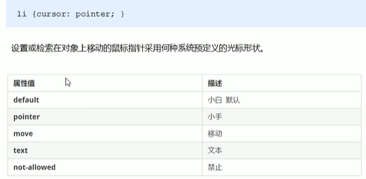

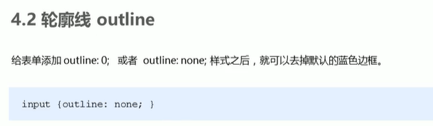

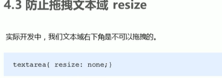

### 精灵技术

把所有小图片放到一个大的图片中

### 字体图标

字体图标展示的是图标，本质是字体，有文字的所有属性，比图片小很多，不能替换精灵图，可以优化。

下载字体图标：阿里iconfont字库，解压

把fonts文件夹放到页面的根目录下，引入html中

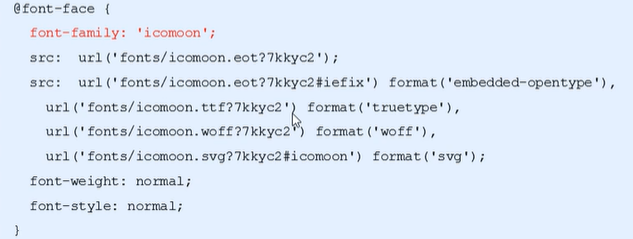

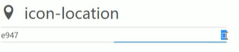

```html
<style>
    span{
        font-family:'icomoon'
    }
</style>
<span icon-location>o</span>
```


### 显示与隐藏

display：none

visibility：inherit(继承父亲的隐藏性)，visible(可以看到的)，collapse(隐藏的)

overflow溢出部分：visible，auto，hidden，scroll

### css三大特性

层叠性：样式冲突，就近原则。后面的覆盖前面的样式

继承性：子标签会继承父标签的文字相关的样式。(text-，font-，line-)

​	css的每一种属性都能添加下面的值：inherit、开启当前属性的继承。initial、将属性初始值应用于该元素。revert、重置为浏览器的默认值。revert-layer、将响应元素设置为上一级层叠层中的值。unset、将属性设置为自然之，如果属性自然继承，那就继承（**可以通过all:unset重设所有属性的值**）

优先级：多个选择器，先执行那个选择器。优先级高的不会全部覆盖优先级低的所有元素，只覆盖有冲突的。

​	选择器相同：层叠规则是后面的覆盖前面的样式

​	选择器不同：则根据选择器权重执行

**!important > 行内样式 > ID选择器 > (类选择器 | 属性选择器 | 伪类选择器 )> 元素选择器>继承或***

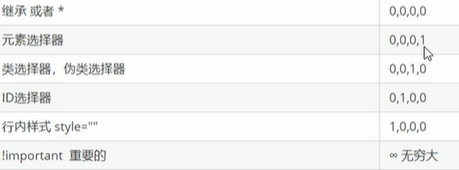

​	级联层的优先级：级联层中的优先级最小，级联层中的优先级也会按层叠性覆盖

```css
@layer div1;/*声明*/
@layer div1{
/*使用*/
    div{
        color:#fff
    }
}
```

color：pink!important;权重最大

### 背景

background-color：#fff;//默认是透明的

**background-image：url(url1),url(rul2);//背景图片非常容易控制位置，比插入图片，可以设置多个背景图像。linear-gradient(rgba(0, 0, 255, 0.5), rgba(255, 255, 0, 0.5))也属于背景图像。**

​	默认状态下背景图片重复显示，表示背景图片平铺

​		方位名词：left top和top left效果一致。如果只写一个方位名词，另一个省略，第二个是居中对齐。

​		精确名词：第一个肯定是x，第二个肯定是y坐标。

​		混合单位：第一个肯定是x，第二个肯定是y坐标。

​	background-attachment：scroll(滚动) | fixed;属性设置背景是否国定或者随页面的其余部分滚动

​	**background**：rgba(0, 0, 0, 0.3)rgb与alpha透明度，只改变背景的透明度，取值0-1

**background-clip：**改变背景图片延申的位置border-box(延申到边框外沿)|padding-box(延伸到内边框)|contet-box(内容区域为外部被裁减)|text(被裁减成文字的前景色)

**background-origin：**改变背景图像的原点位置的背景相对区域border-box(背景图片摆放位置以border为参考)|padding-box(以padding区域为参考)|content-box(以content区域为参考)

**background-position：**x  y;改变背景图片的位置，xy是x与y坐标，可以使用方位名词或者精确单位

​	top、left、center、25% 75%、bottom 50px right 100px

**background-repeat：**repeat(平铺，或重复显示) | no-repeat(不平铺) | repeat-x(x轴平铺) | repeat-y|space(图像均匀分布在盒子内)|round()

**background-size：**设置背景图片的大小，length(指定图片大小，不能为负)|percentage(指定相对背景区的百分比)|auto(以背景图片的比例缩放)|cover(完全覆盖背景区，多余的部分会被裁减)|contain(完全装入，可能右空白区域)


- 控制< img >标签平铺方式object-fit属性。
- fill：完全填充容器，但可能导致图片纵横比例发生变化。
- contain：完全适应容器，显示可能有留白。
- cover：完全覆盖，会有裁剪。

**组合写法**

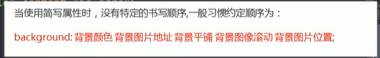

### 文本

让单行文本垂直居中

让line-height=height就行，原理：

就是文字本身的高度等于上空隙+文字高度+加下空隙=height

### 选择器

**空格：后代选择器，可以不是直接后代。**

**">"：子类选择器，必须是直接后代。**

**"+"：相邻兄弟选择器，选择必须是相邻的兄弟。**

**"~"：兄弟选择器，不一定是相邻的兄弟。**

**","：表示选中多个元素。**

通用选择器：`*` 将匹配文档的所有元素。

标签选择器：`input` 匹配任何< input >元素。

id选择器：`#toc` 匹配 ID 为 "toc" 的元素。

class选择器：`.index` 匹配任何 `class` 属性中含有 "index" 类的元

属性选择器

```css
/* 存在 href 属性并且属性值包含"example"的 <a> 元素 */
a[href="example"] {
  font-size: 2em;
}
```

派生选择器：

```css
/* 相当于子类选择器 */
h2 strong {
     color: blue;
}
```

组合选择器：各种选择器相互组合

```css
.page p{
    font-size: 18px;
}
.page > p{
    //page子元素中所有p元素
}
.page + p{
    //相邻兄弟元素，是.page下面相邻的p标签
}
.page ~ p{
	//相邻兄弟元素，是.page下面所有的p标签
}
```

伪选择器

动态伪类选择器

```css
//链接伪类，以下顺序最好不要颠倒
:link “链接”：超链接点击之前

:visited “访问过的”：链接被访问过之后

:hover “悬停”：鼠标放到标签上的时候

:active “激活”： 鼠标点击标签，但是不松手时。


:focus”input伪类焦点选择器“，当input或取焦点时添加样式
//可以通过tabindex=“1”来设置盒子是否能聚焦-1，0，1
```

UI伪类选择器

```css
E:checked（选中状态伪类选择器）：匹配选中的复选按钮或者单选按钮表单元素。目前只有Opera浏览器支持
E:enabled（启用状态伪类选择器 ）：匹配所有启用的表单可以匹配可用状态元素
E:disabled（不可用状态伪类选择器）：匹配所有禁用的表单匹配不可用状态元素
```

结构伪类选择器：结构伪类选择器，可以根据元素在文档中所处的位置，来动态选择元素，从而减少HTML文档对ID或类的依赖，有助于保持代码干净整洁。

```css
E:last-child选择父元素的倒数第一个子元素E，相当于E:nth-last-child(1)

E:nth-child(n)	选择父元素的第n个子元素，n从1开始计算

E:nth-last-child(n)	选择父元素的倒数第n个子元素，n从1开始计算

E:first-of-type	选择父元素下同种标签的第一个元素，相当于E:nth-of-type(1)

E:last-of-type	选择父元素下同种标签的倒数第一个元素，相当于E:nth-last-of-type(1)

E:nth-of-type(n)	与:nth-child(n)作用类似，用作选择使用同种标签的第n个元素	

E:nth-last-of-type	与:nth-last-child作用类似，用作选择同种标签的倒数第一个元素

E:only-child	选择父元素下仅有的一个子元素，相当于E:first-child:last-child或E:nth-child(1):nth-last-child(1)

E:only-of-type	选择父元素下使用同种标签的唯一子元素，相当于E:first-of-type:last-of-type或E:nth-of-type(1):nth-last-of-type(1)

E:empty	选择空节点，即没有子元素的元素，而且该元素也不包含任何文本节点

E:root	选择文档的根元素，对于HTML文档，根元素永远HTML
```

否定伪类选择器

E:not(F)：匹配所有除元素F外的E元素

选择器优先级

```html
1.id选择器（#myid）

2.类选择器（.myclassname）

3.标签选择器（div,h1,p）

4.子选择器（ul < li）

5.后代选择器（li a）

6.伪类选择（a:hover,li:nth-child）
```

### 伪元素

**设置元素指定部分的样式。伪元素一般是双冒号，css1与css2中是单:，为了兼容css1与css2可以使用单:**

::first-line：伪元素向文本首行添加样式

::first-letter：向文本的首字母添加样式

::before：可以在元素内容之前插入内容。比如图片文字等

::after：用于在元素内容之后插入元素

::selection：匹配用户选择的元素部分，可以给用户选择的内容添加背景颜色。

### 文档流

https://blog.csdn.net/chelen_jak/article/details/41961087

**静态定位：**元素默认定位方式，无定位的意思

**相对定位：**设置相对定位后，原来位置依然被占，相对于自身原来的位置移动。position：relative。最主要的作用就是给绝对定位当爹

**绝对定位**：设置绝对定位后，原来的位置会被空出来，position：absolute。

​	当没有祖先或者祖先没有定位，以浏览器为准定位，

​	当有父元素，且父元素也定位了(只要不是静态就行)，就衣服元素为准

**固定定位：**相对于浏览器可视区窗口，其余的特点类似于绝对定位position：fixed。

**粘性定位：**相对于浏览器可视区窗口，原来位置依然被占，必须添加top，left，right，bottom其中之一才有效。可以固定**文章的目录**


flaot：left设置盒子向右浮动。

​	1、脱离标准流移动到指定位置，

​	2、浮动盒子不再保留原来位置

清除浮动：清除浮动主要是为了解决，父元素因为子级元素浮动引起的内部高度为0的问题

​	第一种方式：在在父元素内最后一个浮动标签后，新加一个标签，给其设置clear：both这样的css样式(不推荐)；

​	第二种方式：给父元素添加overflow属性（父元素添加overflow:hidden）（不推荐）

​	第三种方式：(推荐)伪元素

```css
.clearfix::after{/*伪元素是行内元素 正常浏览器清除浮动方法*/
    content: "";
    display: block;//块
    height: 0;
    clear:both;//左右两侧不允许有浮动元素
    visibility: hidden;//隐藏元素，但是隐藏后位置依然被占
}
```

​	第四种方式：使用双伪元素

```css
.clearfix::after,.clearfix::before{
    content: "";
    display: table;
}
```

### 内联元素与块状元素的特点

**内联元素：**`<span>、<em>、<a>、<p>`等标签，当然块状元素也可以通过设置display：inline；显示为内联元素，从而使块级元素具有内联元素的特点。

​	1、和其他元素在同一行上，不独占一行；

​	2、元素的高度、宽度及顶部底部边距不可设置；

​	3、元素的宽度就是元素所包含的图片或文字的宽度，不可设置；

​	4、内联元素的顶部底部边距margin-top及margin-bottom属性不起作用，而margin-left及margin-right属性可以起作用。padding属性top、bottom、left、right也可起作用，但是padding-top属性最多只能撑到浏览器顶部，padding-top高于浏览器顶部，元素不会下移。当为行内元素添加背景时可以使用padding,但是背景色会覆盖周围元素。

**块状元素：**<div>、 <p>、<h1>、<form>、<ul> 和 <li>就是块状元素。内联元素可以通过设置display:block；显示为块状元素。

​	1、每个块状元素都从新的一行开始，并且其后的元素也另起一行（独占一行）；

​	2、元素的高度、宽度、行高以及顶和底边距都可设置；

​	3、元素宽度在不设置的情况下，占它本身父容器的100%（和父元素宽度一致）；

​	4、一个容器内部可以放行内或者块级元素(p与h标签内部不能放块级元素，因为它是内容块级元素)

**行内块元素：**img，input，td，它同时有会计元素的特点，也有行内元素的特点。可以使用display:inline-block设置行内块元素(button，input，textarea，select，img)

​	1、和相邻行内元素在同一行，但是之间会有空隙，一行显示多个

​	2、默认宽度就是它本身内容的宽度

​	3、高度，行高，外边距可设置

### 盒子模型

box-sizing来指定盒子模型，有两个值：content-box(默认)、border-box(现在)

- Margin(外边距) - 清除边框外的区域，外边距是透明的。
- Border(边框) - 围绕在内边距和内容外的边框。
- Padding(内边距) - 清除内容周围的区域，内边距是透明的。
- Content(内容) - 盒子的内容，显示文本和图像。

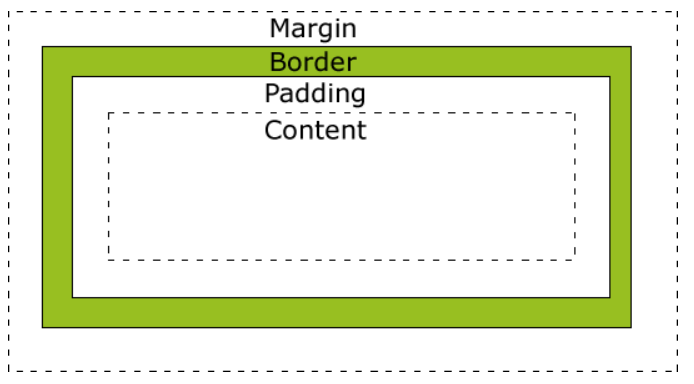

### 元素折叠规则

如果想设置z-index，position不能为static

一个文档可以有多个层叠上下文：

​	天生派：页面根元素天生具有层叠上下文，position：fixed也是天生是层叠上下文。

​	正统派：指的是普通元素设置了z-index的值为数值不是auto的时候的定位元素是层叠上下文。position的值为absolut或relative且z-index值不为auto。position为fixed或sticky

​	扩招派：其他css3属性。

每个层叠上下文的层叠顺序：假设bock盒子设置了inline元素，整体就以inline在层叠上下文的位置为准

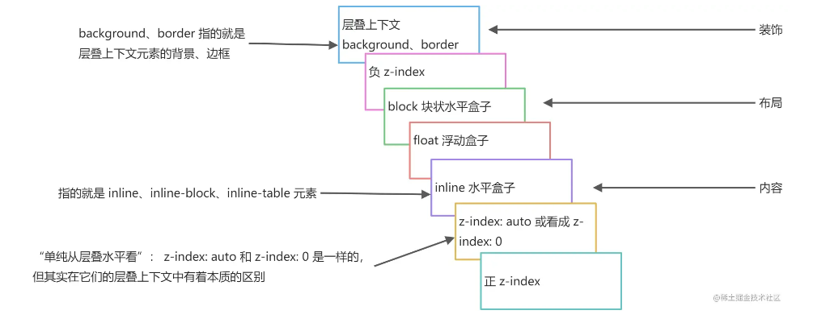

上下文的排列顺序：

​	当元素具有明显的层叠标识时，例如 `z-index` ，那么谁大谁就在上面显示

​	当发生层叠的元素具有相同水平层叠顺序时，那么在 DOM 流中，**后者居上**

### BFC(块级格式化上下文)于IFC(内联格式化上下文)

BFC：可以理解成一个隐含的属性，当满足某个条件就能开启

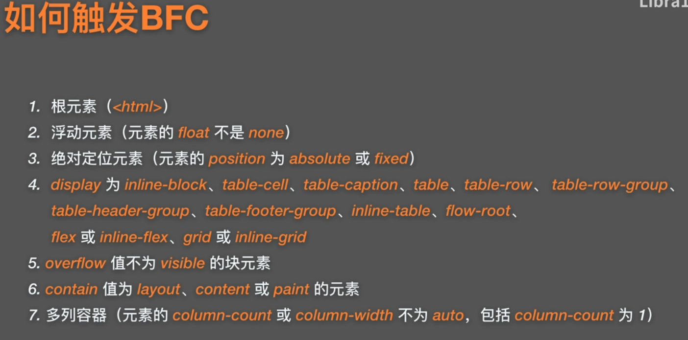

BFC区域内的元素不会影响到BFC外面的，相当于一个独立的区域

1、开启BFC后，其子元素不会产生margin塌陷问题

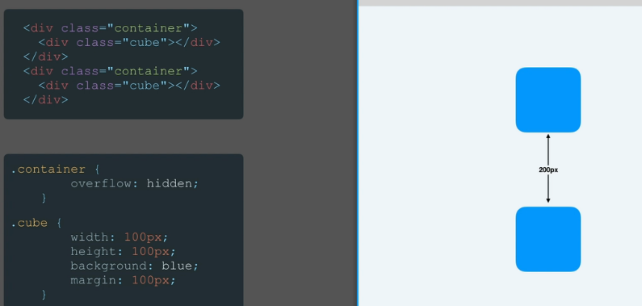

2、BFC：可以清除浮动。

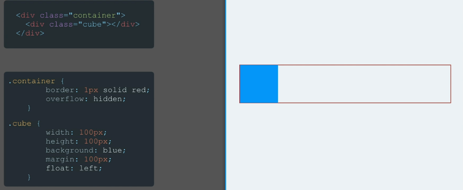

3、BFC：可以清除覆盖浮动问题，正常元素变成BFC

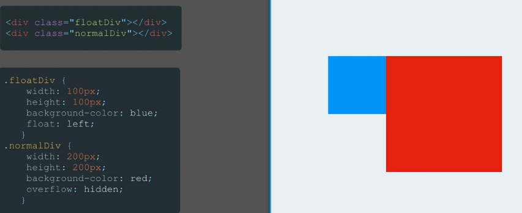

IFC：只计算水平方向的 padding、margin、border

## html5新特性

### 语义化标签

一看这个标签就知道他是干啥的

< header >：头部标签。< nav >：导航标签。< article >：内容标签。< section >：块级标签。< aside >：测边框标签。< footer >：尾部标签。

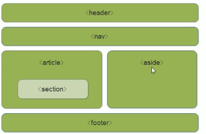

### 多媒体标签

音频：< audio >

```html
<audio src="media/snow.mps"></audio>
```

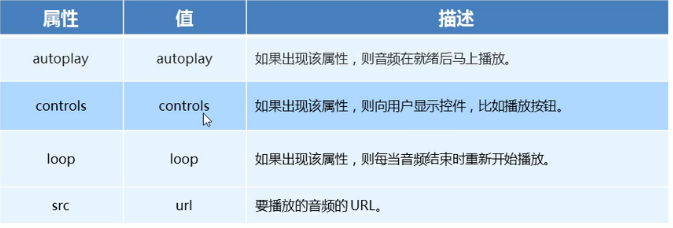

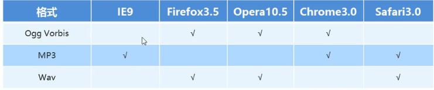

视频：< video >

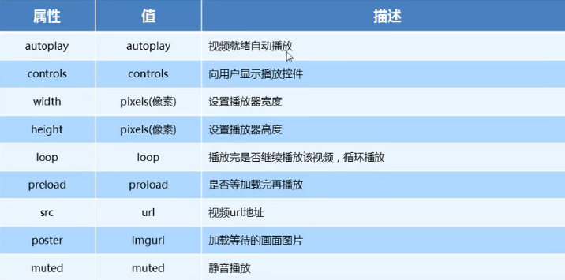

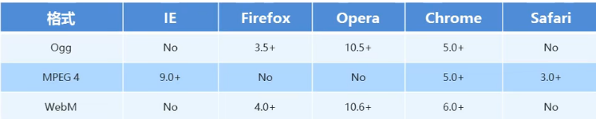

### 表单属性

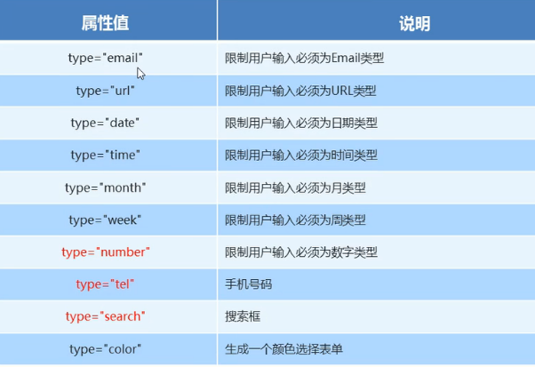

### Canvas画布

### 本地存储

### Web workers

### 应用缓存

### 无障碍

## css3新特性

常见的分辨率

分辨率   比例 | 设备尺寸 

1024 * 500		（8.9 寸） 

1024 * 768		（4 : 3  | 10.4 寸、12.1 寸、14.1 寸、15 寸） 

1280 * 800		（16 : 10  |15.4 寸） 

1280 * 1024		（5：4  | 14.1寸、15.0寸） 

1280 * 854		（15 : 10 | 15.2） 

1366 * 768		（16：9 | 不常见） 

1440 * 900		（16：10  17寸 仅苹果用）

1440 * 1050		（5：4  | 14.1寸、15.0寸） 

1600 * 1024		（14：9 | 不常见） 

1600 * 1200		（4：3 | 15、16.1） 

1680 * 1050	     （16：10 | 15.4寸、20.0寸）

 1920 * 1200		（23寸）

### 自定义属性

分别给box与box1定义属性，如果没有定义则使用var第二个参数的默认值，自定义属性必须使用时前--

```css
.box{
            --main: pink;
        }
        .box{
            width: 100px;
            height: 100px;
            background-color: var(--main,black);
        }
        .box1{
            --main: rgb(192, 255, 192);
        }
        .box1{
            width: 100px;
            height: 100px;
            background-color: var(--main);
        }
```


### 元素单位

px：绝对单位，页面按精确像素展示。因为像素比不同，所以展示的大小可能也有不同。

em：相对于当前对象内文本的字体尺寸。如当前对行内文本的字体尺寸未被人为设置，则相对于浏览器的默认字体尺寸（`1em = 16px`）

rem：相对单位，相对的只是HTML根元素`font-size`的值，同理，如果想要简化`font-size`的转化，我们可以在根元素`html`中加入`font-size: 62.5%`

vw：就是根据窗口的宽度，分成100等份，100vw就表示满宽，50vw就表示一半宽。

vh：`vh`则为窗口的高度

### 响应式布局

#### 媒体查询：媒体查询的功能，这个功能可以让你查询当前运行网页的设备的一些信息，让你可以通过这些信息来调整网页的布局和样式等。

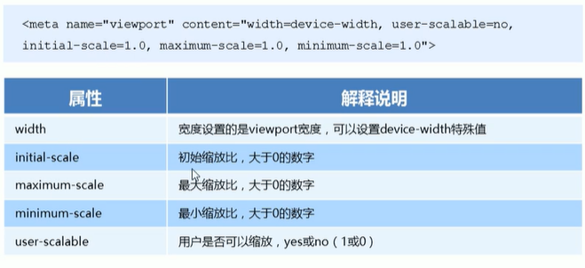

```css
/** style.css 样式被用在宽度小于或等于 480px 的手持设备上，或者被用于屏幕宽度大于或等于 960px 的设备上 **/ <link rel="stylesheet" type="text/css" href="style.css" media="handheld and (max-width:480px), screen and (min-width:960px)" />

// 屏幕大于 1024px 或小于 1440px 时应用该样式
@media screen and (min-width: 1024px) and (max-width: 1440px) {
  ...
}


// 屏幕大于 1440px 时应用该样式
@media screen and (min-width: 1441px) { 
  ...
}

// 屏幕大于 1024px 或小于 1440px 时应用该样式
@media screen and (min-width: 1024px) and (max-width: 1440px) { 
  ...
}
```

#### Flex布局

**可以实现max-width实现网页div剧中，并且当浏览器不够宽度时，就自动缩小盒子的宽度，使用flex也能实现**

https://blog.csdn.net/youhebuke225/article/details/106414855

##### 容器属性

display：flex开启响应式布局，开启以后它会向主轴方向排列默认是右边。

​	flex-direction：设置主轴方向右，左，下，上(row，row-reverse，column，column-reverse)默认主轴向右，侧轴向下

​	flex-wrap：设置超出部分是否换行，默认是不会超出的，因为盒子是弹性的，需要设置flex-shrink:0才会让子元素是不弹性，nowrap不换，wrap换行，wrap-reverse反向换行。

​	flex-flow：是flex-direction与flex-wrap的缩写

​	justify-**content**：主轴上元素的布局。`flex-start` 从主轴的起点开始（默认），`flex-end` 从主轴的终点开始，`center` 居中，`space-between`两端对齐，中间均匀分布，`space-around`空间平均分布在每个盒子的两边(**所有元素在父容器之间的对齐方式**)

​	align**-items**：设置交叉轴方向上的对齐方式(**在每个盒子内部，元素在每个盒子内的对齐方式**)

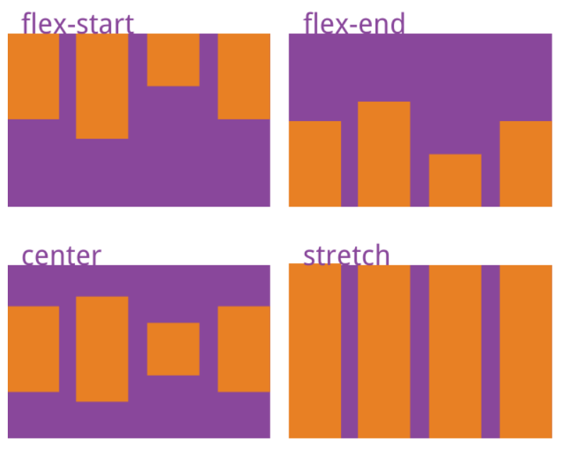

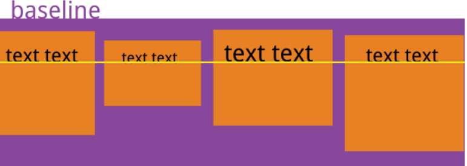

​	align-content：当有多行元素时的布局

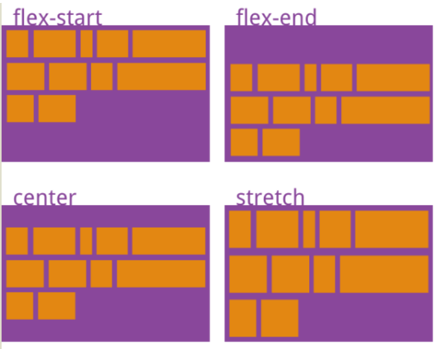

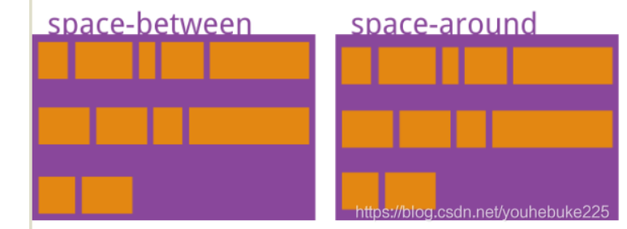

##### 子属性

如果一个容器是弹性容器，那么他的子容器就是弹性项目，孙子容器不是。

​	order：可以指定排列顺序，order：num，num越大越往后排

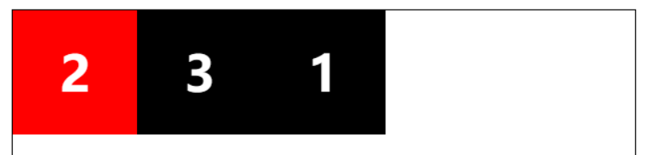

​	flex-grow：flex-grow: 1如果父元素还有剩余空间，就平均分配给每一个项目。

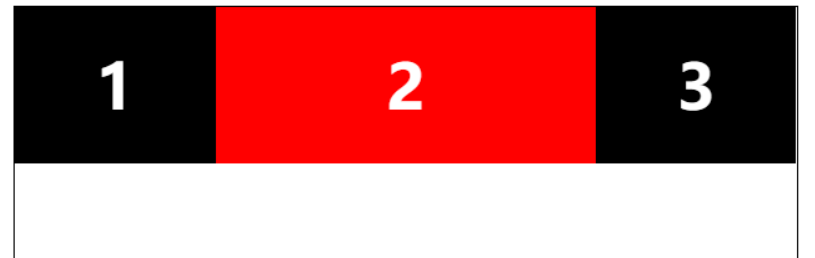

​	flex-shrink：与flex-grow相反当父元素空间不够时，就收缩flex-shrink标记的值`flex-shrink：0`表示不收缩

​	flex-basis：表示盒子初始的时候所占空间的大小，单位px

​	flex：是flex-grow，flex-shrink，flex-basis的简写。默认0 1 auto

​	align-**self**：**设置单个盒子内的对齐方式**

1. `auto` 继承`align-items`的属性
2. `flex-start` 盒子从侧轴开始的地方布局
3. `flex-end` 盒子从侧轴结束的地方布局
4. `center` 盒子在侧轴居中位置
5. `baseline` 文字基线对其
6. `stretch`默认值，没有高度自动充满父元素

#### Grid布局

开启Grid：display：grid;

**grid-template-columns：100px 100px 100px;、表示每行有三个盒子宽度分别是100px，**

**也可以用fr指定浮动宽度，假设都是1fr，表示每个占三分之一，使用fr是响应式的。**

**也可以使用repeat(3, 200px);3表示三个元素，每个元素的宽或高是200px。**

**grid-template-columns：repeat(auto-fill, 200px);让一行尽可能多的容纳元素。**

**grid-template-columns：200px 1fr minmax(400px, 1fr)，设置这个列的最小与最大值**

**auto：是尽可能的占据剩余空间**

##### 容器属性

grid-template-rows：设置每一行的行高。

column-gap：设置列间距

row-gap：设置行间距

gap：表示行和列同时设置

```css
.layout{
            grid-template-areas: "header header header"
					"sidebar content content"
					"footer footer footer" 
        }
header{
	grid-area: header;
}
main{
    grid-area: content;
}
aside{
    grid-area: sidebar;
}
footer {
    grid-area: footer;
}
```

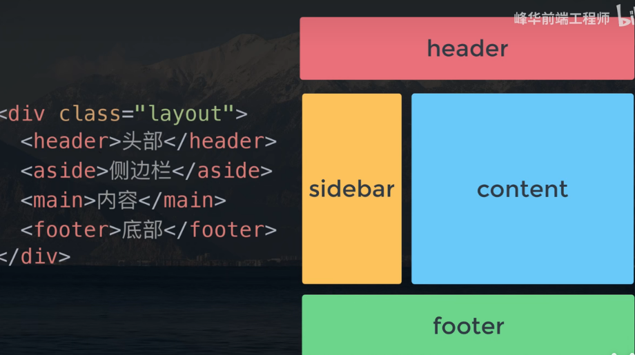

grid-auto-flow：row(先排行再排列)，column(先排列后排行)。row dense(当前面的盒子有控出时，就让下面的的盒子填充)


justify-items：center：表示x轴方向剧中对齐，end：靠右对齐，space-between：两端对齐，start：对其单元格起始边缘。（每个单元格内对齐方式，可以设置每个元素项目的高度不同）

align-items: conter:表示y轴方向剧中对齐，end：靠下对其（每个单元格内对齐方式）

place-items：align-items与justify-items简写。

align-content：center：表示对于弹性内部所有快y周方向剧中(整个内容区在水平方向的位置)(strech：拉伸整个网格，space-around：x轴方向有间隔，space-between，space-evenly)

justify-content：center：x轴，其他与align-content相同。(整个内容区在垂直方向位置)

place-content：align-content与justify-content简写

当没有定义grid-template-columns` 和 `grid-template-rows时，可以通过grid-auto-columns`和`grid-auto-rows设置宽度或高度

##### 项目属性

grid-column-start：表示从左边框的网格线到grid-column-end：右边框的网格线。

grid-row-start：上边框的网格线到grid-row-end：下边框的网格线。

也可以向以下方式指定

**grid-row: 1 / 4;    grid-column: 2 / 3;**


  grid-template-areas: 'a a a'

​									'b b c' 

​			                        'e e c';

 **grid-area: c;**

justify-self：设置单个项目的对齐方式，与justify-items完全相同

align-self：设置单个项目的对齐方式，与align-items完全相同

属性值：start | end | center | stretch

#### 瀑布流

使用flex实现瀑布流

```html
<style>
.box {
            display: flex;  
            flex-flow: column wrap;
            height: 100vh;
        }
        .item {
            margin: 10px;
            width: calc(30% - 20px);
        }
</style>
<div class="box">
        <div class="item">
          <div class="div1"></div>
        </div>
        <div class="item">
            <div class="div2"></div>
        </div>
        <div class="item">
            <div class="div3"></div>
        </div>
        <div class="item">
            <div class="div4"></div>
        </div>
        <div class="item">
            <div class="div5"></div>
        </div>
        <div class="item">
            <div class="div6"></div>
        </div>
        <div class="item">
          <div class="div7"></div>
        </div>
        <div class="item">
          <div class="div8"></div>
        </div>
        <div class="item">
          <div class="div9"></div>
        </div>
        <div class="item">
          <div class="div10"></div>
        </div>
        <div class="item">
          <div class="div11"></div>
        </div>
        <div class="item">
          <div class="div12"></div>
        </div>
        <div class="item">
          <div class="div13"></div>
        </div>
      </div>
```

使用grid实现瀑布流

### 动画

text-shaow:1px 1px 3px red文字阴影

3表示模糊度，阴影可以加多个


box-shaow:1px 1px 3px 7px inset red盒子阴影

第一个1px表示向右偏移

第二个1px表示向下偏移

3px表示模糊度

7px表示外延值

inset表示内置阴影


指定css3渐变：

**线性渐变：是一条直线**

background-image：linear-gradient(to top, red,green);to top：从下到上，to left：从右向左，36deg（36度）：到36°

background-image：repeationg-linear-gradient(blue 20%,yellow 40%);

**径向渐变：从中心点向外扩展**

background-image：radial-gradient(circle, bule, yellow)

大小：最近边：closest-side最远边：farthest-side最近角：closest-corner最远角：farthest-corner

形状：circle圆，ellipse椭圆(默认)

中心：(at 10px 10px);设置中心点的位置

#### 2d

```css
            /* 移动，参考点为右上角 */
            /* 向右移动 */
            /* transform: translate(30px); */
            /* 向右和向下移动 */
            /* transform: translate(30px, 50px); */

            /* 旋转，参数只有一个，参数是正表示顺时针，围绕元素中心旋转 */
            /* transform: rotate(36deg); */

            /* 缩放，以中心点进行缩放 */
            /* 盒子缩小一倍 */
            /* transform: scale(0.5); */
            /* 可以传递两个参数，表示水平方向和垂直方向 */
            /* transform: scale(0.5, 1.2); */

            /* 倾斜 */
            /* 一个值表示水平倾斜，两个值表示水平和垂直 */
            transform: skew(40deg, 20deg);

 /* 设置原点，以上属性除了移动，其他属性参考点都是原点。默认原点是中心点。transform-origin：center center */
transform-origin：top|bottom|center|left|right

/*一个ransform可以设置多种操作，中间用空格隔开*/
transform: rotate(10deg) translate(50px);
```

#### 3d

父元素需要设置的属性

transform-style：preserve-3d(子元素保留3D位置)|flat(子元素不保留3D位置)。就是父元素设置3d了，子元素能不能设置3d

perspective：1000px；表示3d的深度。

perspective-origin：center center；表示观察点的位置。根据平面的观察点不同，3d会呈现出不同的效果

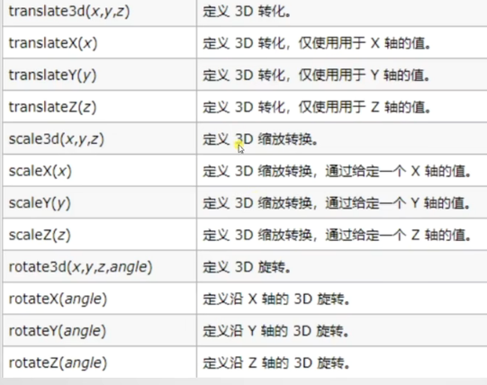

```css
/*位移,必须传递三个参数,translateX(),translateY(),translateZ()*/
translate3d(x, y, z)

/*旋转，rotateX(),rotateY(),rotateZ()*/
translateX(30deg)/*顺时针旋转30度*/
transform-origin:left;/*围绕左边框旋转*/
backface-visibility:visible|hidden;/*visible背面可见，hidden背面不可见*/

/*缩放，必须穿3个参数，scaleX scaleY scaleZ*/
scale3d(num,num,num)/*分别表述倍率*/
transform: scaleZ(2) translateZ(100px);/*使当前节点z轴距离扩大一倍*/
```

#### 过度

transition：过度

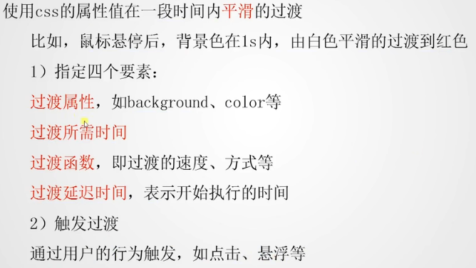

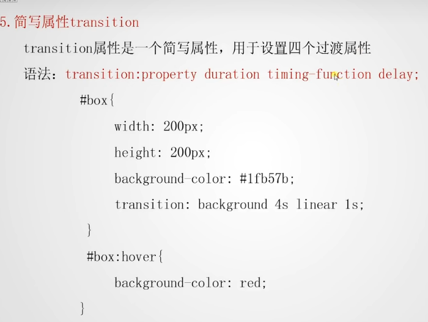

```css
.box1{
            background-color: red;
            width: 200px;
            height: 200px;
            margin: 200px auto;
            /* 过度属性,all表示所有属性，不建议设置all，建议transition-property: transform background; */
            transition-property: background-color;
            /* 过度完成时间 */
            transition-duration: 2s;
            /* 过度函数,linear匀速 */
            transition-timing-function: linear;
            /* 延时执行时间 */
            transition-delay: 1s;
        }
        .box1:hover{
            transform: translate(30px, -10px);
            box-shadow: 0px 0px 10px 10px #ccc;
            background-color: green;
        }
```

**transition: transform 2s, background 2s;简写设置多个属性**

transition-timing-function取值：

默认为`ease`

`ease`：开始慢，中间快，结束慢

`linear`：匀速

`ease-in`：开始慢，结束快

`ease-out`：开始快，结束慢

`ease-in-out`：开始慢，中间快，结束慢(和ease稍有区别)

`cubic-bezier()`：函数定义了一个贝塞尔曲线(Cubic Bezier)。贝塞尔曲线曲线由四个点 `P0`，`P1`，`P2` 和 `P3` 定义。`P0` 和 `P3` 是曲线的起点和终点。`P0`是（`0`,`0`）表示初始时间和初始状态，`P3`是（`1`,`1`）表示最终时间和最终状态。

需要给此函数传递`P1`，`P2`代表两个坐标点：`cubic-bezier(x1,y1,x2,y2)`

`x1` 和 `x2` 的取值范围`0` 到 `1` 之间的数字，y可以取任何值。

#### 动画

**通过keyframes定义关键帧**

动画属性从默认到25%的属性值，然后到100%的属性值

```css
@keyframes biankuang{
    25%{background-color: blueviolet;
        transform: translateX(0px);
    }
    100%{
        background-color: blueviolet;
        transform: translateX(100px);
    }
}
```

**animation-name：输入keyframes定义的名字**

**animation-duration：设置动画的持续时间，默认为0s**

**animation-timing-function：用于定义运动速率和轨迹**

| 值                            | 描述                                                         |
| ----------------------------- | ------------------------------------------------------------ |
| linear                        | 动画从头到尾的速度是相同的。                                 |
| ease（缓解）                  | **`默认值`**：动画以低速开始，然后加快，在结束前变慢。       |
| ease-in                       | 动画以低速开始。                                             |
| ease-out                      | 动画以低速结束。                                             |
| ease-in-out                   | 动画以低速开始和结束。                                       |
| cubic-bezier(*n*,*n*,*n*,*n*) | 贝塞尔曲线（自定义数值），可到[相关网站](https://link.juejin.cn?target=https%3A%2F%2Fcubic-bezier.com%2F)可视化设置。 |

**animation-delay：设置动画的延迟时间**

**animation-iteration-count：设置动画的执行次数，默认执行1次，infinite执行无限次**

**animation-direction：用户设置动画执行方向**

| 值                  | 描述                                 |
| ------------------- | ------------------------------------ |
| normal              | 默认值。动画按正常播放。             |
| reverse             | 动画反向播放。                       |
| alternate（交替的） | 动画正向交替执行（正向->反向）Loop。 |
| alternate-reverse   | 动画反向交替执行（反向->正向）Loop。 |
| inherit             | 从父元素继承该属性。                 |

**animation：name duration timing-function delay iteration-count direation**

### 函数

width：calc(100% / 3);

color：var(--cs-sf-sf);

