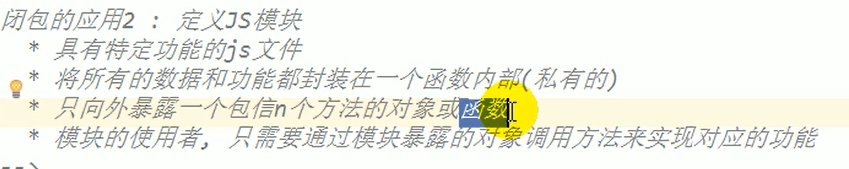
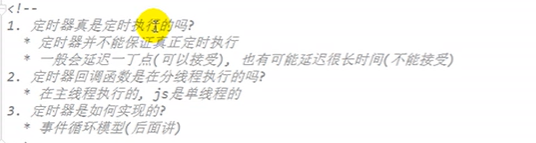

css框架：tailwind，bootstarap

组件库：ElementUI(Vue)，LayUI，VantUI(Vue)，NUTUI，Ant-Design(React，有vue版本的)

数据可视化：AntV

组件插件：富文本编辑器，弹窗，轮播图

工具库：jQuery，Axios

动效库：Animate.css

字体图标库：IconFont，IconPark

```html
// alert("这是js代码") 浏览器的一个弹窗
// document.write("lfjsd;kfjlsd") 写在body标签中
// console.log("fdjsaklf") 在控制台中打印
<a href="javascript: alert('jfdksl');">dfas</a>
<button onclick="alert('dfsfas')">kjq</button>
```

## javascript基本的语法

//单行注释。/**/多行注释。

```javascript
/*
*js完全区分大小写
*js中每行语句以;结尾，如果不写分号浏览器会添加，会消耗浏览器的性能
*js中会忽略多个空格与换行
*/
```

```javascript
/*
*字面量，比如1，2，3
*变量，x=1
*/
//声明变量
var a = 123;
```

```javascript
标识符规范
//js中所有可以自主命名的都可以称为标识符（变量名，函数名，属性名）
//标识符可以写字母，数字，_，$，不能以数字开头，不能是关键字或保留字
//js底层保存的标识符是实际上是采用unicode编码，所以理论上将，所有的utf-8含有的内容都可以作为标识符
```

### 基本数据类型

```javascript
字符串
//在js中有6中数据类型、String 字符串、Number 数值、Boolean 布尔值、Null 空值、Undefined 未定义、Object 对象（引用类型）

//字符串
//\作为转译字符
var str = "hello";//单引号与双引号都可以用，不能嵌套（双引号不能放双引，但是可以先用单引号再用双引号）
```

```javascript
数值型
var a = 123;
//typeof可以检查变量的类型
console.log(typeof a);
//Number.MAX_VALUE最大值，如果表示的数字超过最大值返回Infinity正无穷，Infinity是一个数字类型
a = "abc" * "abc" //结果为NAN也是一个数值类型，表示不是一个数字
//Number.MIN_VALUE表示0以上的最小值,最小的小数

//js中整数运算可以保证精确，如果使用js小数会得到不精确的值
```

```javascript
布尔值类型
//布尔值只有两个 true，false
```

```javascript
null和undefined
//null只有一个值 null。是一个object类型
//null专门用来表示一个为空的对象

//undefind类型只有一个，表示未定义，没有给变量赋值时就是undefined，是一个undefned类型
```

```js
BigInt类型
//“number” 类型无法安全地表示大于 (253-1)（即 9007199254740991），或小于 -(253-1) 的整数。
//BigInt 类型是最近被添加到 JavaScript 语言中的，用于表示任意长度的整数。
// 尾部的 "n" 表示这是一个 BigInt 类型
const bigInt = 1234567890123456789012345678901234567890n;
```

```js
Object类型和Symbol类型
//object 类型是一个特殊的类型。其他所有的数据类型都被称为“原始类型”，因为它们的值只包含一个单独的内容（字符串、数字或者其他）。相反，object 则用于储存数据集合和更复杂的实体。
//symbol 类型用于创建对象的唯一标识符。我们在这里提到 symbol 类型是为了完整性，但我们要在学完 object 类型后再学习它。
```

### 判断数据类型

typeof：数值/字符串/布尔/undefined/function(不能判断：null与Object，Object与Array)

```js
typeof undefined // "undefined"

typeof 0 // "number"

typeof 10n // "bigint"

typeof true // "boolean"

typeof "foo" // "string"

typeof Symbol("id") // "symbol"

typeof Math // "object"

typeof null // "object"，这是官方承认的错误，这个问题来自于js早期阶段，并为了兼容性而留下的，null绝对不是object。

typeof alert // "function"，js没有特别的function类型，函数隶属于object类型。但是typeof会对函数区分对待，并返回function。这也是js早期问题
```

instanceof：判断对象的具体类型

​	A instanceof B：如果B函数的显示原型对象在A对象的原型链上，返回true，否则返回false

===：null/undefined

### js交互

**alert**

```js
alert("Hello");//弹出一个提示框
```

**prompt**

```js
//接收两个参数，分别是提示内容，和input输入框的默认值
let age = prompt('How old are you?', 100);
//返回用户点击的值
alert(`You are ${age} years old!`);
```

**confirm**

```js
//提示交互的值，不用输入
let isBoss = confirm("Are you the boss?");
//返回用户点击的值
alert( isBoss );
```

### 强制类型转换

```javascript
//主要是将其他的数据类型转换为String Number Boolean
//null与undefined没有toString方法

其他数据类型转换为String
1、调用被转换数据类型的toString()方法
var a = 123;
var b = a.toString();
a = true;
a = a.toString();
2、调用Sring函数，将a转换为字符串
var a = 123;
a = String(a)


将其他的数据类型转换为Number
1、使用Number()函数
var a = "123";
//如果字符串中不是一个数字转换后为NAN表示不是一个数
//如果字符串是一个空串或全是空格转换后是一个0
//true转成1，false转换为0，null转成0，undefined是一个NAN
a = Number(a);
2、ParseInt()把一个字符串转换成一个整数，ParseFloat()把一个字符串转换成一个浮点数
var a = "123px";
a = parseInt(a, 10);//可以把数字取出转化为数字，如果对非String使用parseInt会先转换为String再转换int。10表示一个10进制

其他类型转换为Boolean值
//数字转boolean，除了0和nan其余的都是true
//字符串转boolean，除了空串其余的都是true
//null，undefined转换成boolean是false
//对象也会转换为true
var a = 123;
a = Boolean(a);
console.log(a);


布尔转换
//直观上为“空”的值（如 0、空字符串、null、undefined 和 NaN）将变为 false。
alert( Boolean(1) ); // true
alert( Boolean(0) ); // false
alert( Boolean("hello") ); // true
alert( Boolean("") ); // false
```

### 运算符

运算符可以对一个或多个值进行计算，返回结果

```javascript
var a = 123;
var result = typeof a;//result是一个字符串类型
算数运算符
+、-、*、/、%、**(求幂)//当对非Number进行运算会先转换成数值让后进行运算，任何值与nan做计算结果都是nan、
//对两个字符串做+会拼成一个字符串、
var b = "123" + "345";
//任何值和字符串做+都会转换成字符串让后拼串
var c = 123;
c = c + "";  

一元运算符
var a = 123;
a = -a;
//对于非number会先转换为number再运算
a = true;
a = -a;
a = "18";
a = -a;
```

```javascript
//自增
var a = 1;
a++;先输出再计算
++a;先计算再输出
//自减
a--;
--a;
```

**一元运算符的加号**

可以把非数值转化成数值，与Number相似，但是比Number更加简洁。

一元运算符的优先级大于二元运算符

```js
// 转化非数字
alert( +true ); // 1
alert( +"" );   // 0

let apples = "2";
let oranges = "3";
// 在二元运算符加号起作用之前，所有的值都被转化为了数字
alert( +apples + +oranges ); // 5
```


```javascript
逻辑运算符：!, &&, ||
//!: 如果对非boolean进行取反，会先转化为boolean让后取反
//&&: 属于短路的与，会先转化为boolean让后再运算，并返回原值（反回的是后面的值），如果有false则返回false，如果两个都为false返回第一个false
//||: 输入短路或

let height = 0;
alert(height || 100);//100，都会转化为boole，会返回第一个true的值
alert(height ?? 100);//0，会先判断height有没有定义，优先级与||相同，因为||有很多缺点，无法区分false、0、空字符串 "" 和 null/undefined。它们都一样 —— 假值，所以出现了??
```

```
赋值运算符：=，+=，-=，*=，/=，%=
```

```javascript
关系运算符
//比较两个值之间的关系，如果关系成立返回true
>,<,==,!=//任何值和nan比较结果都为false
//如果两边都是字符串，不会将转换为number而是转换为unicode编码

//NaN不和任何值相等，包括他本身，可以用isNaN()函数来判断是否为NaN
== ：比较的是两个值，如果类型不同，现将字符串转换再进行比较
!= ：比较的是两个值，如果类型不同，现将字符串转换再进行比较
===：全等，用来判断两个值是否相等，不会做类型转换
```

```javascript
三元运算 条件表达式?语句1:语句2;
```

**位运算符**

- 按位与 ( `&` )
- 按位或 ( `|` )
- 按位异或 ( `^` )
- 按位非 ( `~` )
- 左移 ( `<<` )
- 右移 ( `>>` )
- 无符号右移 ( `>>>` )

**逗号运算符**

```js
let a = (1 + 2, 3 + 4);
alert( a ); // 7（3 + 4 的结果）

// 一行上有三个运算符
for (a = 1, b = 3, c = a * b; a < 10; a++) {
 ...
}
```

**运算符的优先级**


| 优先级 | 名称     | 符号 |
| :----- | :------- | :--- |
| 15     | 一元加号 | `+`  |
| 15     | 一元负号 | `-`  |
| 14     | 求幂     | `**` |
| 13     | 乘号     | `*`  |
| 13     | 除号     | `/`  |
| 12     | 加号     | `+`  |
| 12     | 减号     | `-`  |
| 2      | 赋值符   | `=`  |

### 值得比较

**==与>、<、>=、<=的逻辑相互独立。他们都会对数据类型进行转换成int后再进行判断。**

**但是null进行==判断时不会转换位int数据类型。**

字符串比较

```js
alert( 'Z' > 'A' ); // true
alert( 'Glow' > 'Glee' ); // true
alert( 'Bee' > 'Be' ); // true
```

不同类型间的比较

**当对不同类型的值进行比较时，JavaScript 会首先将其转化为数字（number）再判定大小。**

```js
alert( '2' > 1 ); // true，字符串 '2' 会被转化为数字 2
alert( '01' == 1 ); // true，字符串 '01' 会被转化为数字 1
alert( true == 1 ); // true，true转化成1
alert( false == 0 ); // true，false转化成0
```

严格相等

```js
alert( 0 === false ); // false，严格相等不会进行数据类型转换
//两个特殊的比较
alert( null === undefined ); // false
alert( null == undefined ); // true
```


### 流程控制

{

​	这是代码块的内容，要么都执行，要么都不执行，代码块的后面不用写分号。js中的代码块只有分组的作用，没有其他的作用。代码块内部的内容再外面是可见的

}

```javascript
if(条件1){
    语句;
}else if(条件2){
    语句;
}else{
    语句;
}
```

```javascript
//条件分支语句
switch(条件表达式){//会给下面的值进行全等比较
    case 1:
        语句1
        break;
    case 2:
        语句2
        break;
    default:
        语句3
        break;
}
```

```javascript
//循环语句
while(条件表达式){
    语句
}
console.time("test");//test是计时器的名称
outer: //为循环起一个名称
for(var i = 0; i < 10; i++){
    语句
    break outer;//指定终止循环的名称
}
console.timeEnd("test");//用来中止计时器
break: 可以退出循环语句和switch，只对离他最近的产生影响
continue: 可以终止本次循环，给break用法一样
```

### 对象

对象是一种复合的数据类型

内建对象

​	es标准定义的对象，在任何es的实现中都可以使用

​	比如，Math，String，Number，Boolean，Function，Object。。

宿主对象

​	有js的运行环境提供的对象，目前来讲有浏览器提供的对象

​	比如BOM，DOM

自定义对象

​	有开发人员指定

```javascript
//创建对象，typeof检查对象，会返回object
var obj = new Object();
//像对象中添加属性
obj.name = "孙悟空"; 
console.log(obj.fender);//读取对象的不存在的属性会返回undefined
delete obj.name;//删除对象的属性

//对象的的属性名不要求强制标识符的规范，尽量按标识符的规范去做。如果使用特殊字符不能用以上的方式定义属性
var n = "123"
obj[n] = 123;//这种方式更加灵活
console.log(obj["123"]);

//属性值可以传入对象
console.log("test" in obj);//检查obj中是否有属性test
```

```javascript
//对象的字面量，来创建对象
var obj = {age:18};
obj.name = "孙悟空";
console.log(obj.age);
console.log(obj.name);
```


使用工厂的方法创建对象

```javascript
//使用工厂创建的对象都是object不能区分对象
function createPerson(name, age){
    //创建一个新的对象
    var obj = new Object();
    obj.name = name;
    obj.age = age;
    return obj;
}
```


使用构造函数创建Person和Dog对象，构造函数需要new 关键字调用

```javascript
1、立即创建一个新的对象
2、将新建的对象设置函数的this，在构造函数中可以使用this来引入新建的对象
3、逐行执行函数的代码
4、将新建的对象作为返回值
//使用同一个构造函数创建的对象，我们称为一类对象，构造函数我们称为类
function Person(name, age){
	this.name = name;//this就是新创建的对象
    this.age = age;
    this.sayName = function(){
        alert(this.name);
    }
}
var per  = new Person("123", 12);
console.log(per instanceof Person)//检查一个对象是否是一个类的实例，如果是返回true，object是所有对象的父对象

//构造函数的优化
//因为构造函数每次创建对象都会创建新的方法。为了让方法对象之创建一次
//大大提高了性能，定义在全局作用域中可能不安全
var fun = function(){
     alert(this.name);
}
function Person(name, age){
	this.name = name;//this就是新创建的对象
    this.age = age;
    this.sayName = fun;
}
```


**原型对象**，类似于java的继承 

```javascript
function MyClass() {
    
}
var mc  = new  MMyClass();
console.log(mc._prote_);
console.log(MyClass.prototype);
```

定义在全局作用域中可能不安全，我们所创建的每个对象，解析器都会向函数中添加一个属性prototype

​	prototype就是一个原型对象

如果函数当普通函数调用，给没有一样。

如果作为构造函数的调用，他所创建的对象中都会有一个隐含的属性

​	指向构造器函数的原型对象，我们可以用_ proto _来访问该属性


原型对象就相当于公共区域，所有同一类的实例都能访问原型对象

​	我们可以将对象中共有的

向原型对象添加公共的方法

```javascript
function MyClass() {
    
}
MyClass.prototype.a = 123;
MyClass.prototype.sayHello = function() {
    alert("hello");
}
var mc = new MyClass();
console.log(mc.a);//当我们访问对象或方法时，会先从方法中去找，方法中没有从原型对象中去找a的值

console.log("name" in mc);//判断某个属性是否在对象中，有返回true
mc.hasOwnProperty("name");//判断是否含有name属性，只有在自身的方法才返回true
原型对象也有原型对象，hasOwnProperty是在原型的原型里，object没有原型
console.log(mc._proto_._proto_.proto_);
```

当我们在控制台中打印对象时，实际上是打印对象的toString()方法，可以添加toString方法，来改变返回值

**垃圾回收机制**

```javascript
//当一个对象没有任何对象对其引用，对象就使用不了。js中有自动的垃圾回收机制，我们不需要手动回收。
var obj = new Object();
obj = null;
```


### 函数

函数也是对象，分装一些功能和代码

```javascript
//创建函数，可以把代码以字符串的形式传递给构造器
var fun = new Function("console.log('hello 我的第一个函数')");
//调用函数
fun();

//以上方式基本上是不用的，使用函数声明来创建对象
function fun(a, b) {
    console.log(a+b);
}
fun(1,2);
var fun = function(a，b) {
    console.log(a+b);
}
fun(1,2);
```


```javascript
//函数的参数
function fun(a, b){
    console.log(a+b);
}
fun(2,3,true);//函数不会检查实参的数量，如果实参的数量少于形参，则形参的值是NaN

//函数的返回值
function sum(a, b, c){
    return a+b+c;
}
var s = sum(2,3,4);//如果没有返回值就返回undefined

//参数可以是任意的类型，包括对象和函数

参数的返回值
//返回值可以是任意的数据类型，也可以是一个对象

立即执行函数
(function() {
    alert("我是匿名函数");
})();
```

**函数对象的方法**

```javascript
//call()：当调用时都会调用函数
//apply()：当调用时都会调用函数
function fun(a,b) {
    alert(this);
}
var obj = {};
fun.call(obj,1,2);//当传入对象时函数中的this就变成了obj对象,可以将实参依次传递
fun.apply(obj,[[1,2]]);//当传入对象时函数中的this就变成了obj对象，apply方法必须把实参封装到数组中
```

```javascript
//再调用函数的时候，浏览器每次会传递连个隐含的参数
1、函数上下问this
2、封装实参的对象arguments，是一个类数组对象。它也可以通过索引操作数据，也可以获取长度，在调用函数时，我们所传递的实参都会分装到arguments参数中。即使不定义实参也能使用

function fun() {
    console.log(arguments instanceof Array);
    console.log(arguments.length);
    console.log(arguments[0]);
    console.log(arguments.callee);//对应的是一个当前执行函数对象
}
```

### 对象中的方法

```javascript
var obj = new Object();
obj.name = "孙悟空";
obj.sayName = function() {//我们称为对象的方法
    console.log(obj.name);
};
obj.sayName();

var obj2 = {
  	name:"我控",
    sayName:function() {
         console.log(obj.name);
    }
};
//使用枚举便利对象的属性,有几个属性就会执行几次
for(var n in obj2){
    console.log(obj[n]);//n是属性名,打印属性值
}
```

### 作用域

js中一共有两种作用域

​	1、全局作用域

​		直接编写再script中的js代码。都是全局作用域。全局作用域在页面打开是创建，关闭时销毁，全局对象window，代表浏览器的窗口，有浏览器创建。全局变量都会作为window的属性保存，全局函数会作为window的方法保存。

```javascript
var a = 10;
console.log(window.c);
var fun = function();
console.log(window.fun);

//使用var关键字声明变量，会在所有的代码执行之前  
console.log(a);
a = 123;//不会提前

fun();//会正常执行
fun2();//会报错

//使用函数声明形式创建函数，会在代码执行之前执行
function fun(){
    console.log("fun");
}
//变量会提前声明，但不会赋值
var fun2 = function() {
    console.log("fun2");
}
```

​	2、局部作用域  

​		函数作用域：调用函数时创建函数作用域，函数执行结束后函数作用域销毁

```javascript
var a = 10;
function fun(e){
    //定义形参e，相当于var e
    console.log(a);//函数作用域可以访问全局变量，他会现在自生的作用域中寻找
    a = 20;//给全局变量赋值
}
```

### this关键字

解析器在调用函数每次都会像函数传递一个隐含this参数，this指向的是一个对象是函数执行的上下文对象，函数中的this是函数外部的对象

根据函数的调用方式的不同，this会指向不同的对象

​	1、以函数的形式调用，this就表示window对象

​	2、以方法的形式调用，this表示调用方法的对象

### 数组

也是一个对象，和普通的对象功能类似，

索引

​	从0开始的整数就是索引

```javascript
//创建一个数组对象
var arr = new Array();
console.log(typeof arr);
//像数组添加元素
arr[0] = 10;
arr[1] = 33;
//读取数组中的元素
var a = arr[1];
console.log(arr.length);//会获取最大的长度加1，尽量不要创建非连续的数组

//修改length
arr.length = 10;//多出的部分空出来，数组多出的部分会被删除
arr[arr.length] = 20;
```

```javascript
//使用字面量创建数组，数组中可以存放任意数据类型
var arr = ["hello", 2, {name:"kjq"}, function(){alert(1)}, undefined];
```

数组的常见方法

````javascript
var arr = ["孙悟空","猪八戒"];
//向数组的末尾添加一个或更多元素，并返回新的长度。
var result = arr.push("唐僧","白骨精");
//删除并返回数组的最后一个元素，并将删除的元素返回
var a = arr.pop();
//向数组的开头添加一个或更多元素，并返回新的长度。
arr.unshift("牛魔王");
//删除并返回数组的第一个元素
arr.shift();
//从某个已有的数组返回选定的元素,不会影响原数组，返回新数组
//开始1，2个元素(如果第二个参数省略不写，就会截取开始到结束)。可以传递负值从倒序开始
var result = arr.slice(0,2);
//删除元素，并向数组添加新元素。删除数组中指定元素
//会删除原数组的指定元素，并返回删除的数组
//1表示位置，2表示数量，第三个参数，可以传递新的元素，插入到删除的位置
var result = arr.splice(0,2,"牛魔王");
//连接两个或更多的数组，并返回结果。
var arr2 = ["孙悟空","猪八戒"];
var arr3 = arr.concat(arr2,"铁扇公主");
//把数组的所有元素放入一个字符串。元素通过指定的分隔符进行分隔。将数组转化为字符串
result = arr.join("hello");//中间用hello连接
//颠倒数组中元素的顺序。
result = arr.reverse();
//对数组的元素进行排序,也会影响原数组，会按照unicode编码排序，可以添加函数来指定排序规则
arr.sort(function(a, b){
    return b - a;//可以通过返回值的不同来改变ab的值（降序）
});
````

数组的遍历

```javascript
var arr = ["孙悟空","牛魔王","猪八戒"];
for(var a = 0; a < arr.length; a++){
    console.log(arr[a]);
}
```

forEach遍历数组

```javascript
var arr = ["孙悟空","牛魔王","猪八戒"];
//有几个元素就执行几次
//每次执行浏览器会一实参的形式传递到函数中
//浏览器会传递三个函数
//第个参数是元素
//第二个参数是索引
//第三个是数组
arr.forEach(function(value, index, arr){
    console.log(a);
});
```

### 日期对象

````javascript
//直接封装当前代码执行的时间
var date = new Date();
//创建一个指定事件对象
var date2 = new Date("12/08/2022 11:10:30");
//getDate() 从 Date 对象返回一个月中的某一天 (1 ~ 31)。 
//getDay() 从 Date 对象返回一周中的某一天 (0 ~ 6)。 
//getMonth() 从 Date 对象返回月份 (0 ~ 11)。 
//getFullYear() 从 Date 对象以四位数字返回年份。 
//getTime() 返回 1970 年 1 月 1 日至今的毫秒数。返回时间戳/1秒=1000毫秒。计算机底层保存的都是时间戳  
var time = date2.Time();
//获取当前的时间戳
time = Date.now();

````

### 数学对象

| [abs(x)]     | 返回数的绝对值。                                             |
| ------------ | ------------------------------------------------------------ |
| [acos(x)]    | 返回数的反余弦值。                                           |
| [asin(x)]    | 返回数的反正弦值。                                           |
| [atan(x)]    | 以介于 -PI/2 与 PI/2 弧度之间的数值来返回 x 的反正切值。     |
| [atan2(y,x)] | 返回从 x 轴到点 (x,y) 的角度（介于 -PI/2 与 PI/2 弧度之间）。 |
| [ceil(x)]    | 对数进行上舍入。                                             |
| [cos(x)]     | 返回数的余弦。                                               |
| [exp(x)]     | 返回 e 的指数。                                              |
| [floor(x)]   | 对数进行下舍入。                                             |
| [log(x)]     | 返回数的自然对数（底为e）。                                  |
| [max(x,y)]   | 返回 x 和 y 中的最高值。                                     |
| [min(x,y)]   | 返回 x 和 y 中的最低值。                                     |
| [pow(x,y)]   | 返回 x 的 y 次幂。                                           |
| [random()]   | 返回 0 ~ 1 之间的随机数。                                    |
| [round(x)]   | 把数四舍五入为最接近的整数。                                 |
| [sin(x)]     | 返回数的正弦。                                               |
| [sqrt(x)]    | 返回数的平方根。                                             |
| [tan(x)]     | 返回角的正切。                                               |
| [toSource()] | 返回该对象的源代码。                                         |
| [valueOf()]  | 返回 Math 对象的原始值。                                     |

### 包装类

可以将基本数据类型转换成对象，String()，Number()，Boolean()

```javascript
//创建一个Number类型的对象
var num = new Number(3);
var str = new String("hello");
var bol = new Boolean(true);
//在开发中基本不会使用，因为在比较是有可能发生不同的结果

var s = 123;
s = s.toString();//先把s转换成临时的Number对象，所以才能调用方法，是浏览器底层自己用的
```

String中的方法

```javascript
var str = "hello Atguigu"
//charAt() 返回在指定位置的字符。 
//charCodeAt() 返回在指定的位置的字符的 Unicode 编码。 
//String.fromCharCode(72) 从字符编码创建一个字符串。 
//concat() 连接字符串。 
//indexOf("h", 1) 检索字符串。检索字符串是否含有指定内容，并返回第一次出现位置,1表示指定查找的位置
//lastIndexOf() 从后向前搜索字符串。 
//slice() 提取字符串的片断，并在新的字符串中返回被提取的部分。 
//substring() 提取字符串中两个指定的索引号之间的字符。 
//substr() 从起始索引号提取字符串中指定数目的字符。 
//split() 把字符串分割为字符串数组。
```

### 正则表达式

```javascript
//创建正则表达式对象
//var reg = new RegExp("正则表达式", "匹配模式");
//test()使用这个方法可以用来检查一个字符串是否符合正则表达式的规则。如果符合返回true，否则返回false
var reg = new RegExp("a","i");//可以检查字符串中是否含有a，严格区分大小写,当传入i时就忽略大小写
var str = "a";
var result = reg.test(str);
```

```javascript
正则表达式语法
reg = /a/i;//这种创建更加简单
reg = /a|b/;reg = /[a-b]/;//表示a或b
reg = /a[ade]c/;
```

```javascript
var str = "la2b3c4d5e6f";
var result = str.split("c");//字符串以c进行拆分
//想根据任意字母拆分，方法可以传递一个正则表达式作为参数，这样方法将会根据正则表达式去拆分字符串
//这个方法即使不指定全局g，也按照全局进行拆分
var result = str.split(/[A-z]/);

//根据正则表达式进行搜索
//search只会查询第一个
str = "hello abc hello abc aec afc";
result = str.search(/a[bef]c/);

//根据正则表达式将符合条件的内容提取出来
result = str.match(/[A-z]/g);//默认只找一个，g表示匹配全部，匹配到的内容保存到数组中返回

//将字符串中指定内容替换成新的内容
result = str.replace(/[A-z]/g, "@_@");
```

正则表达式语法

```javascript
//量词,设置内容出现的次数{n}.表示出现n次,只对前面一个内容起作用
var reg = /ab{3}/;
//表示出现一次到三次都行
var reg = /ab{1,3}c/;
//表示三次以上
var reg = /ab{3,}c/;
//+表示至少出现一次。*表示0个或多个。？表示0个或1个。

reg = /^a/;//检查以a开头
reg = /a$/;//表示结尾

//检查一个字符串是否是手机号
var reg = /^1[3-9][0-9]{9}$/;
console.log(reg.test("12334589012"));
//.表示任意字符
var reg = /\./;//\表示转义字符，字符串中\也表示转义字符

//接受用户的输入
var str = prompt("请输入你的用户名:");
```

```javascript
//电子邮件的匹配
var reg = //;
```

### DOM 对象

文档对象模型

​	文档：表示的是一个html页面

​	对象：将网页中的每个部分都转换为对象

​	模型：使用模型来表示对象之间的关系

节点Node构成了html文档最基本的单元

​	文档节点：整个html文档。元素节点：html文档中的html标签。属性节点：元素的属性。文本节点：html标签中的文本内容。


```javascript
//获取按钮对象
var btn = document.getElementById("btn");
//修改按钮的文字
btn.inerHTML = "I'm Button";
```

#### 事件和处理事件

```javascript
onabort 图像加载被中断 1 3 4 
onblur 元素失去焦点 1 2 3 
onchange 用户改变域的内容 1 2 3 
onclick 鼠标点击某个对象 1 2 3 
ondblclick 鼠标双击某个对象 1 4 4 
onerror 当加载文档或图像时发生某个错误 1 3 4 
onfocus 元素获得焦点 1 2 3 
onkeydown 某个键盘的键被按下 1 4 3 
onkeypress 某个键盘的键被按下或按住 1 4 3 
onkeyup 某个键盘的键被松开 1 4 3 
onload 某个页面或图像被完成加载 1 2 3 
onmousedown 某个鼠标按键被按下 1 4 4 
onmousemove 鼠标被移动 1 6 3 
onmouseout 鼠标从某元素移开 1 4 4 
onmouseover 鼠标被移到某元素之上 1 2 3 
onmouseup 某个鼠标按键被松开 1 4 4 
onreset 重置按钮被点击 1 3 4 
onresize 窗口或框架被调整尺寸 1 4 4 
onselect 文本被选定 1 2 3 
onsubmit 提交按钮被点击 1 2 3 
onunload 用户退出页面 1 2 3 
```

**鼠标移动事件**

当鼠标在areaDiv中移动时，在showMsg中显示鼠标的坐标

```javascript
//鼠标移动时，浏览器都会将一个事件对象作为实参传递进响应函数
//在事件对象中封装了所有的事件属性
areaDiv.onmousemove = function(e) {
    //获取事件对象的属性，ie8不传递事件对象，它是保存到window中
    if(!e){
        e = window.e;
    }
    var x = e.clientX;
    var y = e.clientY;
    
};
```

鼠标跟随

```html
<!DOCTYPE html>
<html lang="en">
<head>
    <meta charset="UTF-8">
    <title>Document</title>
    <script type="text/javascript">
        window.onload = function(){
            var box1 = document.getElementById("box1");
            document.onmousemove = function(e){
                //解决兼容问题
                e = e || window.e;

                //clientX，clientY获取鼠标的坐标,当前可见窗口的坐标
                //pageX，pageY获取的是当前窗口的坐标，在IE8中不支持
                //为了解决IE8兼容所以在加上滚动条的长度也能够实现

                //获取滚动的高度，还需要考虑兼容问题
                //var st = document.body.scrollTop;//chrome浏览器认为滚动条在body中
                //var st = document.documentElement.scrollTop;//其他浏览器认为滚动条在html标签中
                var st = document.body.scrollTop || document.documentElement.scrollTop;

                var left = e.clientX;
                var top = e.clientY;
                //设置div的偏移量
                box1.style.left = left + "px";
                box1.style.top = top + st + "px";
            }
        };
    </script>
</head>
<body style="height: 1000px;">
    <div id="box1" style="width: 100px; height: 100px; background-color: red; position:absolute;"></div>
</body>
</html>
```

**事件的冒泡**

-- 所谓的冒泡指的就是事件的向上传递，当后代元素上的事件被触发时，其祖先元素的相同事件也会被触发。大多数冒泡都是有意义的，如果不希望发生事件的冒泡可以通过事件对象来取消冒泡

```javascript
var s1 = document.getElementById("s1");
s1.onclick = function(e){
    e = e || window.e;
    //取消冒泡
    e.cancelBubble = true;
}
```

**事件的委派**

要求：当使用js添加按钮时，我们希望只绑定一次，即可应用到多个的元素上，即使元素时候添加的。我们可以尝试将其绑定给元素共同的祖先元素

```javascript
//将事件统一绑定给共同的祖先元素，这样后代元素的事件触发时，会一直冒泡到祖先元素，从而使用祖先元素的事件处理
//有一个问题，点击ul中的所有位置都触发对象
ul.onclick = function(e){
  	//获取触发此事件的元素
    e = e || window.e;
    if(e.target.className == "link"){
        
    }
};
```

**事件的绑定**

一般事件不能够绑定多个，用一下方式绑定多个

```javascript
//1、事件的字符串，不要on。2、回调函数，当时间触发时改函数会被调用。3、是否在捕获阶段触发事件，需要一个布尔值，一般false
//会按照绑定的顺序执行，不支持IE8
btn01.addEventListenter("click", function(){
    //中的this是绑定事件的对象
},false);
//1、事件的字符串。2、会点函数。
//后绑定先执行
btn01.attachEvent("onclick", function(){
    //中的this时window
});

//定义一个函数兼容所有的浏览器
bind(btn01, "click", function() {
    alert(1);
});
/*
 * obj 要绑定的事件对象
 * eventStr 事件的字符串
 * callback 回调函数
 */
function bind(obj, eventStr, callback){
    if(obj.addEventListener){
        //大部分浏览器兼容的方式
        obj.addEventListener(eventStr, callback, false);
    }else{
        //IE8
    	obj.attachEvent("on" + eventStr, function(){
            //在匿名函数中调用回调函数
            callback.call(this);
        });
    } 
}
```

**事件的传播**

微软认为事件应该由内向外传播，网景公司认为应该由外向内传播的，w3c综合了啷个公司的方案

​	1、捕获阶段。当点击事件时开始从外面向内进行补货，不会触发事件。

​	2、目标阶段。事件捕获到目标元素，捕获结束

​	3、冒泡阶段。事件从目标元素向祖先元素传递，依次触发祖先元素事件

如果希望边捕获便执行最后的参数写成true，ie8没有捕获

 obj.addEventListener(eventStr, callback, true);

**滚轮事件**

```javascript
window.onload = function() {
    function fun(e){
        e = e || window.e;
        if(e.wheelDelta > 0 || e.detail < 0){//wheelDelta120表示向上滚，-120表示向下滚.detail向上滚-3，向下滚3
            //向上滚box变短
            box1.style.height = box1.clientHeight - 10 + "px";
        }else{
            box1.style.height = box1.clientHeight + 10 + "px";
        }
        //当我们滚动时浏览器页面的滚动条也跟着滚动，若取消默认滚动就return false。但是火狐不支持。所以使用e.preventDefault();来取消默认滚动。ie8不支持e.preventDefault();
        e.preventDefault() && e.preventDefault();
        return false;
    };
  	//当滚轮向下box1变长，当滚轮向上时box2变短
    //box1绑定滚轮滚动事件，火狐不支持
    box1.onmousewheel = fun;
    //火狐中使用滚轮
    bind(box1, "DOMMouseScroll", fun);
    function bind(obj, eventStr, callback){
        if(obj.addEventListener){
            //大部分浏览器兼容的方式
            obj.addEventListener(eventStr, callback, false);
        }else{
            //IE8
            obj.attachEvent("on" + eventStr, function(){
                //在匿名函数中调用回调函数
                callback.call(obj);
            });
        } 
    }
};

```

**键盘的点击事件**

```javascript
window.onload = function(){
    //onkeydown-键盘被按下，如果一直按着一个按键不松手会一直连续触发，第一次与第二次时间间隔比较长
    //onkeyup-键盘松开，不会连续触发
    document.onkeydown = function(event){
        event = event || window.event;
        //keyCode获取按键的编码
        //判断y是否被按下
        if(event.keyCode == 89){
            
        }
        //判断y和ctrl是否被同时按下
        //altKey,ctrlKey,shiftKey,判断是否被按下
        if(event.keyCode === 89 && event.ctrlKey){
            
        }
    }
    document.onkeyup = function(){
        
    }
    
    var input = document.getElementsByTagName("input")[0];
    input.onkeydown = function(event){
        event = event || window.event;
        //如果是数字就不让输入
        if(event.keyCode >= 48 && event.keyCode <= 57){
            //在文本中输入内容属于onkeydown的默认行为,return false;就取消默认行为
        return false;
        }
    }
}
```

#### DOM搜索

```javascript
//获取按钮对象
var btn = document.getElementById("btn");
//为单击事件绑定响应函数
btn.onclick = function(){
  	alert("你点");
};
```

浏览器加载的顺序，是自上而下加载的，如果把script写在上面，而浏览器的代码还没有加载完成，所以会报错

把js代码写在下面就是为了让浏览器的代码加载完成再执行

如果想写在上面进行如下操作

```javascript
//表示整个文档页面加载完成之后执行
window.onload = function(){
    //获取按钮对象
    var btn = document.getElementById("btn");
    //为单击事件绑定响应函数
    btn.onclick = function(){
        alert("你点");
    };
}
```


class不能直接读。需要用btn.className


获取元素节点的子节点


2、会获取文本节点在内的所有子节点，DOM标签中的空白也会当作文本节点，推荐使用children只会获取子元素


获取父节点和兄弟节点


**DOM查询方法中剩余的方法**

```javascript
var body = document.body;//获取body标签
var html = document.documentElement;//获取个标签
var all = document.all;//获取所有的标签
all = document.getElementsByTagName("*");
var box1 = document.getElementsByClassName("box1");//通过class获取id的值，ie九以上的浏览器才能使用
var div = document.querySelector(".box1 div")//可以根据css选择器查询节点,使用该方法只会返回唯一的元素，如果满足条件的有多个只会返回第一个
var divs = document.querySelectorAll(".box1");//是返回多个对象
```

#### DOM增删改的方法

```javascript
//appendChild() 把新的子节点添加到指定节点。
//removeChild() 删除子节点。
//replaceChild() 替换子节点。
//insertBefore() 在指定的子节点前面插入新的子节点。有父节点调用，传入新节点与旧节点
//createAttribute() 创建属性节点。
//createElement() 创建元素节点。
//createTextNode() 创建文本节点。
//getAttribute() 返回指定的属性值。
//setAttribute() 把指定属性设置或修改为指定的值。
```

```javascript
//可以创建一个元素节点对象，他需要一个标签名作为参数，将会根据改标签名创建元素节点对象，并返回
var li = document.createElement("li");
//可以用来创建文本对象
var text = docuement.createTextNode("hello");
//把文本节点插入到li中
li.appendChild(text);
//获取父节点
var city = document.getElementById("city");
//将节点添加到city
city.appendChild(li);
//不建议使用innerHTML添加，建议结合使用
li.innerHTML = "hello";
```

**增删改练习**

```html
<!DOCTYPE html>
<html lang="en">
<head>
    <meta charset="UTF-8">
    <title>Document</title>
    <script type="text/javascript">
        window.onload = function(){
            function click(){
                //点击那个超链接this就是谁
                var tr = this.parentNode.parentNode;
                //检查提示框的返回值
                if(confirm("确认删除"+tr.getElementsByTagName("td")[0].innerHTML+"吗")){
                    tr.parentNode.removeChild(tr);
                    //点击超链会跳转页面，此时不希望跳转
                    return false;
                };
                    return false;
            }
            var allA = document.getElementsByTagName("a");
            //for循环会在浏览器加载时执行，单机想一函数会在for执行完成后执行，这是注意i变为了3；
            for (var i = 0; i < allA.length; i++) {
                allA[i].onclick = click;
            }

            /*
             *添加功能
             */
            var button = document.getElementById("addEmpButton");
            button.onclick = function () {
                //获取员工的名字
                var name = document.getElementById("empName").value;
                var email = document.getElementById("email").value;
                var salary = document.getElementById("salary").value;
                
                //创建tr
                var tr = document.createElement("tr");
                //创建td
                var nametd = document.createElement("td");
                var emailtd = document.createElement("td");
                var salarytd = document.createElement("td");
                var atd = document.createElement("td");
                //创建a
                var a = document.createElement("a");
                 //向a中添加属性
                a.href = "";
                //添加文本
                nametd.innerHTML = name;
                emailtd.innerHTML = email;
                salarytd.innerHTML = salary;
                a.innerHTML = "Delete";
                //将a添加到td中
                atd.appendChild(a);

                
                //将td添加到tr中
                tr.appendChild(nametd);
                tr.appendChild(emailtd);
                tr.appendChild(salarytd);
                tr.appendChild(atd);
                //将tr天骄到table中
                var table = document.getElementById("employeeTable");
                //浏览器会默认创建tbody标签，所以把tr尽量添加到tbody
                var tbody = table.getElementsByTagName("tbody")[0];
                tbody.appendChild(tr);
                //需要给delete单独绑定一个点击响应函数
                a.onclick = click;
            };
        };
    </script>
</head>
<body>
    <table id="employeeTable">
        <tr>
            <th>Name</th>
            <th>Email</th>
            <th>Salary</th>
            <th>&nbsp;</th>
        </tr>
        <tr>
            <td>Tom</td>
            <td>tom@tom.com</td>
            <td>5000</td>
            <td><a href="">Delete</a></td>
        </tr>
    </table>
    <div id="formDiv">
        <h4>添加新员工</h4>
        <table>
            <tr>
                <td class="word">name: </td>
                <td class="inp">
                    <input type="text" name="empName" id="empName"/>
                </td>
            </tr>
            <tr>
                <td class="word">email: </td>
                <td class="inp">
                    <input type="text" name="email" id="email"/>
                </td>
            </tr>
            <tr>
                <td class="word">salary: </td>
                <td class="inp">
                    <input type="text" name="salary" id="salary"/>
                </td>
            </tr>
            <tr>
                <td colspan="2" align="center">
                    <button id="addEmpButton" value="abc">
                        Submit
                    </button>
                </td>
            </tr>
        </table>
    </div>
</body>
</html>
```

#### DOM操作CSS

我们通过style属性修改时都是内联样式，内联样式优先级高会优先修改。我们通过style属性读取的属性也是内联样式。

```javascript
var box1 = document.getElementById("box1");
box1.style.width = "30px";//修改剥削的宽度
box1.style.backgroud-color = "yellow";//backgroud-color注意-在js中是不合法的，所以这样写backgroudColor
```


//以下两种方式都是只读的

读取元素的当前正在显示样式

```javascript
//之哟ie支持，在其他浏览器使用getComputedStyle(),是window内置的方法
alert(box1.currentStyle.windt);
//建议使用，他会获取固定的长度。ie8不支持
//getComputedStyle()有两个参数，1、获取样式的优速2、可以传递一个伪元素，一般传递null
var css = getComputedStyle(box1, null);//会返回对象，对象中的方法封装了元素对应的样式
```

自己写一个所有浏览器都支持的方法

```javascript
alert(getStyle(box1,"width"));
/*
 *obj 获取的样式元素
 *name 获取样式名
 */
function getStyle(obj, name){
    //正常浏览器的方式
    if(window.getComputedStyle)
    	return getComputedStyle(obj , null)[name];
    //ie8浏览器的方式
    return obj.currentStyle[name];
}
```

**其他样式相关的属性**

```javascript
//不带px的反回的只是数字，这些属性都是只读
element.clientHeight 返回元素的可见高度。包括内边距
element.clientWidth 返回元素的可见宽度。 

element.offsetHeight 返回元素的高度。 包括内边距和边框
element.offsetWidth 返回元素的宽度。 

//会获取当前元素离我们最近的开启定位的祖先元素
element.offsetParent 返回元素的偏移容器。 

element.offsetLeft 返回元素相对定位父元素的水平偏移量。  
element.offsetTop 返回元素相对定位父元素的垂直偏移长度。 


element.scrollHeight 返回元素的整体高度。如果有一个滚轮的滚动区域的高度  
element.scrollWidth 返回元素的整体宽度。 如果有一个滚轮的滚动区域的宽度
element.scrollLeft 返回元素左边缘与视图之间的距离。水平滚条滚动的距离
element.scrollTop 返回元素上边缘与视图之间的距离。垂直滚条滚动的距离
//当满足scrollWidth - scrollLeft == clientHeight时滚条就滚到底了
//disabled可以设置元素是否可以点击
```

### BOM 对象

bom

- 浏览器对象模型

- bom主要是通过js来操作浏览器

- 在bom中为我们提供了一组对象，用来完成对浏览器的操作

- bom对象

  - window

    ​	代表是整个浏览器窗口，同时window也是网页中的全局对象

  - Navigator

    ​	代表当前浏览器的信息，通过该对象可以来识别不同的浏览器

  - Location

    ​	代表浏览器地址栏的信息，通过地址跳转页面

  - History

    	代表浏览器的历史记录，通过该对象来操作浏览器的历史记录。由于隐私的原因，不能获取具体的历史记录，只能操作浏览器向前或向后翻页。只在当此访问时有效

  - Screen

    ​	代表用户屏幕的信息，通过该对象可以获取到用户的显示的相关信息

这些对象都是通过window对象保存的，所以是全局的

#### Navigator

返回浏览器的访问信息

```javascript
//由于历史原因，navigator大部分属性都已经不能帮助我们识别浏览器
alert(navigator.appName);
//一般会使用userAgent来判断浏览器的信息，userAgent就是一个字符串，这个字符串包含有用来描述浏览器信息的所有内容，不同的浏览器有不同的userAgent
if(/firefox/i.test(navigator.userAgent)){
    alert("你是火狐");
}else if(/Chrome/i.test(navigator.userAgent)){
    alert("你是谷歌");
}else if(/msie/i.test(navigator.userAgent)){
    //ie11已经和微软的表示都去除了，所以是用不了了
}else if("ActiveXObject" in window){
    alert("你是ie")
}
//如果使用userAgent不能判断，还可以使用特有的对象，来判断浏览器的信息
```

#### History

返回浏览器的历史记录

```javascript
//返回历史记录中当此访问的连接的数量
alert(history.length);
//back() 加载 history 列表中的前一个 URL。作用和浏览器回退按钮一样
history.back();
//forward() 加载 history 列表中的下一个 URL。 与back()正好相反
history.forwaard();
//go() 加载 history 列表中的某个具体页面。跳转到指定页面
	//1向前跳转一个页面2向前跳转一个页面-1向后跳转一个页面
```

#### Location

返回浏览器的地址栏

```javascript
//获取浏览器当前页面的地址栏
location;//可以修改地址栏的信息，可以修改相对路径
// assign() 加载新的文档。用来跳转其他页面
location.assign("http://www.baidu.com");
// reload(true) 重新加载当前文档。用来重新加载当前按钮，当传入true时，清除缓存加载页面
// replace() 用新的文档替换当前文档。可以使用一个新的页面替换当前页面。没有历史记录
```

### 定时器

#### 循环定时器

```javascript
//改变文本的数字，程序执行的速度很快，所以需要延时
var count = document.getElementById("count");
//setInterval()定时调用，会让函数每过一定的时间执行一次
//参数1、需要一个函数。2、每次调用间隔的时间
var num = 0;
var timer = setInterval(function(){//返回1，表示1号定时器
    num++;
    count.innerHTML = num;
    if(num == 11){
        clearIntercal(timer);//关闭定时器
    }
},1000);//一秒执行一次
//clearIntercal(timer);关闭定时器
```

#### 延时调用

```javascript
var timer = setTimeout(function(){
    //一个函数不马上执行3秒之后执行，只执行一次
},3000);
//关闭延时调用
clearTimeout(timer)
```

可以通过修改class的属性间接修改样式，可以使我们的表现和行为进一步分离

### json

```javascript
var obj = '{"name":"孙悟空","age":18,"gender":"男"}';
//可以被任何语言识别，并转换为对象，javaScript object notation
//json中允许的值1、字符串。2、数值。3、布尔值。4、null。5、对象。6、数组
//json的分类	 1、对象{}
//		       2、数组[]

//json转换为对象
obj = JSON.parse(obj);
//对象转化为字符串
obj = JSON.stringify(obj);
```

js中的对象只有js自己认识，

### 二进制数据，文件

文件的mime类型如下图


#### ArrayBuffer二进制数组

ArrayBuffer在内存存储，需要视图进行解析，视图并不存储任何东西。

TapedArray所有视图的总称：

- Uint8Array，Uint16Array，Uint32Array —— 用于 8、16 和 32 位的整数。
  - Uint8ClampedArray —— 用于 8 位整数，在赋值时便“固定“其值（见下文）。
- Int8Array，Int16Array，Int32Array —— 用于有符号整数（可以为负数）。
- Float32Array，Float64Array —— 用于 32 位和 64 位的有符号浮点数。

TapedArray方法：

1、具有Array方法。

2、没有splice，我们无法“删除”一个值，因为类型化数组是缓冲区（buffer）上的视图，并且缓冲区（buffer）是固定的、连续的内存区域。我们所能做的就是分配一个零值。

3、无concat方法

4、`arr.set(fromArr, [offset])` 从 `offset`（默认为 0）开始，将 `fromArr` 中的所有元素复制到 `arr`。

5、`arr.subarray([begin, end])` 创建一个从 `begin` 到 `end`（不包括）相同类型的新视图。这类似于 `slice` 方法（同样也支持），但不复制任何内容 —— **只是创建一个新视图**，以对给定片段的数据进行操作。

```js
let buffer = new ArrayBuffer(16);//定义16字节长度
        let view = new Uint32Array(buffer);//让视图进行操作
        alert(Uint32Array.BYTES_PER_ELEMENT);//每个整数4个字节
        alert(view.length);//能存储几个整数
        alert(view.byteLength);//有多少个字节
        view[0] = 123456;
        for(let num of view){
            alert(num);
        }
```

**创建视图的五种方法：**

1. new Uint8Array(buffer, [byteOffset], [length]);默认方式，byteOffset表述buffer的起始位置，length表示创建数组的长度。
2. 直接给Uint8Array一个对象：let arr = new Uint8Array([0, 1, 2, 3]);
3. 直接传递TayedArray视图的方式：let arr16 = new Uint16Array([1, 1000]); let arr8 = new Uint8Array(arr16);
4. 直接指定TayedArray创建数字的个数：let arr = new Uint16Array(4); 

view.buffer-引用ArrayBuffer

view.byteLength-ArrayBuffer字节的长度


**DataView(为类型化数组)**：我们可以使用 `.getUint8(i)` 或 `.getUint16(i)` 之类的方法访问数据。而不是构造好的Uint8Array这样固定的形式。

`new DataView(buffer, [byteOffset], [byteLength])`：与类型化创建基本相同。

```js
// 4 个字节的二进制数组，每个都是最大值 255
let buffer = new Uint8Array([255, 255, 255, 255]).buffer;

let dataView = new DataView(buffer);

// 在偏移量为 0 处获取 8 位数字
alert( dataView.getUint8(0) ); // 255

// 现在在偏移量为 0 处获取 16 位数字，它由 2 个字节组成，一起解析为 65535
alert( dataView.getUint16(0) ); // 65535（最大的 16 位无符号整数）

// 在偏移量为 0 处获取 32 位数字
alert( dataView.getUint32(0) ); // 4294967295（最大的 32 位无符号整数）

dataView.setUint32(0, 0); // 将 4 个字节的数字设为 0，即将所有字节都设为 0
```

#### TextDecoder和TextEncoder

**TextDecoder：表示的是文本解析器。**

```javascript
let decoder = new TextDecoder([label], [options]);
//label-设置编码字符串
//options-是一个对象{fatal:布尔值，如果为true不可解码抛出异常，默认用\uFFFD替换无效字符, ignoreBOM如果为true忽略Unicode标记}
```

TextDecoder用法

```js
let uint8Array1 = new Uint8Array([72, 101, 108, 108, 111]);
        let uint8Array2 = new Uint8Array([228, 189, 160, 229, 165, 189]);
        
        let decoder = new TextDecoder("utf-8",{fatal:true,ignoreBOM:true});
        alert(decoder.decode(uint8Array1));
        alert(decoder.decode(uint8Array2));

        // 解码部分字节
        let binaryString = uint8Array1.subarray(1, -1);
        alert(decoder.decode(binaryString));
```

**TextEncoder：与TextEncoder做的事情相反。**

- **`encode(str)`** —— 从字符串返回 `Uint8Array`。
- **`encodeInto(str, destination)`** —— 将 `str` 编码到 `destination` 中，该目标必须为 `Uint8Array`。

```js
let encoder = new TextEncoder();

let uint8Array = encoder.encode("Hello");
alert(uint8Array); // 72,101,108,108,111
```

#### Blob

拥有类型的二进制数据，

构造函数语法：他是用于文件下载的重要对象，可以方便 `Blob` 用于在浏览器中非常常见的上传/下载操作。

> new Blob(blobParts, options);
>
> - blobparts：是一个类型值的数组
> - options是可选对象
>   - type-Blob类型，通常是MIME类型，如text/html
>   - endings-是否转换换行符，默认什么也不做

```js
// 从字符串创建 Blob
let blob = new Blob(["<html>…</html>"], {type: 'text/html'});
// 请注意：第一个参数必须是一个数组 [...]


// 从类型化数组（typed array）和字符串创建 Blob
let hello = new Uint8Array([72, 101, 108, 108, 111]); // 二进制格式的 "hello"

let blob = new Blob([hello, ' ', 'world'], {type: 'text/plain'});
```

#### File和FileReader

File 对象继承自 `Blob`，并扩展了与文件系统相关的功能。

FileReader 是一个对象，其唯一目的是从 `Blob`（因此也从 `File`）对象中读取数据。

### http请求报文与响应报文

**请求报文**

- 请求行包括三个部分，第一个是方法。常见的有get，post，put，delete。第二个是路径，也就是服务器地址后面的部分，第三个是http的版本。

  比如 https://mp.csdn.net/users，这个users就是路径，当前的主流版本是http 1.1。具体格式如下，

  GET /users HTTP/1.1

- 请求头(headers)。

| text/html             | 用于浏览器间响应           |
| --------------------- | -------------------------- |
| x-www-form-urlencoded | 纯⽂本表单的提交⽅式       |
| multitype/form-data   | 含有⼆进制⽂件时的提交⽅式 |
| application/json      | json格式                   |

- 主体(body)`报文主体就是报文的主要数据部分，它可以是任意数据类型的数据`。

  比如请求主体中包含了要发给服务器的数据，响应主体中装载了要返回给客户端的数据。

  起始行和首部都是文本化且具有特定结构的，主体则可包含所有二进制数据和文本。

**响应报文**

1. 响应行：状态包括三个部分.第一个是http版本，常用的还是1.1。第二个是状态码，常见的有200，表示成功，404，表示找不到内容。第三个是状态信息。具体格式如：HTTP/1.1 200 OK
2. 响应头：Server	服务器应用程序软件的名称和版本
   Content-Type	响应正文的类型（是图片还是二进制字符串）
   Content-Length	响应正文长度
   Content-Charset	响应正文使用的编码
   Content-Encoding	响应正文使用的数据压缩格式
   Content-Language	响应正文使用的语言
3. 响应体：服务器发送给客户端的内容，也是客户端所请求的内容。

**状态妈的拓展**

100~199 (信息性状态码)	HTTP/1.1向协议中引入了信息性状态码
200~299 (成功状态码)	客户端发起请求时，这些请求通常都是成功的。服务器有一组用来表示成功的状态码，分别对应于不同类型的请求
300~399 (重定向状态码)	重定向状态码要么告知客户端使用替代位置来访问他们所感兴趣的资源，要么就提供一个替代的响应而不是资源的内容
400~499 (客户端错误状态码)	有时客户端会发送一些服务器无法处理的东西。浏览网页时，我们都看到过臭名昭著的404 Not Found错误码，这只是服务器在告诉我们，它对我们请求的资源一无所知
500~599 (服务器错误状态码)	有时客户端发送了一条有效请求，服务器自身却出错了，这些会返回5xx状态码。

### Fetch

fetch(url，[可选参数]);如果网络请求不存在，就会返回失败的promise对象。

let response = await fetch(url);通过这种方式获得响应对象。

```js
// let json = new Promise((resolve, reject)=>{
        //     resolve({name:12});
        // });
        // async function fun(){
        //     let j = await json;
        //     console.log(json);
        //     console.log(j);
        // }
        // fun();
        async function fun(){
            // let url = 'https://api.github.com/repos/javascript-tutorial/en.javascript.info/commits';
            // let response = await fetch(url);
            // console.log(response.status);//获取状态码
            // console.log(response.ok);//如果状态码是200-299，就返回true
            // console.log(response.text());//获取response，以文本的形式显示。保存到成功的promise对象中
            // console.log(response.json);//将响应解析成json格式
            // console.log(response.formData);//以FormData对象的形式返回response
            // console.log(response.blob());//以Blob形式返回response，具有类型的二进制数据
            // console.log(response.arrayBuffer())//低级的二级制数据
        
            // 从服务器请求图片并显示或下载
            let response1 = await fetch('../images/1636196419825.jpg');
            let blob = await response1.blob();
            let img = document.createElement('img');
            // img.style = 'position:fixed;top:10px;left:10px;width:100px';
            document.body.append(img)
            img.src = URL.createObjectURL(blob);
            // setTimeout(() => { // 3 秒后将其隐藏
            //     img.remove();
            //     URL.revokeObjectURL(img.src);
            // }, 3000);
        }
        fun();
```

获取header

```js
let response = await fetch('https://api.github.com/repos/javascript-tutorial/en.javascript.info/commits');

// 获取一个 header
alert(response.headers.get('Content-Type')); // application/json; charset=utf-8

// 迭代所有 header
for (let [key, value] of response.headers) {
  alert(`${key} = ${value}`);
}
```

### XHR

**fetch是和xhr是平级的，jQuery与axios都是封装了xhr**

## javaScript高级

### 函数高级

#### 回调函数

```javascript
1、回调函数的特点
	1)、你定义的
    2)、你没有调用
    3)、但是它执行力
2、常见的回调函数
	1）、dom事件回调函数
    2）、定时器回调函数
    3）、ajax请求回调函数
    4）、生命周期回调函数
```

同步回调函数：立即执行，完全执行完才结束，不会放入回调队列中。数组遍历的回调函数

异步回调函数：会放入回调队列中。定时器，ajax，promise

**IIFE**

immediately-invoked function Expression

立即调用函数表达式

```javascript
//匿名函数自调用
//隐藏实现，不会污染外部命名空间
(function(){
    var a = 3;
    console.log("..");
})();
```

**函数中的this**

所有的函数内部都有一个变量this，他的值是调用函数的当前对象，任何函数都是对象调用。谁调用函数this就是谁

#### 原型与原型链

原型对象其实就是Object对象的实例

**显示原型**

每个函数都有prototype默认指向的对象是object的空对象，没有我们的属性

prototype中有一个属性constructor，它指的向函数对象if(Date.prototype.constructor === Date) 为：true

函数中的原型是给对象使用的

**隐式原型**

每个对象都有一个__ proto __ ，

fn. __ proto __ === Fn.prototype 为：true // 都是创建对象时添加的


当对象盗用方法时，先去本对象中查找，然后如果没有找到就去原型对象中去找

 **原型链**

**实例对象的隐式原型等于构造函数的显式原型**

**Function与Object和function(){}都是Function的实例对象。**

Object的实例原型对象是原型链的尽头，实例原型对象应该是__ proto __ == null

Object.prototype 不是object的实例对象

Function是它自身的实例，所有函数都是Function的实例包括他自己


instanceof判断左边的对象是否是右边的实例，原理

A instanceof B判断的标准，如果B函数显示原型对象在A对象的原型链上，返回true

#### 执行上下文与执行上下文栈

在执行全局代码前将window确定为全局执行上下文

对全局数据进行预处理

​	var定义的全局变量，在定义语句之前就能访问得到==>undefined，添加为window的属性

​	function声明的全局函数，在定义之前就能直接调用==>赋值(fun)，添加为window的方法

​	this==>赋值window

开始执行全局代码


函数执行上下文

在调用函数，准备执行函数体之前，创建对应的函数执行上下文对象(虚拟的对象)

对局部数据进行预处理

​	形参变量==>赋值==>添加为执行上下文的属性


上下文栈


#### 作用域与作用域链


#### 闭包

```javascript
var btns = document.getElementsByTagName('button');
for(var i = 0, length = btns.length; i < length; i++){
    (function (i){//使用了闭包
        var btn = btns[i];
        btn.onclick = function (){//如果不使用闭包，就会产生这个循环结束以后再执行。
            alert(i+1);
        }
    })(i);
}
```

如何产生闭包

​	当一个嵌套的内部函数引用了嵌套的外部函数的变量时，就产生了闭包。

​	1、闭包是嵌套的内部函数

​	2、包含被引用变量的对象

```javascript
//闭包的作用
function fn1(){
    var a = 2;
    //闭包只是在创建函数对象时才产生
    function fn2(){
        a++;
        console.log(a);
    }
    return fn2;
}
var f = fn1();//这里相当于只创建了一次，外部函数执行几次，就创建几次闭包
f();//3
f();//4
```

闭包的作用：使用函数内部的变量在函数执行完成后，仍然存活在内存中（延长了变量的生命周期）。让函数外部可操作函数内部的变量


闭包的生命周期：外部函数执行时产生->内部闭包函数没有引用的时候就死亡了。


闭包的应用：



定义js模块：

```javascript
//具有特定功能
function myModule() {
    var msg = 'my atguigu';
    function doSomething() {
        console.log('doSomething()' + msg.toUpperCase());
    }

    function doOtherthing () {
        console.log('doOtherthing()' + msg.toUpperCase());
    }
    return {
        doSomething: doSomething,
        doOtherthing: doOtherthing
    };
}
var fn = myModule();
fn.doOtherthing();
fn.doSomething();
```

闭包的缺点：

函数执行完后，函数的内部局部变量没有释放，占用内存时间会变长，容易造成内存泄漏


```javascript
function fn() {
    var arr = new Array[100000];
    function fn2(){
        console.log(arr.length);
    }
    return fn2
}//arr没有释放
var f = fn2();
f();
f=null//释放闭包空间
```

### 面向对象高级

#### 对象创建模式

```javascript
//Object构造函数模式
var p = new Object();
//对象字面量形式
var p = {
    name: 'Tom',
    age: 12,
    setName: function(name){
        this.name = name
    }
}
//工厂模式
function createPerson(name, age){
    var obj = {
        name: 'Tom',
        age: 12,
        setName: function(name){
            this.name = name
        }
    }
}
//自定义构造函数模式
function Person(name, age){
    this.name = name;
    this.age = age;
    this.setName = function(name){
        this.name = name;
    }
}
//构造函数+原型对象
function Person(name, age){
    this.name = name;
    this.age = age;
}
Person.prototype.setName = function(name){
    this.name=name
}
```

#### 继承模式

方式一：主要是用于方法的继承

```javascript
//父类型
function Supper() {
    this.supProp = "supper";
}
Supper.prototype.showSuperProp = function () {
    console.log(this.supProp);
}

//子类型
function Sub() {
    this.subProp = "sub property";
}
//子类型的原型是父类性的实例
Sub.prototype = new Supper();
//让子类性的原型的constructor指向子类型
Sub.prototype.constructor = Sub;
Sub.prototype.showSubProp = function () {
    console.log(this.subProp);
}

//创建子类的实例，调用父类的方法
var sub = new Sub();
sub.showSuperProp();
```


方式二

其实这种不算继承，主要是用于属性的继承

```javascript
function Person(name, age){
    this.name = name;
    this.age = age;
}
function Student(name, age, price){
    Person.call(this, name, age);//this.Person(name, age)
    this.price = price;
}
var s = new Student('Tom', 20, 1400);
console.log(s.name, s.age, s.price);
```

最好的是将两种方式组合

```javascript
function Person(name, age){
    this.name = name;
    this.age = age;
}
Person.prototype.setName = functon (name) {
    this.name = name;
}
function Student(name, age, price){
    Person.call(this, name, age);//this.Person(name, age)
    this.price = price;
}
//最终是为了看到父类性的方法
Student.prototype = new person();
Student.prototype.constructor = Student;
Student.prototype.setPrice = function (price){
    this.price = price;
}
var s = new Student('Tom', 20, 1400);
s.setName('box');
s.setPrice(1200);
console.log(s.name, s.age, s.price);
```

### 线程机制与事件机制

#### 浏览器的内核

支撑浏览器运行的最核心的程序

内核有很多模块组成

主线程

​	1、js引擎模块，负责js程序的编译与运行

​	2、html，css文档解析模块。负责页面文本的解析

​	3、dom/css模块；负责dom/css在内存中的相关处理

​	4、布局和渲染模块；负责页面的布局和效果的绘制

分线程

​	5、定时器模块；负责定时器的管理

​	6、事件响应模块；负责事件的响应

​	7、网络请求模块；负责ajax请求

#### 定时器引发的思考



```javascript
var start = Date.new();
setTimeout(function(){
	console.log('定时器执行力', Date.now() - start)
}, 200);//可能大于200毫秒
```

#### js是单线程执行的


### H5 Web Workers(多线程)

## ES6 

```js
//1、生命变量，变量不能重复声明
let a;
//2、块级作用域 全局，函数，eval
{
    //let 就是快级作用域
    let gir1 = 'a'
    //var 没有块级作用域
    var gir2 = 'a'
}
//3、let不存在变量提升

//声明常量，1、一定要给初始值，2、一般使用大写，3、常量不能修改，4、const也是块级作用域，5、但是可以对数组和对象中的数据修改
const SHCHOOL = '尚硅谷'

//变量的解构赋值
const f = ['1', '2', '3', '4', '5'];
let [a, b, c, d, e] = f;
consoe.log(a);

const z = {
    name: '找本',
    age: 17,
    hanshu:function(){
    }
}
let {name, age, hanshu} = z
console.log(name);


//模板字符串
let str = `${name}hello`

//对象的的简化写法
let name = "hello"
let chang = function(){
    console.log("change");
}
const school = {
    name,
    //方法的简化
    chang,
    improve(){
        console.log("方法的简化");
    }
}

//箭头函数，不能作为构造函数创建对象，没有arguments
let fn = (a, b) => {
    this;//始终指向函数声明时所在作用域下的this的值，这里是window
}

let add = n => {//只有一个形参，可以省略小括号
    
}
let pow = (n) => n*n;//省略花括号，当代码只有一条语句时候，此时return必须省略，语句的结果就是返回值

//给形参指定默认值
let fun = function(a=10){
    return a;
}

//rest用来代替argument来获取实参
function date(...args){
    //console.log(argument)是对象
    console.log(args)//是数组
}

//扩展运算符...
const tfboys = ['a','b','c'];
function chunwan(){
    console.log(arguments);
}
chunwan(...tfboys)//前面传递参数相当于这样写chunwan(tfboys[0],tfboys[1],tfboys[2])

//扩展运算符，数组合并
const 123 = ['a', 'b']
const 2 = [...123, ...tfbots]
//数组的克隆
const sanzhihua = ['E', 'G', 'M'];
const sanyecao = [...sanzhihua];
//伪数组其实就是一个对象，转化成数组
const divs = document.querySelectorAll('div');
const divArr = [...divs];

//es中的新的数据类型Symbol类似于字符串，不能运算。主要是独一无二的值 
let s = Symbol();//返回symbol是唯一的，对于我们是不可见的
let s = Symbol('kjq');//里面的字符串是描述字符串
let s = Symbol.for('kjqi')//通过字符串的描述可以创建相同symbol
//symbol的使用
let game = {};
let methods = {
    up: Symbol(),
    down: Symbol()
};
game[methods.up] = function(){}
game[methods.down] = function(){}
```

​      

### 迭代器

```js
//迭代器
const xiyou = ['a','b','c','d'];
//for(let v in xiyou){
//    console.log(v)
//}
let iterator = xiyou[Symbol.iterator]();
console.log(iterator.next);
console.log(iterator.next);
console.log(iterator.next);
```

### 生成器

是一个特殊的函数，es6提供的异步编程解决方案 

```javascript
function * gen(){
    console.log("hello")
    yield 'hello';//相当于分隔符，把函数分成两部分
    console.log("kjq");
}
let iterator = gen();
console.log(iterator.next());//next()返回结果就是yield后面的值
console.log(iterator.next());
//next("BB")是可以传递参数，将作为yield的返回结果
```

```js
//有先后顺序的异步操作会出现回调地狱的情况
//1s后输出111，2s后输出222，3s秒后输出333
setTimeout(()=>{
    console.log(111);
    setTimeout(()=>{
    	console.log(222);
		setTimeout(()=>{
            console.log(333);

        }, 3000);
    }, 2000);
}, 1000);
//通过生成器函数
function one(){
    setTimeout(()=>{
        console.log(111);
        iterator.next();
    },1000)
}
function two(){
    setTimeout(()=>{
        console.log(222);
        iterator.next();
    },2000)
}
function three(){
    setTimeout(()=>{
        console.log(333);
        iterator.next();
    },3000)
}
function * gen(){
    yield one();
    yield two();
    yield three();
}
let iterator = gen();
iterator.next();
```

### Promise异步编程

```js
const btn = document.querySelector('#btn');
btn.addEventListener('click', function(){
    //这里是同步调用的
            
	// 创建promise
   	// resolve解决，异步任务成功
    // reject拒绝，异步任务失败
    const p = new Promise((resolve, reject)=>{
       	setTimeout(()=>{
        	let n = Math.ceil(Math.random() * (100));
        	if(n <= 50){
           		resolve(n);  //将p设置成成功
           	}else{
                reject(n);   //将p设置成失败
            }
      	}, 1000);
   	});
	p.then(()=>{
       	// p成功调用
       	alert("中奖了");
   	},()=>{
       	// p失败调用
      	alert("再接再厉");
  	})
})
p.catch(error=>{
   	//只能指定失败的回调函数，内部其实也是then的封装
   	alert("kqj");
});

//改变promise对象的状态
resolve
reject
throw '问题';
```


PromiseState：保存的式promise的状态。promiseResult：保存的式成功或失败返回的值，只能由resolve与reject设置


**then：返回的是promise对象**

```js
//promise的结果是由then执行的那个回调决定的，如果抛出错误，resove会变成失败。
//return 521;//会变成成功，返回值就是成功的值。
//return new Promise((resolve, reject)=>{
//	返回结果由内部决定的
//})

//中断promise链，只有一种方式,返回pending，return new Promise(()=>{})
```


**=======================**

是一个构造函数，

```js
//这里面主要是封装的异步操作：文件操作，网络操作，数据库操作
const p = new Promise(function(resolve, reject){
    //当调用完resolve是p函数就会变成成功
    resolve('hello');
    //reject(err);//当执行这个函数时表示失败
})
//成功后就能调用p中的then方法
p.then(function(value){//只要调用了resolve，就会调用第一个方
},function(error){//当调用reject时，就会调用这个函数
})


//then反回的结果也是一个Promise，是函数执行结果决定的对象的状态
//如果return是一个非promise对象，状态为成功，反回的值为对象成功的值。
//如果return反回的是一个promise对象，此时promise的状态为内部创建promise返回状态相同，返回值为resolve()参数
const result = p.then(function(value){
    return 123;
    return new Promise(function(resolve, reject){
        resolve(123)
    })
},function(error){});
//then是可以链式调用的


//promise解决回调地狱问题，读取文件
const p = new Promise((resolve, reject)=>{
    setTimeout(()=>{
        console.log(1111);
        resolve(1111);
    },1000)
});
p.then(value=>{
    return new Promise((resolve, reject)=>{
         setTimeout(()=>{
            console.log(2222);
            resolve([value,2222]);
        },2000);
    })
}).then(value=>{
    return new Promise((resolve, reject)=>{
         setTimeout(()=>{
            console.log(3333);
             value.push(3333);
            resolve(value);
        },3000);
    })
}).then(value=>{
    console.log(value);
});
```

```js
//catch方法，用来指定promise失败的回调
p.catch(error => {
    
})
```

### set集合

```js
let s = new Set(['1','2','3','4']);//主动去重
```


### map集合

```js
let m = new Map();
m.set('name', '尚硅谷')
```


### class类


```js
class Phone{
    //构造方法，名字不能修改
    constructor(name){
        this.name = name;
    }
    //方法使用改语法
    call(){
        console.log("我可以打电话");
    }
}

let onrPhone = new Phone('kjq');

//静态成员可以被所有实现类共享

//class的继承
class A{
    constructor(name){
        this.name = name;
    }
}
class B extends A{
    constructor(name,age){
        super(name)
        this.age = age;
    }
}

//重写父类的方法

//class中的get与set方法
```

###    数值扩展


### 模块化

export：命令用于规定模块的对外接口

import：命令用于数据其他模块的提供的功能  

```js
//分别暴露
export let school = 'hello';
export function teach(){
    console.log("kjq")
}
//同意暴露
let school = 'hello';
function findJob(){
    console.log("我帮你找工作");
}
export {school, findJob};
//默认暴露
export default {
    school:'JWT'，
    function findJob(){
    }
}
```

```js
//通用的导入方式
import * as m1 from "./src/js/m1.js"
//结构复制形式
import {school, teach} from './src/js/m1.js'
//真对默认暴露
import m3 from './src/js/m3.js'
```

## ES7


计算2的10次方

## ES8

### async和await  

```js
//定义async函数，他的返回值时Promise对象，值为返回值，状态为成功，只要返回的不是promise对象，结果都是成功的promise对象
async function fn(){
    // 返回一个字符串
    // return '尚硅谷'
    // throw new Error('hello')//反回的是失败的Promise
    
    return new Promise((resolve, reject)=>{
        //resolve('成功')//result的值是成功的Promise，值是'成功'。失败则相反
    })
}
const result = fn();
```

```js
//await必须写在asyns函数中中，await右侧的表达式一般为promise对象，await反回的是promise成功的值，如果反回的promise失败了，就抛出异常，需要try..catch
const p = new Promise((resolve, reject)=>{
    resolve("用户数据");
});

async function main(){
    try{
        let result = await p;//result=用户数据
    }catch(e){
        console.log(e);//如果失败了就能捕获得到
    }
}
```

```js
function fun1(){
    return new Promise((resolve, reject)=>{
         setTimeout(()=>{
            console.log(1111);
            resolve(1111);
        },1000);
    });
}
function fun2(){
    return new Promise((resolve, reject)=>{
         setTimeout(()=>{
            console.log(3333);
            resolve(3333);
        },3000);
    });
}
function fun3(){
    return new Promise((resolve, reject)=>{
         setTimeout(()=>{
            console.log(2222);
            resolve(2222);
        },2000);
    });
}
async function main(){
    let x1 = await fun1();
    let x2 = await fun2();
    let x3 = await fun3();
    console.log(x1,x2,x2);
}
main();
```

### 对象方法扩展


## ES9

扩展运算符

```js
const s1 = {
    name:'kjq'
}
//...s1 => name:'kjq'
const s2 = {
    age:18
}
//对象的合并
const proson = {...s1, ...s2}
```

正则扩展

```js
//命名捕获分组
//原来写法
let str = '<a href="http://www.atguigu.com">尚硅谷</a>'
const reg = /<a href="(.*)">(.*)<\/a>/;
const result = reg.exec(str);
console.log(result[1]);
console.log(result[2]);

//扩展以后有一个命名
let str = '<a href="http://www.atguigu.com">尚硅谷</a>'
const reg = /<a href="(?<url>.*)">(?<text>.*)<\/a>/;
const result = reg.exec(str);
console.log(result.groups.url);
console.log(result.groups.text);
```

```js
//反向断言
```

## ES10

```js
//Object.fromEntries();把二维数组转化为对象，把map集合转化为对象
const result = Object.formEntries([
    ['name','kjq'],
    ['xueke','java']
]);
const m = new Map();
m.set('name','ATGUIGU');
const result = Object.formEntries(m);
```

```js
//trim清除空白字符，trimStart与trimEnd分别清除左侧与右侧空白
```

```js
//flat将多维数组转低维数组
const arr = [1, 2, 3, [5, 6]];
arr.flat();

//flatMap
const arr = [1, 2, 3, 4];
const result = arr.flatMap(item => [item * 10]);
```

```js
//dscription得到Symbol中的字符串
let s = Symbol('kjq');
let kjq = s.desciption;
```

## ES11

```js
const p1 = new Promise((resolve, reject)=>{
    setTimenout(()=>{
        resolve('1');
    },1000);
});
const p2 = new Promise((resolve, reject)=>{
    setTimenout(()=>{
        resolve('2');
    },2000);
});
//result的值是一个数组，allSettled不管什么都成功，all只有都成功才返回成功
const result = Promise.allSettled([p1, p2]);
```

```js
//动态加载，只有用到的时候才加载，import('./hello.js')返回结果是promise对象
import('./hello.js').them(module => {
    module.hello();//这里进行调用方法
})
```

