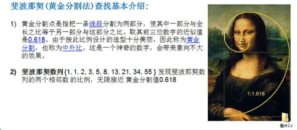
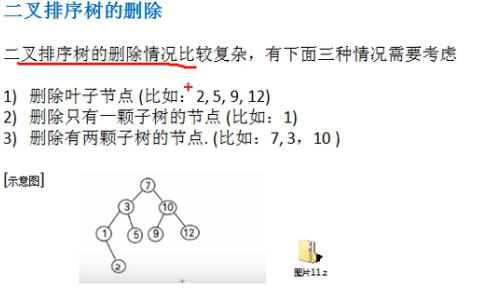
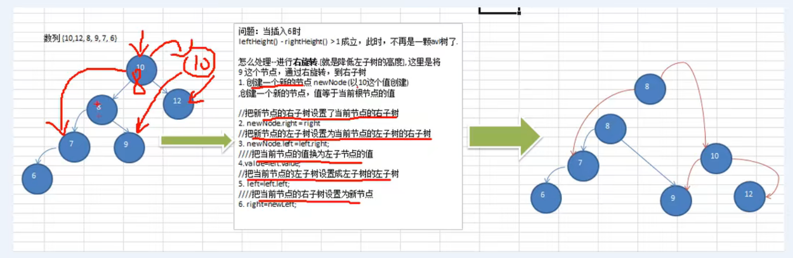
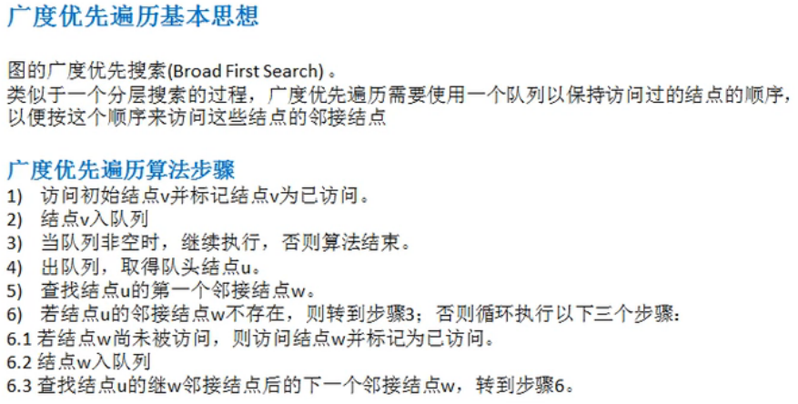
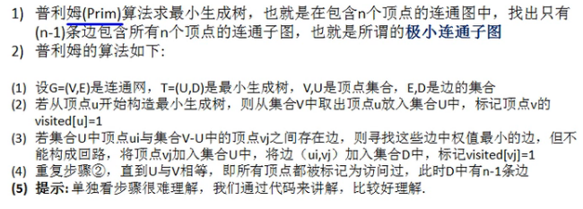

**字符串截取：str.substring(2, 4);**

最大公约数

```java
		int a = 2;
		int b = 9;
		int x = a>b?a:b;
		int y = a<=b?a:b;
		int num = y;
		for(int i = 0; i < num; i++) {
			a = x%y;
			b = y;
			x = b;
			y = a;
			if(a == 0) {
				System.out.println(b);
				break;
			}
		}
```

最小公倍数：可以整除两个数的数，如6，9的最小公倍数是18

​	可以求出最大公约数，6*9/3

质数：求100以内的质数

```java
for(int i = 2; i <= 100; i++) {
			boolean b = true;
			for(int j = 2; j <= Math.sqrt(i); j++) {
				if(i % 2 == 0 && i != 2) {
					b = false;
					break;
				}
				if(i % j == 0) {
					b= false;
					break;
				}
			}
			if(b) {
				System.out.println(i);
			}
		}
```

01背包

暴力搜索，动态规划，递归，排序

枚举，排序，搜索****，计数，贪心，动态规划 ** ，图论，数论，博弈论，概率论，计算机几何，字符串算法 ***API

LinkedList< Integer > list = new LinkedList<>();
		list.addLast(6);//在链表的尾部插入元素
		list.addFirst(4);//在链表头部插入元素
		int x = list.removeFirst();//删除链表头部的元素
		int y = list.removeLast();//删除链表尾部的元素

BigInteger("123")：大整数，位数不限

BigDecimal：多位数，位数不限

（1）求幂：c=a.pow(b);

（2）输入：a = sc.nextBigInteger();
（3）加法：c = a.add(b);
（4）减法：c = a.subtract(b);
（5）乘法：c = a.multiply(b);
（6）除法：c = a.divide(b);
（7）取余：c = a.remainder(b);//也可mod

num = num.setScale(2, BigDecimal.ROUND_HALF_UP);//使num保留两位小数，四舍五入的方式

dou2.add(dou1, 101, BigDecimal.ROUND_HALF_UP)

#101表示保存多少位， BigDecimal.ROUND_HALF_UP表示用四舍五入的方法

做除法时：ROUND_DOWN(总是不加一)，ROUND_UP(总是加一)，ROUND_HALF_UP(四舍五入)，ROUND_HALF_DOWN(四舍五入相反)

## 稀疏数组和队列

### 稀疏数组


代码实现

```java
public static void main(String[] args) {
//        创建一个原始数组
//        0表示没有子，1表示白子，2表示黑子
        int chessArr1[][] = new int[11][11];
        chessArr1[1][2] = 1;
        chessArr1[2][4] = 2;
        chessArr1[5][6] = 2;
//        创建出原始的二维数组
        System.out.println("原始的二维数组~~~");
        for (int[] row : chessArr1) {
            for (int data : row) {
                System.out.printf("%d\t", data);
            }
            System.out.println();
        }
        int sum = 0;
        //得到稀疏数组有多少个值
        for (int i = 0; i < chessArr1.length; i++) {
            for (int j = 0; j < chessArr1[0].length; j++) {
                if (chessArr1[i][j] != 0){
                    sum++;
                }
            }
        }
//        创建稀疏数组初始化
        int sparseArr[][] = new int[sum + 1][3];
        sparseArr[0][0] = chessArr1.length;
        sparseArr[0][1] = chessArr1[0].length;
        sparseArr[0][2] = sum;
//        给稀疏数组赋值
        int count = 0;
        for (int i = 0; i < chessArr1.length; i++) {
            for (int j = 0; j < chessArr1[0].length; j++) {
                if (chessArr1[i][j] != 0){
                    count++;
                    sparseArr[count][0] = i;
                    sparseArr[count][1] = j;
                    sparseArr[count][2] = chessArr1[i][j];
                }
            }
        }
//        打印稀疏数组
        System.out.println();
        for (int[] row : sparseArr) {
            for (int data : row) {
                System.out.printf("%d\t", data);
            }
            System.out.println();
        }
    }
```

### 队列

图片中有一错误最后一个front = 1


5。有效个数：(rear + maxSize - front) % maxSize

代码实现

```java
class ArrQueue {
    private int maxSize;
    private int front;
    private int rear;
    private int[] arr;

    public ArrQueue(int n){
        arr = new int[n];
        front = 0;
        rear = 0;
        maxSize = n;
    }

//   判断是否满了
    public boolean isFull(){
        return (rear + 1) % maxSize == front;
    }
//    判断是否为空
    public boolean isEmpty() {
        return rear == front;
    }

//    判断数据的有效个数
    public int getArrSize(){
        return (rear + maxSize - front) % maxSize;
    }

//    添加数据
    public void addQueue(int m){
        if(isFull()){
            System.out.println("队列已满");
            return;
        }
        arr[rear] = m;
        rear = (rear + 1) % maxSize;
    }
//    取出数据
    public int getQueue(){
        int m;
        if(isEmpty()){
            throw new RuntimeException("队列为空");
        }
        m = arr[front];
        front = (front + 1) % maxSize;
        return m;
    }
}
```

## 链表


代码实现

```java
public class LianBiao {
    public static void main(String[] args) {
        HeroNode heroNode1 = new HeroNode(2);
        HeroNode heroNode2 = new HeroNode(3);
        HeroNode heroNode3 = new HeroNode(4);
        HeroNode heroNode4 = new HeroNode(5);

        SingleLinkedList singleLinkedList = new SingleLinkedList();
        singleLinkedList.add(heroNode1);
        singleLinkedList.add(heroNode2);
        singleLinkedList.add(heroNode3);
        singleLinkedList.add(heroNode4);
        singleLinkedList.list();
    }
}
//管理英雄人物
class SingleLinkedList{
    private HeroNode head = new HeroNode(0);

//    添加一个节点
    public void add(HeroNode node){
        HeroNode temp = head;
        while (true){
            if (temp.next == null){
                break;
            }
            temp = temp.next;
        }
        temp.next = node;
    }
//    显示链表
    public void list(){
        if (head.next == null){
            System.out.println("链表中没有数据");
            return;
        }
        HeroNode temp = head.next;
        while (true){
            System.out.println(temp);
            if (temp.next == null){
                break;
            }
            temp = temp.next;
        }
    }
}
//定义节点
class HeroNode{
    public int no;
    public HeroNode next;

    public HeroNode(int no){
        this.no = no;
    }

    @Override
    public String toString() {
        return "HeroNode{" +
                "no=" + no +
                '}';
    }
}
```

环形链表和约瑟夫问题


解题代码

```java
package com.company;

public class Josephu {
    public static void main(String[] args) {
        CreateList createList = new CreateList();
        createList.create(5);
        createList.jos(2);
    }
}

class CreateList{
    private Node head = new Node(0);

    public void create(int num){
        if (num <= 0){
            return;
        }
        Node first = head;
        Node curBoy = head;
        head.next = head;
        head.data = 1;
        for (int i = 2; i <= num; i++) {
            Node node = new Node(i);
            curBoy.next = node;
            curBoy = node;
            node.next = first;
        }
    }

    public void getList(){
        Node temp = head;
        while (true){
            if (temp.next == head){
                System.out.println(temp.data);
                break;
            }
            System.out.println(temp.data);
            temp = temp.next;
        }
    }

    public void jos(int m){
        Node temp = head;
        Node helper = head;
        while (true){
            if (helper.next == head){
                break;
            }
            helper = helper.next;
        }
        while (true){
            if (temp == helper) {
                System.out.println(temp);
                break;
            }
            for (int i = 0; i < m - 1; i++) {
                temp = temp.next;
                helper = helper.next;
                if ((i + 1) == (m -1)){
                    System.out.println(temp);
                    helper.next = temp.next;
                    temp = temp.next;
                }
            }
        }
    }
}

class Node{
    int data;

    Node next;
    public Node(int data){
        this.data = data;
    }

    @Override
    public String toString() {
        return "Node{" +
                "data=" + data +
                '}';
    }
}
```

## 栈


top指向栈顶元素的位数

例题：使用栈计算表达式的结果7 * 2 * 2 - 5 + 1 - 5 + 3 - 4，需要设计两个栈，存数(numStack)和存符号(operStack)


### 前缀、中缀、后缀表达式(逆波兰表达式)

对应先序中序和后序遍历

前缀表达式：


中缀表达式：正常写法

后缀表达式：


中缀表达式转成后缀表达式

## 递归

### 迷宫回溯问题

```java
package com.company;

public class MiGong {
    public static void main(String[] args) {
        int[][] map = new int[8][7];
//        使用1表示墙
        for (int i = 0; i < 7; i++) {
            map[0][i] = 1;
            map[7][i] = 1;
        }
        for (int i = 0; i < 8; i++) {
            map[i][0] = 1;
            map[i][6] = 1;
        }
        map[3][1] = 1;
        map[3][2] = 1;
        for (int i = 0; i < 8; i++) {
            for (int j = 0; j < 7; j++) {
                System.out.printf("%d\t", map[i][j]);
            }
            System.out.println();
        }
        setWay(map, 1, 1);
        System.out.println();
        for (int i = 0; i < 8; i++) {
            for (int j = 0; j < 7; j++) {
                System.out.printf("%d\t", map[i][j]);
            }
            System.out.println();
        }
    }
    // 使用递归找路，找了就返回true。能到6，5表示通路，为2表示可以走的路，3表示探过了走不通
    // 下>右>上>左
    public static boolean setWay(int[][] map, int i, int j){
        if (map[6][5] == 2){
            return true;
        }else {
            if (map[i][j] == 0){//没有走过，按策略走
                map[i][j] = 2;//假定能走通
                if (setWay(map, i+1, j)){//向下走
                    return true;
                } else if(setWay(map, i, j+1)){
                    return true;
                } else if (setWay(map, i-1, j)){
                    return true;
                }else if (setWay(map, i, j-1)){
                    return true;
                }else {
                    //该点是死路
                    map[i][j] = 3;
                    return false;
                }
            }else {//可能是1，2，3
                return false;
            }
        }
    }
}
```

### 八皇后问题

```java
public class BaHuangHou {
    int max = 8;//表示有多少个皇后
    int[] arr = new int[max];
    int num = 0;
    public static void main(String[] args) {
        BaHuangHou baHuangHou = new BaHuangHou();
        baHuangHou.bh(0);
    }

    //输出皇后摆放的位置
    private void print(){
        for (int i = 0; i < arr.length; i++) {
            System.out.print(arr[i] + " ");
        }
        System.out.println();
    }
    //判断第n个皇后时，前n个是否冲突
    private boolean judge(int n){
        for (int i = 0; i < n; i++) {
            if (arr[i] == arr[n] || Math.abs(n - i) == Math.abs(arr[n] - arr[i])){
                return false;
            }
        }
        return true;
    }
//    m = 0
    public void bh(int m){
        if (m == max){//八个皇后依然放好
            print();
            return;
        }
        for (int i = 0; i < max; i++) {
            //先把当前这个皇后放在1列
            arr[m] = i;
            if (judge(m)){//不冲突放n+1个皇后
                bh(m+1);
            }
        }
    }
}
```

### 汉诺塔

```java
public class HanNuoTa {
	public static void main(String[] args) {
		hanNuo("a", "b", "c", 3);
	}
	public static void hanNuo(String a, String b , String c, int n) {
		if(n == 0) {
			return;
		}
		hanNuo(a, c, b, n - 1);
		System.out.println(a + "->" + c);
		hanNuo(b, a, c, n - 1);
	}
}
```

## 排序算法

### java中常用的三种排序方法

```java
//		Set<Integer> set = new TreeSet<>(new Comparator<Integer>() {
//			@Override
//			public int compare(Integer o1, Integer o2) {
//				return -o1.compareTo(o2);
//			}
//		});
//set会去除重复
//		set.add(4);
//		set.add(4);
//		set.add(-1);
//		set.add(9);
//		System.out.println(set);
		
//		Integer[] arr = {-1, 3, 7, -2, 3};//这种方式不传比较器支持int，double类型的
//		Arrays.sort(arr, new Comparator<Integer>() {
//			@Override
//			public int compare(Integer o1, Integer o2) {
//				// TODO Auto-generated method stub
//				return -o1.compareTo(o2);
//			}
//		});
//		System.out.println(Arrays.toString(arr));
		
		List<Integer> list = new ArrayList<>();
		list.add(4);
		list.add(4);
		list.add(-1);
		list.add(9);
		Collections.sort(list, new Comparator<Integer>() {
			@Override
			public int compare(Integer o1, Integer o2) {
				// TODO Auto-generated method stub
				return -o1.compareTo(o2);
			}
		});
		System.out.println(list);
```


### 插入排序

#### 直接插入排序

适用于基本有序的数组

重点是把前面看成有序，后面看成无序，让后找一个无序一次与有序列表比较，当小于有序列表中的数就进行交换


```java
public class PaiDui {
	public static void main(String[] args) {
		int[] arr = {10, 1, 9, 7, 4, 12};
		zhiJieChaRu(arr);
	}
	public static void zhiJieChaRu(int[] arr) {
		int temp = 0;
		for(int i = 1; i < arr.length; i++) {
			temp = arr[i];
			int j;
			for(j = i; j > 0 && temp < arr[j - 1]; j--) {
				arr[j] = arr[j - 1];
			}
			arr[j] = temp;
		}
        System.out.println(Arrays.toString(arr));
	}
}
```

#### 希尔排序

适用于基本完全逆序的数组


```java
//交换法实现希尔排序
public class XiEr {
    public static void main(String[] args) {
        int[] arr = {8, 9, 1, 7, 2, 3, 5, 4, 6, 0};
        int temp = 0;
        for (int i = arr.length/2; i >= 1; i/=2) {
            for (int j = i; j < arr.length; j++) {
                for (int k = j - i; k >= 0 ; k-=i) {
                    if (arr[k] > arr[k+i]){
                        temp = arr[k];
                        arr[k] = arr[k+i];
                        arr[k+i] = temp;
                    }
                }
            }
        }
        for (int x = 0; x < arr.length; x++) {
            System.out.println(arr[x]);
        }
    }
}
//移位法实现希尔排序
public static void main(String[] args) {
    int[] arr = {8, 9, 1, 7, 2, 3, 5, 4, 6, 0};
    for (int i = arr.length/2; i >= 1; i/=2){
        for (int j = i; j < arr.length; j++) {
            int num = j;
            int temp = arr[j];
            if (arr[num] < arr[num - i]){
                while (num - i >= 0 && temp < arr[num - i]){
                    arr[num] = arr[num - i];
                    num -= i;
                }
                arr[num] = temp;
            }
        }
        for (int x = 0; x < arr.length; x++) {
            System.out.println(arr[x]);
        }
        System.out.println();
    }
}
```

```java
public static void XiErPaiXu(int[] arr) {
	for(int i = arr.length / 2; i >= 1; i /= 2) {
		for(int j = i; j < arr.length; j++) {
			int k;
			int temp = arr[j];
			for(k = j; k > 0 && temp < arr[k - i]; k -= i) {
				arr[k] = arr[k - i];
			}
			arr[k] = temp;
			System.out.println(Arrays.toString(arr));
		}
	}
}
```
### 选择排序

#### 简单选择排序


```java
    public static void main(String[] args) {
        int arr[] = {3, 9, -1, 10, -2};
        int temp;
        int data;
        for (int i = 0; i < arr.length - 1; i++) {
            temp = i;
            for (int j = i; j < arr.length - 1; j++) {
                if (arr[temp] >= arr[j + 1]){
                    temp = j + 1;
                }
            }
            data = arr[temp];
            arr[temp] = arr[i];
            arr[i] = data;
        }
        for (int i = 0; i < arr.length; i++) {
            System.out.println(arr[i]);
        }
    }
```

#### 堆排序

### 交换排序

#### 冒泡排序

```java
public static void main(String[] args) {
        int arr[] = {3, 9, -1, 10, -2};
        int temp = 0;
        for (int i = 0; i < arr.length - 1; i++) {
            for (int j = 0; j < arr.length - i - 1; j++) {
                if (arr[j] <= arr[j + 1]){
                    temp = arr[j];
                    arr[j] = arr[j + 1];
                    arr[j + 1] = temp;
                }
            }
        }
        for (int i = 0; i < arr.length; i++) {
            System.out.println(arr[i]);
        }
    }
```

#### 快速排序


我们一中间为数的基准

```java
public class KuaiSu {
    public static void main(String[] args) {
        int[] arr = {8, -9, -1, 7, -2, 3, 5, -4, 6, 0};
        ks(arr, 0, arr.length - 1);
        System.out.println(Arrays.toString(arr));
    }

    public static void ks(int[] arr, int left, int right){
        int l = left;
        int r = right;
        if (left >= right){
            return;
        }
        int temp = arr[(l + r) / 2];
        while (l < r){
            while (arr[l] < temp){
                l++;
            }
            while (arr[r] > temp){
                r--;
            }
            if (l >= r){
                break;
            }
            int x = arr[l];
            arr[l] = arr[r];
            arr[r] = x;
            if (arr[l] == temp){
                r--;
            }
            if (arr[r] == temp){
                l++;
            }
        }
        if (l == r){
            l++;
            r--;
        }
        System.out.println(r+"======"+l);
        ks(arr, left, r);
        ks(arr, l, right);
    }
}
```

如果一第一个数为基准

```java
public static void kspx(int[] arr, int l, int r) {
//		if(l > r) return;
//		int x = l;
//		int y = r;
//		while(x != y) {
//			while(arr[y] >= arr[l] && y > x) {
//				y--;
//			}
//			while(arr[x] <= arr[l] && y > x) {
//				x++;
//			}
//			if(y > x) {
//				int sum = arr[y];
//				arr[y] = arr[x];
//				arr[x] = sum;
//			}
//		}
//		int num = arr[l];
//		arr[l] = arr[x];
//		arr[x] = num;
//		kspx(arr, l, x - 1);
//		kspx(arr, x + 1, r);
	}
```

如果一最后一个数为基准

```java
public static void kspx(int[] arr, int l, int r) {
		if(l > r)return;
		int x = l;
		int y = r;
		while(y !=  x) {
			while(arr[x] <= arr[r] && x < y) {
				x++;
			}
			while(arr[y] >= arr[r] && x < y) {
				y--;
			}
			if(x < y) {
				int sum = arr[x];
				arr[x] = arr[y];
				arr[y] = sum;
			}
		}
		int num = arr[x];
		arr[x] = arr[r];
		arr[r] = num;
		kspx(arr, l, x - 1);
		kspx(arr, x + 1, r);
	}
```

### 归并排序


归并排序是需要一个额外的空间与原数组长度相同

```java
public class GuiBing {
    public static void main(String[] args) {
        int[] arr1 = {8, 4, 5, 7, 1, 3, 6, 2};
        int[] temp = new int[arr1.length];
        mergeSort(arr1, 0, arr1.length - 1, temp);
        System.out.println(Arrays.toString(arr1));
    }

//    分与和的方法
    public static void mergeSort(int[] arr, int left, int right, int[] temp){
        if (left < right){
            int min = (left + right) / 2;
            mergeSort(arr, left, min, temp);
            mergeSort(arr, (min + 1), right, temp);
            merge(arr, left, min, right, temp);
        }
    }

//    合并的函数
    public static void merge(int[] arr, int left, int min, int right, int[] temp){
//        把两个从min分开的数组合并到temp数组中去
        int t = 0;
        int l1 = left;
        int l2 = min + 1;
        while (l1 <= min && l2 <= right){
            if (arr[l1] >= arr[l2]){
                temp[t] = arr[l2];
                t++;
                l2++;
            }else {
                temp[t] = arr[l1];
                t++;
                l1++;
            }
        }
		// 把剩余的数据全部放到temp数组中
        while (l1 <= min){
            temp[t] = arr[l1];
            t++;
            l1++;
        }
        while (l2 <= right){
            temp[t] = arr[l2];
            t++;
            l2++;
        }
		// 把temp数组中的元素拷贝到arr中去
        t = 0;
        for (int i = left; i <= right; i++, t++) {
            arr[i] = temp[t];
        }
    }
}
```

### 基数排序


代码实现

```java
public class JiShu {
    public static void main(String[] args) {
//        int[] arr = {7878, 539, 41, 37, 2, 3, 56, 40, 62, 10};
        int[] arr = {53, 3, 542, 748, 14, 214};
//        首先需要是个通，每个桶的大小是数组的长度
        int[][] tong = new int[10][arr.length];
//        还需要一个数组来记录每个桶中有多少个数据
        int[] num = new int[10];

//        找到arr中数的最大值
        int max = arr[0];
        for (int i = 0; i < arr.length; i++) {
            if (max < arr[i]){
                max = arr[i];
            }
        }
//        求出最大值的位数
        int wei = (max + "").length();
        for (int l = 0, n = 1; l < wei; l++, n *= 10) {
            for (int i = 0; i < arr.length; i++) {
                int x = arr[i] / n % 10;
                tong[x][num[x]] = arr[i];
                num[x]++;
            }
            int k = 0;
            for (int i = 0; i < 10; i++) {
                if (num[i] != 0){
                    for (int j = 0; j < num[i]; j++) {
                        arr[k] = tong[i][j];
                        k++;
                    }
                    num[i] = 0;
                }
            }
        }
        System.out.println(Arrays.toString(arr));
    }
}
```

## 查找算法

### 顺序查找

就是按顺序查找，数组可以是有序也可以是无序的

### 二分查找


递归二分查找

```java
public class ErFenChaZhao {
    public static void main(String[] args) {
        int[] arr = {1, 8, 10, 89, 1000, 1234};
        int a = binarySearch(arr, 0, arr.length - 1, 1000);
        System.out.println(a);

    }

    public static int binarySearch(int[] arr, int left, int right, int findVal){
        if (left > right){
            return -1;
        }

        int mid = (left + right) / 2;
        if (findVal > arr[mid]){
            return binarySearch(arr, mid + 1, right, findVal);
        }else if (findVal < arr[mid]){
            return binarySearch(arr, left, mid - 1, findVal);
        }else {
            return mid;
        }
    }
}
```

当查找的数有多个相同的值时，找到mid时不要马上返回，应该向左递归和向右递归

```java
public class ErFenChaZhao {
    public static void main(String[] args) {
        int[] arr = {1, 8, 10, 10, 89, 1000, 1234};
        List<Integer> a = binarySearch(arr, 0, arr.length - 1, 10);
        System.out.println(a);

    }

    public static List<Integer> binarySearch(int[] arr, int left, int right, int findVal){
        if (left > right){
            return new ArrayList<Integer>();
        }

        int mid = (left + right) / 2;
        if (findVal > arr[mid]){
            return binarySearch(arr, mid + 1, right, findVal);
        }else if (findVal < arr[mid]){
            return binarySearch(arr, left, mid - 1, findVal);
        }else {
//            return mid;
            List<Integer> list = new ArrayList<>();
            int temp = mid - 1;
            while (true){
                if (temp < 0 || arr[temp] != findVal){
                    break;
                }
                list.add(temp);
                temp -= 1;
            }
            list.add(mid);
            temp = mid + 1;
            while (true){
                if (temp > arr.length - 1 || arr[temp] != findVal){
                    break;
                }
                list.add(temp);
                temp += 1;
            }
            return list;
        }
    }
}
```

### 插值查找


### 斐波那契额查找 

根据黄金分割形成的算法



mid = low + F(k-1) - 1


 ```java
 public class FeiBoNaQie {
     public static void main(String[] args) {
         int[] arr = {1, 2, 3, 4};
         System.out.println(fibSearch(arr, 2));
     }
 
     public static int[] k(){
         int[] f = new int[20];
         f[0] = 1;
         f[1] = 1;
         for (int i = 2; i < 20; i++) {
             f[i] = f[i - 1] + f[i - 2];
         }
         return f;
     }
 
     public static int fibSearch(int[] a, int key){
         int low = 0;
         int high = a.length - 1;
         int k = 0;
         int mid = 0;
         int f[] = k();
         while (high > f[k] - 1){
             k++;
         }
         int[] temp = Arrays.copyOf(a, f[k]);
 //        System.out.println(Arrays.toString(temp));
         for (int i = high + 1; i < temp.length; i++) {
             temp[i] = a[high];
         }
         while (low <= high){
             mid = low + f[k - 1] -1;
             if (key < temp[mid]){
                 high = mid - 1;
                 k--;
             }else if(key > temp[mid]){
                 low = mid + 1;
                 k -= 2;
             }else {
                 if (mid <= high){
                     return mid;
                 }else {
                     return high;
                 }
             }
         }
         return -1;
     }
 }
 ```

## 哈希表


```java
public class HashTabDemo {
    public static void main(String[] args) {
        HashTab hashTab = new HashTab(7);
        hashTab.add(new Emp(5, "小明"));
        hashTab.add(new Emp(12, "明"));
        hashTab.add(new Emp(90, "小"));
        hashTab.list();
    }
}
//创建hash表
class HashTab{
    EmplinkedList[] emplinkedLists;
    int size;
    public HashTab(int size) {
        this.size = size;
        this.emplinkedLists = new EmplinkedList[size];
        for (int i = 0; i < size; i++) {
            emplinkedLists[i] = new EmplinkedList();
        }
    }
//    添加
    public void add(Emp emp){
//        根据员工的id，得到该员工应该添加到哪里
        int empLinkdListNo = hashFun(emp.id);
        System.out.println(empLinkdListNo);
        emplinkedLists[empLinkdListNo].add(emp);
    }
//    遍历
    public void list(){
        for (int i = 0; i < emplinkedLists.length; i++) {
            emplinkedLists[i].list();
        }
    }

//    散列函数
    public int hashFun(int id){
//        除了取模法还有其他方法
        return id % size;
    }
}

//表示员工
class Emp {
    public int id;
    public String name;
    public Emp next;
    public Emp(int id, String name){
        this.id = id;
        this.name = name;
    }
}

//创建EmplinkedList，表示链表
class EmplinkedList{
//    头指针
    private Emp head;

//    添加员工
    public void add(Emp emp){
        if (head == null){
            head = emp;
            return;
        }
        Emp curEmp = head;
        while (true){
            if (curEmp.next == null){
                break;
            }
            curEmp = curEmp.next;
        }
        curEmp.next = emp;
    }
//    遍历员工的数据
    public void list(){
        if (head == null){
            System.out.println("当前链表为空没有数据");
            return;
        }
        Emp curEmp = head;
        while (true){
            System.out.println(curEmp.name+","+curEmp.id);
            if (curEmp.next == null){
                break;
            }
            curEmp = curEmp.next;
        }
        System.out.println();
    }
}
```

## 树结构


### 二叉树


```java
public class QianXu {
    public static void main(String[] args) {
        BinaryTree binaryTree = new BinaryTree();
        Node node1 = new Node(2);
        Node node2 = new Node(7);
        Node node3 = new Node(9);
        Node node4 = new Node(10);
        Node node5 = new Node(3);
        binaryTree.setRoot(node1);
        node1.setLeft(node2);
        node1.setRight(node3);
        node2.setLeft(node4);
        node2.setRight(node5);
        binaryTree.qian();
        System.out.println();
        binaryTree.zhong();
        System.out.println();
        binaryTree.hou();
    }
}
class BinaryTree{
    private Node root;

    public void setRoot(Node root) {
        this.root = root;
    }

//    前序遍历
    public void qian(){
        if (this.root != null){
            this.root.qian();
        }else {
            System.out.println("二叉树为空");
        }
    }
//    中序遍历
    public void zhong(){
        if (this.root != null){
            this.root.zhong();
        }
    }
//    后序遍历
    public void hou(){
        if (this.root != null){
            this.root.hou();
        }
    }
}

class Node{
    private int no;
    private Node left;
    private Node right;

    public Node(int no) {
        this.no = no;
    }

    public int getNo() {
        return no;
    }

    public void setNo(int no) {
        this.no = no;
    }

    public Node getLeft() {
        return left;
    }

    public void setLeft(Node left) {
        this.left = left;
    }

    public Node getRight() {
        return right;
    }

    public void setRight(Node right) {
        this.right = right;
    }

    @Override
    public String toString() {
        return "Node{" +
                "no=" + no +
                '}';
    }

//    前序
    public void qian(){
        System.out.println(this);
        if (this.left != null){
            this.left.qian();
        }
        if (this.right != null){
            this.right.qian();
        }
    }
//    中序
    public void zhong(){
        if (this.left != null){
            this.left.zhong();
        }
        System.out.println(this);
        if (this.right != null){
            this.right.zhong();
        }
    }
//    后序
    public void hou(){
        if (this.left != null){
            this.left.hou();
        }
        if (this.right != null){
            this.right.hou();
        }
        System.out.println(this);
    }
}
```

#### 顺序存储二叉树


```java
public class ArrBinaryTreeDemo {
    public static void main(String[] args) {
        int[] arr = {1, 2, 3, 4, 5, 6, 7};
        ArrBinaryTree arrBinaryTree = new ArrBinaryTree(arr);
        arrBinaryTree.list(0);
    }
}

class ArrBinaryTree{
    private int[] arr;

    public ArrBinaryTree(int[] arr) {
        this.arr = arr;
    }
//    编写前序遍历数组二叉树
    public void list(int num){
        if (arr == null){
            System.out.println("该数组为空");
            return;
        }
        if (num >= arr.length){
            return;
        }
        System.out.println(arr[num]);
        list(num * 2 + 1);
        list(num * 2 + 2);
    }
}
```

#### 线索化二叉树


#### 堆排序


第n个非叶子节点arr.length/2-n


```java
public class DuiPaiXu {
    public static void main(String[] args) {
        int[] arr = {4, 6, 8, 5, 9};
        int temp;
        for (int i = arr.length / 2 - 1; i >= 0; i--) {
            dui(arr, i, arr.length);
        }
        for (int i = arr.length - 1; i > 0; i--) {
            temp = arr[i];
            arr[i] = arr[0];
            arr[0] = temp;
            dui(arr, 0, i);
        }
        System.out.println(Arrays.toString(arr));
    }
    public static void dui(int[] arr, int i, int lenght){
        int temp = arr[i];
        for (int k = i * 2 + 1; k < lenght; k = k * 2 + 1) {
            if (k + 1 < lenght && arr[k] < arr[k + 1]){
                k++;
            }
            if (arr[k] > temp){
                arr[i] = arr[k];
                i = k;
            }else {
                break;
            }
        }
        arr[i] = temp;
    }
}
```

#### 赫夫曼树(最优二叉树)


赫夫曼编码：这个字符中每个字符的编码都不是其他编码的前缀，权表示每个字符出现的次数


#### 二叉排序树




```java
public class ErChaPaiXuShu {
    public static void main(String[] args) {
        int[] arr = {7, 3, 10, 12, 5, 1, 9};
        BinarySortTree binarySortTree = new BinarySortTree();
        for (int i = 0; i < arr.length; i++) {
            binarySortTree.add(new Node1(arr[i]));
        }
        binarySortTree.infixOrder();
    }
}
//创建二叉排序树
class BinarySortTree{
    private Node1 root;
//    添加
    public void add(Node1 node){
        if (root == null){
            root = node;
        }else {
            root.add(node);
        }
    }
//    遍历
    public void infixOrder(){
        if (root != null){
            root.infixOrder();
        }else {
            System.out.println("当前二叉树为空");
        }
    }

}

//创建节点
class Node1{
    int value;
    Node1 left;
    Node1 right;

    public Node1(int value) {
        this.value = value;
    }

//    添加节点
    public void add(Node1 node){
        if (node == null){
            return;
        }
        if (node.value < this.value){
            if (this.left == null){
                this.left = node;
            }else {
                this.left.add(node);
            }
        }else {
            if (this.right == null){
                this.right = node;
            }else {
                this.right.add(node);
            }
        }
    }

//    中序遍历
    public void infixOrder(){
        if (this.left != null){
            this.left.infixOrder();
        }
        System.out.println(this);
        if (this.right != null){
            this.right.infixOrder();
        }
    }

    @Override
    public String toString() {
        return "Node1{" +
                "value=" + value +
                '}';
    }
}
```

#### 平衡二叉树


左旋转


右旋转



以上都是单旋转，当实现都会出现我问题，比如下图


### 多路查找树(平衡树)

#### 多叉树与B树

一般数据库做索引的时候采用的就是B树

2-3树的原理

性质：
（1）对于每一个结点有 1 或者 2 个关键码。
（2）当节点有一个关键码的时，节点有 2 个子树。
（3）当节点有 2 个关键码时，节点有 3 个子树。
（4）所有叶子点都在树的同一层。


b+树


b*树


## 图

图的两种表示方法：邻接矩阵，邻接表


```java
public class JuZhengTu {
    public static void main(String[] args) {
        Graph graph = new Graph(4);
        graph.insertVertex("a");
        graph.insertVertex("b");
        graph.insertVertex("c");
        graph.insertVertex("d");
        graph.insertEdge(0, 1, 1);
        graph.insertEdge(3, 1, 1);
        graph.insertEdge(2, 1, 1);
        graph.insertEdge(3, 2, 1);
        graph.showGraph();
    }
}

class Graph{
    private ArrayList<String> vertexList;//存放顶点的集合
    private int[][] edges;//存储图对应的邻接矩阵
    private int numOfEdges;//表示边的数目

    public Graph(int n){
        //初始化矩阵和集合
        edges = new int[n][n];
        vertexList = new ArrayList<String>(n);
        numOfEdges = 0;
    }

//    插入节点
    public void insertVertex(String vertex){
        vertexList.add(vertex);
    }

//    添加边
    public void insertEdge(int v1, int v2, int weight){
        edges[v1][v2] = weight;
        edges[v2][v1] = weight;
        numOfEdges++;
    }

//    返回节点的个数
//    得到边的数目
//    返回节点i对应的值0->'A'...
//    返回v1和v2的权值，就是边上的值
//    显示矩阵
    public void showGraph(){
        for (int[] link : edges) {
            System.out.println(Arrays.toString(link));
        }
    }
}
```

### 深度优先遍历DFS


### 广度优先遍历BFS



## 程序员常用的10种算法

### 二分查找非递归方式

```java
public class ErFenChaZhaoFeiDiGui {
    public static void main(String[] args) {
        int[] arr = {2, 4, 5, 20, 71, 90};
        System.out.println(binarySearch(arr, -90));
    }

    public static int binarySearch(int[] arr, int target){
        int left = 0;
        int right = arr.length - 1;
        while (left <= right){
            int mid = (left + right) / 2;
            if (arr[mid] == target){
                return mid;
            }else if (arr[mid] > target){
                right = mid - 1;
            }else {
                left = mid + 1;
            }
        }
        return -1;
    }
}
```

### 分治算法


汉诺塔

```java
public class HanNuoTa {
    public static void main(String[] args) {
        hanoiTower(2, 'a', 'b', 'c');
    }
    public static void hanoiTower(int num, char a, char b, char c){
        if (num == 1){
            System.out.println(a + "->" + c);
        }else {
//            把上面的所有盘A-B，引动会使用到c
            hanoiTower(num - 1, a, c, b);
//            把最下面的盘A-C
            System.out.println(a + "->" + c);
//            把B塔的所有盘从B-C，移动使用到a塔
            hanoiTower(num - 1, b, a, c);
        }
    }
}
```

### 动态规划


背包问题


k表示放几个物品，k=1只放第一个物品。b表示背包的总容量。w物品重量，v表示物品价值


```java
public class BeiBaoWenTi {
    public static void main(String[] args) {
        int[] w = {1, 4, 3};//物品的重量
        int[] val = {1500, 3000, 2000};//物品的价值,这里的val[i],表示前面的v[i];
        int m = 4;//背包的容量
        int n = val.length;//物品的个数

        // 记录商品保存的情况是数组
        int[][] path = new int[n + 1][m + 1];

        //创建二维数组，v[i][j]表示在前i个物品中能够装入容量为j的背包的最大价值
        int[][] v = new int[n+1][m+1];

        //初始化，可以不做，因为默认是0
        for (int i = 0; i < v.length; i++) {
            v[i][0] = 0;
        }
        for (int i = 0; i < v[0].length; i++) {
            v[0][i] = 0;
        }
        //根据前面的公式动态规划处理，j表示背包容量，i表示第几个物品
        for (int i = 1; i < v.length; i++) {
            for (int j = 1; j < v[0].length; j++) {
                if (w[i - 1] > j){
                    v[i][j] = v[i - 1][j];
                }else {
//                    v[i][j] = Math.max(v[i - 1][j], val[i - 1] + v[i - 1][j - w[i - 1]]);
//                    为了记录商品存放到背包的情况，我们不能直接的使用上面的公式，需要使用if-else来体现公式
                    if (v[i - 1][j] < val[i - 1] + v[i - 1][j - w[i - 1]]){
                        v[i][j] = val[i - 1] + v[i - 1][j - w[i - 1]];
                        path[i][j] = 1;
                    }else v[i][j] = v[i - 1][j];
                }
            }
        }

        for (int i = 0; i < v.length; i++) {
            for (int j = 0; j < v[i].length; j++) {
                System.out.print(v[i][j] + " ");
            }
            System.out.println();
        }
        System.out.println();
        for (int i = 0; i < path.length; i++) {
            for (int j = 0; j < path[0].length; j++) {
                System.out.print(path[i][j]+" ");
            }
            System.out.println();
        }
//        输出哪些物品放到了j重量的背包中
        int i = path.length - 1;
        int j = path[0].length - 1;
        while (i > 0 && j > 0){
            if (path[i][j] == 1){
                System.out.printf("%d\n", i);
                j-=w[i-1];
            }
            i--;
        }
    }
}
```

### KMP算法

```java
import java.util.Arrays;

public class KMP {
	public static void main(String[] args) {
		int[] next = getNext("ACADBACAEF");
		System.out.println(PiPei("HHFLHA AACADBACAEFSHK HUDHUKH", "ACADBACAEF", next));
	}
//	求出next数组，这样求出的next数组正好是正解的偏一位
//	当前求出0010012300
//	真正的  -1001001230
	public static int[] getNext(String str) {
		int[] next = new int[str.length()];
		next[0] = 0;
		for(int i = 1, j = 0; i < next.length; i++) {
//			这里是当匹配不到回退的地方，与匹配时相似
			while(j > 0 && str.charAt(i) != str.charAt(j)) {
				j = next[j - 1];
			}
			if(str.charAt(i) == str.charAt(j)) {
				j++;
			}
			next[i] = j;
		}
		return next;
	}
//	模式串匹配
	public static int PiPei(String str1, String str2, int[] next) {
		for(int i = 0, j = 0; i < str1.length(); i++) {
			while(j > 0 && str1.charAt(i) != str2.charAt(j)){
				j = next[j - 1];
			}
			if(str1.charAt(i) == str2.charAt(j)) {
				j++;
			}
			if(j == str2.length()){
				return i - j + 1;
			}
		}	
		return -1;
	}
}
```

### 贪心算法


例题：假设有n个电台，但是每个电台覆盖的城市有限，问那个集合的电台能覆盖到所有城市


### 普利姆算法

加点法：求最小生成树




### 回溯

### 克鲁斯卡尔算法

加边法：求最小生成树

### 迪杰斯特拉算法


### 弗洛伊德算法

### 骑士周游回溯算法

## 算法

（线段树，并查集，树状数组，数论）模板

### 线段树

```java
package xianDuanShu;

import java.util.Arrays;
import java.util.Scanner;

public class XianDuanShu {
	static int[] Sum;//存储当前节点的求和
	static int[] Add;//Add为懒惰标记
	static int[] A;//原数组
	static int N;//数组的长度
	
	static int num = 0;//记录查询区间值得总和
	public static void main(String[] args) {
		Scanner input = new Scanner(System.in);
		N = input.nextInt();
		A = new int[N+1];
		Sum = new int[N<<2|1];
		Add = new int[N<<2|1];
		for(int i = 1; i <= N; i++) {
			A[i] = input.nextInt();
		}
		build(1,N,1);
		//A[L]+=C;用如下表示方法表示
		update(4,3,1,N,1);
		//区间加法
		updates(3,5,1,1,N,1);
		//查询区间是[4,4]
		query(4,4,1,N,1);
		System.out.println(num);
		System.out.println(Arrays.toString(Sum));
	}

	/**
	 * 初始化线段树
	 * @param l 表示区间的左端点
	 * @param r 表示区间的右端点
	 * @param rt 当前节点的编号
	 */
	static void build(int l, int r, int rt) {
		if(l == r) {//如果是叶子节点
			Sum[rt] = A[l];//存储数组值
			return;
		}
		int m = (l+r)>>1;
		//递归左右子树
		build(l,m,rt<<1);
		build(m+1,r,rt<<1|1);
		//遍历完成以后更新当前节点的值
		Sum[rt] = Sum[rt<<1]+Sum[rt<<1|1];
	}
	
	/**
	 * 点的修改
	 * @param L 要修改的编号
	 * @param C L编号要加的值
	 * @param l 表示当前区间左端点
	 * @param r 表示当前区间右端点
	 * @param rt 表示当前节点的编号
	 */
	static void update(int L, int C, int l, int r, int rt) {
		if(l == r) {
			//到达叶子节点
			Sum[rt] += C;
			return;
		}
		int m = (l+r)>>1;
		if(L <= m) {
			update(L,C,l,m,rt<<1);
		}else {
			update(L,C,m+1,r,rt<<1|1);
		}
		Sum[rt] = Sum[rt<<1]+Sum[rt<<1|1];
	}
	
	//区间修改A[L,R]+=C;区间修改
	/**
	 * @param L 修改区间的左端点
	 * @param R 修改区间的右端点
	 * @param C 要加的值
	 * @param l 当前区间的左端点
	 * @param r 当前区间的右端点
	 * @param rt 当前编号
	 */
	static void updates(int L, int R, int C, int l, int r, int rt) {
		if(L <= l && r <= R) {
			Sum[rt]+=C*(r-l+1);
			Add[rt]+=C;
			return;
		}
		int m = (l+r)>>1;
		//计算当前区间相加时，需要计算上一次区间相加遗留的Add
		if(Add[rt] != 0) {
			Add[rt<<1]+=Add[rt];
			Add[rt<<1|1]+=Add[rt];
			Sum[rt<<1]+=Add[rt]*(m-l+1);
			Sum[rt<<1|1]+=Add[rt]*(r-m);
			//清除本节点的标记
			Add[rt]=0;
		}
		//判断与左右子树是否有交集，如果有交集才遍历
		if(L <= m) {
			updates(L,R,C,l,m,rt<<1);
		}
		if(R > m) {
			updates(L,R,C,m+1,r,rt<<1|1);
		}
		Sum[rt] = Sum[rt<<1]+Sum[rt<<1|1];
	}
	//区间查询
	static void query(int L, int R, int l, int r, int rt) {
		if(L <= l && r <= R) {
			num += Sum[rt];
			return;
		}
		int m = (l+r)>>1;
		//计算当前区间相加时，需要计算上一次区间相加遗留的Add
		if(Add[rt] != 0 && (rt<<1|1) < (N<<2|1)) {
			Add[rt<<1]+=Add[rt];
			Add[rt<<1|1]+=Add[rt];
			Sum[rt<<1]+=Add[rt]*(m-l+1);
			Sum[rt<<1|1]+=Add[rt]*(r-m);
			//清除本节点的标记
			Add[rt]=0;
		}
		if(L <= m) {
			query(L,R,l,m,rt<<1);
		}
		if(R > m) {
			query(L,R,m+1,r,rt<<1|1);
		}
	}
}
```

### dfs

- 优化搜多顺序（先搜索小的）。排除冗余信息（是否有相同的信息），可行性剪枝（不可能得到答案），最优性剪枝（表示向下搜如果最优性解比当前大就能return了）

bfs   

### dp

1. dp数组下标表示的含义
2. 递推公式
3. dp数组的初始化
4. 遍历顺序
5. 打印dp数组


1、明确状态：下标索引

2、明确选择：选择最值

3、根据状态与选择定义dp数组

4、初始化

动态规划解题框架


**例题1：迈台阶**，有n阶台阶，我一步可以走两个台阶也可以走一个。问有多少种不同的走法。

1个台阶时：1种。2个台阶时：2种。3个台阶时：3种。4个台阶时：5种

1. 到达i阶有dp[i]种方法
2. dp[i] = dp[i-1]+dp[i-2];

**例题2：最小花费爬楼梯**、有n个台阶，我一步可以走两个台阶也可以走一个，每爬一个台阶都消耗一定体力，问爬到顶楼所需的最小体力。

1个台阶时：x1。2个台阶时：求跨一步或跨两步的最小体力。3个台阶时：求从1台阶或从2台阶跨到3台阶所需要的最小体力。4个台阶时：求从2台阶或从3台阶跨到4台阶所需要的最小体力。

1. 跨过i台阶所需的最小体力dp[i]
2. dp[i] = min(dp[i-1]+count[i-1], dp[i-2]+count[i-2])

**例题3：不同路径**、m*n矩阵从左上角到右下角有多少种不同的路径。

1. 构造m*n的矩阵，走到dp[i] [j]表示矩阵i行j列的路径种类。
2. dp[i] [j] = dp[i-1] [j] + dp[j-1] [i];
3. 初始化：dp[i] [0] = 1; dp[0] [j] = 1;

**例题4：整数拆分**、给定一个整数n，拆分成若干个数使其相乘最大。

1. dp[i]表示，差分i的结果乘积最大值是dp[i]
2. dp[i] = max(j * (i - j), j * dp[i - j], dp[i]);

```java
Scanner input = new Scanner(System.in);
int n = input.nextInt();
int[] dp = new int[n+1];
dp[0] = 0;
dp[1] = 0;
dp[2] = 1;
for(int i = 3; i <= n; i++) {
	for(int j = 1; j <= (i/2); j++) {
		dp[i] = Math.max(Math.max(j*(i-j), j*dp[i-j]), dp[i]);
	}
}
System.out.println(Arrays.toString(dp));
```

**例题5：多少种不同的搜索树、**给定1-n个节点，总成多少种不同的搜索树。

1. dp[i]表示有i个节点时，有多少种不同的搜索树。
2. dp[i] += dp[j-1]*dp[i-j];

#### 背包问题

> **01背包**

```java
public static void main(String[] args) {
    //   01背包的优化
	//  int[] dp = new int[V+1];
	//	for(int i=1; i<=m; i++)
	//	    for(int j=V; j>=vs[i]; j--)
	//	    {
	//	        dp[j]=Math.max(dp[j-w[i]]+ms[i],dp[j]);
	//	    }
	//	}
		Scanner input = new Scanner(System.in);
		int N = input.nextInt();
		int V = input.nextInt();
		int[] vs = new int[N];
		int[] ms = new int[N];
		for(int i = 0; i < N; i++) {
			vs[i] = input.nextInt();
			ms[i] = input.nextInt();
		}
		int[][] vis = new int[N+1][V+1];
		for(int i = 1; i < vis.length; i++) {
			for(int j = 1; j < vis[i].length; j++) {
				if(vs[i-1] > j) {
					vis[i][j] = vis[i-1][j];
				}else {
					if(ms[i-1]+vis[i-1][j-vs[i-1]] > vis[i-1][j]) {
						vis[i][j] = ms[i-1]+vis[i-1][j-vs[i-1]];
					}else {
						vis[i][j] = vis[i-1][j];
					}
				}
			}
		}
		System.out.println(vis[N][V]);
	}
```

> **完全背包**

```java
public static void main(String[] args) {
    //   完全背包的优化
	//  int[] dp = new int[V+1];
	//	for(int i=1; i<=m; i++)
	//	    for(int j=1; j>=vs[i]; j++)
	//	    {
	//	        dp[j]=Math.max(dp[j-w[i]]+ms[i],dp[j]);
	//	    }
	//	}
	Scanner input = new Scanner(System.in);
	int N = input.nextInt();//有几个物品
	
	int V = input.nextInt();//背包的容量
	
	int[] vs = new int[N];//物品的体积
	int[] ms = new int[N];//物品的价值
	
	int[][] vis = new int[N+1][V+1];//物品的动态转移方程存储
	
	for(int i = 0; i < N; i++) {
		vs[i] = input.nextInt();
		ms[i] = input.nextInt();
	}
	
	for(int i = 1; i < vis.length; i++) {
		for(int j = 1; j < vis[i].length; j++) {
			if(vs[i-1] <= j) {
				vis[i][j] = Math.max(vis[i-1][j], vis[i][j-vs[i-1]]+ms[i-1]);
			}else {
				vis[i][j] = vis[i-1][j];
			}
		}
	}
	System.out.println(vis[N][V]);
}
```

> **多重背包**

```java
public static void main(String[] args) {
		Scanner input = new Scanner(System.in);
		int N = input.nextInt();
		int V = input.nextInt();
		
		int[][] arr = new int[N][3];
		
		for(int i = 0; i < N; i++) {
			arr[i][0] = input.nextInt();
			arr[i][1] = input.nextInt();
			arr[i][2] = input.nextInt();
		}
		
		int[][] vis = new int[N+1][V+1];
		
		for(int i = 1; i < vis.length; i++) {
			for(int j = 1; j < vis[i].length; j++) {
				vis[i][j] = vis[i-1][j];
				for(int k = 1; k <= arr[i-1][2]; k++) {
					if(j >= k*arr[i-1][0]) {
						vis[i][j] = Math.max(vis[i][j], arr[i-1][1]*k+vis[i-1][j-arr[i-1][0]*k]);
					}
				}
			}
		}
//		for(int i = 0; i <= N; i++) {
//			System.out.println(Arrays.toString(vis[i]));
//		}
		System.out.println(vis[N][V]);
	}
```

> **二维费用背包**

```java
public static void main(String[] args) {
	Scanner input = new Scanner(System.in);
	
	int N = input.nextInt();
	int V = input.nextInt();
	int M = input.nextInt();
	
	int[] vs = new int[N];
	int[] ms = new int[N];
	int[] money = new int[N];
	
	for(int i = 0; i < N; i++) {
		vs[i] = input.nextInt();
		ms[i] = input.nextInt();
		money[i] = input.nextInt();
	}
	
//		简化前
//		int[][][] vis = new int[N+1][V+1][M+1];
//		
//		for(int k = 1; k < vis.length; k++) {
//			for(int i = 1; i < vis[k].length; i++) {
//				for(int j = 1; j < vis[k][i].length; j++) {
//					if(i >= vs[k-1] && j >= ms[k-1]) {
//						vis[k][i][j] = Math.max(vis[k-1][i][j], money[k-1]+vis[k-1][i-vs[k-1]][j-ms[k-1]]);
//					}else {
//						vis[k][i][j] = vis[k-1][i][j];
//					}
//				}
//			}
//		}
//		System.out.println(vis[N][V][M]);

//		简化后01问题
	int[][] vis = new int[V+1][M+1];
	for(int k = 1; k <= N; k++) {
		for(int i = V; i >= vs[k-1]; i--) {
			for(int j = M; j >= ms[k-1]; j--) {
				vis[i][j] = Math.max(vis[i][j], money[k-1]+vis[i-vs[k-1]][j-ms[k-1]]);
			}
		}
	}
	System.out.println(vis[V][M]);
}
```

> **分组背包问题**

```java
public static void main(String[] args) {
	Scanner input = new Scanner(System.in);
	int N = input.nextInt();
	int V = input.nextInt();
	
	int[] dp = new int[V+1];
	for(int i = 1; i <= N; i++) {
		int n = input.nextInt();
		int[][] vis = new int[n][2];
		for(int k = 0; k < n; k++) {
			vis[k][0] = input.nextInt();
			vis[k][1] = input.nextInt();
		}
		for(int j = V; j > 0; j--) {
			for(int l = 0; l < n; l++) {
				if(j >= vis[l][0]) {
					dp[j] = Math.max(dp[j], vis[l][1]+dp[j-vis[l][0]]);
				}
			}
		}
		
	}
	System.out.println(dp[V]);
}
```

#### 状态压缩dp

1. 状态压缩：适用于n的范围比较小，并且每个数都有两种状态，选中或不选。利用二进制保存
2. 动态规划：正常的动态规划

&：x&y，将两个十进制数在二进制下进与运算(都1为，其余为0)

|：x|y，将两个十进制数在二进制下进或运算(都0为0，其余为1)

^：x^y，将两个十进制数在二进制下进异或运算(不同为1，相同为0)

~：取反

<<x：相当于乘x

> **例题：**

请你把N * M的棋盘分割成若干个1 * 2的长方形，求方案数。例如：


输入样例：(1,3)(2,4)(4,4)(2,11)(0,0)。输入出样例：0，5，36，144

```java
Scanner input = new Scanner(System.in);
int N = input.nextInt();//有多少行
int M = input.nextInt();//有多少列

//		创建st数组保存合并后的状态是否合法
boolean[] st = new boolean[1<<N];

//		预处理，判断合并成i状态的列是否合法。
//		如果合并列的某行是1表示横放，0表示竖放。
//		如果合并列不存在连续奇数个0，表示i状态合法。
for(int i = 0; i < 1<<N; i++) {
	st[i] = true;
	int cnt = 0;//用来记录i中前j位0的个数
	for(int j = 0; j < N; j++) {
		if((i>>j&1) == 1) {//判断最后一位是0还是1
			if((cnt & 1) == 1) {//判断有奇数个0
				st[i] = false;
				break;
			}
		}else {
			cnt++;
		}
	}
	if((cnt & 1) == 1) {//判断有奇数个0
		st[i] = false;
	}
}

//		创建二维数组，保存第几列，k状态的种类数
int[][] dp = new int[M+1][1<<N];
//		状态数量计算
dp[0][0] = 1;//第0列状态为0时有1种；

for(int i = 1; i <= M; i++) {//遍历列数
	for(int j = 0; j < (1<<N); j++) {//枚举i列的状态
		for(int k = 0; k < (1<<N); k++) {//枚举i-1列的状态
//					两列不能出现重叠的1，不会出现连续奇数个0
			if((j&k) == 0 && st[j|k]) {
				dp[i][j] += dp[i-1][k];
			}
		}
	}
}
//		输出二维数组
for(int i = 0; i <= M; i++) {
	System.out.println(Arrays.toString(dp[i]));
}
//		输出结果
System.out.println(dp[M][0]);
```

#### 区间dp

区间dp就是在区间上进行动态规划，求解一段区间上的最优解。主要是通过合并小区间的 最优解进而得出整个大区间上最优解的dp算法。

例题：合并石子


样例：

4
1 3 5 2
22

```java
Scanner sc = new Scanner(System.in);
		int n = sc.nextInt();
		int[][] dp = new int[n+1][n+1];
		int[] sum = new int[n+1];
		for (int i=1; i<=n;i++) {
			sum[i] = sum[i-1] + sc.nextInt();//接收并计算前缀和
			Arrays.fill(dp[i], (int)1e8);//先将所有元素赋值为一个很大的数，因为求的是最小值
			dp[i][i] = 0;	//合并区间长度为1的初始值为0
		}
		for (int len = 2; len <= n; len++) {//先枚举区间长度
			for (int i = 1; i+len-1 <= n; i++) {//再枚举区间左端点，左端点加区间长度不能大于n
				int j = i+len-1;	//区间右端点
				for (int k = i; k < j; k++) {//枚举区间分割点
					dp[i][j] = Math.min(dp[i][j], dp[i][k]+dp[k+1][j]+sum[j]-sum[i-1]);
				}
			}
		}
		System.out.println(dp[1][n]);
```

模板：

```java
for (int len = 2; len <= n; len++) {
			for (int i = 1; i+len-1 <= n; i++) {
				int j = i+len-1;
				for (int k = i; k < j; k++) {
					dp[i][j] = Math.min(dp[i][j], dp[i][k]+dp[k+1][j]+加上合并所需要的值);
				}
			}
		}
```

#### 树形dp


#### 数位dp

**给定一个闭区间[L,R]，求这个区间满足"某种约束条件"的数的总数量。**

数位dp有个通用的套路，就是先采用**前缀和思想**，将求解“[l,r]这个区间内的满足约束的数的数量”，转化为“[1,r]满足约束的数量 - 区间[1,l−1]满足约束的数量“

所以我们最终要求解的问题通通转化为：[1,x]中满足约束的数量，或者[0,x]中的满足约束的数量

然后将数字x拆分为一个个数位

#### 单调队列优化dp


#### 斜率优化dp
