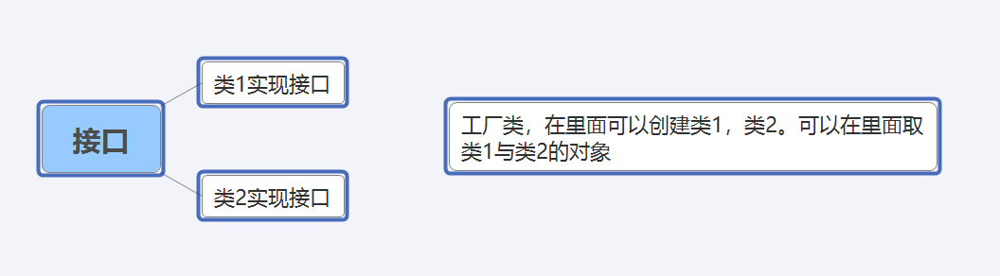
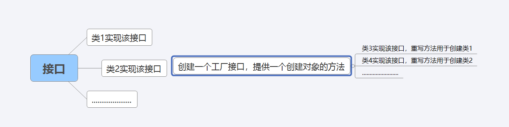
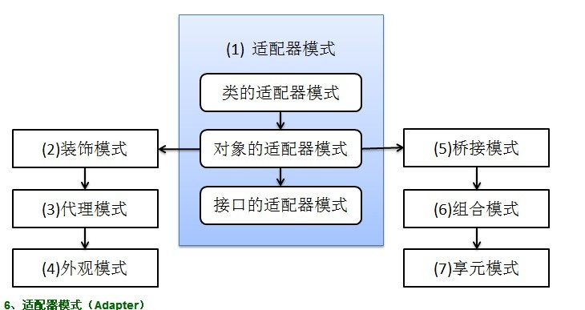

1、开闭原则：对扩展开放，对修改关闭。

2、里氏代换原则：任何基类可以出现的地方，子类一定可以出现。

3、依赖倒转原则：依赖于抽象而不依赖于具体，针对接口的。

4、接口隔离原则：就是使用多个接口比使用单个接口要好。

5、迪米特法则：一个实体应当尽量少的与其他实体发生相互作用。

6、合成复合原则：进量少的使用合成，聚合的方法，而不是用继承。

## 抽象工厂模式

### 工厂模式



普通工程模式：

```java
//创建一个共同的接口
public interface Sender {  
    public void Send();  
} 
//其次创建两个实现类
public class MailSender implements Sender {  
    @Override  
    public void Send() {  
        System.out.println("mailsender!");  
    }  
} 
public class SmsSender implements Sender {  
  
    @Override  
    public void Send() {  
        System.out.println("SmsSender");  
    }  
} 
//创建一个工厂类
public class SendFactory { 
    public Sender produce(String type) {  
        if ("mail".equals(type)) {  
            return new MailSender();  
        } else if ("sms".equals(type)) {  
            return new SmsSender();  
        } else {  
            System.out.println("请输入正确的类型!");  
            return null;  
        }  
    }  
}
```

多个工厂方法模式

将上面工厂类做以下修改

```java
public class SendFactory {
    public Sender produceMail(){
        return new MailSender();
    }
    public Sender produceSms(){
        return new SmsSender();
    }
}
```

静态工厂模式

将上面工厂类做以下修改

```java
public class SendFactory {  
      
    public static Sender produceMail(){  
        return new MailSender();  
    }  
      
    public static Sender produceSms(){  
        return new SmsSender();  
    }  
}
```

### 抽象工厂模式

当多个类实现同一个接口时，可以使用工厂模式。但是上面创建工厂对工厂类的依赖性比较大，不能不修改源码的情况下添加功能。

而抽象工厂模式可以直接给代码添加功能能



```java
//创建一个公用的接口
public interface Sender {  
    public void Send();  
} 
public class MailSender implements Sender {  
    @Override  
    public void Send() {  
        System.out.println("mailsender!");  
    }  
}public class SmsSender implements Sender {  
  
    @Override  
    public void Send() {  
        System.out.println("sender!");  
    }  
} 
//创建一个工厂接口
public interface Provider {  
    public Sender produce();  
}  
public class SendMailFactory implements Provider {  
      
    @Override  
    public Sender produce(){  
        return new MailSender();  
    }  
} 
public class SendSmsFactory implements Provider{  
  
    @Override  
    public Sender produce() {  
        return new SmsSender();  
    }  
} 
```

### 单例模式

```java
//第一种实现单例的方法
public class Singleton {  
  
    /* 私有构造方法，防止被实例化 */  
    private Singleton() {  
    }  
  
    /* 此处使用一个内部类来维护单例，并且此单例只会创建一次 */  
    private static class SingletonFactory {  
        private static Singleton instance = new Singleton();  
    }  
  
    /* 获取实例 */  
    public static Singleton getInstance() {  
        return SingletonFactory.instance;  
    }  
  
    /* 如果该对象被用于序列化，可以保证对象在序列化前后保持一致 */  
    public Object readResolve() {  
        return getInstance();  
    }  
}

//第二种实现单例的方法
public class SingletonTest {  
  
    private static SingletonTest instance = null;  
  
    private SingletonTest() {  
    }  
  
    private static synchronized void syncInit() { // 
        if (instance == null) {  
            instance = new SingletonTest();  
        }  
    }  
  
    public static SingletonTest getInstance() {  
        if (instance == null) {  
            syncInit();  
        }  
        return instance;  
    }  
}
```

### 建造者模式

用来创建复合对象，复合对象就是某个类具有不同的属性

```java
public class Builder {  
      
    private List<Sender> list = new ArrayList<Sender>();  
      
    public void produceMailSender(int count){  
        for(int i=0; i<count; i++){  
            list.add(new MailSender());  
        }  
    }  
      
    public void produceSmsSender(int count){  
        for(int i=0; i<count; i++){  
            list.add(new SmsSender());  
        }  
    }  
}  
```

建造者模式主要创建多个部分，而工厂模式创建的是单个产品。

### 原型模式

该模式的思想是将一个对象作为原型，对其进行复制，克隆，产生一个和原对象类似的新对象。

```java
public class Prototype implements Cloneable {  
  
    public Object clone() throws CloneNotSupportedException {  
        Prototype proto = (Prototype) super.clone();  
        return proto;  
    }  
} 
```

一个原型类，只需要实现Cloneable接口，覆写clone方法，此处clone方法可以改成任意的名称，因为Cloneable接口是个空接口，你可以任意定义实现类的方法名，如cloneA或者cloneB，因为此处的重点是super.clone()这句话，super.clone()调用的是Object的clone()方法，而在Object类中，clone()是native的

浅复制：将对象复制后，基本的数据类型的变量都会重新创建，而引用类型指向的还是原对象所指向的。

深复制：将一个对象复制后，不论是基本数据类型还有引用类型，都是重新创建的。

```java
    /**/ 
    public Object clone() throws CloneNotSupportedException {  
            Prototype proto = (Prototype) super.clone();  
            return proto;  
        }  
    /* 深复制 */  
    public Object deepClone() throws IOException, ClassNotFoundException {  
  
        /* 写入当前对象的二进制流 */  
        ByteArrayOutputStream bos = new ByteArrayOutputStream();  
        ObjectOutputStream oos = new ObjectOutputStream(bos);  
        oos.writeObject(this);  
  
        /* 读出二进制流产生的新对象 */  
        ByteArrayInputStream bis = new ByteArrayInputStream(bos.toByteArray());  
        ObjectInputStream ois = new ObjectInputStream(bis);  
        return ois.readObject();  
    } 
```

## 适配器模式



### 适配器模式

适配器模式就是将某个类的接口转换成客户端期望的另一个接口表示。适配器模式主要分为三类：类的适配器模式、对象的适配器模式、接口的适配器模式。

类的适配器模式：

```java
public class Source {  
  
    public void method1() {  
        System.out.println("this is original method!");  
    }  
} 
public interface Targetable {  
  
    /* 与原类中的方法相同 */  
    public void method1();  
  
    /* 新类的方法 */  
    public void method2();  
} 
//将自己的功能和source的功能结合
public class Adapter extends Source implements Targetable {  
  
    @Override  
    public void method2() {  
        System.out.println("this is the targetable method!");  
    }  
} 
//测试代码
public class AdapterTest {  
  
    public static void main(String[] args) {  
        Targetable target = new Adapter();  
        target.method1();  
        target.method2();  
    }  
} 
```

对象的适配器模式：

```java
public class Wrapper implements Targetable {  
  
    private Source source;  
      
    public Wrapper(Source source){  
        super();  
        this.source = source;  
    }  
    @Override  
    public void method2() {  
        System.out.println("this is the targetable method!");  
    }  
  
    @Override  
    public void method1() {  
        source.method1();  
    }  
} 
//测试类
public class AdapterTest {  
  
    public static void main(String[] args) {  
        Source source = new Source();  
        Targetable target = new Wrapper(source);  
        target.method1();  
        target.method2();  
    }  
} 
```

接口的适配器模式：

```java
public interface Sourceable {  
      
    public void method1();  
    public void method2();  
} 
public abstract class Wrapper2 implements Sourceable{  
    public void method1(){}  
    public void method2(){}  
} 
//以下再写代码就直接继承wrapper2而不用继承接口了
```

### 装饰模式

装饰模式就是给一个对象增加一些新的功能，而且是动态的，要求装饰对象和被装饰对象实现同一个接口，装饰对象持有被装饰对象的实例

```java
public interface Sourceable {  
    public void method();  
}  
//被装饰类
public class Source implements Sourceable {  
  
    @Override  
    public void method() {  
        System.out.println("the original method!");  
    }  
}  
//装饰被装饰类，为其添加新功能
public class Decorator implements Sourceable {  
  
    private Sourceable source;  
      
    public Decorator(Sourceable source){  
        super();  
        this.source = source;  
    }  
    @Override  
    public void method() {  
        System.out.println("before decorator!");  
        source.method();  
        System.out.println("after decorator!");  
    }  
}  
```

### 代理模式

代理模式就是代理出的一个类，替换原来的类进行一些操作

```java
public interface Sourceable {  
    public void method();  
}  
public class Source implements Sourceable {  
  
    @Override  
    public void method() {  
        System.out.println("the original method!");  
    }  
}  
public class Proxy implements Sourceable {  
  
    private Source source;  
    public Proxy(){  
        super();  
        this.source = new Source();  
    }  
    @Override  
    public void method() {  
        before();  
        source.method();  
        atfer();  
    }  
    private void atfer() {  
        System.out.println("after proxy!");  
    }  
    private void before() {  
        System.out.println("before proxy!");  
    }  
}  
```

采用一个代理类调用原有的方法，且对产生的结果进行控制。这种方法就是代理模式。使用代理模式，可以将功能划分的更加清晰，有助于后期维护！

### 外观模式

说白了就是，创建一个外观类，对一些对象进行管理

了解决类与类之家的依赖关系的，像spring一样，可以将类和类之间的关系配置到配置文件中，而外观模式就是将他们的关系放在一个Facade类中，降低了类类之间的耦合度，该模式中没有涉及到接口，

```java
public class CPU {  
      
    public void startup(){  
        System.out.println("cpu startup!");  
    }  
      
    public void shutdown(){  
        System.out.println("cpu shutdown!");  
    }  
}  
public class Memory {  
      
    public void startup(){  
        System.out.println("memory startup!");  
    }  
      
    public void shutdown(){  
        System.out.println("memory shutdown!");  
    }  
}
public class Disk {  
      
    public void startup(){  
        System.out.println("disk startup!");  
    }  
      
    public void shutdown(){  
        System.out.println("disk shutdown!");  
    }  
}  
//这是一个外观类，持有以上三个类的实例。
public class Computer {  
    private CPU cpu;  
    private Memory memory;  
    private Disk disk;  
      
    public Computer(){  
        cpu = new CPU();  
        memory = new Memory();  
        disk = new Disk();  
    }  
      
    public void startup(){  
        System.out.println("start the computer!");  
        cpu.startup();  
        memory.startup();  
        disk.startup();  
        System.out.println("start computer finished!");  
    }  
      
    public void shutdown(){  
        System.out.println("begin to close the computer!");  
        cpu.shutdown();  
        memory.shutdown();  
        disk.shutdown();  
        System.out.println("computer closed!");  
    }  
}
```

如果我们没有Computer类，那么，CPU、Memory、Disk他们之间将会相互持有实例，产生关系，这样会造成严重的依赖，修改一个类，可能会带来其他类的修改，这不是我们想要看到的，有了Computer类，他们之间的关系被放在了Computer类里，这样就起到了解耦的作用，

### 桥接模式-JDBC数据库驱动实现的方式

桥接的用意是：**将抽象化与实现化解耦，使得二者可以独立变化**，像我们常用的JDBC桥DriverManager一样，JDBC进行连接数据库的时候，在各个数据库之间进行切换，基本不需要动太多的代码，甚至丝毫不用动，原因就是JDBC提供统一接口，每个数据库提供各自的实现，用一个叫做数据库驱动的程序来桥接就行了。

```java
public interface Sourceable {  
    public void method();  
}  
//分别定义两个实现类：
public class SourceSub1 implements Sourceable {  
  
    @Override  
    public void method() {  
        System.out.println("this is the first sub!");  
    }  
}  
public class SourceSub2 implements Sourceable {  
  
    @Override  
    public void method() {  
        System.out.println("this is the second sub!");  
    }  
}  
//定义一个桥，持有Sourceable的一个实例：
public abstract class Bridge {  
    private Sourceable source;  
  
    public void method(){  
        source.method();  
    }  
      
    public Sourceable getSource() {  
        return source;  
    }  
  
    public void setSource(Sourceable source) {  
        this.source = source;  
    }  
} 
public class MyBridge extends Bridge {  
    public void method(){
        getSource().method();
    }  
}  
//测试类：

[java]  view plain copy
public class BridgeTest {  
      
    public static void main(String[] args) {  
          
        Bridge bridge = new MyBridge();  
          
        /*调用第一个对象*/  
        Sourceable source1 = new SourceSub1();  
        bridge.setSource(source1);  
        //最关键的一步，当用相同的方式调用方法时会出现相应实现接口的类的方法。
        bridge.method();  
          
        /*调用第二个对象*/  
        Sourceable source2 = new SourceSub2();  
        bridge.setSource(source2);  
        bridge.method();  
    }  
}  
```

### 组合模式

将多个对象组合在一起进行操作，常用于表示树形结构中，例如二叉树

```java
public class TreeNode {  
      
    private String name;  
    private TreeNode parent;  
    private Vector<TreeNode> children = new Vector<TreeNode>();  
      
    public TreeNode(String name){  
        this.name = name;  
    }  
  
    public String getName() {  
        return name;  
    }  
  
    public void setName(String name) {  
        this.name = name;  
    }  
  
    public TreeNode getParent() {  
        return parent;  
    }  
  
    public void setParent(TreeNode parent) {  
        this.parent = parent;  
    }  
      
    //添加孩子节点  
    public void add(TreeNode node){  
        children.add(node);  
    }  
      
    //删除孩子节点  
    public void remove(TreeNode node){  
        children.remove(node);  
    }  
      
    //取得孩子节点  
    public Enumeration<TreeNode> getChildren(){  
        return children.elements();  
    }  
}  
public class Tree {  
  
    TreeNode root = null;  
  
    public Tree(String name) {  
        root = new TreeNode(name);  
    }  
  
    public static void main(String[] args) {  
        Tree tree = new Tree("A");  
        TreeNode nodeB = new TreeNode("B");  
        TreeNode nodeC = new TreeNode("C");  
          
        nodeB.add(nodeC);  
        tree.root.add(nodeB);  //多个对象叠加操作
        System.out.println("build the tree finished!");  
    }  
} 
```

### 享元模式

实现对象的共享，即共享池，当系统中对象多的时候可以减少内存的开销，通常与工厂模式一起使用。

通过连接池的管理，实现了数据库连接的共享，不需要每一次都重新创建连接，节省了数据库重新创建的开销，提升了系统的性能！

## 观察者模式


### 策略模式(子类与父类)

策略模式定义了一系列算法，并将每个算法封装起来，使他们可以相互替换，且算法的变化不会影响到使用算法的客户。需要设计一个接口，为一系列实现类提供统一的方法，多个实现类实现该接口，设计一个抽象类（可有可无，属于辅助类），提供辅助函数，

```java
public interface ICalculator {  
    public int calculate(String exp);  
}  
//辅助类：
public abstract class AbstractCalculator {  
      
    public int[] split(String exp,String opt){  
        String array[] = exp.split(opt);  
        int arrayInt[] = new int[2];  
        arrayInt[0] = Integer.parseInt(array[0]);  
        arrayInt[1] = Integer.parseInt(array[1]);  
        return arrayInt;  
    }  
}  
//三个实现类：
public class Plus extends AbstractCalculator implements ICalculator {  
  
    @Override  
    public int calculate(String exp) {  
        int arrayInt[] = split(exp,"\\+");  
        return arrayInt[0]+arrayInt[1];  
    }  
}  
public class Minus extends AbstractCalculator implements ICalculator {  
  
    @Override  
    public int calculate(String exp) {  
        int arrayInt[] = split(exp,"-");  
        return arrayInt[0]-arrayInt[1];  
    }  
  
}  
public class Multiply extends AbstractCalculator implements ICalculator {  
  
    @Override  
    public int calculate(String exp) {  
        int arrayInt[] = split(exp,"\\*");  
        return arrayInt[0]*arrayInt[1];  
    }  
}  
//简单的测试类：

[java]  view plain copy
public class StrategyTest {  
  
    public static void main(String[] args) {  
        String exp = "2+8";  
        ICalculator cal = new Plus();  
        int result = cal.calculate(exp);  
        System.out.println(result);  
    }  
}  
//输出：10
```

策略模式的决定权在用户，系统本身提供不同算法的实现，新增或者删除算法，对各种算法做封装。因此，策略模式多用在算法决策系统中，外部用户只需要决定用哪个算法即可。

### 模板方法模式(子类与父类)

一个抽象类中，有一个主方法，再定义1...n个方法，可以是抽象的，也可以是实际的方法，定义一个类，继承该抽象类，重写抽象方法，通过调用抽象类，实现对子类的调用。

```java
public abstract class AbstractCalculator {  
      
    /*主方法，实现对本类其它方法的调用*/  
    public final int calculate(String exp,String opt){  
        int array[] = split(exp,opt);  
        return calculate(array[0],array[1]);  
    }  
      
    /*被子类重写的方法*/  
    abstract public int calculate(int num1,int num2);  
      
    public int[] split(String exp,String opt){  
        String array[] = exp.split(opt);  
        int arrayInt[] = new int[2];  
        arrayInt[0] = Integer.parseInt(array[0]); 
        arrayInt[1] = Integer.parseInt(array[1]); 
        return arrayInt;  
    }  
}  
public class Plus extends AbstractCalculator {  
    @Override  
    public int calculate(int num1,int num2) {  
        return num1 + num2;  
    }  
}  
//测试类：
public class StrategyTest {  
  
    public static void main(String[] args) {  
        String exp = "8+8";  
        AbstractCalculator cal = new Plus();  
        int result = cal.calculate(exp, "\\+");  
        System.out.println(result);  
    }  
}
```

### 观察者模式(两类之间)

MySubject类就是我们的主对象，Observer1和Observer2是依赖于MySubject的对象，当MySubject变化时，Observer1和Observer2必然变化。AbstractSubject类中定义着需要监控的对象列表，可以对其进行修改：增加或删除被监控对象，且当MySubject变化时，负责通知在列表内存在的对象。我们看实现代码：

```java
public interface Observer {  
    public void update();  
}  
//两个实现类：
public class Observer1 implements Observer {  
  
    @Override  
    public void update() {  
        System.out.println("observer1 has received!");  
    }  
}  
public class Observer2 implements Observer {  
  
    @Override  
    public void update() {  
        System.out.println("observer2 has received!");  
    }  
  
}  
//Subject接口及实现类：
public interface Subject {  
      
    /*增加观察者*/  
    public void add(Observer observer);  
      
    /*删除观察者*/  
    public void del(Observer observer);  
      
    /*通知所有的观察者*/  
    public void notifyObservers();  
      
    /*自身的操作*/  
    public void operation();  
}  
public abstract class AbstractSubject implements Subject {  
  
    private Vector<Observer> vector = new Vector<Observer>();  
    @Override  
    public void add(Observer observer) {  
        vector.add(observer);  
    }  
  
    @Override  
    public void del(Observer observer) {  
        vector.remove(observer);  
    }  
 
    @Override  
    public void notifyObservers() {  
        Enumeration<Observer> enumo = vector.elements(); 
        while(enumo.hasMoreElements()){//可以去观察对象添加情况并且把所有的对象的方法都执行一边
            enumo.nextElement().update();  
        }  
    }  
}  
public class MySubject extends AbstractSubject {  
    @Override  
    public void operation() {  
        System.out.println("update self!");  
        notifyObservers();  
    }  
}  
//测试类：
public class ObserverTest {  
    public static void main(String[] args) {  
        Subject sub = new MySubject();  
        sub.add(new Observer1());  
        sub.add(new Observer2());  
        sub.operation();  
    }
}  
//输出：
//update self!
//observer1 has received!
//observer2 has received!
```

### 迭代子模式(两类之间)

迭代器模式就是顺序访问聚集中的对象，一般来说，集合中非常常见，如果对集合类比较熟悉的话，理解本模式会十分轻松。这句话包含两层意思：一是需要遍历的对象，即聚集对象，二是迭代器对象，用于对聚集对象进行遍历访问。

```java
public interface Collection {  
      
    public Iterator iterator();  
      
    /*取得集合元素*/  
    public Object get(int i);  
      
    /*取得集合大小*/  
    public int size();  
}  
public interface Iterator {  
    //前移  
    public Object previous();  
      
    //后移  
    public Object next();  
    public boolean hasNext();  
      
    //取得第一个元素  
    public Object first();  
}  
//两个实现：
public class MyCollection implements Collection {  
  
    public String string[] = {"A","B","C","D","E"};  
    @Override  
    public Iterator iterator() {  
        return new MyIterator(this);  
    }  
  
    @Override  
    public Object get(int i) {  
        return string[i];  
    }  
  
    @Override  
    public int size() {  
        return string.length;  
    }  
}  
public class MyIterator implements Iterator {  
  
    private Collection collection;  
    private int pos = -1;  
      
    public MyIterator(Collection collection){  
        this.collection = collection;  
    }  
      
    @Override  
    public Object previous() {  
        if(pos > 0){  
            pos--;  
        }  
        return collection.get(pos);  
    }  
  
    @Override  
    public Object next() {  
        if(pos<collection.size()-1){  
            pos++;  
        }  
        return collection.get(pos);  
    }  
  
    @Override  
    public boolean hasNext() {  
        if(pos<collection.size()-1){  
            return true;  
        }else{  
            return false;  
        }  
    }  
  
    @Override  
    public Object first() {  
        pos = 0;  
        return collection.get(pos);  
    }  
  
}  
//测试类：
public class Test {  
  
    public static void main(String[] args) {  
        Collection collection = new MyCollection();  
        Iterator it = collection.iterator();  
          
        while(it.hasNext()){  
            System.out.println(it.next());  
        }  
    }  
}  
//输出：A B C D E

//此处我们貌似模拟了一个集合类的过程，感觉是不是很爽？其实JDK中各个类也都是这些基本的东西，加一些设计模式，再加一些优化放到一起的，只要我们把这些东西学会了，掌握好了，我们也可以写出自己的集合类，甚至框架！
```

### 责任链模式(两类之间)

有多个对象，每个对象持有对下一个对象的引用，这样就会形成一条链，请求在这条链上传递，直到某一对象决定处理该请求。但是发出者并不清楚到底最终那个对象会处理该请求，所以，责任链模式可以实现，在隐瞒客户端的情况下，对系统进行动态的调整。

```java
public interface Handler {  
    public void operator();  
}
public abstract class AbstractHandler {  
      
    private Handler handler;  
  
    public Handler getHandler() {  
        return handler;  
    }  
  
    public void setHandler(Handler handler) {  
        this.handler = handler;  
    }  
      
}
public class MyHandler extends AbstractHandler implements Handler {  
  
    private String name;  
  
    public MyHandler(String name) {  
        this.name = name;  
    }  
  
    @Override  
    public void operator() {  
        System.out.println(name+"deal!");  
        if(getHandler()!=null){  
            getHandler().operator();  
        }  
    }  
}  
public class Test {  
  
    public static void main(String[] args) {  
        MyHandler h1 = new MyHandler("h1");  
        MyHandler h2 = new MyHandler("h2");  
        MyHandler h3 = new MyHandler("h3");  
  
        h1.setHandler(h2);  
        h2.setHandler(h3);  
  
        h1.operator();  
    }  
}  
//输出：

//h1deal!
//h2deal!
//h3deal!
//此处强调一点就是，链接上的请求可以是一条链，可以是一个树，还可以是一个环，模式本身不约束这个，需要我们自己去实现，同时，在一个时刻，命令只允许由一个对象传给另一个对象，而不允许传给多个对象。
```

### 命令模式(两类之间)

举个例子，司令员下令让士兵去干件事情，从整个事情的角度来考虑，司令员的作用是，发出口令，口令经过传递，传到了士兵耳朵里，士兵去执行。这个过程好在，三者相互解耦，任何一方都不用去依赖其他人，只需要做好自己的事儿就行，司令员要的是结果，不会去关注到底士兵是怎么实现的。

```java
public interface Command {  
    public void exe();  
}  
//命令
public class MyCommand implements Command {  
  
    private Receiver receiver;  
      
    public MyCommand(Receiver receiver) {  
        this.receiver = receiver;  
    }  
  
    @Override  
    public void exe() {  
        receiver.action();  
    }  
}  
//士兵
public class Receiver {  
    public void action(){  
        System.out.println("command received!");  
    }  
}  
//司令员
public class Invoker {  
      
    private Command command;  
      
    public Invoker(Command command) {  
        this.command = command;  
    }  
  
    public void action(){  
        command.exe();  
    }  
}  
public class Test {  
  
    public static void main(String[] args) {  
        Receiver receiver = new Receiver();  
        Command cmd = new MyCommand(receiver);  
        Invoker invoker = new Invoker(cmd);  
        invoker.action();  
    }  
}  
```

### 备忘录模式(类的状态)

假设有原始类A，A中有各种属性，A可以决定需要备份的属性，备忘录类B是用来存储A的一些内部状态，类C呢，就是一个用来存储备忘录的，且只能存储，不能修改等操作

c类就是用来保存b类引用的，b是保存a类的属性值

```java
//a类
public class Original {  
      
    private String value;  
      
    public String getValue() {  
        return value;  
    }  
  
    public void setValue(String value) {  
        this.value = value;  
    }  
  
    public Original(String value) {  
        this.value = value;  
    }  
  
    public Memento createMemento(){  
        return new Memento(value);  
    }  
      
    public void restoreMemento(Memento memento){  
        this.value = memento.getValue();  
    }  
}  
//b类
public class Memento {  
      
    private String value;  
  
    public Memento(String value) {  
        this.value = value;  
    }  
  
    public String getValue() {  
        return value;  
    }  
  
    public void setValue(String value) {  
        this.value = value;  
    }  
}  
//c类
public class Storage {  
      
    private Memento memento;  
      
    public Storage(Memento memento) {  
        this.memento = memento;  
    }  
  
    public Memento getMemento() {  
        return memento;  
    }  
  
    public void setMemento(Memento memento) {  
        this.memento = memento;  
    }  
}  
//测试类：
public class Test {  
  
    public static void main(String[] args) {  
          
        // 创建原始类  
        Original origi = new Original("egg");  
  
        // 创建备忘录  
        Storage storage = new Storage(origi.createMemento());  
  
        // 修改原始类的状态  
        System.out.println("初始化状态为：" + origi.getValue());  
        origi.setValue("niu");  
        System.out.println("修改后的状态为：" + origi.getValue());  
  
        // 回复原始类的状态  
        origi.restoreMemento(storage.getMemento());  
        System.out.println("恢复后的状态为：" + origi.getValue());  
    }  
}  
//输出：
//初始化状态为：egg
//修改后的状态为：niu
//恢复后的状态为：egg
```

### 状态模式(类的状态)

当对象的状态改变时，同时改变其行为，很好理解！就拿QQ来说，有几种状态，在线、隐身、忙碌等，每个状态对应不同的操作，而且你的好友也能看到你的状态，所以，状态模式就两点：1、可以通过改变状态来获得不同的行为。2、你的好友能同时看到你的变化。

```java
//状态类
public class State {  
      
    private String value;  
      
    public String getValue() {  
        return value;  
    }  
  
    public void setValue(String value) {  
        this.value = value;  
    }  
  
    public void method1(){  
        System.out.println("execute the first opt!");  
    }  
      
    public void method2(){  
        System.out.println("execute the second opt!");  
    }  
}  
//可以切换状态
public class Context {  
  
    private State state;  
  
    public Context(State state) {  
        this.state = state;  
    }  
  
    public State getState() {  
        return state;  
    }  
  
    public void setState(State state) {  
        this.state = state;  
    }  
  
    public void method() {  
        if (state.getValue().equals("state1")) {  
            state.method1();  
        } else if (state.getValue().equals("state2")) {  
            state.method2();  
        }  
    }  
}  
//测试类：
public class Test {  
  
    public static void main(String[] args) {  
          
        State state = new State();  
        Context context = new Context(state);  
          
        //设置第一种状态  
        state.setValue("state1");  
        context.method();  
          
        //设置第二种状态  
        state.setValue("state2");  
        context.method();  
    }  
}  
```

### 访问者模式(通过中间类)

把数据结构和作用于结构上的操作解耦合，使得操作集合可相对自由地演化。访问者模式适用于数据结构相对稳定算法又易变化的系统。因为访问者模式使得算法操作增加变得容易。若系统数据结构对象易于变化，经常有新的数据对象增加进来，则不适合使用访问者模式。访问者模式的优点是增加操作很容易，因为增加操作意味着增加新的访问者。访问者模式将有关行为集中到一个访问者对象中，其改变不影响系统数据结构。其缺点就是增加新的数据结构很困难。

访问者模式就是一种分离对象数据结构与行为的方法，通过这种分离，可达到为一个被访问者动态添加新的操作而无需做其它的修改的效果。

```java
public interface Visitor {  
    public void visit(Subject sub);  
}  
public class MyVisitor implements Visitor {  
  
    @Override  
    public void visit(Subject sub) {  
        System.out.println("visit the subject："+sub.getSubject());  
    }  
}  
//Subject类，accept方法，接受将要访问它的对象，getSubject()获取将要被访问的属性，
public interface Subject {  
    public void accept(Visitor visitor);  
    public String getSubject();  
}  
public class MySubject implements Subject {  
  
    @Override  
    public void accept(Visitor visitor) {  
        visitor.visit(this);  
    }  
  
    @Override  
    public String getSubject() {  
        return "love";  
    }  
}  
//测试：
public class Test {  
  
    public static void main(String[] args) {  
          
        Visitor visitor = new MyVisitor();  
        Subject sub = new MySubject();  
        sub.accept(visitor);      
    }  
} 
//如果我们想为一个现有的类增加新功能，不得不考虑几个事情：1、新功能会不会与现有功能出现兼容性问题？2、以后会不会再需要添加？3、如果类不允许修改代码怎么办？面对这些问题，最好的解决方法就是使用访问者模式，访问者模式适用于数据结构相对稳定的系统，把数据结构和算法解耦，
```

### 中介模式(通过中间类)

是用来降低类类之间的耦合的，因为如果类类之间有依赖关系的话，不利于功能的拓展和维护，因为只要修改一个对象，其它关联的对象都得进行修改。如果使用中介者模式，只需关心和Mediator类的关系，具体类类之间的关系及调度交给Mediator就行，这有点像spring容器的作用。

```java
public interface Mediator {  
    public void createMediator();  
    public void workAll();  
}  
public class MyMediator implements Mediator {  

    private User user1;  
    private User user2;  
 
    public User getUser1() {  
        return user1;  
    }  

    public User getUser2() {  
        return user2;  
    }  

    @Override  
    public void createMediator() {  
        user1 = new User1(this);  
        user2 = new User2(this);  
    }  
  
    @Override  
    public void workAll() {  
        user1.work();  
        user2.work();  
    }  
} 
public abstract class User {  
      
    private Mediator mediator;  
      
    public Mediator getMediator(){  
        return mediator;  
    }  
      
    public User(Mediator mediator) {  
        this.mediator = mediator;  
    }  
  
    public abstract void work();  
}  
public class User1 extends User {  
  
    public User1(Mediator mediator){  
        super(mediator);  
    }  
      
    @Override  
    public void work() {  
        System.out.println("user1 exe!");  
    }  
}  
public class User2 extends User {  
  
    public User2(Mediator mediator){  
        super(mediator);  
    }  
      
    @Override  
    public void work() {  
        System.out.println("user2 exe!");  
    }  
}  
//测试类：
public class Test {  
  
    public static void main(String[] args) {  
        Mediator mediator = new MyMediator();  
        mediator.createMediator();  
        mediator.workAll();  
    }  
}  
//输出：
//user1 exe!
//user2 exe!
```

### 解释器模式(通过中间类)

一般主要应用在OOP开发中的编译器的开发中，所以适用面比较窄。解释器模式用来做各种各样的解释器，如正则表达式等的解释器等等！

```java
public interface Expression {  
    public int interpret(Context context);  
}
public class Plus implements Expression {
  
    @Override  
    public int interpret(Context context) {
        return context.getNum1()+context.getNum2();
    }
}
public class Minus implements Expression {
  
    @Override  
    public int interpret(Context context) {
        return context.getNum1()-context.getNum2();
    }
}
public class Context {
      
    private int num1;
    private int num2;
      
    public Context(int num1, int num2) {
        this.num1 = num1;
        this.num2 = num2;
    }
      
    public int getNum1() {
        return num1;
    }
    public void setNum1(int num1) {
        this.num1 = num1;
    }  
    public int getNum2() {  
        return num2;  
    }  
    public void setNum2(int num2) {  
        this.num2 = num2;  
    }  
      
      
}  
public class Test {  
  
    public static void main(String[] args) {  
  
        // 计算9+2-8的值  
        int result = new Minus().interpret((new Context(new Plus()  
                .interpret(new Context(9, 2)), 8)));  
        System.out.println(result);  
    }  
} 
```

